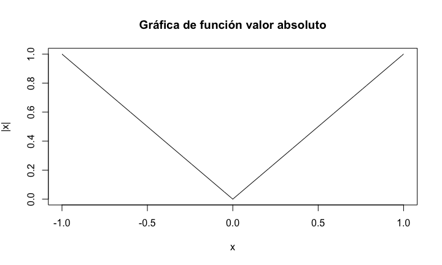

<script src="https://kit.fontawesome.com/a0edb659c7.js" crossorigin="anonymous"></script>


# Derivada de una función en un punto del dominio de la misma

## Introducción

La derivada de una función sirve para formalizar la noción de **recta tangente** en un punto $x_0$ para una función $f(x)$.

En el gráfico siguiente, podemos observar un ejemplo del dibujo de una función junto con la recta tangente en un punto $x_0$ de su dominio.

La pendiente de la recta tangente (en rojo) vendría a representar lo que denominaremos la derivada de la función $f(x)$ en $x=x_0$.

## Introducción


## Introducción

<div class="center">


</div>


## Definición de derivada de una función en un punto

Consideremos la figura anterior.

La pendiente de una recta recordemos que se define como la tangente del ángulo con el eje de las $x$. 

Hemos dibujado una función $f(x)$ que pasa por el punto $(x_0,f(x_0))$ junto con una recta secante que pasa por el punto. 

Otro punto de dicha recta dado un valor $h$ sería $(x_0+h,f(x_0+h))$. Intuitivamente dicha recta secante "tiende" a la tangente cuando el valor $h$ tiende a cero. 

## Definición de derivada de una función en un punto

La pendiente de la recta secante como puede observarse es la tangente del ángulo $\alpha$ que vale $\frac{f(x_0+h)-f(x_0)}{h}$.
Entonces, la definición de derivada de $f(x)$ en $x=x_0$ es la siguiente:


## Definición de derivada de una función en un punto
<l class="definition"> Definición de derivada en un punto. </l>

Sea $f:(a,b)\longrightarrow \mathbb{R}$ una función real de variable real. Sea $x_0\in (a,b)$. Diremos que $f$ es **derivable** en $x_0$ o que **existe la derivada de $f$ en $x_0$** cuando existe el límite siguiente:
$$
\lim_{h\to 0}\frac{f(x_0+h)-f(x_0)}{h},
$$
y, en caso en que exista, llamaremos a dicho límite **derivada de la función $f$ en $x_0$** escrita matemáticamente como $f'(x_0)$.

## Definición de derivada de una función en un punto
<l class="observ">Observación. </l>

La derivada de una función es un propiedad **local**, es decir, está definida en un punto $x_0$ del dominio.

Cuando, haciendo un abuso del lenguaje, se dice que la función $f$ es **derivable**, se quiere decir que dicha función es derivable en todos los puntos del dominio de la misma.

## Definición de derivada de una función en un punto

<l class="observ">Observación. </l>

La derivada de una función $f$ en un punto de su dominio $x_0$ se puede expresar también de la forma siguiente:
$$
\lim_{x\to x_0}\frac{f(x)-f(x_0)}{x-x_0}.
$$
Para comprobar la afirmación anterior, basta considerar el cambio de variable siguiente $x=x_0+h$, de donde $h=x-x_0$ y aplicar la definición de derivada.

Fijaos que decir que $h$ tiende a cero es equivalente a decir que $x$ tiende a $x_0$.


## Ejemplos
<div class="example">
**Derivada de la función constante**

Veamos que si la función $f$ es constante en todo su dominio, $f(x)=k$, para todo $x$ del dominio, la derivada de $f$ en cualquier punto del mismo es nula.

Sea $x_0$ un punto del dominio de $f$. La **derivada** de $f$ en $x_0$ será:
$$
f'(x_0)=\lim_{x\to x_0}\frac{f(x)-f(x_0)}{x-x_0}=\lim_{x\to x_0}\frac{k-k}{x-x_0}=\lim_{x\to x_0} 0 =0.
$$

</div>


## Ejemplos

<div class="example">
**Derivada del monomio de grado $n$**

Calculemos la derivada de función $f$ si ésta vale $f(x)=x^n$, donde $n$ es un valor natural mayor que $1$ ($n=1,2,\ldots$):

Sea $x_0$ un punto del dominio de $f$. La **derivada** de $f$ en $x_0$ será:
$$
\begin{array}{rl}
f'(x_0) & =\displaystyle\lim_{x\to x_0}\frac{f(x)-f(x_0)}{x-x_0}=\lim_{x\to x_0}\frac{x^n-x_0^n}{x-x_0}=\lim_{x\to x_0} \frac{(x-x_0)(x^{n-1}+x^{n-2}x_0+x^{n-3}x_0^2+\cdots+ x_0^{n-1})}{x-x_0} \\ & \displaystyle =\lim_{x\to x_0} x^{n-1}+x^{n-2}x_0+x^{n-3}x_0^2+\cdots+ x_0^{n-1} =n\cdot x_0^{n-1}.
\end{array}
$$
</div>

## Ejemplo
<div class="example">
**Derivada del monomio de grado $n$**

La derivada de la función anterior en `Wolfram Alpha` se muestra en el enlace siguiente:
<l class="center">
[](https://www.wolframalpha.com/input/?i=derivative+of+x%5En)
</l>

</div>


## Ejemplos
<div class="example">
**Derivada del valor absoluto**

Consideremos la función $f(x)=|x|$, valor absoluto de $x$, definida en todo $\mathbb{R}$ como:
$f(x)=\begin{cases}
x, & \mbox{si } x\geq 0, \\
-x & \mbox{si }x<0.
\end{cases}$

Estudiemos la derivabilidad de $f$ en $x_0=0$, es decir, veamos si el límite siguiente existe:
$\displaystyle\lim_{x\to 0}\frac{f(x)-f(0)}{x-0}=\lim_{x\to 0}\frac{|x|}{x}$.

Si hacemos el límite anterior por la derecha o para los valores $x>0$, obtenemos:
$$
\lim_{x\to 0^+}\frac{|x|}{x}=\lim_{x\to 0^+}\frac{x}{x}=\lim_{x\to 0^+}1 =1.
$$
En cambio, si lo hacemos por la izquierda o para los valores $x<0$, obtenemos:
$$
\lim_{x\to 0^-}\frac{|x|}{x}=\lim_{x\to 0^-}\frac{-x}{x}=\lim_{x\to 0^-} -1 =-1.
$$

</div>

## Ejemplos
<div class="example">
**Derivada del valor absoluto**

Como los límites anteriores no coinciden, concluimos que el límite $\displaystyle \lim_{x\to 0}\frac{|x|}{x}$ no existe y por tanto, $f$ no es derivable en $x=0$.

Gráficamente se observa que la función anterior tiene una punta en $x=0$ y, por tanto, $f$ no puede ser derivable en dicho punto.

Este comportamiento es el usual cuando una función no es derivable en un punto $x_0$, es decir, se observa gráficamente que en dicho punto, la función no tiene un comportamiento suave.

</div>

## Ejemplos
<div class="example">
**Derivada del valor absoluto**



</div>

## Ejemplo
<div class="example">
**Derivada del valor absoluto**

La gráfica del valor absoluto en `Wolfram Alpha` se muestra en el enlace siguiente:
<l class="center">
[](https://www.wolframalpha.com/input/?i=plot+of+%7Cx%7C)
</l>

</div>

# Propiedades de las funciones derivables

## Derivabilidad implica continuidad

<l class="prop"> Teorema.</l> 

Sea $f$ una función real de variable real y sea $x_0$ un punto del dominio de $f$. Si $f$ es derivable en $x_0$, entonces $f$ es continua en $x_0$.


## Derivabilidad implica continuidad
<div class="dem">
**Demostración.**

Definimos la función siguiente en un entorno de punto $x_0$:
$$
g(x)=\begin{cases}
\frac{f(x)-f(x_0)}{x-x_0}, & \mbox{si }x\neq x_0,\\
f'(x_0), & \mbox{si } x=x_0.
\end{cases}
$$
Usando que $f$ es derivable en $x_0$, tenemos que la función $g$ definida anteriormente será continua en $x_0$ ya que:
$$
\lim_{x\to x_0} g(x)=\lim_{x\to x_0} \frac{f(x)-f(x_0)}{x-x_0}=f'(x_0)=g(x_0).
$$
Si despejamos $f(x)$ de la expresión de $g(x)$ obtenemos $f(x)=f(x_0)+g(x)\cdot (x-x_0)$. 

Veamos que $f$ es continua en $x_0$:
$$
\lim_{x\to x_0}f(x)=\lim_{x\to x_0} f(x_0)+g(x)\cdot (x-x_0) = f(x_0)+f'(x_0)\cdot 0 = f(x_0),
$$
tal como queríamos ver.
</div>


## La derivada de la suma es suma de derivadas
<l class="prop">Proposición.</l>

Sean $f$ y $g$ dos funciones reales de variable real y sea $x_0$ un valor del dominio de $f$ y de $g$. Si $f$ y $g$ son derivables en $x_0$, también lo es la función suma $f+g$, y se verifica que: $(f+g)'(x_0)=f'(x_0)+g'(x_0)$.

<div class="dem">
**Demostración:**
$$
\begin{array}{rl}
(f+g)'(x_0) & = \displaystyle\lim_{x\to x_0}\frac{(f+g)(x)-(f+g)(x_0)}{x-x_0}=\lim_{x\to x_0}\frac{f(x)+g(x)-f(x_0)-g(x_0)}{x-x_0} \\ & = \displaystyle \lim_{x\to x_0}\frac{f(x)-f(x_0)}{x-x_0} + \lim_{x\to x_0}\frac{g(x)-g(x_0)}{x-x_0}=f'(x_0)+g'(x_0).
\end{array}
$$

</div>

## La derivada de una función por una constante es la constante por la derivada de la función
<l class="prop">Proposición.</l>

Sea $k\in\mathbb{R}$ un valor real, $f$ una función real de variable real y $x_0$ un punto del dominio de $f$. Entonce si $f$ es derivable en $x_0$, también lo es $k\cdot f$ y se verifica que: $(k\cdot f)'(x_0)=k\cdot f'(x_0)$.

<div class="dem">
**Demostración:**

$$
\begin{array}{rl}
(k\cdot f)'(x_0) & \displaystyle =\lim_{x\to x_0}\frac{(k\cdot f)(x)-(k\cdot f)(x_0)}{x-x_0}=
\lim_{x\to x_0}\frac{k\cdot f(x)-k\cdot f(x_0)}{x-x_0}=\lim_{x\to x_0}\frac{k\cdot (f(x)-f(x_0))}{x-x_0} \\  &\displaystyle =k\lim_{x\to x_0}\frac{ f(x)-f(x_0)}{x-x_0}=k f'(x_0).
\end{array}
$$
</div>

## La derivada del producto de funciones
<l class="prop">Proposición.</l>

Sean $f$ y $g$ dos funciones reales de variable real y sea $x_0$ un punto del dominio de $f$ y de $g$. Si $f$ y $g$ son derivables en $x_0$, también lo es la función producto $f\cdot g$, y se verifica que: $(f\cdot g)'(x_0)=f'(x_0)\cdot g(x_0)+f(x_0)\cdot g'(x_0)$.

<div class="dem">
**Demostración:**
$$
\begin{array}{rl}
(f\cdot g)'(x_0) & = \displaystyle\lim_{x\to x_0}\frac{(f\cdot g)(x)-(f\cdot g)(x_0)}{x-x_0}=\lim_{x\to x_0}\frac{f(x)\cdot g(x)-f(x_0)\cdot g(x_0)}{x-x_0} \\ & = \displaystyle \lim_{x\to x_0}\frac{f(x)\cdot g(x)-f(x)\cdot g(x_0)+f(x)\cdot g(x_0)-f(x_0)\cdot g(x_0)}{x-x_0}\\ & = \displaystyle \lim_{x\to x_0}\frac{f(x)\cdot (g(x)- g(x_0))+(f(x)-f(x_0))\cdot g(x_0)}{x-x_0}\\ & = \displaystyle \lim_{x\to x_0}f(x)\cdot\frac{g(x)- g(x_0)}{x-x_0}+\lim_{x\to x_0}\frac{f(x)-f(x_0)}{x-x_0}\cdot g(x_0)=f(x_0)\cdot g'(x_0)+f'(x_0)\cdot g(x_0).
\end{array}
$$

</div>

## La derivada del cociente de funciones
<l class="prop">Proposición.</l>

Sean $f$ y $g$ dos funciones reales de variable real y sea $x_0$ un punto del dominio de $f$ y de $g$ tal que $g'(x_0)\neq 0$. Si $f$ y $g$ son derivables en $x_0$, también lo es la función cociente $\frac{f}{g}$, y se verifica que: $\left(\frac{f}{g}\right)'(x_0)=\frac{f'(x_0)\cdot g(x_0)-f(x_0)\cdot g'(x_0)}{g(x_0)^2}$.

<div class="dem">
**Demostración:**
$$
\begin{array}{rl}
\left(\frac{f}{g}\right)'(x_0) & = \displaystyle\lim_{x\to x_0}\frac{\left(\frac{f}{g}\right)(x)-\left(\frac{f}{g}\right)(x_0)}{x-x_0}=\lim_{x\to x_0}\frac{\frac{f(x)}{g(x)}-\frac{f(x_0)}{g(x_0)}}{x-x_0} =\lim_{x\to x_0} \frac{f(x)\cdot g(x_0)-g(x)\cdot f(x_0)}{g(x)\cdot g(x_0)\cdot (x-x_0)}  \\ & \displaystyle =\lim_{x\to x_0} \frac{f(x)\cdot g(x_0)-f(x_0)\cdot g(x_0)+f(x_0)\cdot g(x_0) -g(x)\cdot f(x_0)}{g(x)\cdot g(x_0)\cdot (x-x_0)} \\ & = \displaystyle \lim_{x\to x_0}\frac{1}{g(x)\cdot g(x_0)}\cdot \left(\lim_{x\to x_0}\frac{f(x)-f(x_0)}{x-x_0}\cdot g(x_0)-f(x_0)\cdot \lim_{x\to x_0} \frac{g(x)-g(x_0)}{x-x_0}\right) \\ & = \displaystyle \frac{1}{g(x_0)^2}(f'(x_0)\cdot g(x_0)-f(x_0)\cdot g'(x_0)).
\end{array}
$$

</div>


## Derivada de la función inversa
<l class="prop">Proposición.</l>

Sea $f$ una función real de variable real y $x_0$ un punto del dominio de $f$. Suponemos que $f$ es derivable en $x_0$ y que $f'(x_0)\neq 0$. Supongamos que $f$ admite inversa $g$, es decir, existe una función $g$ tal que $g\circ f=\mathrm{Id}$, es decir, para cualquier valor $x$ del dominio de $f$, se cumple que $g(f(x))=x$. Además, suponemos que $g$ es continua en $f(x_0)$. Entonces $g$ es derivable en $f(x_0)$ y se verifica que 
$$g'(f(x_0))=\frac{1}{f'(x_0)}.$$

## Derivada de la función inversa
<div class="dem">
**Demostración:**

El valor de $g'(f(x_0))$ es:
$g'(f(x_0))  = \displaystyle\lim_{y\to f(x_0)}\frac{g(y)-g(f(x_0))}{y-f(x_0)}.$

Para el cálculo del límite anterior, hacemos el cambio de variable siguiente: $y=f(x)$, o lo que es lo mismo, $x=g(y)$. Como $y$ tiende a $f(x_0)$, tendremos con la variable nueva que $f(x)$ tiende a $f(x_0)$ pero como $g$ es continua en $f(x_0)$, deducimos que $g(f(x))=x$ tiende a $g(f(x_0))=x_0$. En resumen, el límite anterior puede escribirse como:
$$
g'(f(x_0)) =\lim_{x\to x_0}\frac{g(f(x))-g(f(x_0))}{f(x)-f(x_0)}=\lim_{x\to x_0}\frac{x-x_0}{f(x)-f(x_0)} = \frac{1}{\displaystyle\lim_{x\to x_0}\frac{f(x)-f(x_0)}{x-x_0}}=\frac{1}{f'(x_0)}.
$$

</div>

## Ejemplo
<div class="example">
**Ejemplo: derivada de la función $g(x)=\sqrt[n]{x}$.**

La función $g(x)=\sqrt[n]{x}$ es la inversa de la función $f(x)=x^n$ ya que:
$g(f(x))=g(x^n)=\sqrt[n]{x^n}=x$. 

Usando la expresión vista anteriormente, podemos escribir que: $g'(f(x))=g'(x^n)=\frac{1}{f'(x)}$.

En un ejemplo anterior vimos que $f'(x)=n\cdot x^{n-1}$. Por tanto:  $g'(x^n)=\frac{1}{n\cdot x^{n-1}}$.

Sea $y=x^n$, entonces $x=\sqrt[n]{y}$. Por tanto, $g'(y)=\frac{1}{n\cdot x^{n-1}}=\frac{1}{n\cdot \sqrt[n]{y^{n-1}}}$.


La derivada de la función $g(x)$ en `Wolfram Alpha` se muestra en el enlace siguiente:
<l class="center">
[](https://www.wolframalpha.com/input/?i=derivative+of+x%5E%281%2Fn%29)
</l>

</div>


## Ejemplo
<div class="example">
**Ejemplo: derivada de la función $\tan x$.**

La función $\tan x$ está definida como $\frac{\sin x}{\cos x}$.

Calculemos primero la derivada de la función $\sin x$ en un valor $x_0$:
$$
\begin{array}{rl}
(\sin)'(x_0) & \displaystyle =\lim_{x\to x_0}\frac{\sin x-\sin x_0}{x-x_0}=\lim_{x\to x_0}\frac{2\cos\left(\frac{x+x_0}{2}\right)\cdot\sin\left(\frac{x-x_0}{2}\right)}{x-x_0}=2\cdot \cos(x_0)\lim_{x\to x_0}\frac{\sin\left(\frac{x-x_0}{2}\right)}{x-x_0} \\ & \displaystyle = \cos(x_0)\lim_{x\to x_0}\frac{\sin\left(\frac{x-x_0}{2}\right)}{\frac{x-x_0}{2}} = \cos(x_0),
\end{array}
$$
usando que $\lim\limits_{x\to x_0}\frac{\sin\left(\frac{x-x_0}{2}\right)}{\frac{x-x_0}{2}}=1.$ La expresión anterior se deduce del hecho de que $\lim\limits_{t\to 0} \frac{\sin t}{t}=1$. 

Si se hace el cambio de variable $t=\frac{x-x_0}{2}$ y teniendo en cuenta que como $x\to x_0$, entonces $t\to 0$, los dos límites anteriores son iguales a 1.


</div>

## Ejemplo
<div class="example">
**Ejemplo: derivada de la función $\tan x$.**

Para calcular la derivada de la función $\cos x$, usamos una técnica similar:
$$
\begin{array}{rl}
(\cos)'(x_0) & \displaystyle =\lim_{x\to x_0}\frac{\cos x-\cos x_0}{x-x_0}=\lim_{x\to x_0}\frac{-2\sin\left(\frac{x+x_0}{2}\right)\cdot\sin\left(\frac{x-x_0}{2}\right)}{x-x_0}=-2\cdot \sin(x_0)\lim_{x\to x_0}\frac{\sin\left(\frac{x-x_0}{2}\right)}{x-x_0} \\ & \displaystyle =- \sin(x_0)\lim_{x\to x_0}\frac{\sin\left(\frac{x-x_0}{2}\right)}{\frac{x-x_0}{2}} = -\sin(x_0).
\end{array}
$$
Usamos la propiedad de la derivada del cociente, podemos hallar la derivada de la función $\tan x$:
$$
\begin{array}{rl}
(\tan)'(x_0) & =\left(\frac{\sin}{\cos}\right)'(x_0)=\frac{\sin'(x_0)\cdot \cos(x_0)-\sin (x_0)\cdot \cos'(x_0)}{\cos^2(x_0)}=\frac{\cos(x_0)\cdot \cos(x_0)+\sin (x_0)\cdot \sin(x_0)}{\cos^2(x_0)} \\ & =
\frac{\cos^2(x_0)+\sin^2(x_0)}{\cos^2(x_0)}=\frac{1}{\cos^2 (x_0)}=1+\tan^2 (x_0).
\end{array}
$$


La derivada de la función $\tan x$ en `Wolfram Alpha` se muestra en el enlace siguiente:
<l class="center">
[](https://www.wolframalpha.com/input/?i=derivative+of+tan%28x%29)
</l>

</div>

##  Derivada de la función compuesta. Regla de la cadena
<l class="prop">Proposición.</l>

Sean $f$ y $g$ dos funciones reales de variable real. Sea $x_0$ un punto del dominio de $f$ tal que $f(x_0)$ es del dominio de $g$. Supongamos que $g$ es derivable en $f(x_0)$ y $f$ es derivable en $x_0$. Entonces la función compuesta $g\circ f$ es derivable en $x_0$ y se verifica que:

$$(g\circ f)'(x_0)=g'(f(x_0))\cdot f'(x_0).$$


##  Derivada de la función compuesta. Regla de la cadena

<div class="dem">
**Demostración:**
$$
\begin{array}{rl}
(g\circ f)'(x_0) & \displaystyle =\lim_{x\to x_0}\frac{(g\circ f)(x)-(g\circ f)(x_0)}{x-x_0}=\lim_{x\to x_0}\frac{g(f(x))-g(f(x_0))}{x-x_0} \\ & \displaystyle =\lim_{x\to x_0}\frac{g(f(x))-g(f(x_0))}{f(x)-f(x_0)}\cdot \lim_{x\to x_0}\frac{f(x)-f(x_0)}{x-x_0}=g'(f(x_0))\cdot f'(x_0).
\end{array}
$$
En el último cálculo, podemos afirmar que el límite $\displaystyle\lim_{x\to x_0}\frac{g(f(x))-g(f(x_0))}{f(x)-f(x_0)}$ vale $g'(f(x_0))$ porque como $f$ es derivable en $x_0$, $f$ será continua en $x_0$ y si $x\to x_0$, entonces $f(x)\to f(x_0)$ y el límite anterior queda:
$$
\lim_{x\to x_0}\frac{g(f(x))-g(f(x_0))}{f(x)-f(x_0)} =\lim_{f(x)\to f(x_0)}\frac{g(f(x))-g(f(x_0))}{f(x)-f(x_0)}=g'(f(x_0)).
$$

</div>

## Ejemplo
<div class="example">
**Ejemplo**

Hallemos la derivada de la función $h(x)=\arctan (x^3+x^2+1)$.

La función anterior es la composición de la función $f(x)=x^3+x^2+1$ y $g(y)=\arctan y$, es decir:
$h(x)=(g\circ f)(x)$.

La derivada de la función $f(x)$ se puede calcular usando la propiedad de la suma de derivadas y la expresión de la derivada del monomio $x^n$:
$$
(x^3+x^2+1)'=(x^3)'+(x^2)'+(1)' = 3x^2+2x+0=3x^2+2x.
$$

A continuación, hallemos la derivada de la función $g(y)=\arctan y$. Dicha función es la función inversa de la función $\tan x$.
Usando la expresión de la derivada de la función inversa, tenemos:
$$
g'(\tan x)=\frac{1}{\tan'(x)}=\frac{1}{\frac{1}{\cos^2 x}}=\cos^2 x.
$$

</div>

## Ejemplo
<div class="example">
**Ejemplo**

Para hallar $g'(y)$, tenemos que escribir $y=\tan x$, y, por tanto, $x=\arctan y$:
$$
g'(y)=\cos^2(\arctan y)=\frac{1}{1+\tan^2 (\arctan y)}=\frac{1}{1+y^2},
$$
donde hemos usado la siguiente relación trigonométrica: $\cos^2\alpha = \frac{1}{1+\tan^2\alpha}$.

La derivada de la función $h(x)$ usando la **regla de la cadena** será:
$$
\begin{array}{rl}
h'(x) & =(g\circ f)'(x)=g'(f(x))\cdot f'(x)=\frac{1}{1+f(x)^2}\cdot (3 x^2+2x)=\frac{3x^2+2x}{1+(x^3+x^2+1)^2}\\ & =\frac{3x^2+2x}{x^6+2 x^5+x^4+2 x^3+2 x^2+2}.
\end{array}
$$


La derivada de la función $h(x)$ en `Wolfram Alpha` se muestra en el enlace siguiente: <l class="center">
[](https://www.wolframalpha.com/input/?i=derivative+of+arctan%28x%5E3%2Bx%5E2%2B1%29)
</l>
</div>

## Tablas de derivadas

Si vais al enlace siguiente [tablas de derivadas](https://www.google.com/search?tbm=isch&sxsrf=ACYBGNQqojnjJv8BaCiJGV99iyRexZsPcg%3A1578831703469&source=hp&biw=2560&bih=1268&ei=Vw8bXsXVGoKkgweJ7qO4Bw&q=tablas+de+derivadas&oq=tablas+de+der&gs_l=img.3.0.35i39j0l5j0i5i30l4.5860.8647..10003...2.0..0.70.862.13......0....1..gws-wiz-img.....10..35i362i39j0i131.bUJ_Ou6rWlA) y escribís "tablas de derivadas" en la casilla de búsqueda, encontraréis un montón de tablas de derivadas para las funciones más usadas.


# Teoremas de derivación

## Derivación y extremos

<l class="definition"> Definición de máximo relativo de una función.</l>

Sea $f: (a,b)\longrightarrow \mathbb{R}$ una función real de variable real. Sea $x_0\in (a,b)$ un valor del dominio de $f$. Diremos que $f$ tiene un **máximo relativo** en el punto $x_0$ si existe un entorno de $x_0$, es decir, existe un valor $\delta >0$, tal que para todo valor $x$ de este entorno, es decir, $x\in (x_0-\delta,x_0+\delta)\subseteq (a,b)$, se cumple que $f(x)\leq f(x_0)$. 

Si la condición anterior se verifica para cualquier punto $x\in (a,b)$, diremos que $f$ tiene un **máximo absoluto** en el punto $x_0$.

## Derivación y extremos
<l class="definition"> Definición de mínimo relativo de una función.</l>

Sea $f: (a,b)\longrightarrow \mathbb{R}$ una función real de variable real. Sea $x_0\in (a,b)$ un valor del dominio de $f$. Diremos que $f$ tiene un **mínimo relativo** en el punto $x_0$ si existe un entorno de $x_0$, es decir, existe un valor $\delta >0$, tal que para todo punto $x$ de este entorno, es decir, $x\in (x_0-\delta,x_0+\delta)\subseteq (a,b)$, se cumple que $f(x)\geq f(x_0)$. 

Si la condición anterior se verifica para cualquier valor $x\in (a,b)$, diremos que $f$ tiene un **mínimo absoluto** en el punto $x_0$.

Los puntos donde $f$ presente un **máximo** o un **mínimo** **relativos** o **absolutos** se denominan **extremos relativos** o **absolutos** de la función.

## Ejemplo
<div class="example">
**Ejemplo**

Consideremos la función siguiente definida en el intervalo $(-2\pi,2\pi)$: 
$$
\begin{array}{rl}
f:(-2\pi,2\pi) & \longrightarrow \mathbb{R},\\
 x& \longrightarrow \sin(x)-\cos(x).
\end{array}
$$
El gráfico de dicha función puede observase en la figura siguiente.

Vemos que tiene dos **máximos relativos** en los valores $x=-\frac{5}{4}\pi$ y $x=\frac{3}{4}\pi$ y dos **mínimos relativos** en los valores $x=-\frac{\pi}{4}$ y $x=\frac{7}{4}\pi$. 

Observamos que dichos máximos y mínimos son **absolutos**.

El gráfico de la función anterior puede verse en `Wolfram Alpha` en el enlace siguiente: <l class="center">
[](https://www.wolframalpha.com/input/?i=plot+of+sin%28x%29-cos%28x%29%2C+where++x+is+between+-2+pi+and+2+pi)
</l>
</div>


## Ejemplo
<div class="example">


</div>


## Derivación y extremos
<l class="prop">Teorema.</l>

Sea $f: (a,b)\longrightarrow \mathbb{R}$ una función real de variable real. Sea $x_0\in (a,b)$ un valor del dominio de $f$ que sea **extremo relativo** de la función. Entonces si $f$ es **derivable** en el punto $x_0$, se verifica que $f'(x_0)=0$.

Intuitivamente, el teorema anterior nos dice que si la función $f$ tiene un comportamiento **suave** en el extremo $x_0$, la recta tangente en este punto tiene que ser **horizontal**, es decir, su pendiente tiene que ser nula, tal como podemos observar en los extremos del ejemplo anterior. 


## Derivación y extremos

<div class="dem">
**Demostración**

Como $f$ es derivable en el punto $x_0$, sabemos que existe el límite siguiente $\displaystyle\lim_{x\to x_0}\frac{f(x)-f(x_0)}{x-x_0}$.

Decir que $f$ es derivable en $x_0$ es equivalente a decir que la función siguiente:
$$
g(x)=\begin{cases}
\frac{f(x)-f(x_0)}{x-x_0}, & \mbox{si }x\neq x_0,\\
f'(x_0), &\mbox{si }x=x_0,
\end{cases}
$$
es continua en $x_0$.

Veamos a continuación que necesariamente $g(x_0)=f'(x_0)=0$ y quedará demostrado el teorema.

Supongamos que $g(x_0)>0$. Como la función $g$ es continua en $x_0$, por el teorema de conservación del signo de funciones continuas, existirá un entorno de $x_0$, es decir, existirá un $\delta >0$ tal que si $x\in (x_0-\delta,x_0+\delta)\subseteq (a,b)$, $g(x)>0$ también será positiva para todos los valores $x$ de dicho entorno.


</div>

## Derivación y extremos

<div class="dem">
**Demostración**

Es decir, para todo $x\in (x_0-\delta,x_0+\delta)$, $g(x)=\frac{f(x)-f(x_0)}{x-x_0}>0$.

Esto es equivalente a decir que el numerador y el denominador de la fracción anterior tienen el mismo signo, dicho en otras palabras:

* si $x\in (x_0-\delta,x_0+\delta)$ y $x>x_0$, entonces $f(x) > f(x_0)$ y,
* si $x\in (x_0-\delta,x_0+\delta)$ y $x<x_0$, entonces $f(x) < f(x_0)$.

Las condiciones anteriores contradicen el hecho que $x_0$ sea un extremo ya que hemos encontrado valores en un entorno del mismo que superan $f(x_0)$ y valores del mismo entorno que son menores que $f(x_0)$. 
En conclusión, llegamos a una contradicción al suponer que $g(x_0)=f'(x_0)>0$.

<div class="exercise">
**Ejercicio**

Suponer que $g(x_0)=f'(x_0)<0$ y ver que se llega a una contradicción razonando de manera similar.
</div>
</div>


## Derivación y extremos

<div class="dem">
**Demostración**

Al no poder ser que $f'(x_0)>$ ni $f'(x_0)<0$, necesariamente $f'(x_0)=0$ tal como queríamos demostrar.
</div>

<l class="observ"> Observación. </l> 

El recíproco del teorema anterior es falso. Es decir, el hecho que $f'(x_0)$ sea $0$, no implica que $x_0$ sea un **extremo relativo** de la función.

<div class="example">
**Ejemplo**

Considerar, por ejemplo, la función $f(x)=x^2\cdot \sin(x)$. Si derivamos dicha función, obtenemos:
$$
f'(x)=2x\sin(x)+x^2\cos(x).
$$
Vemos que $f'(0)=0$. En cambio $f$ no tiene ningún extremo en este punto tal como se observa en el gráfico de su función:
</div>


## Derivación y extremos
<div class="example">
**Ejemplo**


</div>

## Derivación y extremos
<div class="example">
**Ejemplo**

Para ver que el 0 no es extremo relativo, es facil ver que para $x\in (0,\pi)$, $f(x)\geq 0$ y para $x\in (-\pi,0)$, $f(x)\leq 0$. Comprobémoslo para unos cuantos valores en `python`, para $x=-0.2,-0.1,0.1,0.2$:

```python
from sympy import * 
  
def f(x):
 return(x**2*sin(x))
```

</div>

## Derivación y extremos
<div class="example">
**Ejemplo**


```python
for x in [-0.2,-0.1,0.1,0.2]:
  print('f({x})={res}'.format(x=x, res=f(x)))
```

```
## f(-0.2)=-0.00794677323180245
## f(-0.1)=-0.000998334166468282
## f(0.1)=0.000998334166468282
## f(0.2)=0.00794677323180245
```
</div>

## Derivación y extremos
<div class="example">
**Ejemplo**

El cálculo de la derivada de la función anterior puede verse en `Wolfram Alpha` en el enlace siguiente: <l class="center">
[](https://www.wolframalpha.com/input/?i=derivative+of+x%5E2*sin%28x%29)</l>


El gráfico de la función anterior puede verse en `Wolfram Alpha` en el enlace siguiente: <l class="center">
[](https://www.wolframalpha.com/input/?i=plot+of+x%5E2*sin%28x%29%2C+where+x+is+between+-2+and+2)
</l>

</div>

## Derivación y extremos
<l class="definition">Definición de crecimiento de una función. </l>

Sea $f: (a,b)\longrightarrow \mathbb{R}$ una función real de variable real. Sea $x_0\in (a,b)$ un valor del dominio de $f$. Diremos que $f$ es **estrictamente creciente** en el punto $x_0$ si existe un entorno de $x_0$, es decir, existe un valor $\delta >0$ tal que para todo $x$ de dicho entorno diferente de $x_0$, o si $x\in (x_0-\delta,x_0+\delta)\subseteq (a,b)$, con $x\neq x_0$, se verifica que el cociente siguiente es positivo: $\frac{f(x)-f(x_0)}{x-x_0}>0$.

<l class="observ">Observación. </l> 

La definición anterior es equivalente a decir que existe un valor $\delta >0$ tal que si $x\in (x_0,x_0+\delta)$ o $x>x_0$, entonces $f(x)>f(x_0)$ y si $x\in (x_0-\delta, x_0)$ o $x<x_0$, entonces $f(x)<f(x_0)$. Ver el gráfico siguiente.


## Derivación y extremos
<div class="center">

</div>


## Derivación y extremos
<l class="definition">Definición de decrecimiento de una función. </l>

Sea $f: (a,b)\longrightarrow \mathbb{R}$ una función real de variable real. Sea $x_0\in (a,b)$ un valor del dominio de $f$. Diremos que $f$ es **estrictamente decreciente** en el punto $x_0$ si existe un entorno de $x_0$, es decir, existe un valor $\delta >0$ tal que para todo $x$ de dicho entorno diferente de $x_0$, o si $x\in (x_0-\delta,x_0+\delta)\subseteq (a,b)$, con $x\neq x_0$, se verifica que el cociente siguiente es negativo: $\frac{f(x)-f(x_0)}{x-x_0}<0$.

<l class="observ">Observación. </l> 

La definición anterior es equivalente a decir que existe un valor $\delta >0$ tal que si $x\in (x_0,x_0+\delta)$ o $x>x_0$, entonces $f(x)<f(x_0)$ y si $x\in (x_0-\delta, x_0)$ o $x<x_0$, entonces $f(x)>f(x_0)$. Ver gráfico siguiente.

## Derivación y extremos
<div class="center">

</div>

## Derivación y extremos
<l class="observ">Observación. </l> 

Si la desigualdad  $\frac{f(x)-f(x_0)}{x-x_0}\geq 0$ no es estricta, se dice que $f$ es **creciente**.


<l class="observ">Observación. </l> 

Si la desigualdad $\frac{f(x)-f(x_0)}{x-x_0}\leq 0$ no es estricta, se dice que $f$ es **decreciente**.


## Derivación y extremos
<l class="prop">Proposición.</l>

Sea $f: (a,b)\longrightarrow \mathbb{R}$ una función real de variable real. Sea $x_0\in (a,b)$ un valor del dominio de $f$. Supongamos que $f$ es derivable en $x_0$. Entonces si $f'(x_0)>0$ o $f$ tiene **derivada positiva** en $x_0$, entonces $f$ es **estrictamente creciente** en $x_0$.

<div class="dem">
**Demostración**

Como $\displaystyle f'(x_0)=\lim_{x\to x_0}\frac{f(x)-f(x_0)}{x-x_0}>0$, usando la definición de límite tenemos que:
$$
\forall \epsilon >0,\ \exists\delta >0\ \mbox{t.q. si }|x-x_0|<\delta,\mbox{ entonces }\left|f'(x_0)-\frac{f(x)-f(x_0)}{x-x_0}\right|< \epsilon.
$$
</div>

## Derivación y extremos
<div class="dem">
**Demostración**

La última condición se puede escribir de la siguiente manera:
$$
f'(x_0)-\epsilon < \frac{f(x)-f(x_0)}{x-x_0} < f'(x_0)+\epsilon.
$$
Como $f'(x_0)>0$, siempre es posible hallar un $\epsilon >0$ tal que $f'(x_0)-\epsilon>0$.

Para este $\epsilon >0$, podemos encontrar un entorno de $x_0$, es decir, un $\delta >0$ tal que si $x\in (x_0-\delta,x_0+\delta)$, entonces:
$$
0<f'(x_0)-\epsilon < \frac{f(x)-f(x_0)}{x-x_0} < f'(x_0)+\epsilon,
$$
de donde deducimos que $\frac{f(x)-f(x_0)}{x-x_0}>0$ para todo $x$ del entorno, $x\in (x_0-\delta,x_0+\delta)$, lo que equivale a decir que $f$ es estrictamente creciente en $x_0$.
</div>

## Derivación y extremos
<l class="prop">Proposición.</l>

Sea $f: (a,b)\longrightarrow \mathbb{R}$ una función real de variable real. Sea $x_0\in (a,b)$ un valor del dominio de $f$. Supongamos que $f$ es derivable en $x_0$. Entonces si $f'(x_0)<0$ o $f$ tiene **derivada negativa** en $x_0$, entonces $f$ es **estrictamente decreciente** en $x_0$.

<div class="exercise">
**Ejercicio**

Demostrar la proposición anterior usando la misma técnica que para demostrar que si $f'(x_0)>0$, entonces $f$ es **estrictamente creciente** en $x_0$.
</div>

## Ejemplo
<div class="example">
**Ejemplo**

Consideremos la función siguiente de un ejemplo anterior: $f(x)=\sin(x)-\cos(x)$.

La derivada de la función $f$ vale: $f'(x)=\cos(x)+\sin(x)$.

Dicha función se anula en los **extremos** $x=-\frac{5}{4}\pi,-\frac{\pi}{4},\frac{3}{4}\pi$ y $\frac{7}{4}\pi$:

```python
def df(x):
 return(cos(x)+sin(x))
 
for x in [-5*pi/4,-pi/4,3*pi/4,7*pi/4]:
  print("f'({x})={res}".format(x=x, res=df(x)))
```

```
## f'(-5*pi/4)=0
## f'(-pi/4)=0
## f'(3*pi/4)=0
## f'(7*pi/4)=0
```

</div>

## Ejemplo
<div class="example">

En los puntos $x=-\frac{3}{2}\pi$ y $x=\frac{\pi}{2}$ la función es **estrictamente creciente** al tener derivada positiva en dichos puntos:

```python
for x in [-3*pi/2,pi/2]:
  print("f'({x})={res}".format(x=x, res=df(x)))
```

```
## f'(-3*pi/2)=1
## f'(pi/2)=1
```

En cambio, en los puntos $x=-\frac{\pi}{2}$ y $\frac{3}{2}\pi$ la función es **estrictamente decreciente** al tener derivada negativa en dichos puntos:

```python
for x in [-pi/2,3*pi/2]:
  print("f'({x})={res}".format(x=x, res=df(x)))
```

```
## f'(-pi/2)=-1
## f'(3*pi/2)=-1
```

</div>

## Teoremas de Rolle y del valor medio

Las proposiciones vistas hasta ahora nos permiten determinar el comportamiento local de una función en un punto en términos de su crecimiento dependiendo del signo de la derivada de dicha función en dicho punto.

Vamos a ver dos resultados que nos permiten determinar las propiedades globales de la función en todo su dominio a partir del comportamiento de la función derivada de dicha función.

El teorema de Rolle dice que si los valores de una función derivable en todo el interior de un intervalo, los valores coinciden en los extremos del mismo, necesariamente ha de tener al menos un máximo o un mínimo Intuitivamente, el resultado es claro ya que si suponemos por ejemplo que la función crece en su extremo izquierdo $a$, como $f(a)=f(b)$, donde $b$ es su extremo derecho, en algún momento tiene que decrecer. Por tanto, en *dicho momento*, la función tendrá un extremo o un máximo en este caso.

## Teoremas de Rolle y del valor medio
<div class="center">

</div>

## Teoremas de Rolle y del valor medio
El teorema del valor medio dice que dada una función derivable en todo su dominio, ha de existir un punto en el que recta tangente en dicho punto sea paralela a la recta que pasa por los extremos del dominio de la función.

En el gráfico siguiente la recta verde es la recta que pasa por los extremos de la función (en azul) y la recta roja es la recta tangente al punto $c$ que pertenece al dominio de la función.


## Teoremas de Rolle y del valor medio
<div class="center">

</div>

## Teorema de Rolle
<l class="prop">Teorema de Rolle.</l>

Sea $f: [a,b]\longrightarrow \mathbb{R}$ una función real de variable real. Supongamos que $f$ es continua en todo su dominio $[a,b]$ y derivable en los puntos del interior $(a,b)$. Supongamos además que las imágenes en los extremos coinciden, es decir, $f(a)=f(b)$. Entonces existe al menos un punto $c\in (a,b)$ tal que $f'(c)=0$.

<l class="observ">Observación.</l>

En el dominio de definición de $f$ están incluidos los extremos del intervalo.

## Teorema de Rolle
<div class="dem">
**Demostración**

Como la función $f$ es continua en el intervalo cerrado $[a,b]$, deducimos que $f$ tiene un máximo absoluto $M$ y un mínimo absoluto $m$. 

Pueden ocurrir dos casos:

* Que el máximo absoluto se alcance en el extremo $a$ y el mínimo, en el extremo $b$, con $f(a)=M$ y $f(b)=m$ o al revés, es decir, que el máximo absoluto se alcance en el extremo $b$ y el mínimo, en el extremo $a$, con $f(a)=m$ y $f(b)=M$. Como $f(a)=f(b)$, resulta que $M=m$ y la única función en un intervalo en donde su máximo coincide con su mínimo es la función constante. En este caso $f'(x)=0$, para todo $x\in (a,b)$ como ya vimos anteriormente y el teorema quedaría demostrado en este caso.
* Supongamos que el máximo o el mínimo de la función se alcanza en un punto $c\in (a,b)$ del interior del intervalo. Por un teorema visto anteriormente, tenemos que $f'(c)=0$ y el teorema quedaría demostrado también en este caso.
</div>

## Teorema del valor medio de Cauchy
<l class="prop">Teorema del valor medio de Cauchy.</l>

Sean $f,g:[a,b]\longrightarrow \mathbb{R}$ dos funciones continuas en $[a,b]$ y derivables en $(a,b)$. Entonces, existe un punto $c\in (a,b)$ del interior del intervalo tal que:
$$
f'(c)\cdot (g(b)-g(a)) = g'(c)\cdot (f(b)-f(a)).
$$

## Teorema del valor medio de Cauchy
<div class="dem">
**Demostración**

Consideramos la función siguiente:
$$
h(x)=f(x)\cdot (g(b)-g(a))-g(x)\cdot (f(b)-f(a)),
$$
que será continua en $[a,b]$ y derivable en $(a,b)$ al ser suma de productos de funciones continuas y derivables por constantes.

La idea es aplicar el **teorema de Rolle** a la función $h(x)$. Calculemos $h(a)$ y $h(b)$:
$$
\begin{array}{rl}
h(a) & = f(a)\cdot (g(b)-g(a))-g(a)\cdot (f(b)-f(a)) = f(a)\cdot g(b)-g(a)\cdot f(b),\\
h(b) & = f(b)\cdot (g(b)-g(a))-g(b)\cdot (f(b)-f(a)) = -f(b)\cdot g(a)+g(b)\cdot f(a).
\end{array}
$$
Se cumple, por tanto, que $h(a)=h(b)$. Aplicando el **teorema de Rolle** a la función $h$, tenemos que existe un punto $c\in (a,b)$ tal que $h'(c)=0$:
$$
h'(c)=f'(c)\cdot (g(b)-g(a))-g'(c)\cdot (f(b)-f(a))=0,
$$
de donde deducimos lo que dice la tesis del teorema:
$$
f'(c)\cdot (g(b)-g(a)) = g'(c)\cdot (f(b)-f(a)).
$$
</div>

## Teorema del valor medio de Lagrange
<l class="prop">Corolario: Teorema del valor medio de Lagrange.</l>

Sea $f:[a,b]\longrightarrow \mathbb{R}$ una función continua en $[a,b]$ y derivable en $(a,b)$. Entonces, existe un punto $c\in (a,b)$ del interior del intervalo tal que:
$$
f(b)-f(a)=f'(c)\cdot (b-a).
$$

<div class="exercise">
**Ejercicio**

Demostrar el teorema del valor medio de Lagrange.

Indicación: considerar $f(x)$ la función del teorema, $g(x)=x$ y aplicar el **teorema del valor medio de Cauchy**.
</div>

## Teorema del valor medio de Lagrange
<l class="observ">Observación.</l>

El **Teorema del valor medio de Lagrange** es equivalente a afirmar lo que hemos dicho anteriormente: si $f$ es derivable en el intervalo abierto y continua en el cerrado, existe un punto $c$ del interior del intervalo tal que $f'(c)=\frac{f(b)-f(a)}{b-a}$, es decir, la pendiente de la recta tangente en el punto $c$ coincide con la pendiente de la recta que pasa por los extremos $(a,f(a))$ y $(b,f(b))$. 

Es decir, la recta tangente en el punto $c$ es paralela a la recta que pasa por los extremos del intervalo de definición de la función $f$.

## Consecuencias de los teoremas
<l class="prop">Corolario.</l>

Sea $f:[a,b]\longrightarrow \mathbb{R}$ una función continua en $[a,b]$ y derivable en $(a,b)$ tal que $f'(x)=0$ para todo $x\in (a,b)$. Entonces $f$ es constante.

<div class="dem">
**Demostración**

Sea $x\in (a,b]$. Veamos que $f(x)=f(a)$ y, por tanto, $f$ será constante.

Para ello, consideremos la función $f$ restringida al intervalo $[a,x]$, $f:[a,x]\longrightarrow\mathbb{R}$, que será continua en $[a,x]$ y derivable en $(a,x)$. Si aplicamos el **teorema del valor medio de Lagrange**, tenemos que existe un $c\in (a,x)$ tal que:
$$
f(x)-f(a)=f'(c)\cdot (x-a)=0,
$$
ya que nos dicen que $f'(c)=0$ al ser la derivada nula en cualquier punto del intervalo $(a,b)$.

Deducimos, por tanto, que $f(x)=f(a)$, condición que equivale a que la función $f$ es constante.
</div>


## Consecuencias de los teoremas
<l class="prop">Corolario.</l>

Sean $f, g:[a,b]\longrightarrow \mathbb{R}$ funciones continuas en $[a,b]$ y derivables en $(a,b)$ tal que $f'(x)=g'(x)$ para todo $x\in (a,b)$. Entonces $f(x)-g(x)$ es constante.

<div class="exercise">
**Ejercicio**

Demostrar el corolario anterior.

Indicación: aplicar el resultado que hemos visto antes a la función $h(x)=f(x)-g(x)$.
</div>


## Consecuencias de los teoremas
<l class="prop">Corolario.</l>

Sea $f:(a,b)\longrightarrow \mathbb{R}$ una función  derivable en todo punto del intervalo $(a,b)$.
Entonces, $f$ es creciente en $(a,b)$ si, y sólo si, $f'(x)\geq 0$, para todo $x\in (a,b)$ del intervalo.

<div class="dem">
**Demostración**

$\Rightarrow$ Supongamos que la función $f$ es creciente en $(a,b)$. Esto significa que fijado $x_0\in (a,b)$ en el intervalo, existe un entorno de $x_0$, es decir, existe un $\delta >0$, tal que para todo valor $x\in (x_0-\delta,x_0+\delta)$, se verifica que $\frac{f(x)-f(x_0)}{x-x_0}\geq 0$.

Entonces, usando que $\displaystyle f'(x_0)=\lim_{x\to x_0} \frac{f(x)-f(x_0)}{x-x_0}$, tendremos que $f'(x_0)\geq 0$, tal como queríamos ver.
</div>

## Consecuencias de los teoremas

<div class="dem">
**Demostración**

$\Leftarrow$ Supongamos ahora que $f'(x_0)\geq 0$, para todo valor $x_0\in (a,b)$ dentro del intervalo. Veamos que $f$ es creciente en $x_0$. 

Sea $x>x_0$. Si aplicamos el **teorema del valor medio de Lagrange** a la función $f$ restringida al intervalo $[x_0,x]$ tenemos que existe un punto $c$ tal que: 
$$
f'(c)=\frac{f(x)-f(x_0)}{x-x_0}\geq 0.
$$
Sea ahora $x<x_0$. Si volvemos a aplicar el el **teorema del valor medio de Lagrange** a la función $f$ restringida al intervalo $[x,x_0]$ tenemos que existe un punto $c$ tal que: 
$$
f'(c)=\frac{f(x_0)-f(x)}{x_0-x}=\frac{f(x)-f(x_0)}{x-x_0}\geq 0.
$$

</div>

## Consecuencias de los teoremas

<div class="dem">
**Demostración**

En resumen, el cociente $\frac{f(x)-f(x_0)}{x-x_0}\geq 0$ siempre es positivo, condición que equivale a afirmar que $f$ es creciente en $x_0$.

De hecho, hubiera sido suficiente demostrar que el cociente anterior es positivo en un entorno de $x_0$ pero hemos demostrado más, hemos visto que dicho cociente siempre es positivo sea cual sea el valor $x\in (a,b)$ del intervalo.
</div>

## Consecuencias de los teoremas
<l class="prop">Corolario.</l>

Sea $f:(a,b)\longrightarrow \mathbb{R}$ una función  derivable en todo punto del intervalo $(a,b)$.
Entonces, $f$ es decreciente en $(a,b)$ si, y sólo si, $f'(x)\leq 0$, para todo $x\in (a,b)$ del intervalo.

<div class="exercise">
**Ejercicio**

Demostrar el corolario anterior usando la misma técnica de demostración para el caso en que la función $f$ es creciente.
</div>

## Ejemplo
<div class="example">
**Ejemplo**

Consideremos la función vista anteriormente $f(x)=\sin (x)-\cos(x)$ definida en el intervalo $(-\pi,\pi)$.

Como $f(-\pi)=1=f(\pi)$, aplicando el **teorema de Rolle**, sabemos que existe como mínimo un punto $c$ tal que $f'(c)=0$. De hecho, hay dos como hemos visto anteriormente: $c=-\frac{\pi}{4}$ y $c=\frac{3}{4}\pi$:
$$
\begin{array}{rl}
f'(x) & =\cos(x)+\sin(x),\\
f'\left(-\frac{\pi}{4}\right) & =\cos\left(-\frac{\pi}{4}\right)+\sin\left(-\frac{\pi}{4}\right)=\frac{\sqrt{2}}{2}-\frac{\sqrt{2}}{2}=0,\\
f'\left(\frac{3\pi}{4}\right) & =\cos\left(\frac{3\pi}{4}\right)+\sin\left(\frac{3\pi}{4}\right)=-\frac{\sqrt{2}}{2}+\frac{\sqrt{2}}{2}=0.
\end{array}
$$
Si ahora consideramos la función anterior pero definida en el intervalo $\left(-\frac{\pi}{2},\frac{\pi}{2}\right)$, tenemos que existe un punto $c$ tal que:
$$
f'(c)=\cos(c)+\sin(c)=\frac{f\left(\frac{\pi}{2}\right)-f\left(-\frac{\pi}{2}\right)}{\frac{\pi}{2}-\left(-\frac{\pi}{2}\right)}=\frac{1-(-1)}{\pi}=\frac{2}{\pi}.
$$
</div>

## Ejemplo
<div class="example">
Hallemos a continuación el valor $c$:
$$
\begin{array}{rl}
\cos(c)+\sin(c) & = \frac{2}{\pi}, \\
\cos(c) & = \frac{2}{\pi}-\sin(c), \\
\pm \sqrt{1-\sin^2(c)} & = \frac{2}{\pi}-\sin(c), \\
1-\sin^2(c)  & = \left(\frac{2}{\pi}-\sin(c)\right)^2 = \frac{4}{\pi^2}+\sin^2(c)-\frac{4}{\pi}\sin(c),\\
2\sin^2(c)-\frac{4}{\pi}\sin(c)+\frac{4}{\pi^2}-1 & = 0,\\
\sin(c) & = \frac{\frac{4}{\pi}\pm \sqrt{\frac{16}{\pi^2}-8\cdot\left(\frac{4}{\pi^2}-1\right)}}{4},\\
\sin(c) & = \frac{\frac{4}{\pi}\pm \sqrt{8-\frac{16}{\pi^2}}}{4}=\frac{4\pm\sqrt{8\pi^2-16}}{4\pi}=\frac{2\pm\sqrt{2\pi^2-4}}{2\pi}.
\end{array}
$$
</div>

## Ejemplo
<div class="example">

El valor de $\cos(c)$ será:
$$
\begin{array}{rl}
\cos(c) & =\pm\sqrt{1-\left(\frac{2\pm\sqrt{2\pi^2-4}}{2\pi}\right)^2} = \pm\sqrt{1-\frac{2\pi^2\pm 4\sqrt{2\pi^2-4}}{4\pi^2}}=\pm\sqrt{\frac{2\pi^2\mp4\sqrt{2\pi^2-4}}{4\pi^2}}\\ 
& =\pm\sqrt{\frac{(2\mp\sqrt{2\pi^2-4})^2}{4\pi^2}} = \pm\frac{(2\mp\sqrt{2\pi^2-4})}{2\pi}.
\end{array}
$$
Entonces las parejas $(\sin(c),\cos(c))$ son las siguientes:

* si $\sin(c)=\frac{2+\sqrt{2\pi^2-4}}{2\pi}$, entonces $\cos(c)=\frac{2-\sqrt{2\pi^2-4}}{2\pi}$,
* si $\sin(c)=\frac{2-\sqrt{2\pi^2-4}}{2\pi}$, entonces $\cos(c)=\frac{2+\sqrt{2\pi^2-4}}{2\pi}$.

El primer caso no puede ser ya que $\cos(c)<0$ y como estamos en el intervalo $\left(-\frac{\pi}{2},\frac{\pi}{2}\right)$, la función coseno es positiva.

Sólo será solución el segundo caso, donde el valor de $c$ será aproximadamente: -0.318.

</div>

</div>

## Ejemplo
<div class="example">
Comprobemos usando `python` que el valor de $c$ hallado es el correcto:


```python
from numpy import * 
c=arcsin((2-sqrt(2*pi**2-4))/(2*pi))
derivada_c = sin(c)+cos(c)
k=2/pi
print('El valor de c es: {c}'.format(c=c))
```

```
## El valor de c es: -0.3184557133984764
```

</div>

## Ejemplo
<div class="example">

```python
print('El valor de la derivada de f en c es:{x}'.format(x=derivada_c))
```

```
## El valor de la derivada de f en c es:0.6366197723675814
```

```python
print('El valor de 2/pi es:{k}'.format(k=k))
```

```
## El valor de 2/pi es:0.6366197723675814
```

</div>

## Regla de L'Hôpital

Una de las aplicaciones más importantes de las derivadas es su aplicación al cálculo de límites de funciones.

La regla de L'Hôpital permite resolver indeterminaciones usando derivadas:

## Regla de L'Hôpital
<l class="prop">Teorema: regla de L'Hôpital.</l>

Sean $f,g:(a,b)\longrightarrow\mathbb{R}$ dos funciones derivables en un punto $c\in (a,b)$. Supongamos:

* $f(c)=g(c)=0$,
* $g(x)\neq 0$ y $g'(x)\neq 0$ para todo punto $x$ del entorno de $c$ diferente de $c$,

Si se verifican las condiciones anteriores y el límite siguiente existe $\displaystyle\lim_{x\to c}\frac{f'(x)}{g'(x)}$ y vale $L$, entonces también existe el límite $\displaystyle\lim_{x\to c}\frac{f(x)}{g(x)}$ y vale $L$.


## Regla de L'Hôpital
<div class="dem">
**Demostración**

Sea $\delta >0$ tal que $(c-\delta,c+\delta)\subseteq (a,b)$ y donde se cumplen las condiciones del teorema. 

Sea $x\in (c-\delta,c+\delta)$ un punto del entorno. En el intervalo $[c,x]$ se cumplen las hipótesis del **Teorema del valor medio de Cauchy**, ya que $f$ y $g$ son derivables en $(c,x)$ al serlo en todo el entorno $(c-\delta,c+\delta)$, y continuas en $[c,x]$, ya que como son derivables en todo el entorno, serán continuas y como $[c,x]\subset (c-\delta,c+\delta)$, también serán continuas en el intervalo $[c,x]$.

Usando por tanto el **Teorema del valor medio de Cauchy**, podemos afirmar que existe un punto $d\in (c,x)$ tal que:
$$
f'(d)\cdot (g(d)-g(c))=g'(d)\cdot (f(d)-f(c)).
$$
Recordemos que $f(c)=g(c)=0$, $f'(d)\neq 0$ y $g'(d)\neq 0$ ya que suponíamos que las derivadas $f'$ y $g'$ no se anulaban en el entorno de $c$. Usando las condiciones anteriores, podemos simplificar la expresión anterior de la siguiente manera:
$$
\frac{f'(d)}{g'(d)}=\frac{f(d)}{g(d)}.
$$
</div>

## Regla de L'Hôpital
<div class="dem">

Si hacemos tender $x\to c$, como $d\in (c,x)$, tendremos que $d\to c$. Por tanto,
$$
\lim_{x\to c}\frac{f(x)}{g(x)}=\lim_{x\to c}\frac{f'(x)}{g'(x)}=L,
$$
por hipótesis. 

En resumen, si existe $\displaystyle \lim_{x\to c}\frac{f'(x)}{g'(x)}$, también existe el límite $\displaystyle \lim_{x\to c}\frac{f(x)}{g(x)}$ y los dos coinciden.
</div>

<l class="observ">Observación.</l> 

El teorema sigue siendo cierto en el caso en que $a$, $b$, $c$ o $L$ son $\pm \infty$. Es decir, si existe el límite $\displaystyle \lim_{x\to \pm\infty}\frac{f'(x)}{g'(x)}$, también existe el límite $\displaystyle \lim_{x\to \pm\infty}\frac{f(x)}{g(x)}$ y los dos coinciden y pueden tener como resultado $\pm\infty$.

## Ejemplo
<div class="example">
**Ejemplo**

Calculemos el valor del límite siguiente $\displaystyle\lim_{x\to 0}\frac{\sin x-x}{x-x\cos x}$.

Observemos que si sustituimos por el valor $0$, obtenemos la indeterminación $\frac{0}{0}$.

Usando la regla de L'Hôpital, calculemos el límite anterior:
$$
\lim_{x\to 0}\frac{\sin x-x}{x-x\cos x} = \lim_{x\to 0}\frac{\cos x-1}{1-\cos x+x\sin x}=\frac{0}{0}.
$$
Nos vuelve a dar la indeterminación $\frac{0}{0}$. Aplicando la regla de L'Hôpital por segunda vez, obtenemos:
$$
\lim_{x\to 0}\frac{\cos x-1}{1-\cos x+x\sin x} =\lim_{x\to 0}\frac{-\sin x}{\sin x+\sin x+x\cos x}=\lim_{x\to 0}\frac{-\sin x}{2\sin x+x\cos x}=\frac{0}{0}.
$$
</div>

## Ejemplo
<div class="example">
Nos vuelve a dar la indeterminación $\frac{0}{0}$. Aplicando la regla de L'Hôpital por tercera vez, obtenemos:
$$
\lim_{x\to 0}\frac{-\sin x}{2\sin x+x\cos x} =\lim_{x\to 0}\frac{-\cos x}{2\cos x+\cos x-x\sin x}=\frac{-1}{3}.
$$
El límite tiene el valor $-\frac{1}{3}$.

El límite anterior en `Wolfram Alpha` se muestra en el enlace siguiente:
<l class="center">
[](https://www.wolframalpha.com/input/?i=limit+of+%28sin%28x%29-x%29%2F%28x-x*cos%28x%29%29+when+x+tends+to+0)
</l>
</div>

## Regla de L'Hôpital
<div class="box">
<div class="important">
<i class="fa fa-exclamation-triangle"> ¡Cuidado! </i>
</div>
La Regla de L'Hôpital sólo se puede aplicar en un sentido. Es decir, si existe el límite $\displaystyle \lim_{x\to c}\frac{f'(x)}{g'(x)}$, bajo las condiciones del teorema anterior, existe el $\displaystyle \lim_{x\to c}\frac{f(x)}{g(x)}$ y son iguales; ahora bien, si no existe el límite $\displaystyle \lim_{x\to c}\frac{f'(x)}{g'(x)}$, no podemos decir nada acerca del límite $\displaystyle \lim_{x\to c}\frac{f(x)}{g(x)}$. Véase el ejemplo siguiente.
</div>

## Ejemplo
<div class="example">
**Ejemplo**

Consideremos el límite siguiente:
$\displaystyle\lim_{x\to 0}\frac{x^2\sin\left(\frac{1}{x}\right)}{\sin x}.$

Si sustituimos $x$ por $0$ en el límite anterior obtenemos el valor $\frac{0}{0}$, pensad que $\displaystyle\lim_{x\to 0}x^2\sin\left(\frac{1}{x}\right)=0$ vale $0$ ya que es el límite de una funció que tiende a 0 ($x^2$) por una función acotada $\left(\sin\left(\frac{1}{x}\right)\right)$.

Apliquemos pues la regla de l'Hôpital:
$$
\begin{array}{rl}
\displaystyle\lim_{x\to 0}\frac{\left(x^2\sin\left(\frac{1}{x}\right)\right)'}{(\sin x)'} & \displaystyle =\lim_{x\to 0}\frac{2x\sin\left(\frac{1}{x}\right)+x^2\cdot \left(-\frac{1}{x^2}\cos\left(\frac{1}{x}\right)\right)}{\cos x}=
\lim_{x\to 0}\frac{2x\sin\left(\frac{1}{x}\right)-\cos\left(\frac{1}{x}\right)}{\cos x} \\ & \displaystyle =\lim_{x\to 0} \frac{2x\sin\left(\frac{1}{x}\right)}{\cos x}-\lim_{x\to 0}\frac{\cos\left(\frac{1}{x}\right)}{\cos x} = 0-\lim_{x\to 0}\frac{\cos\left(\frac{1}{x}\right)}{\cos x} = -\lim_{x\to 0}\frac{\cos\left(\frac{1}{x}\right)}{\cos x}.
\end{array}
$$
El límite $\displaystyle \lim_{x\to 0} \frac{2x\sin\left(\frac{1}{x}\right)}{\cos x}$ vale $0$ ya que el denominador tiende a $1$ cuando $x\to 0$ y el numerador es el límite de una función que tiende a $0$ ($2x$) por una función acotada $\left(\sin\left(\frac{1}{x}\right)\right)$.

</div>

## Ejemplo
<div class="example">
El límite del cociente de derivadas no existe ya que si consideramos la sucesión $x_n=\frac{1}{2\pi n}\longrightarrow 0$, si $n\to\infty$, el límite de la sucesión $\frac{\cos\left(\frac{1}{x_n}\right)}{\cos x_n}$ vale:
$$
-\lim_{n\to\infty}\frac{\cos (2\pi n)}{\cos\left(\frac{1}{2\pi n}\right)}=-1.
$$
En cambio, si consideramos la sucesión $y_n =\frac{1}{\frac{\pi}{2}+2\pi n}\longrightarrow 0$, si $n\to\infty$, el límite de la sucesión $\frac{\cos\left(\frac{1}{y_n}\right)}{\cos y_n}$ vale:
$$
-\lim_{n\to\infty}\frac{\cos \left(\frac{\pi}{2}+2\pi n\right)}{\cos\left(\frac{1}{\frac{\pi}{2}+2\pi n}\right)}=0.
$$

</div>

## Ejemplo
<div class="example">
A continuación estaríamos tentados a decir que nuestro límite inicial $\displaystyle\lim_{x\to 0}\frac{x^2\sin\left(\frac{1}{x}\right)}{\sin x}$ no existe pero esto es falso ya que:
$$
\lim_{x\to 0}\frac{x^2\sin\left(\frac{1}{x}\right)}{\sin x}= \lim_{x\to 0}\frac{x}{\sin x}\cdot \lim_{x\to 0}
 x\sin\left(\frac{1}{x}\right)=1\cdot 0=0!
$$
El primer límite $\displaystyle \lim_{x\to 0}\frac{x}{\sin x}$ vale $1$ ya que vimos en su momento que $\displaystyle \lim_{x\to 0}\frac{\sin x}{x}=1$, por tanto, si hacemos el límite de su recíproco también será $1$: $\displaystyle \lim_{x\to 0}\frac{x}{\sin x}=1$.

El segundo límite $\displaystyle \lim_{x\to 0} x\sin\left(\frac{1}{x}\right)$ vale $0$ ya que es el límite de una función que tiende a $0$ ($x$) por una función acotada $\left(\sin\left(\frac{1}{x}\right)\right)$.

</div>

## Ejemplo
<div class="example">
En resumen, que no exista el límite una vez aplicada la regla de l'Hôpital no significa que no exista el límite inicial que nos hemos planteado.

El límite anterior en `Wolfram Alpha` se muestra en el enlace siguiente:
<l class="center">
[](https://www.wolframalpha.com/input/?i=limit+of+%28x%5E2*sin%281%2Fx%29%29%2Fsin%28x%29+when+x+tends+to+0)
</l>
</div>

# Fórmula de Taylor

## Introducción

La idea fundamental de la **fórmula de Taylor** es aproximar localmente una función en un entorno de un valor determinado por las funciones más manejables que se conocen, los polinomios.

Dicho de manera más explícita, consideremos una función $f:(a,b)\longrightarrow\mathbb{R}$ que se puede derivar hasta un cierto orden, pongamos $n+1$, para un cierto valor $n$ natural, y sea $x_0\in (a,b)$ un punto del interior del dominio de $f$. Queremos hallar un polinomio $P_n(x)$ tal que se verifique que $f$ y $P_n$ sean "iguales" en $x_0$ hasta orden $n$:
$$
\lim_{x\to x_0}\frac{f(x)-P_n(x)}{(x-x_0)^m} =0,\mbox{ para }m=0,1,\ldots,n.
$$

## Introducción
La condición anterior para $m=0$ es la siguiente:
$$
\lim_{x\to x_0}f(x)-P_n(x) =0,\ \Rightarrow P_n(x_0)=f(x_0),
$$
es decir, la función y el polinomio a hallar deben coincidir en el valor $x_0$.

## Introducción
La condición anterior para $m=1$ es la siguiente:
$$
\lim_{x\to x_0}\frac{f(x)-P_n(x)}{(x-x_0)} =0,\ \Rightarrow P_n'(x_0)=f'(x_0),
$$
es decir, la derivada de la función y el polinomio a hallar deben coincidir en el valor $x_0$ ya que si aplicamos la regla de L'Hôpital (el límite es indeterminado de la forma $\frac{0}{0}$ ya que recordemos que $P_n(x_0)=f(x_0)$):
$$
\lim_{x\to x_0}\frac{f(x)-P_n(x)}{(x-x_0)} = \lim_{x\to x_0}\frac{f'(x)-P_n'(x)}{1}=0.
$$

## Introducción
En general, la condición para $m$ entre $0$ y $n$ es la siguiente:
$$
\lim_{x\to x_0}\frac{f(x)-P_n(x)}{(x-x_0)^m} =0,\ \Rightarrow P_n^{(m)}(x_0)=f^{(m)}(x_0),
$$
es decir, la derivada $m$-ésima de la función y el polinomio a hallar deben coincidir en el valor $x_0$ ya que si aplicamos la regla de L'Hôpital $m$ veces (el límite es indeterminado de la forma $\frac{0}{0}$ ya que recordemos que $P_n^{(i)}(x_0)=f^{(i)}(x_0)$ para los $i$ anteriores desde $0$ hasta $m-1$):
$$
\lim_{x\to x_0}\frac{f(x)-P_n(x)}{(x-x_0)^m} = \lim_{x\to x_0}\frac{f'(x)-P_n'(x)}{m (x-x_0)^{m-1}}=\cdots = \lim_{x\to x_0}\frac{f^{(m)}(x)-P_n^{(m)}(x)}{m!}=0.
$$

## Introducción


<div class="box">
<div class="important">
<i class="fa fa-star"> Importante: </i>
</div>
Las condiciones que debe verificar el polinomio $P_n(x)$ para aproximar la función $f(x)$ hasta orden $n$ en un entorno del punto $x_0$ son las siguientes:
$$
P_n^{(m)}(x_0)=f^{(m)}(x_0),\mbox{ para }m=0,\ldots,n.
$$
En este caso decimos que el polinomio $P_n(x)$ tiene en el punto $x_0$ **orden de contacto** con $f$ superior a $n$.
</div>

## Introducción
<div class="example">
**Ejemplo ilustrativo**

En el enlace siguiente  [](https://www.wolframalpha.com/input/?i=taylors+series+of+sin%28x%29+at+x%3D0) se muestra la función $f(x)=\sin x$ (en rojo) y los polinomios de grado $1$, $P_1(x)$ (la recta en azul discontinua), de grado $3$, $P_3(x)$ (la curva en azul discontinua) para $x_0=0$. El polinomio $P_2(x)$ coincide con el polinomio de grado $1$ en este caso ya que el coeficiente de $x^2$ vale $0$ como veremos más adelante.

En la casilla *expansion point* podéis cambiar el valor $x_0$. Intentad escribir `pi/2` y `pi` y observad qué ocurre.

Si clicáis en la casilla *More terms* en la parte de arriba del gráfico veréis los polinomios de grado $5$, $P_5(x)$ y de grado $7$, $P_7(x)$. Observad cómo cada vez los polinomios se aproximan más a la función $f(x)$.

</div>

<l class="observ">Observación. </l> 

La elección del punto $x_0$ no es arbitraria. Hemos de elegir un valor $x_0$ del que conozcamos el valor $f(x_0)$ y las derivadas de cualquier orden en $x_0$, $f^{(m)}(x_0)$, $m=1,2,\ldots$


## Introducción
<div class="example">
**Ejemplo (continuación)**

En el ejemplo anterior donde recordemos que $f(x)=\sin x$, debemos elegir un punto $x_0$ en el cual conozcamos los valores de $\sin x_0$ y $\cos x_0$ ya que si conocemos dichos valores, conoceremos $f(x_0)$ y las derivadas de cualquier orden:
$$
f(x_0)=\sin x_0,\ f'(x_0)=\cos x_0,\ f''(x_0)=-\sin x_0,\ f'''(x_0)=-\cos x_0,\ f^{iv}(x_0)=\sin x_0,\ldots
$$
Algunos valores $x_0$ elegibles en este caso son los siguientes: $x_0=0,\frac{\pi}{6}, \frac{\pi}{4},\frac{\pi}{3},\frac{\pi}{2},\pi$ ya que conocemos el valor de $\sin (x_0)$ y $\cos(x_0)$ tal como se observa en la tabla siguiente:

<div class="center">
|$x_0$| $0$| $\frac{\pi}{6}$| $\frac{\pi}{4}$|$\frac{\pi}{3}$|$\frac{\pi}{2}$|$\pi$|
|---|:---:|:---:|:---:|:---:|:---:|:---:|
$\sin(x_0)$|$0$|$\frac{1}{2}$|$\frac{\sqrt{2}}{2}$|$\frac{\sqrt{3}}{2}$|$1$|$0$|
$\cos(x_0)$|$1$|$\frac{\sqrt{3}}{2}$|$\frac{\sqrt{2}}{2}$|$\frac{1}{2}$|$0$|$-1$|
</div>
</div>


## Cálculo del polinomio de Taylor
El resultado siguiente nos da una expresión del polinomio de Taylor:

<l class="prop">Teorema. Expresión del polinomio de Taylor.</l>

Sea $n$ un valor natural. Sea $f:(a,b)\longrightarrow\mathbb{R}$ una función real de variable real. Sea $x_0\in (a,b)$ un punto interior del dominio de $f$. Supongamos que $f$ es derivable $n+1$ veces en $x_0$. Entonces el polinomio de Taylor de grado $n$ con **orden de contacto** con $f$ superior a $n$ en $x_0$ es el siguiente:
$$
\begin{array}{rl}
P_n(x) = & f(x_0)+f'(x_0)\cdot (x-x_0)+\frac{f''(x_0)}{2!}\cdot (x-x_0)^2+\cdots +\\ & +\frac{f^{(n)}(x_0)}{n!}\cdot (x-x_0)^n.
\end{array}
$$


## Cálculo del polinomio de Taylor
<div class="box">
<div class="important">
<i class="fa fa-dizzy"> Contenido bastante técnico. </i>
</div>
</div>

<div class="dem">
**Demostración**

Vamos a demostrar la fórmula anterior por inducción sobre $n$.

Para $n=0$, $P_0(x)=f(x_0)$, que por definición es el **polinomio de Taylor** de grado $0$ o constante.

Suponemos cierto para $n$, es decir suponemos que:
$$
P_n(x) =  f(x_0)+f'(x_0)\cdot (x-x_0)+\frac{f''(x_0)}{2!}\cdot (x-x_0)^2+\cdots  +\frac{f^{(n)}(x_0)}{n!}\cdot (x-x_0)^n.
$$
Hemos de demostrar que:
$$
\begin{array}{rl}
P_{n+1}(x) = & f(x_0)+f'(x_0)\cdot (x-x_0)+\frac{f''(x_0)}{2!}\cdot (x-x_0)^2+\cdots + \frac{f^{(n)}(x_0)}{n!}\cdot (x-x_0)^n+\\ & +\frac{f^{(n+1)}(x_0)}{(n+1)!}\cdot (x-x_0)^{n+1} = P_n(x)+\frac{f^{(n+1)}(x_0)}{(n+1)!}\cdot (x-x_0)^{n+1}.
\end{array}
$$

</div>

## Cálculo del polinomio de Taylor
<div class="dem">
Por hipótesis de inducción, sabemos que: $P_n^{(i)}(x_0)=f^{(i)}(x_0)$, para $i=0,\ldots,n$ ya que recordemos que $P_n(x)$ es el polinomio de Taylor de grado $n$.

Para verificar que $P_{n+1}(x)$ correspondiente a la expresión anterior es el polinomio de Taylor de grado $n+1$, hay que verificar las igualdades siguientes: $P_{n+1}^{(i)}(x_0)=f^{(i)}(x_0)$, para $i=0,\ldots,n+1$.

Si $i$ está entre $0$ y $n$, tenemos que:
$$
P_{n+1}^{(i)}(x)=P_{n}^{(i)}(x)+(n+1)\cdots (n+2-i)\cdot\frac{f^{(n+1)}(x_0)}{(n+1)!}\cdot (x-x_0)^{n+1-i}.
$$
Si evaluamos la expresión anterior en $x=x_0$, obtenemos:
$$
P_{n+1}^{(i)}(x_0)=P_{n}^{(i)}(x_0)+(n+1)\cdots (n+2-i)\cdot\frac{f^{(n+1)}(x_0)}{(n+1)!}\cdot (x_0-x_0)^{n+1-i} = P_n^{(i)}(x_0)=f^{(i)}(x_0),
$$
ya que $n+1-i>0$ por lo que el segundo sumando será nulo y la última igualdad es cierta por hipótesis de inducción.
</div>

## Cálculo del polinomio de Taylor
<div class="dem">
Sólo falta demostrar el caso $i=n+1$. Si calculamos la derivada $n+1$-ésima del polinomio $P_{n+1}(x)$ obtenemos:
$$
P_{n+1}^{(n+1)}(x)=P_n^{(n+1)}(x)+f^{(n+1)}(x_0) = f^{(n+1)}(x_0),
$$
ya que $P_n^{(n+1)}(x)=0$ al ser $P_n(x)$ un polinomio de grado $n$ y por tanto la derivada $n+1$-ésima del mismo será 0.

Concluimos por tanto que la derivada $n+1$-ésima del polinomio $P_{n+1}(x)$ será la constante $f^{(n+1)}(x_0)$ y, en particular, se cumplirá que $P_{n+1}^{(n+1)}(x_0)=f^{(n+1)}(x_0)$, tal como queríamos demostrar.
</div>

## Ejemplo
<div class="example">
**Ejemplo**

Consideremos la función $f(x)=\sin (x)$ y el punto $x_0=0$. Vamos a hallar el polinomio de Taylor de grado $n$ de $f(x)$ en $x_0=0$.

Lo primero que hemos de calcular a la vista de la expresión vista en el teorema anterior que nos da la expresión del polinomio de Taylor es el valor de la función en $x_0$, $f(x_0)$ y el valor de las derivadas de $f$ en $x_0$, $f^{(m)}(x_0)$, para $m=1,2,\ldots$

Los valores de $f^{(m)}(0)$ valen lo siguiente:
$$
f(0)=\sin 0=0,\ f'(0)=\cos 0=1,\ f''(0)=-\sin 0=0,\ f'''(0)=-\cos 0 =-1,\ f^{(iv)}(0)=\sin 0 =0, \ldots
$$
A partir de los cálculos anteriores podemos deducir que $f^{(n)}(0)=0$, si $n$ es par y $f^{(n)}(0)=\pm 1$, si $n$ es impar y valdrá $1$ si $n=1,5,9,\ldots$ y $-1$ si $n=3,7,11,\ldots$

Intentemos escribir el resultado anterior de forma más "compacta". Decir que $n$ es par es equivalente a decir que existe un valor $k$ natural tal que $n=2k$ y decir que $n$ es impar es equivalente a decir que existe un valor $k$ natural tal que $n=2k+1$. Por tanto, las condiciones anteriores se pueden escribir como: $f^{(2k)}(0)=0$, $f^{(2k+1)}(0)=\pm 1$.
</div>

## Ejemplo
<div class="example">

Observemos además que los valores de $n$ para los que la derivada $n$-ésima valía $1$, ($n=1,5,9,\ldots$) corresponde a valores de $k$ par ya que $1=2\cdot 0+1,\ 5=2\cdot 2+1,\ 9=2\cdot 4+1,\ldots$ y los valores de $n$ para los que la derivada $n$-ésima valía $-1$ ($n=3,7,11,\ldots$) corresponde a valores de $k$ impar ya que $3=2\cdot 1+1,\ 7=2\cdot 3+1,\ 11=2\cdot 5+1,\ldots$

Por tanto, la condición $f^{(2k+1)}(0)=\pm 1$ puede escribirse como $f^{(2k+1)}(0)=(-1)^k$ ya que la expresión $(-1)^k$ da $1$ para los $k$ pares y $-1$, para los $k$ impares.

En resumen, tenemos lo siguiente: $f^{(2k)}(0)=0$, $f^{(2k+1)}(0)=(-1)^k$, para $k=0,1,2,3,\ldots$

Sea $n$ un natural. Consideremos dos casos:

* $n$ par. En este caso, el polinomio de Taylor de grado $n$ es el siguiente:
$$
P_n(x)=f(0)+f'(0)\cdot x+\frac{f''(0)}{2!}\cdot x^2+\cdots + \frac{f^{n}(0)}{n!}\cdot x^n.
$$
Observemos que el último término del polinomio anterior será $0$ ya que hemos dicho que $f^{(n)}(0)=0$ para $n$ par.
Entonces el polinomio $P_n(x)$ se puede escribir como:
$$
P_n(x)=f(0)+f'(0)\cdot x+\frac{f''(0)}{2!}\cdot x^2+\cdots + \frac{f^{n-1}(0)}{(n-1)!}\cdot x^{n-1}.
$$

</div>

## Ejemplo
<div class="example">
Si eliminamos los términos correspondientes a derivadas pares al ser nulos, nos queda la expresión siguiente:
$$
P_n(x)=x-\frac{x^3}{3!}+\frac{x^5}{5!}+\cdots + \frac{(-1)^k x^{2k+1}}{(2k+1)!}=\sum_{i=0}^k \frac{(-1)^i x^{2i+1}}{(2i+1)!},
$$
donde $k$ es tal que $n-1=2k+1$, o, lo que es lo mismo, $k=\frac{n-2}{2}$.

Consideremos por ejemplo $n=14$, en este caso $k=\frac{14-2}{2}=6$. El polinomio de Taylor de $f(x)=\sin x$ de grado $14$ en $x_0=0$ es el siguiente:
$$
\begin{array}{rl}
P_{14}(x) & =x-\frac{x^3}{3!}+\frac{x^5}{5!}-\frac{x^7}{7!}+\frac{x^9}{9!}-\frac{x^{11}}{11!}+\frac{x^{13}}{13!},\\
& = x-\frac{x^3}{6}+\frac{x^5}{120}-\frac{x^7}{5040}+\frac{x^9}{362880}-\frac{x^{11}}{39916800}+\frac{x^{13}}{6227020800}.
\end{array}
$$
</div>

## Ejemplo
<div class="example">
* $n$ impar. En este caso, el polinomio de Taylor de grado $n$ es el siguiente:
$$
P_n(x)=f(0)+f'(0)\cdot x+\frac{f''(0)}{2!}\cdot x^2+\cdots + \frac{f^{n}(0)}{n!}\cdot x^n.
$$
Si eliminamos los términos correspondientes a derivadas pares al ser nulos, nos queda la expresión siguiente:
$$
P_n(x)=x-\frac{x^3}{3!}+\frac{x^5}{5!}+\cdots + \frac{(-1)^k x^{2k+1}}{(2k+1)!}=\sum_{i=0}^k \frac{(-1)^i x^{2i+1}}{(2i+1)!},
$$
donde $k$ es tal que $n=2k+1$, o, lo que es lo mismo, $k=\frac{n-1}{2}$.
Consideremos por ejemplo $n=11$, en este caso $k=\frac{11-1}{2}=5$. El polinomio de Taylor de $f(x)=\sin x$ de grado $11$ en $x_0=0$ es el siguiente:
$$
P_{11}(x)  =x-\frac{x^3}{3!}+\frac{x^5}{5!}-\frac{x^7}{7!}+\frac{x^9}{9!}-\frac{x^{11}}{11!}
 = x-\frac{x^3}{6}+\frac{x^5}{120}-\frac{x^7}{5040}+\frac{x^9}{362880}-\frac{x^{11}}{39916800}.
$$
Si váis al enlace siguiente  [](https://www.wolframalpha.com/input/?i=taylors+series+of+sin%28x%29+at+x%3D0) y apretáis una vez la casilla `More terms` en la sección `Series expansion at x=0` os aparecerá el polinomio de Taylor de grado 11 y si volvéis a apretar, os aparecerá el polinomio de Taylor de grado 19 que "incluye" el polinomio de Taylor de grado 14.

</div>


## Desarrollos de MacLaurin

<div class="exercise">
**Ejercicio**

Hallar el polinomio de Taylor de grado $n$ para la misma función que el ejemplo anterior en el punto $x_0=\frac{\pi}{2}$.
</div>

<l class="definition">Definición.</l> 

Dada una función $f:(a,b)\longrightarrow \mathbb{R}$, $n+1$ veces derivable tal que $0\in (a,b)$ y sea $P_n(x)$ el polinomio de Taylor de grado $n$ en $x_0=0$. Dicho polinomio se denomina **polinomio o expansión de MacLaurin de grado $n$ de $f$ **.

En el ejemplo anterior, hemos hallado el polinomio de MacLaurin de grado $n$ de la función $f(x)=\sin x$.


## Error en el polinomio de Taylor

Una vez conocido cómo hallar el **polinomio de Taylor** de una función $f(x)$ en un punto $x_0$ de su dominio, podemos usar dicho polinomio o dicha expansión para **aproximar** el valor de dicha función $f(x)$ para valores $x$ **cercanos** a $x_0$.

Ahora bien, si no tenemos manera de estimar o calcular alguna **cota del error** que estamos cometiendo, dicha aproximación no tiene ningún sentido ya que sería como ir a ciegas, es decir, no sabemos hasta qué punto el valor $P_n(x)$ aproxima bien o no el valor de $f(x)$.

El siguiente resultado nos da una expresión que permite acotar el error cometido usando el polinomio de Taylor.

## Error en el polinomio de Taylor

<l class="prop">Teorema. Error en la fórmula de Taylor. </l>

Sea $f$ una función $f:(a,b)\longrightarrow \mathbb{R}$, sea $x_0\in (a,b)$ un punto interior del dominio de $f$ y supongamos que $f$ es $n+1$ veces derivable en un entorno de $x_0$. Sea $P_n(x)$ el polinomio de Taylor de grado $n$ en $x_0$. Entonces si $x$ es un punto del entorno anterior de $x_0$, se verifica:
$$
f(x)-P_n(x)=\frac{f^{n+1}(c)}{m\cdot n!}\cdot (x-c)^{n-m+1}\cdot (x-x_0)^m,
$$
donde $c$ es un punto que está situado entre $x_0$ y $x$ (o entre $x$ y $x_0$, dependiendo de cuál de los dos valores es el menor y el mayor) y se denota por $x\in <x_0,x>$ y $m$ es un natural entre $1$ y $n+1$.
Dicha expresión es conocida por **resto de Cauchy**.

## Error en el polinomio de Taylor
<l class="observ">Observación.</l> 

A la expresión $f(x)-P_n(x)$ se le denota por $R_n(x-x_0)$, $R$ de resto.

<l class="prop">Corolario.</l>

En las condiciones del teorema anterior, considerando $m=n+1$, tenemos la expresión siguiente conocida como **resto de Lagrange**:
$$
f(x)-P_n(x)=\frac{f^{n+1}(c)}{(n+1)!}\cdot (x-x_0)^{n+1}.
$$

Esta es la expresión más conocida de la expresión del error del **polinomio de Taylor** de grado $n$.

## Error en el polinomio de Taylor
<div class="box">
<div class="important">
<i class="fa fa-dizzy"> <i class="fa fa-dizzy"> Contenido muy técnico. </i></i>
</div>
</div>

<div class="dem">
**Demostración**

Sea $x\in (a,b)$ un valor del interior del entorno de $x_0$ donde $f$ es $n+1$ veces derivable. Fijado dicho valor de $x$, se considera la función siguiente que depende de la variable $t$:
$$
F(t)=f(t)+\sum_{k=1}^n \frac{f^{(k)}(t)}{k!}\cdot (x-t)^k.
$$
Dicha función $F(t)$ es continua y derivable en el intervalo $<x_0,x>$ (recordemos que dicha expresión vale $(x_0,x)$, si $x>x_0$ y $(x,x_0)$ si $x<x_0$) ya que es suma de productos de continuas y derivables:
pensad que $f$ es derivable por hipótesis, $f^{(k)}$ será derivable ya que $k\leq n$ y por ser $f$ derivable $n+1$ veces por hipótesis y la función $(x-t)^k$ será derivable al ser un polinomio en $t$.
</div>

## Error en el polinomio de Taylor
<div class="dem">
Hallemos el valor de la derivada de $F$, $F'(t)$:
$$
\begin{array}{rl}
F'(t)   = & \displaystyle f'(t)+\sum_{k=1}^n \frac{f^{(k+1)}(t)}{k!}\cdot (x-t)^k -\sum_{k=1}^n k\cdot \frac{f^{(k)}(t)}{k!}(x-t)^{k-1} \\
 = &\displaystyle f'(t)+\sum_{k=1}^n \frac{f^{(k+1)}(t)}{k!}\cdot (x-t)^k -\sum_{k=1}^n \frac{f^{(k)}(t)}{(k-1)!}(x-t)^{k-1}\\
 = &  f'(t)+\frac{f''(t)}{1!}\cdot (x-t)+\frac{f'''(t)}{2!}\cdot (x-t)^2+\cdots+ \frac{f^{(n)}(t)}{(n-1)!}\cdot (x-t)^{n-1} + \frac{f^{(n+1)}(t)}{n!}\cdot (x-t)^n\\ & -\left(f'(t)+\frac{f''(t)}{1!}\cdot (x-t)+\frac{f'''(t)}{2!}\cdot (x-t)^2 +\cdots + \frac{f^{(n)}(t)}{(n-1)!}\cdot (x-t)^{n-1} \right) = \frac{f^{(n+1)}(t)}{n!}\cdot (x-t)^n.
\end{array}
$$
Consideremos ahora una función $G$ cualquiera continua en el intervalo $<x_0,x>$ cerrado y diferenciable en el mismo intervalo anterior pero abierto tal que $G'(t)\neq 0$ para todo $t\in <x_0,x>$ y $G(x_0)\neq G(x)$.

Si aplicamos el Teorema del valor medio de Cauchy al intervalo $<x_0,x>$ a las funciones $F$ y $G$, tenemos que existe un valor $c\in <x_0,x>$ tal que:
$$
G'(c)\cdot (F(x)-F(x_0))=F'(c)\cdot (G(x)-G(x_0)).
$$

</div>

## Error en el polinomio de Taylor
<div class="dem">
El valor de $F(x)-F(x_0)$ es precisamente el error que cometemos al aproximar $f(x)$ por el polinomio de Taylor de grado $n$, $P_n(x)$ ya que:
$$
F(x)-F(x_0)=f(t)-\left(f(x_0)+\sum_{k=1}^n \frac{f^{(k)}(x_0)}{k!}\cdot (x-x_0)^k\right)=f(x)-P_n(x).
$$
Usando la expresión deducida del Teorema del valor medio de Cauchy, podemos escribir que:
$$
F(x)-F(x_0)=f(x)-P_n(x)=R_n(x-x_0)=\frac{F'(c)}{G'(c)}\cdot (G(x)-G(x_0)).
$$
Diferentes expresiones del error se obtienen eligiendo $G$ de una determinada forma:

* Si $G(t)=(x-t)^{n+1}$, tenemos que $G'(t)=-(n+1)\cdot (x-t)^n$ y, por tanto:
$$
\begin{array}{rl}
R_n(x-x_0) & =\frac{F'(c)}{G'(c)}\cdot (G(x)-G(x_0))=\frac{\frac{f^{(n+1)}(c)}{n!}\cdot (x-c)^n}{-(n+1)\cdot (x-c)^n}\cdot \left(-(x-x_0)^{n+1}\right)\\ & =\frac{f^{(n+1)}(c)}{(n+1)!}\cdot (x-x_0)^{n+1}.
\end{array}
$$


</div>

## Error en el polinomio de Taylor
<div class="dem">
* Si $G(t)=(x-t)^{m}$, con $m$ natural entre $1$ y $n+1$, tenemos que $G'(t)=-m\cdot (x-t)^{m-1}$ y, por tanto:
$$
\begin{array}{rl}
R_n(x-x_0) & =\frac{F'(c)}{G'(c)}\cdot (G(x)-G(x_0))=\frac{\frac{f^{(n+1)}(c)}{n!}\cdot (x-c)^n}{-m\cdot (x-c)^{m-1}}\cdot \left(-(x-x_0)^{m}\right)\\ & =\frac{f^{(n+1)}(c)}{m\cdot n!}\cdot (x-c)^{n-m+1}\cdot (x-x_0)^{m},
\end{array}
$$
tal como queríamos demostrar.
</div>

## Ejemplo
<div class="example">
**Ejemplo: cálculo aproximado de $\sin x$**

Vamos a intentar aproximar la función $f(x)=\sin x$ para un $x$ próximo a $0$.

Recordemos que el polinomio de Taylor (de hecho, el de MacLaurin) de la función $f(x)$ de grado $n$ es el siguiente:
$$
P_n(x)=\sum_{i=0}^k \frac{(-1)^i x^{2i+1}}{(2i+1)!},
$$
con $k=\frac{n-2}{2}$, si $n$ es par y $k=\frac{n-1}{2}$, si $n$ es impar.

El problema que nos planteamos es el siguiente: dado $x$ y $\epsilon$ un error absoluto máximo que estamos dispuestos a cometer, calcular el valor de $P_n(x)$ tal que $|f(x)-P_n(x)=|\sin x-P_n(x)|\leq \epsilon$.

El primer paso es calcular el valor de $n$. Nos fijamos a partir de la expresión de $P_n(x)$ que si $n$ es par el grado del polinomio de MacLaurin tiene grado $n-1$ ya que la potencia más alta de $x$, $2k+1$ vale $2k+1=n-1$.

Supondremos que $n$ es par ya que tiene un término menos que si $n$ es impar y esto es una ventaja a la hora de computar $P_n(x)$. 
</div>

## Ejemplo
<div class="example">
El error cometido $R_n(x)$ usando el teorema anterior vale: (usaremos la fórmula de Lagrange)
$$
f(x)-P_n(x)=R_n(x)=\frac{f^{n+1}(c)}{(n+1)!}\cdot x^{n+1}.
$$
Dicho error se puede acotar por:
$$
|f(x)-P_n(x)|=|R_n(x)|=\left|\frac{f^{n+1}(c)}{(n+1)!}\cdot x^{n+1}\right|\leq \max_{c\in <0,x>}\left|f^{n+1}(c)\right|\cdot \frac{|x|^{n+1}}{(n+1)!}.
$$
Al ser $n$ par, $|f^{n+1}(c)|=|\cos c|$ ya que $n+1$ es impar y recordemos que cualquier derivada impar era $\pm \cos c$. Por tanto, podemos acotar $\displaystyle \max_{c\in <0,x>}\left|f^{n+1}(c)\right|$ por $1$:
$\displaystyle\max_{c\in <0,x>}\left|f^{n+1}(c)\right|\leq 1$ y la cota del error será:
$$
|f(x)-P_n(x)|=|R_n(x)|\leq  \frac{|x|^{n+1}}{(n+1)!}.
$$
La $n$ buscada debe verificar: $\frac{|x|^{n+1}}{(n+1)!}\leq \epsilon$.

</div>

## Ejemplo
<div class="example">
Como para cualquier valor de $x$ el límite $\displaystyle\lim_{n\to\infty} \frac{|x|^{n+1}}{(n+1)!}=0$, seguro que existe una $n$ tal que $\frac{|x|^{n+1}}{(n+1)!}\leq\epsilon$.

La función siguiente nos calcula la $n$ dado $x$ y el error en `python` asegurándose que $n$ es par:

```python
import math
def n(x,error):
 x=float(x)
 m=2
 while(abs(x)**(m+1)/math.factorial(m+1) >=error):
   m=m+1
 if(m % 2==1):
   m=m+1
 return(m)
```

</div>

## Ejemplo
<div class="example">
El valor de $n$ para $x=0.5$ con un error máximo permitido de $0.0001$ será:

```python
n(0.5,0.0001)
```

```
## 6
```

El polinomio de Taylor sería en este caso:
$$
P_6(x)=x-\frac{x^3}{3!}+\frac{x^5}{5!}.
$$
El valor de $P_6(0.5)$ vale:

```python
x=0.5
x-x**3/math.factorial(3)+x**5/math.factorial(5)
```

```
## 0.47942708333333334
```
</div>

## Ejemplo
<div class="example">
Sabemos que el valor anterior evalúa $\sin 0.5$ con un error menor que $0.0001$. Comprobémoslo en `python`:

```python
valor_pol_taylor = x-x**3/math.factorial(3)+x**5/math.factorial(5)
abs(sin(0.5)-valor_pol_taylor)
```

```
## 1.5447291303316568e-06
```

</div>

## Ejemplo
<div class="example">
**Ejemplo: cálculo de $\mathrm{e}$**

Vamos a calcular $\mathrm{e}$ con 6 cifras decimales exactas.

Para ello vamos a calcular el polinomio de Taylor de la función $f(x)=\mathrm{e}^x$ para $x_0=0$, $P_n(x)$ y aproximaremos $f(1)=\mathrm{e}$ por $P_n(1)$ cometiendo un error menor que $0.000001$.

Para calcular el polinomio de Taylor de $f(x)=\mathrm{e}^x$, hemos de calcular $f^{k}(x)$ para cualquier valor $k$ natural. En este caso, observamos que $f^{(k)}(x)=\mathrm{e}^x$ siempre vale lo mismo. Por tanto:
$$
P_n(x)=\sum_{k=0}^n \frac{f^{(k)}(0)}{k!}\cdot x^k = \sum_{k=0}^n \frac{x^k}{k!},
$$
ya que $f^{(k)}(0)=\mathrm{e}^0=1.$

Seguidamente vamos a calcular el valor que $n$ que nos asegure que el error cometido para $x=1$ usando la expresión anterior $P_n(1)$ en lugar de $f(1)=\mathrm{e}$ es menor que $e=0.000001$.
</div>


## Ejemplo
<div class="example">
Recordemos la expresión de la fórmula del error:
$$
|f(x)-P_n(x)|=|R_n(x)|=\left|\frac{f^{n+1}(c)}{(n+1)!}\cdot x^{n+1}\right|\leq \max_{c\in <0,x>}\left|f^{n+1}(c)\right|\cdot \frac{|x|^{n+1}}{(n+1)!}.
$$
La expresión anterior para $x=1$ vale:
$$
\begin{array}{rl}
|f(1)-P_n(1)| & =|R_n(1)|=\left|\frac{f^{n+1}(c)}{(n+1)!}\cdot 1^{n+1}\right|\leq \max_{c\in (0,1)}\left|f^{n+1}(c)\right|\cdot \frac{1}{(n+1)!}=\max_{c\in (0,1)}\mathrm{e}^c\cdot \frac{1}{(n+1)!}\\ & =\frac{\mathrm{e}}{(n+1)!}.
\end{array}
$$
En la última igualdad hemos usado que la función $f(x)=\mathrm{e}^x$ es creciente y por tanto $\displaystyle\max_{c\in (0,1)}\mathrm{e}^c=\mathrm{e}^1=\mathrm{e}$.

Vemos que la cota del error depende del valor de $\mathrm{e}$ que es precisamente el valor que queremos calcular.

No sabemos el valor exacto de $\mathrm{e}$ pero podemos usar que es menor que $3$: $\mathrm{e}<3$.

La cota anterior será, pues:
$$
|f(1)-P_n(1)|=|R_n(1)|=\frac{\mathrm{e}}{(n+1)!}<\frac{3}{(n+1)!}.
$$

</div>

## Ejemplo
<div class="example">
La función siguiente nos calcula la $n$ dado el error en `python`:

```python
def ne(error):
 m=2
 while(3./math.factorial(m+1) >=error):
   m=m+1
 return(m)
```
El valor de $n$ para un error de $0.000001$ vale:

```python
ne(0.000001)
```

```
## 9
```
</div>

## Ejemplo
<div class="example">
El valor de $\mathrm{e}$ con 6 cifras decimales exactas será:
$$
\mathrm{e}\approx 1+1+\frac{1}{2!}+\frac{1}{3!}+\frac{1}{4!}+\frac{1}{5!}+\frac{1}{6!}+\frac{1}{7!}+\frac{1}{8!}+\frac{1}{9!}.
$$
Si calculamos su valor en `python`, obtenemos:

```python
valor_e_aproximado =1
for i in range(1,10):
  valor_e_aproximado=valor_e_aproximado+1./math.factorial(i)
valor_e_aproximado
```

```
## 2.7182815255731922
```
Comprobamos que efectivamente tiene 6 cifras decimales exactas:

```python
math.exp(1)
```

```
## 2.718281828459045
```

</div>

## Ejemplo
<div class="example">
**Ejemplo: generalización del binomio de Newton**

Recordemos la fórmula del binomio de Newton: dados $x,y\in\mathbb{R}$ y un natural $N$, podemos desarrollar la potencia $(x+y)^N$ como:
$$
(x+y)^N = \sum_{k=0}^N \binom{N}{k}\cdot x^k\cdot y^{N-k}.
$$
Sea ahora la función $f(x)=(x+C)^N$, donde $C$ es una constante cualquiera. Sea $x_0$ un valor real. Queremos hallar el polinomio de Taylor de la función anterior alrededor de $x=x_0$. 

Usando la fórmula del binomio de Newton anterior, el polinomio de Taylor de $f(x)$ de grado $N$ alrededor del valor $x=x_0$ es relativamente sencillo de obtener:
$$
\begin{array}{rl}
f(x)=(x+C)^N & \displaystyle =((x-x_0)+(C+x_0))=\sum_{k=0}^N \binom{N}{k}\cdot (x-x_0)^k\cdot (C+x_0)^{N-k}\\ & =\displaystyle \sum_{k=0}^N \binom{N}{k}\cdot (C+x_0)^{N-k}\cdot (x-x_0)^k.
\end{array}
$$

</div>

## Ejemplo
<div class="example">
Observad que el desarrollo anterior no tiene error ya que la expresión de la izquierda es un polinomio de grado $N$. Otra manera de verlo es usar la expresión de la fórmula del error:
$$
f(x)-P_N(x)=R_N(x-x_0)=\frac{f^{N+1}(c)}{(N+1)!}\cdot (x-x_0)^{N+1}.
$$
Ahora bien, como $f(x)$ es un polinomio de grado $N$, la derivada $N+1$-ésima en cualquier valor será $0$ ($f^{N+1}(c)=0$) y, por tanto, $R_N(x-x_0)=0$.

Podemos hallar en particular una expresión para $f^{(k)}(x_0)$:
$$
\begin{array}{rl}
\frac{f^{(k)}(x_0)}{k!} & =\binom{N}{k}\cdot (C+x_0)^{N-k},\\  f^{(k)}(x_0) & =\binom{N}{k}\cdot k!\cdot (C+x_0)^{N-k} = N\cdot (N-1)\cdots (N-k+1)\cdot (C+x_0)^{N-k}.
\end{array}
$$
</div>

## Ejemplo
<div class="example">
Supongamos ahora que "generalizamos" la función $f$ de la forma siguiente $f(x)=(x+C)^\alpha$, donde $\alpha$ no tiene por qué ser entero sino cualquier valor real. Sea $x_0$ un valor real que supondremos distinto de $-C$ para no tener problemas en caso en que $\alpha <0$ ya que en este caso $\displaystyle\lim_{x\to x_0}f(x)=\lim_{x\to x_0}(x+C)^\alpha = \lim_{x\to x_0} 0^\alpha =\lim_{x\to x_0}\frac{1}{0^{-\alpha}}=\frac{1}{0}=\infty$.

¿Cuál sería el polinomio de Taylor de grado $n$ para dicha función $f(x)$ en $x=x_0$?

Estaríamos tentados de generalizar la fórmula anterior de la forma siguiente:
$$
P_n(x)=\sum_{k=0}^n \binom{\alpha}{k}\cdot (C+x_0)^{\alpha -k}\cdot (x-x_0)^k,
$$
pero ¿qué vale $\binom{\alpha}{k}$?. Pensad que sabemos calcular $\binom{N}{k}$ si $N$ es natural pero ahora "nuestra" $N$ es $\alpha$ y es un valor real cualquiera.

Como $\binom{N}{k}$ se puede escribir como $\binom{N}{k}=\frac{N\cdot (N-1)\cdots (N-k+1)}{k!}$, podríamos generalizar $\binom{\alpha}{k}$ como $\binom{\alpha}{k}=\frac{\alpha\cdot (\alpha-1)\cdots (\alpha-k+1)}{k!}$ y la expresión anterior ya tendría sentido.

De acuerdo, todo lo escrito hasta ahora está muy bien, pero ¿es cierta la fórmula anterior?
</div>

## Ejemplo
<div class="example">
Veamos que sí, que la fórmula anterior es cierta.

Primero calculemos las derivadas sucesivas de $f(x)=(x+C)^\alpha$:
$$
f'(x)=\alpha\cdot (x+C)^{\alpha-1},\ f''(x)=\alpha\cdot (\alpha-1)\cdot (x+C)^{\alpha-2},\ f'''(x)=\alpha\cdot (\alpha-1)\cdot (\alpha-2)\cdot (x+C)^{\alpha-3},
$$
y, en general:
$$
f^{(k)}(x)=\alpha\cdot (\alpha-1)\cdots (\alpha-k+1)\cdot (x+C)^{\alpha-k}.
$$
Si evaluamos en $x=x_0$ obtenemos:
$$
f^{(k)}(x_0)=\alpha\cdot (\alpha-1)\cdots (\alpha-k+1)\cdot (x_0+C)^{\alpha-k}=\binom{\alpha}{k}\cdot k!\cdot (x_0+C)^{\alpha-k}.
$$
</div>

## Ejemplo
<div class="example">
El polinomio de Taylor de grado $n$ de $f(x)$ en $x=x_0$ será:
$$
\begin{array}{rl}
P_n(x) & \displaystyle =\sum_{k=0}^n \frac{f^{(k)}(x_0)}{k!}\cdot (x-x_0)^k = \sum_{k=0}^n\frac{\alpha\cdot (\alpha-1)\cdots (\alpha-k+1)}{k!}\cdot (x_0+C)^{\alpha-k}\cdot (x-x_0)^k \\ & \displaystyle = \sum_{k=0}^n \binom{\alpha}{k}\cdot (x_0+C)^{\alpha-k}\cdot (x-x_0)^k,
\end{array}
$$
tal como queríamos ver.

El error cometido será:
$$
R_n(x-x_0)=\frac{f^{(n+1)}(c)}{(n+1)!}\cdot (x-x_0)^{n+1}=\binom{\alpha}{n+1}\cdot (c+C)^{\alpha-n-1}\cdot  (x-x_0)^{n+1}
$$
donde $c\in <x_0,x>$.
</div>

## Ejemplo
<div class="example">
Como aplicación, calculemos el polinomio de Taylor de la función $f(x)=\frac{1}{\sqrt{x+1}}$ para $x_0=2$.

En este caso $\alpha = -\frac{1}{2}$ y $C=1$.

Los valores de $\binom{-\frac{1}{2}}{k}$ son los siguientes:
$$
\binom{-\frac{1}{2}}{k} = \frac{-\frac{1}{2}\cdot\left(-\frac{1}{2}-1\right)\cdots \left(-\frac{1}{2}-k+1\right)}{k!}=\frac{-\frac{1}{2}\cdot\left(-\frac{3}{2}\right)\cdots \left(-\frac{(2k-1)}{2}\right)}{k!}=\frac{(-1)^k\cdot (2k-1)!!}{2^k\cdot k!}.
$$
El polinomio de Taylor de grado $n$ para $f(x)$ en $x_0=2$ será:
$$
P_n(x)=\sum_{k=0}^n \frac{(-1)^k\cdot (2k-1)!!}{2^k\cdot k!}\cdot 3^{-\frac{1}{2}-k}\cdot (x-2)^k=\sum_{k=0}^n \frac{(-1)^k\cdot (2k-1)!!}{2^k\cdot \sqrt{3^{2k+1}}\cdot k!}\cdot (x-2)^k.
$$
El error cometido será:
$$
R_n(x-2)=\binom{-\frac{1}{2}}{n+1}\cdot (1+c)^{-\frac{1}{2}-n-1}\cdot  (x-2)^{n+1}=\frac{(-1)^{n+1}\cdot (2n+1)!!}{2^{n+1}\cdot \sqrt{(1+c)^{2n+3}}\cdot (n+1)!}\cdot (x-2)^{n+1}.
$$
</div>

## Ejemplo
<div class="example">
Si suponemos que $x>2$, usando que $c\in (2,x)$, y, por tanto, $\frac{1}{1+c}\leq \frac{1}{3}$, podemos acotar el error cometido por:
$$
|R_n(x-2)|\leq\frac{(2n+1)!!}{2^{n+1}\cdot \sqrt{3^{2n+3}}\cdot (n+1)!}\cdot (x-2)^{n+1}.
$$
Consideremos $x=2.25$. Calculemos el valor de $n$ para calcular $f(2.25)$ con un error menor que $0.000001$:

```python
def doublefactorial(n):
  if n in (0, 1):
    return 1
  else:
    return n * doublefactorial(n-2)
```

</div>

## Ejemplo
<div class="example">

```python
def calculo_n(error):
  x=2.25
  m=2
  cota_error=(doublefactorial(2*m+1)/(2.**(m+1)*math.sqrt(3.)**(2*m+3)*
    math.factorial(m+1)))*(x-2)**(m+1) 
  while(cota_error >= error):
    m=m+1
    cota_error=(doublefactorial(2*m+1)/(2.**(m+1)*math.sqrt(3.)**(2*m+3)*
      math.factorial(m+1)))*(x-2)**(m+1) 
  return(m)
```
El valor del grado $n$ del polinomio de Taylor será:

```python
calculo_n(0.000001)
```

```
## 4
```
</div>

## Ejemplo
<div class="example">
El polinomio de Taylor será:
$$
P_4(x)=\frac{1}{\sqrt{3}}-\frac{1}{6 \sqrt{3}}\cdot (x-2)+\frac{1}{24\sqrt{3}}\cdot (x-2)^2-\frac{5}{432\sqrt{3}}\cdot (x-2)^3+\frac{35}{10368\sqrt{3}}\cdot (x-2)^4.
$$
Calculemos el valor de $P_4(2.25)$:

```python
coeficientes=[1.,-1./6,1./24,-5./432,35./10368]
coeficientes=[(1./math.sqrt(3.))*c for c in coeficientes]
x=2.25
y=x-2
potencias=[1,y,y**2,y**3,y**4]
import numpy
numpy.dot(potencias,coeficientes)
```

```
## 0.5547007267350142
```
</div>

## Ejemplo
<div class="example">
Comprobemos que tiene efectivamente 6 cifras decimales exactas:

```python
1/math.sqrt(2.25+1.)
```

```
## 0.5547001962252291
```

</div>


## Propiedades del desarrollo de Taylor
La proposición siguiente es útil si queremos hallar el polinomio de Taylor de una función que puede escribirse como suma, producto o cociente de funciones donde es más fácil conocer su polinomio de Taylor:


Sean $f$, $g$ funciones reales de variable real $f,g:(a,b)\longrightarrow\mathbb{R}$ definidas en $(a,b)$ y sea $x_0\in (a,b)$ un punto del interior de su dominio. Sean $P_n(x)$ y $Q_n(x)$ los polinomios de Taylor de grado $n$ de las funciones $f$ y $g$, respectivamente en un entorno del punto $x_0$. 

## Propiedades del desarrollo de Taylor
<l class="prop">Proposición.</l>

* El polinomio de Taylor de toda función escrita como combinación lineal de $f$ y $g$, $\lambda f+\mu g$, con $\lambda,\mu\in \mathbb{R}$ constantes reales es $\lambda P_n(x)+\mu Q_n(x)$.

* La función producto $f\cdot g$ admite un polinomio de Taylor en el mismo entorno del punto $x_0$. Dicho polinomio de Taylor de la función $f\cdot g$ se calcula realizando el producto de los dos polinomios, $P_n(x)\cdot Q_n(x)$ y eliminando todos los términos de grado mayor o igual que $n+1$ en $(x-x_0)$.

## Propiedades del desarrollo de Taylor

<l class="prop">Proposición.</l>

* Si $g(x_0)\neq 0$, el cociente $\frac{f}{g}$ admite un polinomio de Taylor en este entorno. Dicho polinomio de Taylor de la función $\frac{f}{g}$ se calcula de realizar la operación $\frac{P_n(x)}{Q_n(x)}$, desarrollando esta expresión en potencias de $(x-x_0)$ y eliminando todos los términos de grado mayor o igual que $n+1$.


## Ejemplo
<div class="example">
**Ejemplo**

Como ejemplo de aplicación, calculemos el polinomio de Taylor grado $n$ de la función $f(x)=\frac{1}{1-x^2}$ en un punto $x_0$ cualquiera distinto de $\pm 1$ ya que los valores $\pm 1$ no pertenecen al dominio de $f(x)$. Pensad que
$\displaystyle\lim_{x\to\pm 1}f(x)=\lim_{x\to\pm 1}\frac{1}{1-x^2}=\frac{1}{0}=\infty$.

Podemos descomponer la función $f(x)$ de la forma siguiente:
$$
\frac{1}{1-x^2}=\frac{1}{2}\left(\frac{1}{1-x}+\frac{1}{1+x}\right).
$$
Para calcular los polinomios de Taylor de las funciones $f_1(x)=\frac{1}{1-x}$ y $f_2(x)=\frac{1}{1+x}$ en un punto cualquiera $x_0$, a los que llamaremos $P_{1,n}(x)$ y $P_{2,n}(x)$, respectivamente, podemos usar la técnica vista en el ejemplo anterior donde generalizábamos la fórmula de Newton.

</div>

## Ejemplo
<div class="example">
Escribimos $f_1(x)$ de la forma siguiente: $f_1(x)=-\frac{1}{x-1}$. Entonces el valor de $\alpha$ vale $\alpha=-1$ y $C=-1$. El polinomio $P_{1,n}(x)$ será el siguiente:
$$
P_{1,n}(x)=-\sum_{k=0}^n\binom{-1}{k}\cdot (x_0-1)^{-1-k}\cdot (x-x_0)^k.
$$
Calculemos el valor de $\binom{-1}{k}$:
$$
\binom{-1}{k}=\frac{(-1)\cdot (-2)\cdots (-1-k+1)}{k!}=\frac{(-1)^k\cdot k!}{k!}=(-1)^k.
$$
El valor del polinomio $P_{1,n}(x)$ será el siguiente:
$$
P_{1,n}(x)=-\sum_{k=0}^n\frac{(-1)^k}{(x_0-1)^{k+1}}\cdot (x-x_0)^k.
$$
</div>

## Ejemplo
<div class="example">
Usando el mismo razonamiento anterior, podemos obtener el polinomio $P_{2,n}(x)$ donde $\alpha =-1$ y $C=1$:
$$
P_{2,n}(x)=\sum_{k=0}^n\frac{(-1)^k}{(x_0+1)^{k+1}}\cdot (x-x_0)^k.
$$
Usando que $f(x)=\frac{1}{2}\left(\frac{1}{1-x}+\frac{1}{1+x}\right)$, el polinomio de Taylor de la función $f(x)$ en $x_0$ de grado $n$ será:
$$
P_n(x)=\frac{1}{2}\left(P_{1,n}(x)+P_{2,n}(x)\right)=\frac{1}{2}\sum_{k=0}^n (-1)^k\left(\frac{1}{(x_0+1)^{k+1}}-\frac{1}{(x_0-1)^{k+1}}\right)\cdot (x-x_0)^k.
$$

En el enlace siguiente
[](https://www.wolframalpha.com/input/?i=taylor+series+of+1%2F%281-x%5E2%29+at+x%3Dx0)
se muestra el desarrollo de Taylor de la función $f(x)=\frac{1}{1-x^2}$ hasta orden $5$, es decir, hasta el polinomio de grado $5$, $P_5(x)$. Si apretáis el botón `More terms` en la sección `Series expansion at x=x0`, `Mathematica` os calculará más términos del desarrollo de Taylor o aumentará el grado del polinomio.
Comparad los valores que da el `Mathematica` con la solución obtenida.
En la sección `Series representation at x = x0` da una expresión muy parecida a la obtenida.
</div>

# Estudio local de una función 

## Introducción
Dada una función real de variable real $f$, en esta sección vamos a ver cómo podemos **representarla gráficamente** analizando un conjunto de características de la mismas, donde la mayoría de ellas están basadas en la **función derivada**.

Antes de realizar dicho estudio necesitamos:

* analizar el crecimiento, decrecimento y extremos locales de la función $f$ en el caso general, es decir, estudiando las derivadas de orden superior y,
* analizar la concavidad y la convexidad de la función $f$ que definiremos más adelante.

## Crecimiento y extremos
El teorema siguiente nos dice cuándo una función es creciente o decreciente y nos da condiciones para los extremos a partir de condiciones que tienen que verificar derivadas de orden superior de la función:

## Crecimiento y extremos
<l class="prop">Teorema. </l>

Sea $f:(a,b)\longrightarrow\mathbb{R}$ una función real de variable real y sea $x_0\in (a,b)$ un punto interior del dominio de $f$. Supongamos que existe un natural $n$ tal que $f$ es derivable hasta orden $2n+2$ en un entorno de $x_0$. Entonces:

* Si $f'(x_0)=f''(x_0)=\cdots =f^{(2n)}(x_0)=0$ y $f^{(2n+1)}(x_0)\neq 0$, resulta que:
  * si $f^{(2n+1)}(x_0)>0$, $f$ es creciente en $x_0$,
  * si $f^{(2n+1)}(x_0)<0$, $f$ es decreciente en $x_0$.

* Si $f'(x_0)=f''(x_0)=\cdots =f^{(2n-1)}(x_0)=0$ y $f^{(2n)}(x_0)\neq 0$, resulta que:
  * si $f^{(2n)}(x_0)>0$, entonces $f$ tiene un mínimo en $x=x_0$,
  * si $f^{(2n)}(x_0)<0$, entonces $f$ tiene un máximo en $x=x_0$.

## Crecimiento y extremos
<l class="observ">Observación.</l> 

Si aplicamos la primera parte del teorema anterior para $n=0$, tenemos un resultado conocido: si $f'(x_0)>0$, $f$ es creciente en $x_0$ y si $f'(x_0)<0$, $f$ es decreciente en $x_0$. Por tanto, la primera parte del teorema generaliza dicho resultado.

Respecto a la segunda parte del teorema, sabíamos que si $f$ tiene un extremo relativo en $x_0$, entonces $f'(x_0)=0$ y también sabíamos que el recíproco era falso. Esta segunda parte nos dice cuando dicho recíproco es cierto. Si lo aplicamos en el caso sencillo de que $n=1$, nos dice que si $f''(x_0)>0$, entonces $(x_0,f(x_0))$ es un mínimo relativo de $f$ y si $f''(x_0)<0$, entonces $(x_0,f(x_0))$ es un máximo relativo de $f$.

## Crecimiento y extremos
<div class="box">
<div class="important">
<i class="fa fa-dizzy"> Contenido bastante técnico. </i>
</div>
</div>
<div class="dem">
**Demostración**

Consideremos la expresión del polinomio de Taylor de grado $2n+1$ en $x_0$ junto con la expresión del resto de Lagrange:
$$
f(x)=\sum_{k=0}^{2n+1}\frac{f^{(k)}(x_0)}{k!}\cdot (x-x_0)^k + R_{2n+1}(x-x_0).
$$
Teniendo en cuenta que $f'(x_0)=f''(x_0)=\cdots = f^{2n}(x_0)=0$, la expresión anterior queda de la forma siguiente
al ser $0$ los sumandos para $k=1,2,\ldots,2n$:
$$
f(x)=f(x_0)+\frac{f^{(2n+1)}(x_0)}{(2n+1)!}\cdot (x-x_0)^{2n+1} + R_{2n+1}(x-x_0).
$$

</div>

## Crecimiento y extremos
<div class="dem">
Por tanto:
$$
\frac{f(x)-f(x_0)}{(x-x_0)^{2n+1}}=\frac{f^{(2n+1)}(x_0)}{(2n+1)!} +\frac{R_{2n+1}(x-x_0)}{(x-x_0)^{2n+1}}.
$$

Como $R_{2n+1}(x-x_0)=\frac{f^{(2n+2)}(c)}{(2n+2)!}\cdot (x-x_0)^{2n+2}$, con $c\in <x,x_0>$, se verificará que:
$$
\lim_{x\to x_0}\frac{R_{2n+1}(x-x_0)}{(x-x_0)^{2n+1}}=\lim_{x\to x_0}\frac{f^{(2n+2)}(c)}{(2n+2)!}\cdot (x-x_0)=0.
$$
La condición anterior nos dice que el término dominante en la expresión de $\frac{f(x)-f(x_0)}{(x-x_0)^{2n+1}}$ es el primero, $\frac{f^{(2n+1)}(x_0)}{(2n+1)!}$, ya que el segundo, $\frac{R_{2n+1}(x-x_0)}{(x-x_0)^{2n+1}}$, tiende a cero. Por tanto, para $x$ suficientemente próximo a $x_0$, 
$$
\mathrm{signo}\left(\frac{f(x)-f(x_0)}{(x-x_0)^{2n+1}}\right)=\mathrm{signo}\left(\frac{f^{(2n+1)}(x_0)}{(2n+1)!}\right).
$$

</div>

## Crecimiento y extremos
<div class="dem">
Probemos a continuación las tesis de la primera parte del teorema:

* supongamos que $f^{(2n+1)}(x_0)>0$. En este caso, como $\mathrm{signo}\left(\frac{f(x)-f(x_0)}{(x-x_0)^{2n+1}}\right)=\mathrm{signo}\left(\frac{f^{(2n+1)}(x_0)}{(2n+1)!}\right)$, tendremos que $\frac{f(x)-f(x_0)}{(x-x_0)^{2n+1}} > 0$, y, como consecuencia $\frac{f(x)-f(x_0)}{(x-x_0)} > 0$ (ya que $2n+1$ es impar y el signo de $(x-x_0)^{2n+1}$ y $x-x_0$ es el mismo), condición que equivale a decir  que $f$ es creciente en $x_0$.

* supongamos que $f^{(2n+1)}(x_0)<0$. En este caso, como $\mathrm{signo}\left(\frac{f(x)-f(x_0)}{(x-x_0)^{2n+1}}\right)=\mathrm{signo}\left(\frac{f^{(2n+1)}(x_0)}{(2n+1)!}\right)$, tendremos que $\frac{f(x)-f(x_0)}{(x-x_0)^{2n+1}} < 0$, y, como consecuencia $\frac{f(x)-f(x_0)}{(x-x_0)} < 0$ (por la misma razón que antes), condición que equivale a decir que $f$ es decreciente en $x_0$.
</div>

## Crecimiento y extremos
<div class="dem">
Para la demostración de la segunda parte, consideremos la expresión del polinomio de Taylor de grado $2n$ en $x_0$ junto con la expresión del resto de Lagrange:
$$
f(x)=\sum_{k=0}^{2n}\frac{f^{(k)}(x_0)}{k!}\cdot (x-x_0)^k + R_{2n}(x-x_0).
$$
Teniendo en cuenta que $f'(x_0)=f''(x_0)=\cdots = f^{2n-1}(x_0)=0$, la expresión anterior queda de la forma siguiente al ser $0$ los sumandos para $k=1,2,\ldots,2n-1$:
$$
f(x)=f(x_0)+\frac{f^{(2n)}(x_0)}{(2n)!}\cdot (x-x_0)^{2n} + R_{2n}(x-x_0).
$$
Por tanto:
$$
\frac{f(x)-f(x_0)}{(x-x_0)^{2n}}=\frac{f^{(2n)}(x_0)}{(2n)!} +\frac{R_{2n}(x-x_0)}{(x-x_0)^{2n}}.
$$
</div>

## Crecimiento y extremos
<div class="dem">
Como $R_{2n}(x-x_0)=\frac{f^{(2n+1)}(c)}{(2n+1)!}\cdot (x-x_0)^{2n+1}$, con $c\in <x,x_0>$, se verificará que:
$$
\lim_{x\to x_0}\frac{R_{2n}(x-x_0)}{(x-x_0)^{2n}}=\lim_{x\to x_0}\frac{f^{(2n+1)}(c)}{(2n+1)!}\cdot (x-x_0)=0.
$$
La condición anterior nos dice que el término dominante en la expresión de $\frac{f(x)-f(x_0)}{(x-x_0)^{2n}}$ es el primero, $\frac{f^{(2n)}(x_0)}{(2n)!}$, ya que el segundo, $\frac{R_{2n}(x-x_0)}{(x-x_0)^{2n}}$, tiende a cero. Por tanto, para $x$ suficientemente próximo a $x_0$, 
$$
\mathrm{signo}\left(\frac{f(x)-f(x_0)}{(x-x_0)^{2n}}\right)=\mathrm{signo}\left(\frac{f^{(2n)}(x_0)}{(2n)!}\right).
$$
</div>

## Crecimiento y extremos
<div class="dem">
Probemos a continuación las tesis de la segunda parte del teorema:

* si $f^{(2n)}(x_0)>0$, como $\mathrm{signo}\left(\frac{f(x)-f(x_0)}{(x-x_0)^{2n}}\right)=\mathrm{signo}\left(\frac{f^{(2n)}(x_0)}{(2n)!}\right)$, tendremos que $\frac{f(x)-f(x_0)}{(x-x_0)^{2n}} > 0$, y, como consecuencia $f(x)-f(x_0) > 0$ (ya que $2n$ es par y el signo de $(x-x_0)^{2n}$ siempre es positivo), condición que equivale a decir que $f$ tiene un mínimo en $x_0$.

* si $f^{(2n)}(x_0)<0$, como $\mathrm{signo}\left(\frac{f(x)-f(x_0)}{(x-x_0)^{2n}}\right)=\mathrm{signo}\left(\frac{f^{(2n)}(x_0)}{(2n)!}\right)$, tendremos que $\frac{f(x)-f(x_0)}{(x-x_0)^{2n}} < 0$, y, como consecuencia $f(x)-f(x_0) < 0$ (por la misma razón que antes), condición que  equivale a decir que $f$ tiene un máximo en $x_0$.
</div>

## Concavidad y convexidad
La **concavidad/convexidad** de una función es una propiedad muy útil a la hora de representar dicha función. 

De forma intuitiva, una **función convexa** es aquélla que está por **encima** de las rectas tangentes en sus puntos de su gráfica y una **función cóncava** es aquélla que está por **debajo**.

Ver las dos gráficas siguientes.

## Concavidad y convexidad
<div class="center">


</div>

## Concavidad y convexidad

<div class="center">


</div>

## Concavidad y convexidad

<l class="definition">Definición.</l> 

Sea $f:(a,b)\longrightarrow\mathbb{R}$ una función real de variable real. Diremos que $f$ es **convexa** si, y sólo si, dados $x_1,x_2\in (a,b)$ y $t\in [0,1]$ entonces 
$$
f(t\cdot x_1+(1-t)\cdot x_2)\leq t\cdot f(x_1)+(1-t)\cdot f(x_2).
$$

<l class="definition">Definición.</l> 

Sea $f:(a,b)\longrightarrow\mathbb{R}$ una función real de variable real. Diremos que $f$ es **cóncava** si, y sólo si, dados $x_1,x_2\in (a,b)$ y $t\in [0,1]$ entonces 
$$
f(t\cdot x_1+(1-t)\cdot x_2)\geq t\cdot f(x_1)+(1-t)\cdot f(x_2).
$$

Diremos que $f$ es **estrictamente convexa** o **estrictamente cóncava** si las desigualdades anteriores son estrictas.

## Concavidad y convexidad
<l class="observ">Observación.</l>

Las características de **concavidad** y **convexidad** están definidas para todo un intervalos y, por tanto, son **propiedades globales** de la función $f$.

Gráficamente una función es convexa cuando dados dos valores cualesquiera $x_1<x_2$ dentro del dominio de la función, el trozo de la gráfica de la función entre $x_1$ y $x_2$ está **por debajo** de la recta que une los puntos $(x_1,f(x_1))$ y $(x_2,f(x_2))$. 

Se puede ver en la figura siguiente.

## Concavidad y convexidad
<div class="center">


</div>

## Concavidad y convexidad

La condición anterior es equivalente a que para todo punto $x$ del intervalo $[x_1,x_2]$, $f(x)$ es menor o igual que la imagen de $x$ por la recta que une los puntos $(x_1,f(x_1))$ y $(x_2,f(x_2)).$

La ecuación de la recta que une los puntos $(x_1,f(x_1))$ e $(x_2,f(x_2))$ es la siguiente:
$$
y=f(x_1)+\frac{f(x_2)-f(x_1)}{x_2-x_1}\cdot (x-x_1).
$$

## Concavidad y convexidad
Entonces decir que $f(x)$ es menor o igual que la imagen de $x$ por la recta que une los puntos $(x_1,f(x_1))$ y $(x_2,f(x_2))$ equivale a la expresión siguiente:
$$
f(x)\leq f(x_1)+\frac{f(x_2)-f(x_1)}{x_2-x_1}\cdot (x-x_1).
$$
Los puntos $x$ que están en el intervalo $[x_1,x_2]$ se pueden escribir como $t\cdot x_1+(1-t)\cdot x_2$ variando $t$ en el intervalo $[0,1]$. Por ejemplo, para $t=0$, obtenemos el extremo izquierdo $x_1$, para $t=1$, el extremo derecho $x_2$ y para $t=\frac{1}{2}$, el punto medio entre los dos valores $\frac{x_1+x_2}{2}$.

## Concavidad y convexidad
La condición de concavidad sería la siguiente: dados $x_1< x_2$ y $t\in [0,1]$ se verifica:
$$
\begin{array}{rl}
f(t\cdot x_1+(1-t)\cdot x_2) & \leq f(x_1)+\frac{f(x_2)-f(x_1)}{x_2-x_1}\cdot (t\cdot x_1+(1-t)\cdot x_2-x_1)\\
f(t\cdot x_1+(1-t)\cdot x_2) & \leq f(x_1)+\frac{f(x_2)-f(x_1)}{x_2-x_1}\cdot (1-t)\cdot (x_2-x_1)\\
f(t\cdot x_1+(1-t)\cdot x_2) & \leq f(x_1)+(f(x_2)-f(x_1))\cdot (1-t) \\
f(t\cdot x_1+(1-t)\cdot x_2) & \leq t\cdot f(x_1)+(1-t)\cdot f(x_2).
\end{array}
$$
La última desigualdad es la condición que tenemos en la definición de convexidad.

## Concavidad y convexidad
La concavidad se razona de la misma manera, sólo se tiene que tener en cuenta que ahora dados dos valores cualesquiera $x_1<x_2$ dentro del dominio de la función, el trozo de la gráfica de la función entre $x_1$ y $x_2$ está **por encima** de la recta que une los puntos $(x_1,f(x_1))$ y $(x_2,f(x_2))$.

Se puede ver en la figura siguiente.


## Concavidad y convexidad
<div class="center">


</div>

## Concavidad y convexidad
La proposición siguiente nos dice que la recta tangente en un punto de la gráfica de una función **convexa** (**cóncava**) está por **debajo** (**encima**) de la función tal como enunciamos al introducir los conceptos de **convexidad** y **concavidad**:

<l class="prop">Proposición.</l>

Sea $f:(a,b)\longrightarrow \mathbb{R}$ una función real de variable real. Suponemos que $f$ es derivable en $(a,b)$ con derivada continua. Entonces,

* $f$ es **convexa** en $(a,b)$ si, y sólo si, se verifica que $f(x)\geq f(\hat{x})+f'(\hat{x})\cdot (x-\hat{x})$, para todo valor $x,\hat{x}\in (a,b)$ en dicho dominio.
* si $f$ es **cóncava** en $(a,b)$ si, y sólo si, se verifica que $f(x)\leq f(\hat{x})+f'(\hat{x})\cdot (x-\hat{x})$, para todo valor $x,\hat{x}\in (a,b)$ en dicho dominio.

## Concavidad y convexidad
<l class="observ">Observación.</l>

Las condiciones anteriores equivalen a decir que si $f$ es **convexa** en un intervalo $(a,b)$ y $x,\hat{x}\in (a,b)$, entonces la imagen de $f$ en $x$ es mayor que la imagen de $x$ por la recta tangente de $f$ en $\hat{x}$.
La recta tangente de $f$ en $\hat{x}$ tiene la ecuación siguiente: $y=f(\hat{x})+f'(\hat{x})\cdot (x-\hat{x})$, por tanto, la imagen de $x$ por la recta tangente será: $y=f(\hat{x})+f'(\hat{x})\cdot (x-\hat{x})$. 

Entonces afirmar que $f(x)\geq f(\hat{x})+f'(\hat{x})\cdot (x-\hat{x})$ equivale a afirmar que la función en $x$ está por **encima** de la recta tangente en $\hat{x}$ tal como se observaba en el gráfico anterior.

En el caso de que $f$ sea **cóncava**, la observación anterior es la misma pero en lugar de decir que la función está por encima, hemos de decir que la función está por **debajo**.

## Concavidad y convexidad
<div class="box">
<div class="important">
<i class="fa fa-dizzy"> Contenido bastante técnico. </i>
</div>
</div>
<div class="dem">
**Demostración de la proposición**

$\Rightarrow$ Supongamos que $f$ es convexa en $(a,b)$.

Sean $x,\hat{x}\in (a,b)$ dos valores del dominio de $f$. Por ser $f$ convexa, se verifica la condición siguiente para todo valor $t\in  [0,1]$:
$$
f(t\cdot x+(1-t)\cdot \hat{x})\leq t\cdot f(x)+(1-t)\cdot f(\hat{x}).
$$
Operando, obtenemos:
$$
\frac{f(\hat{x}+t\cdot (x-\hat{x}))-f(\hat{x})}{t}\leq f(x)-f(\hat{x}).
$$
</div>

## Concavidad y convexidad

<div class="dem">
Como la desigualdad anterior es cierta para todo valor de $t\in [0,1]$, si hacemos tender $t\to 0$ la parte de la izquierda obtenemos:
$$
\begin{array}{rl}
\displaystyle \lim_{t\to 0}\frac{f(\hat{x}+t\cdot (x-\hat{x}))-f(\hat{x})}{t} & \leq f(x)-f(\hat{x})\\
\displaystyle f'(\hat{x})\cdot (x-\hat{x})& \leq f(x)-f(\hat{x}) \\
\displaystyle f(\hat{x})+f'(\hat{x})\cdot (x-\hat{x}) & \leq f(x),
\end{array}
$$
tal como queríamos ver. 

El cálculo del límite $\displaystyle\lim_{t\to 0}\frac{f(\hat{x}+t\cdot (x-\hat{x}))-f(\hat{x})}{t}$ se puede realizar usando la regla de L'Hôpital:
$$
\begin{array}{rl}
\displaystyle \lim_{t\to 0}\frac{f(\hat{x}+t\cdot (x-\hat{x}))-f(\hat{x})}{t}  &\displaystyle =\lim_{t\to 0}\frac{\frac{d}{dt}(f(\hat{x}+t\cdot (x-\hat{x}))-f(\hat{x}))}{1} \\ & \displaystyle = \lim_{t\to 0}f'(\hat{x}+t\cdot (x-\hat{x}))\cdot (x-\hat{x}) =f'(\hat{x})\cdot (x-\hat{x}),
\end{array}
$$
donde hemos aplicado la regla de la cadena al derivar respecto la variable $t$.

El caso en que $f$ sea **cóncava** se razona de manera similar.
</div>

## Concavidad y convexidad

<div class="dem">
$\Leftarrow$ Supongamos ahora que $f(x)\geq f(\hat{x})+f'(\hat{x})\cdot (x-\hat{x})$, para todo valor $x,\hat{x}\in (a,b)$ en dicho dominio.

Sea $t\in [0,1]$. Entonces, como $x_t = t\cdot x+(1-t)\cdot \hat{x}\in (a,b)$ podemos escribir que:
$$
\begin{array}{rl}
f(x) & \geq f(x_t)+f'(x_t)\cdot (x-x_t), \\
f(\hat{x}) & \geq f(x_t)+f'(x_t)\cdot (\hat{x}-x_t).
\end{array}
$$
Multiplicando la primera desigualdad por $t$ y la segunda por $1-t$ y sumando, obtenemos:
$$
t\cdot f(x)+(1-t)\cdot f(\hat{x})\geq f(x_t)+f'(x_t) (t\cdot (x-x_t)+(1-t)\cdot (\hat{x}-x_t)),
$$
pero 
$$
t\cdot (x-x_t)+(1-t)\cdot (\hat{x}-x_t) = t\cdot x+(1-t)\cdot \hat{x}-t\cdot x_t-(1-t)\cdot x_t=x_t-t\cdot x_t-x_t+t\cdot x_t =0.
$$
En conclusión:
$$
t\cdot f(x)+(1-t)\cdot f(\hat{x})\geq f(x_t)=f(t\cdot x+(1-t)\cdot \hat{x}),
$$
condición que equivale a decir que $f$ es **convexa** en el intervalo $(a,b)$.

La demostración en el caso en que  $f$ sea **cóncava** se razona de manera similar.
</div>

## Concavidad y convexidad
Un punto de inflexión de una función es un punto donde a la izquierda del mismo la función tiene un tipo de convexidad (cóncava o convexa) y a la derecha, otro tipo de convexidad. Es decir, se pasa de cóncava a convexa o de convexa a cóncava:

<l class="definition">Definición de punto de inflexión. </l>

Sea $f:(a,b)\longrightarrow\mathbb{R}$ una función real de variable real. Sea $x_0\in (a,b)$ un punto del interior del dominio de $f$. Diremos que $x_0$ es un punto de inflexión si existe un valor $\delta >0$ tal que 
 si $x\in (x_0-\delta,x_0)$, $f$ es **concava** (**convexa**) en $x$ y si $x\in (x_0,x_0+\delta)$, $f$ es **convexa** (**concava**) en $x$.

Se puede ver en la figura siguiente.

## Concavidad y convexidad
<div class="center">


</div>

## Concavidad y convexidad
El siguiente resultado caracteriza la concavidad y la convexidad de una función a partir de sus derivadas:

<l class="prop">Teorema.</l>

Sea $f:(a,b)\longrightarrow\mathbb{R}$ una función real de variable real. Sea $x_0\in (a,b)$ un punto del interior del dominio de $f$. Supongamos que $f$ es derivable tres veces con $f'''$ continua. Entonces:

* si $f''(x_0) \neq0$, entonces 
  * si $f''(x_0)>0$, tenemos que $f$ es **convexa** en un entorno de $x_0$ y
  * si $f''(x_0)<0$, tenemos que $f$ es **cóncava** en un entorno de $x_0$.

* si $f''(x_0)=0$ y $f'''(x_0)\neq 0$, entonces $f$ tiene un **punto de inflexión** en $x=x_0$.


## Concavidad y convexidad
<l class="observ">Observación.</l> 

Si aplicamos el teorema anterior, obtenemos que si $f''(x_0)>0$, o, equivalentemente, que $f'$ es una función creciente en $x_0$, $f$ es **convexa** en un entorno de $x_0$ y si $f''(x_0)<0$, o, equivalentemente, que $f'$ es una función decreciente en $x_0$, $f$ es **cóncava** en un entorno de $x_0$.

## Concavidad y convexidad

En el gráfico que vimos al principio de la sección se muestran en verde un conjunto de rectas tangentes a una función convexa en rojo. Fijaos que a medida que la variable $x$ aumenta, la pendiente de las rectas tangentes, es decir, la derivada va aumentando. Es decir, las rectas tangentes van subiendo. Se empieza con rectas tangentes de pendiente negativa, se llega a la recta tangente de pendiente cero (el mínimo) y se acaba con rectas tangentes de pendiente positiva.

En el segundo gráfico que vimos al principio de la sección se muestra lo mismo pero para una función cóncava. Fijaos que a medida que la variable $x$ aumenta, la pendiente de las rectas tangentes, es decir, la derivada va disminuyendo. Es decir, las rectas tangentes van bajando. Se empieza con rectas tangentes de pendiente positiva, se llega a la recta tangente de pendiente cero (el máximo) y se acaba con rectas tangentes de pendiente negativa.


## Concavidad y convexidad
<div class="box">
<div class="important">
<i class="fa fa-dizzy"> Contenido bastante técnico. </i>
</div>
</div>
<div class="dem">
**Demostración del teorema**

Demostremos la primera parte del teorema: supongamos que $f''(x_0)>0$. Vamos a ver que $f$ es **convexa** en un entorno de $x_0$.

Como $f''$ es continua al ser $f$ tres veces derivable y $f''(x_0)>0$, existe un $\delta >0$ tal que $f''(x)>0$, para todo $x\in (x_0-\delta,x_0+\delta)$. Es decir, $f''$ es positiva en un entorno del punto $x_0$.

Sean $x_1,x_2\in (x_0-\delta,x_0+\delta)$. Consideremos el desarrollo de Taylor de $f$ en $x_1$ de grado $1$, es decir, el polinomio de Taylor en $x_1$ de grado $1$ junto con el resto de Lagrange y aplicamos dicho desarrollo a $x_2$
$$
f(x_2) =f(x_1)+f'(x_1)\cdot (x_2-x_1)+\frac{f''(c_{12})}{2!}\cdot (x_2-x_1)^2,
$$
donde $c_{12}\in <x_1,x_2>\subseteq (x_0-\delta,x_0+\delta)$.
</div>

## Concavidad y convexidad
<div class="dem">
Como $f''$ es positiva en el intervalo $(x_0-\delta,x_0+\delta)$, tendremos que $f''(c_{12})>0$ y por tanto:
$$
f(x_2)\geq f(x_1)+f'(x_1)\cdot (x_2-x_1),
$$
ya que $\frac{f''(c_{12})}{2!}\cdot (x_2-x_1)^2>0$.

La condición anterior equivale a afirmar que $f$ en convexa en el entorno de $x_0$, $(x_0-\delta,x_0+\delta)$, usando la proposición anterior.

El caso $f''(x_0)<0$ se razona de manera similar.

Demostremos la segunda parte del teorema: supongamos ahora que $f''(x_0)=0$ y $f'''(x_0)\neq 0$.

Supongamos para fijar ideas que $f'''(x_0)>0$ (el caso $f'''(x_0)<0$ se razonaría de forma similar).

Como $\displaystyle f'''(x_0)=\lim_{x\to x_0}\frac{f''(x)-f''(x_0)}{x-x_0}=\lim_{x\to x_0}\frac{f''(x)}{x-x_0}>0$,
tendremos que existe $\delta >0$ tal que $f''(x)>0$ si $x\in (x_0,x_0+\delta)$ y $f''(x)<0$ si $x\in (x_0-\delta,x_0)$. 
</div>

## Concavidad y convexidad
<div class="dem">
Sean $x_1,x_2\in (x_0-\delta,x_0)$. Si consideramos otra vez el desarrollo de Taylor de $f$ en $x_1$ de grado $1$, y aplicamos dicho desarrollo a $x_2$, obtenemos:
$$
f(x_2) =f(x_1)+f'(x_1)\cdot (x_2-x_1)+\frac{f''(c_{12})}{2!}\cdot (x_2-x_1)^2,
$$
donde $c_{12}\in <x_1,x_2>\subseteq (x_0-\delta,x_0)$.

Como $f''$ es negativa en el intervalo $(x_0-\delta,x_0)$, tendremos que $f''(c_{12})<0$ y por tanto:
$$
f(x_2)\leq f(x_1)+f'(x_1)\cdot (x_2-x_1),
$$
ya que $\frac{f''(c_{12})}{2!}\cdot (x_2-x_1)^2<0$. Es decir, $f$ es **cóncava** en el intervalo $(x_0-\delta,x_0)$.

</div>

## Concavidad y convexidad
<div class="dem">
Sean ahora $x_1,x_2\in (x_0,x_0+\delta)$. Si consideramos otra vez el desarrollo de Taylor de $f$ en $x_1$ de grado $1$, y aplicamos dicho desarrollo a $x_2$, obtenemos:
$$
f(x_2) =f(x_1)+f'(x_1)\cdot (x_2-x_1)+\frac{f''(c_{12})}{2!}\cdot (x_2-x_1)^2,
$$
donde $c_{12}\in <x_1,x_2>\subseteq (x_0,x_0+\delta)$.

Como $f''$ es positiva en el intervalo $(x_0,x_0+\delta)$, tendremos que $f''(c_{12})>0$ y por tanto:
$$
f(x_2)\geq f(x_1)+f'(x_1)\cdot (x_2-x_1),
$$
ya que $\frac{f''(c_{12})}{2!}\cdot (x_2-x_1)^2>0$. Es decir, $f$ es **convexa** en el intervalo $(x_0-\delta,x_0)$.

En resumen, acabamos de demostrar que $x_0$ es un punto de inflexión, tal como queríamos ver.
</div>


## Ejemplo
<div class="example">
**Ejemplo: estudio de la concavidad y convexidad de una función cúbica**

Consideremos una **funció cúbica** general dependiente de cuatro **parámetros**: $f(x)=a x^3+b x^2+c x+d$, definida en todo el conjunto de números reales $\mathbb{R}$, donde $a,b,c$ y $d$ son los parámetros de los que depende donde suponemos que $a\neq 0$.

Usando el resultado anterior, estudiar la **concavidad y convexidad** equivale a estudiar el signo de la **derivada segunda**: $f''(x)=2(3a x+b)$. Entonces:

* si $f''(x)>0$, o si $x>-\frac{b}{3a}$, la función es **convexa**,
* si $f''(x)<0$, o si $x<-\frac{b}{3a}$, la función es **cóncava** y,
* si $f''(x)=0$, o si $x=-\frac{b}{3a}$, como $f'''(x)=6a\neq 0$, $f$ tiene un **punto de inflexión** en dicho punto.

En el enlace siguiente  [](https://www.wolframalpha.com/input/?i=plot+of+x%5E3-3+x%5E2%2B2+x-1) se muestra la gráfica de la función $f(x)=x^3-3 x^2+2x-1$, donde puede observarse que es convexa en la región $\left(-\frac{b}{3a},\infty\right)=\left(-\frac{-3}{3\cdot 1},\infty\right)=(1,\infty)$, cóncava en la región $(-\infty,1)$ y tiene un punto de inflexión en el punto $(1,-1)$.

</div>


## Estudio local de una función

Una de las aplicaciones más usadas del estudio de las derivadas de primer y segundo orden es la **representación aproximada de funciones**. 

Las derivadas son una herramienta muy útil para calcular las regiones donde la función **crece y decrece**, donde la función es **convexa y cóncava** así como determinar los **extremos relativos** (**máximos y mínimos**) y los **puntos de inflexión.**

Sin embargo, aparte del crecimiento y la concavidad, de cara a poder realizar una **representación aproximada de la gráfica de una función**, necesitamos estudiar otras propiedades.

## Estudio local de una función
Concretamente, dichas propiedades son las siguientes:

* Determinación del **dominio** de la función.
* Cálculo del conjunto formado por sus **puntos de discontinuidad**.
* Cálculo de los **puntos de corte** con el eje de abscisas o eje de las $x$ y el de ordenadas o eje de las $y$.
* Estudio de las **simetrías** con respecto el eje de ordenadas o eje de las $y$ y respecto con el origen $(0,0)$.
* Cálculo de las posibles **asíntotas**.
* Cálculo de los **extremos relativos**, es decir, los **máximos y mínimos** de la función así como los intervalos de **crecimiento y decrecimiento** de la misma.
* Cálculo de los **puntos de inflexión** de la función así como los intervalos de **convexidad** y **concavidad** de la misma.


## Determinación del **dominio** de la función
Recordemos que el **dominio** de una función es el subconjunto de $\mathbb{R}$ donde está definida.

<div class="example">
**Ejemplo**

Consideremos la función $f(x)=\frac{x^3-3 x+2}{x^3-x}$. 

Al ser una función **racional** (cociente de dos **polinomios**), el **dominio** de la misma serán todos los valores reales excepto aquéllos que anulen el denominador:
$$
x^3-x=0,\ \Leftrightarrow x\cdot (x^2-1)=0,\ \Leftrightarrow x=0,\ x^2-1=0,\ \Leftrightarrow x=0,\ x=\pm 1.
$$
Por tanto, el dominio de $f$ será el conjunto siguiente: $\mathbb{R}-\{-1,0,1\}$.
</div>

## Cálculo del conjunto formado por sus **puntos de discontinuidad**
Recordemos que el conjunto de **puntos de discontinuidad** de una función son aquellos puntos de su dominio en los que la función no es continua.

<div class="example">
**Ejemplo (continuación)**

En el ejemplo anterior en donde $f(x)=\frac{x^3-3 x+2}{x^3-x}$, no hay **puntos de discontinuidad** ya que los únicos puntos en los que $f$ no es continua serían aquéllos en los que el denominador se anula pero éstos no pertenecen al dominio.
</div>

## Cálculo de los **puntos de corte**
Para calcular los **puntos de corte** de una función $f(x)$ se tienen que realizar los procedimientos siguientes:

* **Puntos de corte** con el eje de abscisas o eje de las $x$. Hay que resolver la ecuación $f(x)=0$. Sean (en caso que existan) $x_1,\ldots,x_n$ sus soluciones. Entonces los puntos de corte son $(x_1,0),\ldots (x_n,0)$.

* **Punto de corte** con el eje de ordenadas o eje de las $y$. En este caso, sólo hay un punto de corte y es el siguiente: $(0,f(0))$.

## Cálculo de los **puntos de corte** 
<div class="example">
**Ejemplo (continuación)**

Los puntos de corte para la función $f(x)=\frac{x^3-3 x+2}{x^3-x}$ son los siguientes:

* Eje de abscisas o eje X. Hay que resolver la ecuación siguiente: $\frac{x^3-3 x+2}{x^3-x}=0$, que equivale a resolver $x^3-3 x+2=0$. 

Una solución de la ecuación anterior es $x=1$. Para hallar las demás, podemos descomponer el polinomio anterior usando la regla de Ruffini:
<div class="center">
| | $1$| $0$| $-3$|$2$|
|---:|:---:|:---:|:---:|:---:|
|$1$| |$1$|$1$|$-2$|
||$1$|$1$|$-2$|$0$|
</div>

</div>


## Cálculo de los **puntos de corte** 
<div class="example">
Las demás soluciones serán los ceros del polinomio $x^2+x-2=0$:
$$
x=\frac{-1\pm\sqrt{1+4\cdot 2}}{2}=\frac{-1\pm 3}{2}=1,-2.
$$
Los puntos de corte con el eje de abscisas o eje $X$ son los siguientes: $(-2,0)$ y $(1,0)$.

* El punto de corte con el eje de ordenadas o eje $Y$ no existe en este caso ya que el valor $x=0$ no es del dominio de la función tal como hemos indicado anteriormente.
</div>

## Estudio de las **simetrías**
Averiguar si una función tiene **simetrías** es muy importante de cara a realizar una representación de la misma ya que nos dice cuál es el valor de $f(-x)$ a partir del valor de $f(x)$ para cualquier valor de $x$ de su dominio.

Existen dos tipos de **simetrías**:

* **Simetría** con respecto al eje de ordenadas o eje de las $y$.
* **Simetría** con respecto al origen de coordenadas $(0,0)$.

## Estudio de las **simetrías**
<l class="definition">Definición de simetría con respecto al eje de ordenadas o eje de las $y$.</l> 

Dada $f$ una función real de variable real con dominio $D$, diremos que tiene simetría con respecto al eje $Y$ si para cualquier valor $x$ del dominio $D$, $-x$ también está en $D$ y además $f(-x)=f(x)$.

<l class="definition">Definición de simetría con respecto al origen de coordenadas $(0,0)$.</l> 

Dada $f$ una función real de variable real con dominio $D$, diremos que tiene simetría con respecto al origen de coordenadas $(0,0)$ si para cualquier valor $x$ del dominio $D$, $-x$ también está en $D$ y además $f(-x)=-f(x)$.

## Estudio de las **simetrías**
<l class="observ">Observación:</l> 

La única función real de variable real que tiene los dos tipos de **simetrías** es la función idénticamente nula $f(x)=0$ ya que si suponemos que $f$ tiene los dos tipos de simetrías, tenemos por un lado que $f(-x)=f(x)$ y por otro, que $f(-x)=-f(x)$. 

En resumen $f(x)=-f(x)$, de donde deducimos que $f(x)=0$, para todo valor $x$ de su dominio.


## Estudio de las **simetrías**
<div class="example">
**Ejemplo (continuación)**

Veamos si la función $f(x)=\frac{x^3-3 x+2}{x^3-x}$ tiene algún tipo de simetría:

El valor de $f(-x)$ vale:
$$
f(-x)=\frac{(-x)^3-3\cdot (-x)+2}{(-x)^3-(-x)}=\frac{-x^3+3x+2}{-x^3+x},
$$
valor que, claramente es diferente de $f(x)$ y de $f(-x)$. Por tanto, la función $f(x)$ no presenta ningún tipo de simetría.
</div>


## Estudio de las **simetrías**
<div class="example">
Comprobémoslo con un valor concreto de $x$ de su dominio en `python`, por ejemplo $x=2$:

```python
def f(x):
 return((x**3-3*x+2)/(x**3-x))
 
f(2.)
```

```
## 0.6666666666666666
```

```python
f(-2.)
```

```
## -0.0
```
</div>


## Cálculo de las posibles **asíntotas**

Una **asíntota** es una recta que se aproxima a la función de forma que la distancia entre dicha función y la **asíntota** tiende a cero en un límite determinado.

Su determinación es clave a la hora de realizar una representación de la función ya que nos dice como se comporta dicha función en lugares remotos.

Existen tres tipos de **asíntotas**:

## Cálculo de las posibles **asíntotas**

**Asíntotas horizontales**. Diremos que la recta horizontal $y=b$ para un $b$ determinado es una **asíntota horizontal** de la función $y=f(x)$ si, y sólo si, $\displaystyle\lim_{x\to\pm \infty}f(x)=b$.

Es decir, $\displaystyle\lim_{x\to\pm\infty} (f(x)-b)=0$. En este caso, se dice que la recta $y=b$ es **tangente** a la función $f(x)$ en el infinito. En la gráfica siguiente vemos una función (en verde) que tiene por un lado, cuando $x\to \infty$ la **asíntota horizontal** $y=1$ (en rojo) y, por otro, cuando $x\to -\infty$ la **asíntota horizontal** $y=-1$ (en azul).


## Cálculo de las posibles **asíntotas**

<div class="center">


</div>


## Cálculo de las posibles **asíntotas**

**Asíntotas verticales**. Diremos que la recta vertical $y=a$ para un $a$ determinado es una **asíntota vertical** de la función $y=f(x)$ si, y sólo si, $\displaystyle\lim_{x\to a}f(x)=\pm \infty$.

En este caso, se dice que la recta $x=a$ es **tangente** a la función $f(x)$ en el infinito. En la gráfica siguiente vemos una función (en verde) que tiene una asíntota vertical en $x=1$ (en rojo). Observar que:
$$
\lim_{x\to 1^-} f(x)=\infty, \quad\lim_{x\to 1^+} f(x)=-\infty.
$$

<l class="observ"> Observación: </l> 

Usualmente, los posibles valores de $a$ son puntos que no pertenecen al dominio de la función $f$. Por tanto, los puntos de discontinuidad de la función son buenos candidatos para hallar dichos valores de $a$.

## Cálculo de las posibles **asíntotas**

<div class="center">


</div>


## Cálculo de las posibles **asíntotas**

**Asíntotas oblicuas**. Diremos que la recta vertical $y=m x+n$ para unos $m$ y $n$ determinados es una **asíntota oblicua** de la función $y=f(x)$ si, y sólo si, $\displaystyle\lim_{x\to \pm\infty}(f(x)-(mx+n))=0$.

En este caso, se dice que la recta $y=m x+n$ es **tangente** a la función $f(x)$ en el infinito. 

## Cálculo de las posibles **asíntotas**
Para hallar el valor de $m$, observar que el límite $\displaystyle\lim_{x\to\pm\infty}\frac{f(x)-(mx+n)}{x}=0$ ya que el numerador tiende a $0$ y el denominador, a $\pm\infty$, y $\frac{0}{\pm\infty}=0$. Operando el límite anterior, obtenemos $m$:
$$
\begin{array}{rl}
\displaystyle \lim_{x\to\pm\infty}\frac{f(x)-(mx+n)}{x} & =0,\displaystyle \ \Leftrightarrow \lim_{x\to\pm\infty}\left(\frac{f(x)}{x}-m-\frac{n}{x}\right)=0,\Leftrightarrow\\  \displaystyle \lim_{x\to\pm\infty}\frac{f(x)}{x}-m & =0,\Leftrightarrow\displaystyle 
m = \lim_{x\to\pm\infty}\frac{f(x)}{x}.
\end{array}
$$

## Cálculo de las posibles **asíntotas**
Para hallar el valor de $n$, basta usar que $\displaystyle\lim_{x\to \pm\infty}(f(x)-(mx+n))=0$ y el valor de $m$ hallado anteriormente:
$$
\begin{array}{rl}
\displaystyle \lim_{x\to \pm\infty}(f(x)-(mx+n)) & =0,\displaystyle \Leftrightarrow \lim_{x\to \pm\infty}(f(x)-mx)-n=0,\Leftrightarrow\\  n & =\displaystyle\lim_{x\to \pm\infty}(f(x)-mx).
\end{array}
$$


En la gráfica siguiente vemos una función (en verde) que tiene la asíntota oblicua en $y=x$ (en rojo). En este caso, tendremos que los valores de $m$ y $n$ serán $m=1$ y $n=0$. Se puede observar que:
$$
\lim_{x\to\infty} (f(x)-x)=0,\quad \lim_{x\to -\infty} (f(x)-x)=0.
$$


## Cálculo de las posibles **asíntotas**

<div class="center">


</div>

## Ejemplo
<div class="example">
**Ejemplo (continuación)**

Hallemos las posibles asíntotas para la función $f(x)=\frac{x^3-3 x+2}{x^3-x}$:

* Asíntotas horizontales. Para hallar las **asíntotas horizontales**, tenemos que hacer el límite de la función cuando el valor de $x$ tiende a $\pm\infty$:
$$
\lim_{x\to\pm \infty} f(x)=\lim_{x\to\pm \infty} \frac{x^3-3 x+2}{x^3-x}=1.
$$
Entoces la recta horizontal $y=1$ sería una **asíntota horizontal** de nuestra función.

* Asíntotas verticales. Como ya hemos indicado anteriormente, unos buenos candidatos para las posibles **asíntotas verticales** $x=a$ serían los valores de $a$ correspondientes a los puntos de discontinuidad. Recordemos que tenemos tres puntos de discontinuidad: $-1,0,1$. Probemos con cada uno de ellos haciendo el límite correspondiente:
</div>

## Ejemplo
<div class="example">
  * $x=-1$: $\displaystyle\lim_{x\to -1}f(x)=\lim_{x\to -1}\frac{x^3-3 x+2}{x^3-x}=\frac{4}{0}=\infty.$ De hecho para ser más explícitos, tendríamos que escribir:
$$
\lim_{x\to -1^-}\frac{x^3-3 x+2}{x^3-x}=-\infty,\quad \lim_{x\to -1^+}\frac{x^3-3 x+2}{x^3-x}=+\infty,
$$
ya que si $x\to -1^-$, significa que $x<-1$ pero está cerca de $-1$. Veamos cuál es su signo para el valor $x=-1.001$ por ejemplo:

```python
f(-1.001)
```

```
## -1997.0019980021598
```
Es decir, su valor tiende a $-\infty$. 

</div>

## Ejemplo
<div class="example">
Si hacemos $x\to -1^+$, significa que $x>-1$ pero está cerca de $-1$. Veamos cuál es su signo para el valor $x=-0.999$ por ejemplo:

```python
f(-0.999)
```

```
## 2003.0020020020036
```
Es decir, su valor tiende a $+\infty$ tal como hemos indicado anteriormente. Por tanto, la recta vertical $x=-1$ es una **asíntota vertical**.

  * $x=0$: $\displaystyle\lim_{x\to 0}f(x)=\lim_{x\to 0}\frac{x^3-3 x+2}{x^3-x}=\frac{2}{0}=\infty.$ De hecho para ser más explícitos, tendríamos que escribir:
$$
\lim_{x\to 0^-}\frac{x^3-3 x+2}{x^3-x}=+\infty,\quad \lim_{x\to 0^+}\frac{x^3-3 x+2}{x^3-x}=-\infty,
$$
Por tanto, la recta vertical $x=0$ es una **asíntota vertical**.

</div>

## Ejemplo
<div class="example">
 * $x=1$: $\displaystyle\lim_{x\to 1}f(x)=\lim_{x\to 1}\frac{x^3-3 x+2}{x^3-x}=\frac{0}{0}.$ 
 Como hemos obtenido una indeterminación, la resolvemos descomponiendo los polinomios del numerador y del denominador:
$$
\lim_{x\to 1}\frac{x^3-3 x+2}{x^3-x} =\lim_{x\to 1}\frac{(x^2+x-2)\cdot (x-1)}{x\cdot (x-1)\cdot (x+1)}= \lim_{x\to 1}\frac{(x^2+x-2)}{x\cdot (x+1)}=\frac{0}{2}=0.
$$
Entonces, la recta $x=1$ no sería una **asíntota vertical**.

* Asíntotas oblicuas. Existe la creencia sin justificar que dice que si una función tiene **asíntotas horizontales**, entonces no tiene **asíntotas oblicuas**. La razón de dicha creencia es que si $\displaystyle\lim_{x\to \pm \infty}f(x)=b\neq 0$, entonces el valor de la pendiente $m$ en la posible **asíntota oblicua** sería $0$, siendo dicha asíntota una **asíntota horizontal** ya que:
$\displaystyle m=\lim_{x\to\pm\infty}\frac{f(x)}{x}=\frac{b}{\pm\infty}=0.$
Dicho razonamiento, aunque es válido la mayoría de las veces, tiene un pequeño problema en su línea argumental. No podemos asegurar que no exista una función $f(x)$ donde por ejemplo pase lo siguiente: $\displaystyle\lim_{x\to +\infty}=b$ pero $\displaystyle\lim_{x\to -\infty}\frac{f(x)}{x}=m\neq 0$. Es decir, que $f(x)$ tiene una **asíntota horizontal** cuando $x$ tiende a $+\infty$ y una **asíntota oblicua** cuando $x\to -\infty$.
</div>

## Ejemplo
<div class="example">
En resumen, aunque la mayoría de las veces no hace falta comprobar que haya **asíntotas oblicuas** si hay **horizontales**, hay que hacer la comprobación correspondiente.

En nuestro ejemplo, no hay **asíntotas oblicuas** ya que la pendiente correspondiente es $0$:
$$
m=\lim_{x\to\pm\infty}\frac{f(x)}{x}=\lim_{x\to\pm\infty}\frac{x^3-3 x+2}{x\cdot (x^3-x)}=\lim_{x\to\pm\infty}\frac{x^3-3 x+2}{x^4-x^2}=0.
$$

</div>

## Estudio del crecimento de la función

Para realizar una representación aproximada de una función, sólo es necesario conocer dos propiedades fundamentales: sus **asíntotas** y sus **extremos relativos**, es decir, sus **máximos y mínimos relativos.**

Seguidamente, para confirmar que nuestro esbozo es correcto, podemos determinar sus **intervalos de crecimiento y decrecimiento** de la misma y comprobar que los resultados obtenidos son los observados visualmente.

Vamos a dar un método práctico para realizar las dos tareas mencionadas anteriormente: el cálculo de sus **extremos relativos** y los **intervalos de crecimiento y decrecimiento.**

Recordemos que una función **crece** en una región determinada de $\mathbb{R}$ si su derivada es **positiva** y **decrece** si su derivada es **negativa**.


## Estudio del crecimento de la función

Recordemos también que los **extremos relativos** de la función deben verificar que su **derivada** debe ser nula. El primer paso será, pues, calcular los ceros de la ecuación $f'(x)=0$ calculando así los candidatos a **extremos relativos**.

Sean, pues, $x_1,\ldots,x_n$ los ceros de la ecuación $f'(x)=0$ que son los candidatos a **extremos relativos**.

Sean tambien $y_1,\ldots, y_k$ los **puntos de discontinuidad** de la función $f(x)$.

Consideremos el conjunto unión de los conjuntos anteriores $\{x_1,\ldots,x_n\}\cup \{y_1,\ldots,y_k\}$ y nombremos $z_i$, $i=1,\ldots,k+n$ a sus elementos suponiendo éstos por orden creciente:
$$
\{x_1,\ldots,x_n\}\cup \{y_1,\ldots,y_k\} =\{z_1 < \cdots <z_{k+n}\}.
$$

## Estudio del crecimento de la función

A continuación construímos la tabla siguiente:

<div class="center">
|$x$| $-\infty$| | $z_1$| |$z_2$|$\ldots$| |$z_{k+n}$| |$\infty$|
|--|:--:|:--:|:--:|:--:|:--:|:--:|:--:|:--:|:--:|:--:|
|$y'$| |$\pm$| | $\pm$| |$\ldots$|$\pm$| |$\pm$| |
|$y$| |$\nearrow \searrow$| |$\nearrow \searrow$| |$\ldots$|$\nearrow \searrow$| |$\nearrow \searrow$| |
</div>

En la segunda fila indicamos el signo de la derivada en los intervalos correspondientes, esto es, escribimos $+$ si el signo de la derivada en el intervalo $(-\infty,z_1)$ es positivo y escribimos $-$ si es negativo. Y lo mismo para los intervalos siguientes $(z_1,z_2)$ hasta llegar a $(z_{k+n},\infty)$. Para saber el signo de la derivada en un intervalo cualquiera, digamos $(z_{i-1},z_i)$, elegimos un valor $z$ que pertenezca a dicho intervalo, por ejemplo su punto medio $z=\frac{z_{i-1}+z_i}{2}$ y calculamos $f'(z)$ para saber su signo.


## Estudio del crecimento de la función

En la tercera fila, dependiendo del signo de la derivada, indicamos el comportamiento de la función escribiendo el signo $\nearrow$ si la derivada es positiva $+$ y escribiendo el signo $\searrow$ si la derivada es negativa $-$.

De esta manera si en un valor $z_i$, a la izquierda del mismo aparece el signo $\nearrow$ y a la derecha, el signo $\searrow$ observándose $\nearrow \searrow$ sabemos que en $z_i$ hay un **máximo relativo**. Si en cambio es al revés, es decir, a la izquierda del mismo aparece el signo $\searrow$ y a la derecha, el signo $\nearrow$ observándose $\searrow \nearrow$, sabemos que en $z_i$ hay un **mínimo relativo.**

Los **intervalos de crecimiento** de la función $f$ serán aquéllos en los que aparece el signo $\nearrow$ y los **intervalos de decrecimiento** serán aquéllos en los que aparece el signo $\searrow$.


## Ejemplo
<div class="example">
**Ejemplo (continuación)**

Para hallar los **extremos relativos** y los **intervalos de crecimiento y decrecimiento** de la función $\frac{x^3-3 x+2}{x^3-x}$, tal como hemos indicado, resolvemos la ecuación $f'(x)=0$.

En primer lugar, calculemos la función derivada $f'(x)$:
$$
\begin{array}{rl}
f'(x) & =\frac{(3x^2-3)\cdot (x^3-x)-(3x^2-1)\cdot (x^3-3x+2)}{(x^3-x)^2}=\frac{3 x^5-6 x^3+3 x-(3 x^5-10 x^3+6 x^2+3 x-2)}{(x^3-x)^2}\\
& = \frac{4 x^3-6 x^2+2}{(x^3-x)^2}=\frac{(4x+2)\cdot (x-1)^2}{x^2\cdot (x-1)^2\cdot (x+1)^2}=\frac{4x+2}{x^2\cdot (x+1)^2}.
\end{array}
$$

Para resolver la ecuación $f'(x)=0$, hemos de igualar a cero el numerador de la expresión anterior $4x+2=0$, obteniendo $x=-\frac{2}{4}=-\frac{1}{2}$.
</div>

## Ejemplo
<div class="example">
Recordemos que los puntos de discontinuidad de la función $f$ eran $-1,0,1$. El conjunto de los $z_i$ será en nuestro caso: $\left\{-1,-\frac{1}{2},0,1\right\}$.

A continuación construimos la tabla anterior para calcular los **intervalos de crecimiento y decrecimiento** y los **máximos y mínimos relativos** de la función:

<div class="center">
|$x$| $-\infty$| | $-1$| |$-\frac{1}{2}$| |$0$| |$1$| |$\infty$|
|--|:--:|:--:|:--:|:--:|:--:|:--:|:--:|:--:|:--:|:--:|:--:|
|$y'$| |$-$| | $-$| |$+$| |$+$| |$+$|
|$y$| |$\searrow$| |$\searrow$| |$\nearrow$| |$\nearrow$| |$\nearrow$| |
</div>
</div>

## Ejemplo
<div class="example">
Observando la tabla anterior, concluimos que 

* hay un **mínimo relativo** en el punto $\left(-\frac{1}{2},f\left(-\frac{1}{2}\right)\right)=\left(-\frac{1}{2},9\right)$,
* la función **crece** en la siguiente región de $\mathbb{R}$: $\left(-\frac{1}{2},0\right)\cup (0,1)\cup (1,\infty)$ y,
* la función **decrece** en la siguiente región de $\mathbb{R}$: $(-\infty,-1)\cup \left(-1,-\frac{1}{2}\right)$.
</div>


## Concavidad y convexidad
Saber en qué regiones una función es **cóncava o convexa**, ayuda de forma significativa a su representación.

Vamos a dar un método parecido al estudio del **crecimiento y decrecimiento** de una función cambiando los papeles de $f'$ por $f''$.

Recordemos que una función es **convexa** en una región de $\mathbb{R}$ si su derivada segunda es **positiva** y es **convexa**, si es **negativa**.

Recordemos también que los **puntos de inflexión** deben verificar que su derivada segunda debe ser nula. El primer paso será, pues, calcular los ceros de la ecuación $f''(x)=0$ calculando de esta manera los candidatos a **puntos de inflexión**.

## Concavidad y convexidad

Sean $\hat{x}_1,\ldots,\hat{x}_m$ los ceros de la ecuación $f''(x)=0$ que son los candidatos a los **puntos de inflexión**.

Recordemos que $y_1,\ldots,y_k$ eran los **puntos de discontinuidad** de la función $f(x)$.

Igual que antes, consideramos el conjunto unión de los conjuntos $\{\hat{x}_1,\ldots,\hat{x}_m\}\cup \{y_1,\ldots,y_k\}$ y nombramos $\hat{z}_1,\ldots,\hat{z}_{k+m}$ a sus elementos suponiendo éstos por orden creciente:
$$
\{\hat{x}_1,\ldots,\hat{x}_m\}\cup \{y_1,\ldots,y_k\}=\{\hat{z}_1 < \cdots <\hat{z}_{k+m}\}.
$$


## Concavidad y convexidad
A continuación construímos la tabla siguiente:

<div class="center">
|$x$| $-\infty$| | $\hat{z}_1$| |$\hat{z}_2$|$\ldots$| |$\hat{z}_{k+m}$| |$\infty$|
|--|:--:|:--:|:--:|:--:|:--:|:--:|:--:|:--:|:--:|:--:|
|$y''$| |$\pm$| | $\pm$| |$\ldots$|$\pm$| |$\pm$| |
|$y$| |$\bigcup \bigcap$| |$\bigcup \bigcap$| |$\ldots$|$\bigcup \bigcap$| |$\bigcup \bigcap$| |
</div>


En la segunda fila indicamos el signo de la derivada segunda en los intervalos correspondientes, esto es, escribimos $+$ si el signo de la derivada en el intervalo $(-\infty,\hat{z}_1)$ es positivo y escribimos $-$ si es negativo. Y lo mismo para los intervalos siguientes $(\hat{z}_1,\hat{z}_2)$ hasta llegar a $(\hat{z}_{k+m},\infty)$. Para saber el signo de la derivada en un intervalo cualquiera, digamos $(z_{i-1},z_i)$, elegimos un valor $z$ que pertenezca a dicho intervalo, por ejemplo su punto medio $z=\frac{z_{i-1}+z_i}{2}$ y calculamos $f''(z)$ para saber su signo.


## Concavidad y convexidad

En la tercera fila, dependiendo del signo de la derivada segunda, indicamos el comportamiento de la función escribiendo el signo $\bigcup$ si la derivada segunda es positiva $+$ y escribiendo el signo $\bigcap$ si la derivada segunda es negativa $-$.

De esta manera si en un valor $\hat{z}_i$, a la izquierda del mismo aparece el signo $\bigcup$ y a la derecha, el signo $\bigcap$, o viceversa observándose $\bigcup \bigcap$, o $\bigcap \bigcup$ sabemos que en $z_i$ hay un **punto de inflexión**.

Los **intervalos de convexidad** de la función $f$ serán aquéllos en los que aparece el signo $\bigcup$ y los **intervalos de concavidad** serán aquéllos en los que aparece el signo $\bigcap$.

## Ejemplo
<div class="example">
**Ejemplo (continuación)**

Para hallar los **puntos de inflexión** y los **intervalos de convexidad y concavidad** de la función $\frac{x^3-3 x+2}{x^3-x}$, tal como hemos indicado, resolvemos la ecuación $f''(x)=0$.

En primer lugar, calculemos la función derivada $f''(x)$:
$$
\begin{array}{rl}
f''(x) &  = \frac{4\cdot x^2\cdot (x+1)^2-(4x+2)\cdot (2x\cdot (x+1)^2+2x^2\cdot (x+1))}{x^4\cdot (x+1)^4}\\ & =\frac{4\cdot x\cdot (x+1)-(4x+2)\cdot (2 (x+1)+2x)}{x^3\cdot (x+1)^3}=\frac{-4(3 x^2+3 x+1)}{x^3\cdot (x+1)^3}.
\end{array}
$$
Para resolver la ecuación $f''(x)=0$, hemos de igualar a cero el numerador de la expresión anterior $3 x^2+3 x+1=0$, obteniendo $x=\frac{-3\pm\sqrt{9-3\cdot 4}}{6}=\frac{-3\pm\sqrt{-3}}{6}$. No tiene solución real, por tanto, la función no tiene **puntos de inflexión**.
</div>


## Ejemplo
<div class="example">
Recordemos que los puntos de discontinuidad de la función $f$ eran $-1,0,1$. El conjunto de los $\hat{z}_i$ será en nuestro caso: $\left\{-1,0,1\right\}$.

A continuación construimos la tabla anterior para calcular los **intervalos de convexidad y concavidad** de la función:

<div class="center">
|$x$| $-\infty$| | $-1$| |$0$| |$1$| |$\infty$|
|--|:--:|:--:|:--:|:--:|:--:|:--:|:--:|:--:|:--:|
|$y''$| |$-$| | $+$| |$-$| |$-$| |
|$y$| |$\bigcap$| |$\bigcup$| |$\bigcap$| |$\bigcap$| |
</div>

Observando la tabla anterior, concluimos que 

* la función es **convexa** en la siguiente región de $\mathbb{R}$: $(-1,0)$ y
* la función es **cóncava** en la siguiente región de $\mathbb{R}$: $(-\infty,-1)\cup (0,1)\cup (1,\infty)$.
</div>


## Ejemplo
<div class="example">
Las propiedades que hemos estado hallando que en forma de resumen son las siguientes:

* Corte con los ejes: $(-2,0)$ y $(1,0)$.
* Asíntotas: $y=1$, $x=-1$ y $x=0$.
* Mínimo en $\left(-\frac{1}{2},9\right)$, $f$ crece en $\left(-\frac{1}{2},0\right)\cup (0,1)\cup (1,\infty)$ y decrece en $(-\infty,-1)\cup \left(-1,-\frac{1}{2}\right)$.
* No tiene puntos de inflexión, es convexa en $(-1,0)$ y cóncava en $(-\infty,-1)\cup (0,1)\cup (1,\infty)$.

En el gráfico siguiente hemos indicado las asíntotas (en rojo), los puntos de corte y el mínimo $(\bigcup)$. ¿Seríais capaces de acabar la representación gráfica?

Si queréis ver el gráfico de la función que hemos desarrollado en `Wolfram Alpha`, id al enlace siguiente:
[](https://www.wolframalpha.com/input/?i=plot+of+%28x%5E3+-+3+x+%2B+2%29%2F%28x%5E3+-+x%29%2C+x+between+-8+and+8+and+y+between+-20+and+20). 
</div>

## Ejemplo
<div class="example">
<div class="center">


</div>

</div>


