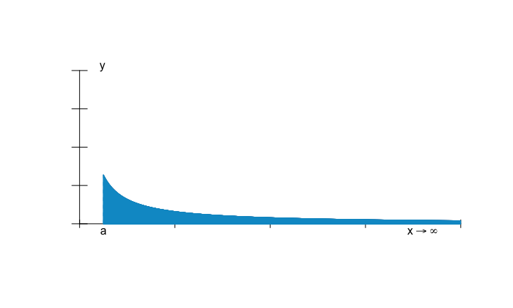
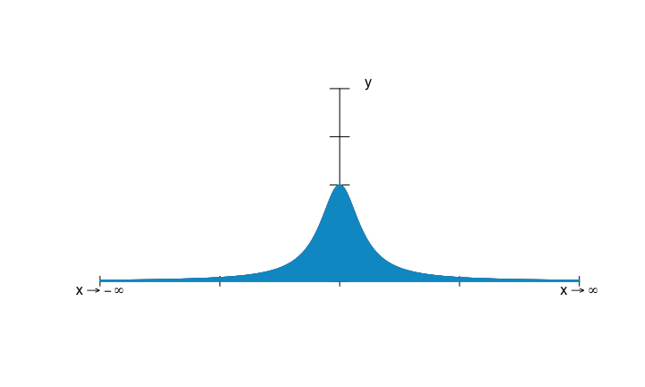
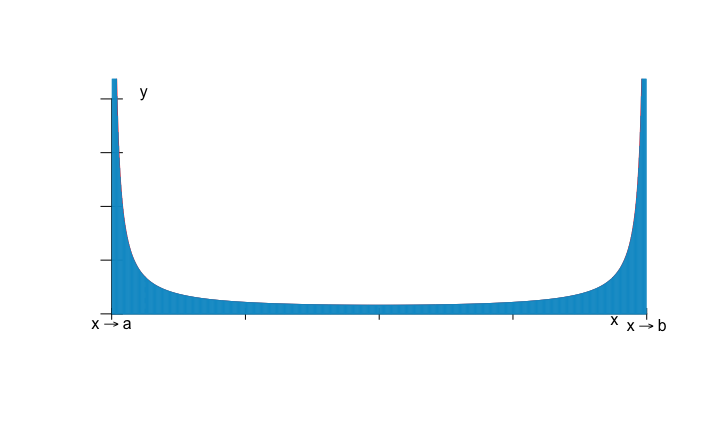

<script src="https://kit.fontawesome.com/a0edb659c7.js" crossorigin="anonymous"></script>


# Introducción

## Motivación

La idea de **integración** nace de la necesidad de calcular **áreas.**

El cálculo de un **área** es la medición de la cantidad de unidades de **superficie** necesarias para una cobertura exacta de una determinada **figura plana.**

A partir de un **cuadrado unitario** el área de un rectángulo se puede calcular multiplicando la **longitud** por la **anchura** del mismo.

Dado que un **triángulo** se puede **diseccionar** y volver a montar para formar un **rectángulo**, el área del mismo se puede calcular dividiendo por dos el **área** del rectángulo correspondiente.

Usando la mismo idea, y dado que un **polígono** se puede **diseccionar** en **triángulos**, el área de cualquier polígono también se puede calcular sumando el área de los **triángulos** involucrados. 

## Motivación

Sin embargo, cuando la figura es **curva**, el cálculo de su área se complica mucho. 
Usando el mismo razonamiento que el cálculo del área de polígonos, podíamos considerar los **polígonos inscritos** y **circunscritos** como **cotas inferiores y superiores** del área de la figura a calcular.

Si hacemos dichos polígonos más "precisos" progresivamente, podemos considerar que el área de la **figura curva** sería el límite del **área** de cada colección de dichos polígonos. Ver figura siguiente.

Ésta es la idea fundamental de la **integración de Riemman** y es la que vamos a desarrollar seguidamente.

## Motivación
<div class="center">


</div>


# Definición de integral de Riemann

## Partición de un intervalo
Para  definir las áreas de los **polígonos inscritos** y **circunscritos** como aproximaciones al área de una figura **curva** cualquiera, necesitamos definir el concepto de **partición** de un intervalo que será dónde "descansarán" los polígonos anteriores.

<l class="definition">Definición de partición de un intervalo.</l>

Sea $[a,b]\subset\mathbb{R}$ un intervalo de la recta real. Una **partición** $P=\{x_0=a< x_1<\ldots,x_n=b\}$ del intervalo anterior es un conjunto finito  de puntos ordenados dentro del intervalo donde el mínimo coincide con $a$ y el máximo, con $b$. A los subintervalos $[x_i,x_{i+1}]$, para $i=0,\ldots,n-1$ se le denomina subintervalos de la partición $[a,b]$:

<div class="center">


</div>


## Partición de un intervalo
Para aproximar cada vez más el área de la **figura curva** al área de la **colección de polígonos**, necesitamos introducir el concepto de **partición más fina** en el sentido de que cuánta más fina sea una partición, más buena será la aproximación del área de los **polígonos** que descansan sobre ella:

<l class="definition">Definición de partición más fina.</l>

Sea $[a,b]\subset\mathbb{R}$ un intervalo de la recta real. Sean $P$ y $P'$ dos **particiones** del intervalo $[a,b]$. Diremos que la **partición** $P'$ es más fina que la partición $P$ si $P\subseteq P'$, es decir si todos los puntos de la partición $P$ son puntos de la partición $P'$, o si se quiere decir en otros términos, si todo **subintervalo** de $P'$ está incluido en algún **subintervalo** de $P$.


## Ejemplo de partición de un intervalo
<div class="example">
**Ejemplo de partición del intervalo $[0,1]$**

Consideramos la partición siguiente del intervalo $[0,1]$:
$$
P=\left\{x_0=0<x_1=\frac{1}{3}<x_2=\frac{2}{3}<x_3=1\right\}.
$$
La siguiente partición $P'$ es más fina que $P$:
$$
P'=\left\{x_0'=0<x_1'=\frac{1}{6}<x_2'=\frac{1}{3}<x_3'=\frac{1}{2}<x_4'=\frac{2}{3}<x_5'=1\right\}.
$$

Observar que $P\subseteq P'$ ya que $\left\{0,\frac{1}{3},\frac{2}{3},1\right\}\subseteq \left\{0,\frac{1}{6},\frac{1}{3},\frac{1}{2},\frac{2}{3}, 1\right\}$.

Además, cualquier subintervalo de la partición $P'$ está incluido en algún **subintervalo** de la partición $P$:
$$
\left[0,\frac{1}{6}\right]\subseteq \left[0,\frac{1}{3}\right],\ \left[\frac{1}{6},\frac{1}{3}\right]\subseteq \left[0,\frac{1}{3}\right],\ \left[\frac{1}{3},\frac{1}{2}\right]\subseteq \left[\frac{1}{3},\frac{2}{3}\right],\ \left[\frac{1}{2},\frac{2}{3}\right]\subseteq \left[\frac{1}{3},\frac{2}{3}\right],\ \left[\frac{2}{3},1\right]\subseteq \left[\frac{2}{3},1\right]
$$
</div>

## Partición de un intervalo
El **diámetro** de una partición es una forma de medir la finura de la misma:

<l class="definition">Definición de diámetro de una partición.</l>

Sea $[a,b]\subset\mathbb{R}$ un intervalo de la recta real. Sea $P=\{x_0=a<x_1<\ldots <x_n\}$ una partición del intervalo. Llamaremos **diámetro** de la partición $P$ y lo denotaremos por $|P|$ a la longitud máxima de los subintervalos de la misma:
$$
|P|=\max_{i=1,\ldots,n} (x_i-x_{i-1}).
$$

## Partición de un intervalo
<div class="example">
**Ejemplo anterior**

En el ejemplo anterior, tendremos que los diámetros de las particiones consideradas serán:
$$
|P|=\max\left\{\frac{1}{3}-0,\frac{2}{3}-\frac{1}{3},1-\frac{2}{3}\right\}=\frac{1}{3},\ |P'|=\max\left\{\frac{1}{6}-0,\frac{1}{3}-\frac{1}{6},\frac{1}{2}-\frac{1}{3},\frac{2}{3}-\frac{1}{2},1-\frac{2}{3}\right\}=\frac{1}{3}.
$$
Observamos que las dos particiones tienen el mismo diámetro.
</div>


## Partición de un intervalo
<l class="observ">Observación. </l>

Dadas dos particiones, si $P'$ es más **fina** que $P$, se verifica que el diámetro de la más fina es menor o igual que el diámetro de la menos fina ya que ésta incluye todos los subintervalos de la más fina: $|P'|\leq |P|$.

A continuación vamos a definir las **aproximaciones inferior y superior** del área de la función curva a calcular usando como **colección de polígonos** los rectángulos con base en los subintervalos de las particiones y cuyas alturas serán los valores ínfimo y supremo, respectivamente, de la función en cada subintervalo:

## Sumas inferiores y superiores
<l class="definition">Definición de sumas inferiores y superiores.</l>

Sea $[a,b]\subset\mathbb{R}$ un intervalo de la recta real. Sea $P=\{x_0=a<x_1<\ldots <x_n\}$ una partición del intervalo.
Sea $f:[a,b]\longrightarrow\mathbb{R}$ una función acotada en dicho intervalo. Definimos para cada subintervalo $[x_{i-1},x_i]$ el valor ínfimo y supremo de la función en dicho subintervalo:
$$
m_i =\inf_{x\in [x_{i-1},x_i]} f(x),\quad M_i =\sup_{x\in [x_{i-1},x_i]} f(x).
$$

## Sumas inferiores y superiores
La **suma inferior** correspondiente a la partición $P$ a la función $f$ se define como:
$$
L(f,P)=\sum_{i=1}^n m_i\cdot (x_i-x_{i-1}),
$$
y la **suma superior** correspondiente a la partición $P$ a la función $f$ se define como:
$$
U(f,P)=\sum_{i=1}^n M_i\cdot (x_i-x_{i-1}).
$$

## Sumas inferiores y superiores
<l class="observ">Observación.</l>

El nombre de $L$ en la notación de **suma inferior** viene del inglés "lower" y el nombre de $U$ en la **suma superior**, de "upper".

En las dos figuras siguientes se puede ver un ejemplo de una partición de 6 puntos indicando los infimos $m_i$ y los supremos $M_i$ de la función representada en verde en cada subintervalo de la partición.

La suma de las áreas de los rectángulos en azul sería la suma inferior $L(f,P)$ correspondiente a la partición $P$ de la función $f$ y la suma de las áreas de los rectángulos en rojo, la suma superior $U(f,P)$ correspondiente a dicha partición $P$ de la función $f$.

## Sumas inferiores y superiores
<div class="center">


</div>

## Sumas inferiores y superiores
<div class="center">


</div>

## Ejemplo
<div class="example">
**Ejemplo** 

Consideremos la función $f(x)=1-x^2$ definida en el intervalo $[0,1]$ y la partición vista anteriormente:
$$
P=\left\{x_0=0<x_1=\frac{1}{3}<x_2=\frac{2}{3}<x_3=1\right\}.
$$
La suma inferior de $f$ correspondiente a la partición $P$, $L(f,P)$ sería:
$$
L(f,P)=\inf_{x\in \left[0,\frac{1}{3}\right]} f(x)\cdot \left(\frac{1}{3}-0\right)+\inf_{x\in \left[\frac{1}{3},\frac{2}{3}\right]} f(x)\cdot \left(\frac{2}{3}-\frac{1}{3}\right)+\inf_{x\in \left[\frac{2}{3},1\right]} f(x)\cdot \left(1-\frac{2}{3}\right).
$$
La función $f(x)=1-x^2$ es decreciente en el intervalo $[0,1]$ tal como muestra su gráfica. Hemos indicado con rectas verticales discontinuas los valores de la partición considerada en el eje $X$.
</div>

## Ejemplo
<div class="example">

</div>

## Ejemplo
<div class="example">
Otra forma de ver que la función es decreciente es observar el signo de la derivada en el intervalo considerado $[0,1]$.

El valor de la derivada es $f'(x)=-2x$ y su valor será negativo para todo valor $x$ en el intervalo $[0,1]$. Por tanto, recordemos que en este caso la función es decreciente.

Usando la observación anterior, podemos afirmar que, en general, el ínfimo de la función $f$ en un subintervalo cualquiera $[x_{i-1},x_i]$ de la partición se alcanzará en el valor $x_i$: 
$$
m_i =\inf_{x\in [x_{i-1},x_i]} f(x) = f(x_i).
$$
El valor de la suma inferior será, pues,
$$
\begin{array}{rl}
L(f,P) & =f\left(\frac{1}{3}\right)\cdot \frac{1}{3}+f\left(\frac{2}{3}\right)\cdot \frac{1}{3}+f\left(1\right)\cdot \frac{1}{3}=\left(1-\frac{1}{9}\right)\cdot \frac{1}{3}+\left(1-\frac{4}{9}\right)\cdot \frac{1}{3}+\left(1-1\right)\cdot \frac{1}{3}\\
& = \frac{13}{27}\approx 0.4815.
\end{array}
$$
</div>

## Ejemplo
<div class="example">
Razonando de manera similar, podemos afirmar que, en general, el supremo de la función $f$ en un subintervalo cualquiera $[x_{i-1},x_i]$ de la partición se alcanzará en el valor $x_{i-1}$: 
$$
M_i =\sup_{x\in [x_{i-1},x_i]} f(x) = f(x_{i-1}).
$$
El valor de la suma superior será, pues,
$$
\begin{array}{rl}
U(f,P) & =f\left(0\right)\cdot \frac{1}{3}+f\left(\frac{1}{3}\right)\cdot \frac{1}{3}+f\left(\frac{2}{3}\right)\cdot \frac{1}{3}=\left(1-0\right)\cdot \frac{1}{3}+\left(1-\frac{1}{9}\right)\cdot \frac{1}{3}+\left(1-\frac{4}{9}\right)\cdot \frac{1}{3}\\
& = \frac{22}{27}\approx 0.8148.
\end{array}
$$
En las dos figuras siguientes, hemos dibujado en verde los rectángulos correspondientes a la suma inferior $L(f,P)$ y en rojo, los correspondientes a la suma superior $U(f,P)$. Los valores obtenidos anteriormente serían, pues, la suma de las áreas de los rectángulos en verde para $L(f,P)$ y la suma de las áreas de los rectángulos en rojo para $U(f,P)$.
</div>

## Ejemplo
<div class="example">

</div>

## Ejemplo
<div class="example">


</div>


## Ejemplo
<div class="example">
El cálculo de la suma inferior y superior en `python` es el siguiente:

```python
import numpy as np
def f(x):
 return(1-x**2)

x = np.linspace(0,1,num=4);
suma_inferior = 0;
suma_superior = 0;
for i in range(1,len(x)):
  suma_inferior = suma_inferior+f(x[i])*(x[i]-x[i-1]);
  suma_superior = suma_superior+f(x[i-1])*(x[i]-x[i-1]);
```

</div>


## Ejemplo
<div class="example">

```python
print('Suma inferior={res}'.format(x=x, res=suma_inferior))
```

```
## Suma inferior=0.48148148148148145
```

```python
print('Suma superior={res}'.format(x=x, res=suma_superior))
```

```
## Suma superior=0.8148148148148148
```

</div>

## Sumas inferiores y superiores
<div class="exercise">
**Ejercicio**

Sea $f:[a,b]\longrightarrow \mathbb{R}$ una función acotada. Sea $P=\{x_0=a < x_1<\cdots <x_n=b\}$ una partición del intervalo $[a,b]$. 
Sea $m=\inf_{x\in [a,b]}f(x)$ el ínfimo de la función $f$ en el intervalo considerado $[a,b]$ y $M$, el supremo: $M=\sup_{x\in [a,b]}f(x)$. Demostrar que se verifican las desigualdades siguientes:
$$
m\cdot (b-a)\leq L(f,P)\leq U(f,P)\leq M\cdot (b-a).
$$
Indicación: pensad que $m_i\geq m$ y $M_i\leq M$, para todo subintervalo de la partición $P$.
</div>

El resultado siguiente nos dice cómo se comportan las **sumas inferiores y superiores** a medida que hacemos más **finas** las particiones del intervalo en cuestión:


## Sumas inferiores y superiores
<l class="prop">Proposición. </l>

Sea $f:[a,b]\longrightarrow \mathbb{R}$ una función acotada. Sean $P$ y $P'$ dos particiones del intervalo $[a,b]$. Entonces:

* Si la partición $P'$ es más fina que la partición $P$, se verifica:
$$
L(f,P')\geq L(f,P), \quad U(f,P')\leq U(f,P).
$$

* Siempre se verifica que:
$$
L(f,P)\leq U(f,P').
$$

## Sumas inferiores y superiores

<l class="observ">Observación. </l>

La proposición anterior nos dice que a medida que las **particiones** se hacen más **finas**, las **sumas inferiores van creciendo** y las **sumas superiores van disminuyendo.** 

O, dicho en otros términos, cuánto más **fina** es la partición, el **área por defecto** de la función $f$ va **creciendo** y el **área por exceso** va **disminuyendo.**

La segunda parte nos dice que cualquier suma superior de cualquier partición siempre supera cualquier suma inferior de otra partición cualquiera. Es decir, cualquier área por exceso siempre supera cualquier área por defecto.


## Sumas inferiores y superiores
<div class="box">
<div class="important">
<i class="fa fa-dizzy"> Contenido bastante técnico. </i>
</div>
</div>

<div class="dem">
**Demostración**

Demostremos en primer lugar que $L(f,P')\geq L(f,P)$.

Sea $P=\{x_0=a<x_1<\cdots < x_n\}$ la partición $P$. Como la partición $P'$ es más fina que la partición $P$, cada subintervalo $[x_{i-1},x_i]$ de $P$ contendrá puntos de la partición de $P'$. Llamaremos $x_{i-1}=x_{i,0}<x_{i,1}<\cdots < x_{i,n_i}=x_i$ a los puntos de la partición $P'$ incluidos en el subintervalo $[x_{i-1},x_i]$. Notar que hemos llamado $x_{i,0}=x_{i-1}$ al extremo de la izquierda y $x_{i,n_i}=x_i$ al extremo de la derecha del subintervalo $[x_{i-1},x_i]$.

Sea $m_{ij}$ el ínfimo de la función $f$ en el subintervalo $[x_{i,j-1},x_{i,j}]$: $\displaystyle m_{ij} = \inf_{x\in [x_{i,j-1},x_{i,j}]} f(x),$
y $m_i$, al ínfimo de la función $f$ en el subintervalo grande $[x_{i-1},x_i]$: $\displaystyle m_i = \inf_{x\in [x_{i-1},x_{i}]} f(x).$

</div>

## Sumas inferiores y superiores
<div class="dem">
Usando la notación anterior, podemos escribir la suma inferior de $f$ respecto las particiones $P'$ y $P$ de la forma siguiente:
$$
\begin{array}{rl}
L(f,P') & = \displaystyle\sum_{i=1}^n\sum_{j=1}^{n_i} m_{ij}\cdot (x_{i,j}-x_{i,j-1}), \\
L(f,P) & = \displaystyle\sum_{i=1}^n m_{i}\cdot (x_{i}-x_{i-1}).
\end{array}
$$

De cara a realizar la resta de las dos sumas inferiores anteriores, necesitamos escribir la suma inferior $L(f,P)$ como la suma doble que aparece en la suma inferior $L(f,P')$. Para ello, notemos lo siguiente:
$$
x_i-x_{i-1}=x_{i,n_i}-x_{i,0}=x_{i,n_i}-x_{i,n_i-1}+x_{i,n_i-1}+\cdots -x_{i,1}+x_{i,1}-x_{i,0},
$$
es decir, vamos sumando y restando los valores de la partición $P'$ que están en el subintervalo $[x_{i-1},x_i]$ distintos de los extremos $x_{i-1}$ y $x_i$.
</div>

## Sumas inferiores y superiores
<div class="dem">
De esta manera obtenemos la expresión siguiente:
$$
x_i-x_{i-1}=\sum_{j=1}^{n_i} (x_{i,j}-x_{i,j-1}).
$$
La expresión anterior nos permite escribir la suma inferior de $f$ respecto la partición $P$ en términos de la suma doble que aparece en la expresión de la suma inferior de $f$ respecto la partición más fina $P'$ permitiendo obtener $L(f,P')-L(f,P)$ de forma relativamente sencilla:
$$
\begin{array}{rl}
L(f,P') & = \displaystyle\sum_{i=1}^n\sum_{j=1}^{n_i} m_{ij}\cdot (x_{i,j}-x_{i,j-1}), \\
L(f,P) & = \displaystyle\sum_{i=1}^n\sum_{j=1}^{n_i} m_{i}\cdot (x_{i,j}-x_{i,j-1}).
\end{array}
$$
Usando las expresiones anteriores, la expresión de $L(f,P')-L(f,P)$ será:
$$
L(f,P')-L(f,P) = \sum_{i=1}^n\sum_{j=1}^{n_i} (m_{ij}-m_i)\cdot (x_{i,j}-x_{i,j-1}).
$$

</div>

## Sumas inferiores y superiores
<div class="dem">
El objetivo es demostrar que $L(f,P')-L(f,P)\geq 0$, o que $L(f,P')\geq L(f,P)$. Para ello, basta observar que los sumandos que aparecen en la suma doble de la expresión anterior son positivos ya que en primer lugar, $x_{i,j}-x_{i,j-1}\geq 0$ y $m_{ij}-m_i\geq 0$, o $m_{i,j}\geq m_i$ ya que $m_{i,j}$ es el ínfimo de la función $f$ en el subintervalo $[x_{i,j-1},x_{i,j}]$ y $m_i$, el ínfimo de la función $f$ en el subintervalo $[x_{i-1},x_i]$. 

Como el subintervalo  $[x_{i,j-1},x_{i,j}]$ está incluído en el subintervalo $[x_{i-1},x_i]$, el valor de su ínfimo será mayor al ser el primer subintervalo "más pequeño que el segundo".

Queda visto por tanto que $L(f,P')\geq L(f,P)$.

</div>

## Sumas inferiores y superiores
<div class="dem">
Para demostrar que $U(f,P')\leq U(f,P)$, escribamos dichas sumas de la forma siguiente siguiendo un razonamiento similar al realizado anteriormente:
$$
\begin{array}{rl}
U(f,P') & = \displaystyle\sum_{i=1}^n\sum_{j=1}^{n_i} M_{ij}\cdot (x_{i,j}-x_{i,j-1}), \\
U(f,P) & = \displaystyle\sum_{i=1}^n\sum_{j=1}^{n_i} M_{i}\cdot (x_{i,j}-x_{i,j-1}),
\end{array}
$$
donde $M_{ij}$ es el supremo de la función $f$ en el subintervalo $[x_{i,j-1},x_{i,j}]$: $\displaystyle M_{ij} =\sup_{x\in [x_{i,j-1},x_{i,j}]} f(x),$
y $M_i$, el supremo de la función $f$ en el subintervalo grande $[x_{i-1},x_i]$: $\displaystyle M_i = \sup_{x\in [x_{i-1},x_{i}]} f(x).$

La expresión de $U(f,P')-U(f,P)$ será:
$$
U(f,P')-U(f,P)=\sum_{i=1}^n\sum_{j=1}^{n_i} (M_{ij}-M_i)\cdot (x_{i,j}-x_{i,j-1}).
$$
</div>

## Sumas inferiores y superiores
<div class="dem">
El objetivo es demostrar que $U(f,P')-U(f,P)\leq 0$, o que $U(f,P')\leq U(f,P)$. Para ello, basta observar que los sumandos que aparecen en la suma doble de la expresión anterior son negativos ya que en primer lugar, $x_{i,j}-x_{i,j-1}\geq 0$ y $M_{ij}-M_i\leq 0$, o $M_{i,j}\leq M_i$ ya que $M_{i,j}$ es el supremo de la función $f$ en el subintervalo $[x_{i,j-1},x_{i,j}]$ y $M_i$, el supremo de la función $f$ en el subintervalo $[x_{i-1},x_i]$. 

Como el subintervalo  $[x_{i,j-1},x_{i,j}]$ está incluído en el subintervalo $[x_{i-1},x_i]$, el valor de su supremo será menor al ser el primer subintervalo "más pequeño que el segundo".

Queda visto por tanto que $U(f,P')\leq U(f,P)$.

Falta demostrar que $L(f,P)\leq U(f,P')$:
$$
L(f,P)\leq L(f,P')\leq U(f,P').
$$
La primera desigualdad es consecuencia de la primera parte de esta demostración, la segunda desigualdad, consecuencia del hecho de que cualquier suma inferior siempre es menor que cualquier suma superior.
</div>


## Ejemplo
<div class="example">
**Ejemplo** 

Consideremos la función $f(x)=1-x^2$ definida en el intervalo $[0,1]$ y las particines siguientes donde $P'$, como puede observarse, es más fina que $P$:
$$
\begin{array}{rl}
P & =\left\{x_0=0<x_1=\frac{1}{3}<x_2=\frac{2}{3}<x_3=1\right\},\\
P' & =\left\{x_{0,0}=0<x_{0,1}=\frac{1}{6}<x_{1,0}=\frac{1}{3}<x_{1,1}=\frac{1}{2}<x_{1,2}=\frac{7}{12}<x_{2,0}=\frac{2}{3}<x_{2,1}=\frac{5}{6}<x_{3,0}=1\right\}.
\end{array}
$$
Comprobemos en `python` que $L(f,P')\geq L(f,P)$ y $U(f,P')\leq U(f,P)$:

</div>


## Ejemplo
<div class="example">

```python
def f(x):
 return(1-x**2)

P = [0.,1./3.,2./3.,1.];
P2 = [0.,1./6.,1./3.,1./2.,7./12.,2./3.,5./6.,1.]
suma_inferior_P = 0;
suma_inferior_P2 = 0;
suma_superior_P = 0;
suma_superior_P2 = 0;

for i in range(1,len(P)):
  suma_inferior_P = suma_inferior_P+f(P[i])*(P[i]-P[i-1]);
  suma_superior_P = suma_superior_P+f(P[i-1])*(P[i]-P[i-1]);

for i in range(1,len(P2)):
  suma_inferior_P2 = suma_inferior_P2+f(P2[i])*(P2[i]-P2[i-1]);
  suma_superior_P2 = suma_superior_P2+f(P2[i-1])*(P2[i]-P2[i-1]);
```

</div>


## Ejemplo
<div class="example">

```python
print('Suma inferior={res}'.format(x=x, res=suma_inferior_P))
```

```
## Suma inferior=0.48148148148148145
```

```python
print('Suma inferior partición más fina={res}'.format(x=x, res=suma_inferior_P2))
```

```
## Suma inferior partición más fina=0.5873842592592592
```
</div>


## Ejemplo
<div class="example">

```python
print('Suma superior={res}'.format(x=x, res=suma_superior_P))
```

```
## Suma superior=0.8148148148148148
```

```python
print('Suma superior partición más fina={res}'.format(x=x, res=suma_superior_P2))
```

```
## Suma superior partición más fina=0.7378472222222222
```

</div>


## Ejemplo
<div class="example">
Por último mostramos gráficamente las dos particiones junto con las sumas inferiores y superiores.

Los dos gráficos siguientes corresponden a las sumas inferiores de las dos particiones consideradas empezando con la menos fina y mostrando a continuación la más fina y en los dos gráficos siguientes hacemos lo mismo pero con las sumas superiores.


</div>

## Ejemplo
<div class="example">

</div>

## Ejemplo
<div class="example">

</div>

## Ejemplo
<div class="example">


</div>

## Ejemplo
<div class="example">

</div>

## Integral superior e inferior

Dada una función acotada $f$, usando la proposición anterior, a medida que hagamos **más finas** las particiones del intervalo de definición de dicha función, las **sumas inferiores** irán **aumentando**  y las **sumas superiores** irán **disminuyendo**.

Como cualquier **suma inferior** está acotada **superiormente** por una **suma superior** cualquiera, existirá el **supremo** de dichas **sumas inferiores** para todas las particiones del intervalo.

De la misma manera, como cualquier **suma superior** está acotada **inferiormente** por una **suma inferior** cualquiera, existirá el **ínfimo** de dichas **sumas superiores** para todas las particiones del intervalo.

A dicho **supremo** y a dicho **ínfimo** se le conoce como **integral inferior** y **superior** de la función $f$, respectivamente:


## Integral superior e inferior
<l class="definition">Definición de integral superior e inferior. </l>

Sea $f:[a,b]\longrightarrow\mathbb{R}$ una función acotada. Definimos **integral inferior** e **integral superior** de la función $f$ al **supremo** y al **ínfimo** de las **sumas inferiores** e **superiores** respectivamente para todas las particiones del intervalo:
$$
\underline{\int_a^b} f =\sup_P L(f,P),\quad \overline{\int_a^b} f =\inf_P U(f,P).
$$

## Integral superior e inferior
<l class="observ">Observación.</l>

Dada una partición cualquiera del intervalo $[a,b]$ se verifica siempre:
$$
L(f,P)\leq \underline{\int_a^b} f\leq \overline{\int_a^b} f \leq U(f,P).
$$
La primera desigualdad es consecuencia de que un elemento (suma inferior de $f$ respecto de una partición $P$) siempre es menor que el supremo del conjunto (supremo de las sumas inferiores de $f$ respecto de las particiones).

## Integral superior e inferior

La segunda desigualdad es consecuencia de que siempre cualquier suma inferior respecto de una partición $P$ es menor que cualquier suma superior respecto de cualquier partición $P'$ no necesariamente la misma que $P$ (ver proposición anterior): $L(f,P)\leq U(f,P')$. Si consideramos ínfimos en la parte derecha de la desigualdad anterior, tendremos:
$$
L(f,P)\leq\inf_{P'} U(f,P')=\overline{\int_a^b} f.
$$

## Integral superior e inferior

Y ahora, como $\overline{\int_a^b} f$ es un valor fijo, si consideramos supremos en la parte izquierda de la desigualdad anterior, tenemos:
$$
\underline{\int_a^b} f =\sup_P L(f,P)\leq \overline{\int_a^b} f,
$$
tal como queríamos ver.

Por último, la tercera desigualdad es consecuencia de que el ínfimo de un conjunto de elementos (sumas superiores respecto de particiones) siempre es menor que cualquiera de sus elementos (suma superior respecto de la partición $P$).

## Integral superior e inferior

La proposición siguiente nos dice que siempre es posible hallar una partición $P$, tan **fina** como sea posible, tal que la **integral superior** e **inferior** de $f$ se puede aproximar tanto como se quiera a la **suma superior** e **inferior** de $f$ respecto la partición $P$.

<l class="prop">Proposición.</l>

Sea $f:[a,b]\longrightarrow\mathbb{R}$ una función acotada. Entonces, para todo valor $\epsilon >0$, siempre es posible hallar un valor $\delta >0$ tal que si $P$ es una partición del intervalo $[a,b]$ con diámetro menor que $\delta$, $|P|<\delta$, entonces:
$$
0\leq \underline{\int_a^b} f -L(f,P)<\epsilon, \quad 0\leq U(f,P)-\overline{\int_a^b} f <\epsilon.
$$

## Integral superior e inferior

<l class="observ">Observación.</l>

La proposición anterior es equivalente a la siguiente:
Si $\{P_n\}_n$ es una sucesión de particiones con diámetros tendiendo a cero, $\displaystyle\lim_{n\to\infty}|P_n|=0$, entonces:
$$
\lim_{n\to\infty} L(f,P_n)=\underline{\int_a^b} f,\quad \lim_{n\to\infty} U(f,P_n)=\overline{\int_a^b} f.
$$


## Funciones integrables

En estos momentos ya estamos en condiciones de definir cuándo una función acotada cualquiera será **integrable**. 

La idea es que la **integral superior** e **inferior** de la misma deben coincidir.

Es decir, los límites de las **sumas superiores** e **inferiores** cuando las particiones se hacen más y más finas deben ser los mismos:

## Funciones integrables

<l class="definition">Definición de función integrable.</l>

Sea $f:[a,b]\longrightarrow\mathbb{R}$ una función acotada. 
Diremos que dicha función es **integrable** si su **integral inferior** y **superior coinciden** y en este caso, llamaremos **integral de $f$ en el intervalo $[a,b]$** al valor de dichas integrales:
$$
\int_a^b f = \underline{\int_a^b}= \overline{\int_a^b} f.
$$
La integral también se indica por $\displaystyle\int_a^b f(x)\, dx$.


## Funciones integrables
A continuación vamos a dar condiciones y criterios para verificar si una determinada función es o no **integrable**.

La proposición siguiente nos dice que afirmar que una función es **integrable** es equivalente a decir que podemos encontrar un **partición** del intervalo correspondiente tal que la diferencia entre la **sumas inferior** y la **superior** de dicha **partición** se puede hacer tan pequeña como se quiera: 

<l class="prop"> Proposición: condición necesaria y suficiente de integrabilidad. Criterio de Riemann</l>

Sea $f:[a,b]\longrightarrow\mathbb{R}$ una función acotada. Entonces $f$ es integrable si, y sólo si se verifica la condición siguiente:
para todo valor positivo $\epsilon >0$, existe una partición $P$ del intervalo $[a,b]$ tal que $U(f,P)-L(f,P)<\epsilon$.

## Funciones integrables
<div class="box">
<div class="important">
<i class="fa fa-dizzy"> Contenido bastante técnico. </i>
</div>
</div>
<div class="dem">
**Demostración**

La demostración de la proposición anterior se basa en la proposición vista sobre integrales superiores e inferiores.

Veamos primero la implicación directa:

$\Rightarrow$: supongamos que $f$ es integrable. Entonces, $\underline{\int_a^b} f= \overline{\int_a^b} f$.

Consideremos un valor $\epsilon >0$. Sabemos que existe un valor $\delta >0$ tal que si $P$ es una partición del intervalo $[a,b]$ con diámetro menor que $\delta$, $|P|<\delta$, se tiene: 
$$
0\leq \underline{\int_a^b} f -L(f,P)<\frac{\epsilon}{2}, \quad 0\leq U(f,P)-\overline{\int_a^b} f <\frac{\epsilon}{2}.
$$
</div>

## Funciones integrables
<div class="dem">
Por tanto:
$$
0< U(f,P)-L(f,P)=U(f,P)-\overline{\int_a^b} f+\underline{\int_a^b} f -L(f,P) <\frac{\epsilon}{2}+\frac{\epsilon}{2}=\epsilon,
$$
tal como queríamos ver.
</div>

## Funciones integrables
<div class="dem">
Demostremos ahora la implicación inversa:

$\Leftarrow$: sabemos que dado cualquier $\epsilon >0$, existe una partición $P$ del intervalo $[a,b]$ tal que $U(f,P)-L(f,P)<\epsilon$.

Ahora bien, recordemos que:
$$
L(f,P)\leq \underline{\int_a^b} f\leq \overline{\int_a^b} f \leq U(f,P).
$$
Por tanto, usando la condición anterior tenemos que $\overline{\int_a^b} f-\underline{\int_a^b} f<\epsilon$.

Como la condición es para todo $\epsilon >0$, necesariamente ha de cumplirse que $\underline{\int_a^b} f=\overline{\int_a^b} f$, condición que equivale a decir que $f$ es integrable en el intervalo $[a,b]$.
</div>

## Funciones integrables

La condición anterior es difícil de aplicar en la práctica y en su lugar se usa la proposición equivalente siguiente:

<l class="prop"> Proposición: condición necesaria y suficiente de integrabilidad.</l>

Sea $f:[a,b]\longrightarrow\mathbb{R}$ una función acotada. Sea $\{P_n\}_n$ una sucesión de particiones del intervalo $[a,b]$ tal que $\displaystyle\lim_{n\to\infty}|P_n|=0$, es decir, los diámetros tienden a cero.  Entonces $f$ es integrable si, y sólo si $\displaystyle\lim_{n\to\infty}U(f,P_n)=\lim_{n\to\infty}L(f,P_n)$ y, en este caso, 
$$\lim_{n\to\infty}L(f,P_n)=\int_a^b f=\lim_{n\to\infty}U(f,P_n).$$

## Funciones integrables

Dicha proposición nos dice que para verificar que una función $f$ sea **integrable** en un intervalo $[a,b]$, basta hallar una sucesión de particiones $(P_n)_n$ con diámetros cada vez más pequeños y tendiendo a cero tal que el límite de las **sumas superiores** e **inferiores** tienden hacia el mismo límite siendo dicho límite el valor de la integral de la función $f$ en el intervalo $[a,b]$.

## Funciones integrables
<div class="box">
<div class="important">
<i class="fa fa-dizzy"> Contenido bastante técnico. </i>
</div>
</div>
<div class="dem">
**Demostración**

Demostremos primero la implicación directa:

$\Rightarrow$: supongamos que $f$ es integrable. Entonces, $\underline{\int_a^b} f = \overline{\int_a^b} f$.

Usando la proposición anterior, sabemos que para cualquier $\epsilon >0$, existe una partición $P$, tal que $U(f,P)-L(f,P)<\epsilon$.

Consideremos $n\in\mathbb{N}$ un valor natural y $\epsilon = \frac{1}{n}$. Entonces existe una partición $P_n$ tal que $U(f,P_n)-L(f,P_n)<\frac{1}{n}.$ A continuación, consideremos la partición 
$$
\hat{P}_n =P_n\cup \{x_0=a < a+\frac{b-a}{n}<\cdots < x_i=a+i\cdot \frac{b-a}{n}<\cdots <  b=x_n\}.
$$
</div>

## Funciones integrables
<div class="dem">
Fijarse que se cumple, por un lado que el diámetro de $\hat{P}_n$ es menor o igual que $\frac{1}{n}$, $|\hat{P}_n|\leq \frac{1}{n}$ y, por otro,
$$
0\leq U(f,\hat{P}_n)-L(f,\hat{P}_n)\leq U(f,P_n)-L(f,P_n)<\frac{1}{n},
$$
ya que la partición $\hat{P}_n$ es más fina que $P_n$.

A partir de la condición anterior, haciendo tender $n\to\infty$, tenemos que $I=\displaystyle\lim_{n\to\infty}U(f,\hat{P}_n)=\lim_{n\to\infty}L(f,\hat{P}_n)$, tal como queríamos ver. Es decir, existe una sucesión de particiones $\{\hat{P}_n\}_n$ con $\displaystyle\lim_{n\to \infty}|\hat{P}_n|=0$ tal que $I=\displaystyle\lim_{n\to\infty}U(f,\hat{P}_n)=\lim_{n\to\infty}L(f,\hat{P}_n)$.


El valor de $I$ anterior sería el valor de la integral de $f$ en el intervalo $[a,b]$ ya que 

* por un lado, se verifica que:
$\overline{\int_a^b} f \leq U(f,\hat{P}_n)$ para todo valor de $n$. Si pasamos a límite tendremos que $\overline{\int_a^b} f \leq I$;
* por otro lado, tenemos que $\underline{\int_a^b} f \geq  L(f,\hat{P}_n)$ para todo valor de $n$. Si pasamos a límite tendremos que $\underline{\int_a^b} f \geq I$.

En resumen: $I\leq \underline{\int_a^b} f=\overline{\int_a^b} f \leq I$, lo que implica que $I=\underline{\int_a^b} f=\overline{\int_a^b} f =\int_a^b f$.


</div>

## Funciones integrables
<div class="dem">
Hagamos la demostración de la implicación inversa:

$\Leftarrow$: supongamos que existe una partición $\{P_n\}_n$ con $\displaystyle\lim_{n\to\infty}|P_n|=0$ tal que $I=\displaystyle\lim_{n\to\infty}U(f,P_n)=\lim_{n\to\infty}L(f,P_n)$.

Como $\displaystyle\lim_{n\to\infty} U(f,P_n)-L(f,P_n)=0$, entonces para todo valor $\epsilon >0$, existe un valor $n_0$ tal que si $n\geq n_0$, $U(f,P_n)-L(f,P_n)<\epsilon$.

Es decir, para todo $\epsilon >0$, existe una partición $P$ (cualquier partición $P_n$ con $n\geq n_0$) tal que $U(f,P)-L(f,P)<\epsilon$. Usando la primera proposición vista que nos da una condición necesaria y suficiente de integrabilidad, tenemos que $f$ será integrable en el intervalo $[a,b]$, tal como queríamos ver.

</div>

## Funciones integrables. Ejemplo
<div class="example">
**Ejemplo**

Sea $k\geq 1$ un natural cualquiera mayor que $1$. Veamos que la función $f(x)=x^k$ es integrable en el intervalo $[0,1]$.

Para ello, aplicaremos la proposición anterior y consideraremos la suceción de particiones siguiente:
$$
P_n =\left\{x_0=0<\frac{1}{n}<\cdots < \frac{i}{n}<\cdots < x_n =1\right\}.
$$
La partición anterior sería equiespaciada donde $x_i-x_{i-1}=\frac{1}{n}$. Por tanto el diámetro de $P_n$ sería $|P_n|=\frac{1}{n}$ y se verificará que $\displaystyle\lim_{n\to\infty}|P_n|=0$.

Calculemos las sumas inferiores y superiores de $f$ respecto las particiones $P_n$:
$$
\begin{array}{rl}
L(f,P_n) & \displaystyle = \sum_{i=1}^n m_i\cdot (x_i-x_{i-1}) = \sum_{i=1}^n \inf_{x\in [x_{i-1},x_i]}x^k\cdot \frac{1}{n},\\
U(f,P_n) & \displaystyle = \sum_{i=1}^n M_i\cdot (x_i-x_{i-1}) = \sum_{i=1}^n \sup_{x\in [x_{i-1},x_i]}x^k\cdot \frac{1}{n}.
\end{array}
$$
</div>

## Funciones integrables. Ejemplo
<div class="example">
Como la función $f(x)=x^k$ es creciente en el intervalo $[0,1]$ tendremos que 
$$\inf_{x\in [x_{i-1},x_i]}x^k =x_{i-1}^k =\left(\frac{i-1}{n}\right)^k,\quad  \sup_{x\in [x_{i-1},x_i]}x^k =x_{i}^k =\left(\frac{i}{n}\right)^k.$$

Las sumas inferiores y superiores serán, por tanto,
$$
\begin{array}{rl}
L(f,P_n) & \displaystyle = \frac{1}{n}\sum_{i=1}^n \left(\frac{i-1}{n}\right)^k = \frac{1}{n^{k+1}}\sum_{i=1}^n (i-1)^k ,\\
U(f,P_n) & \displaystyle = \frac{1}{n}\sum_{i=1}^n \left(\frac{i}{n}\right)^k = \frac{1}{n^{k+1}}\sum_{i=1}^n i^k.
\end{array}
$$
El valor de la diferencia entre las sumas superiores e inferiores será:
$$
U(f,P_n)-L(f,P_n)= \frac{1}{n^{k+1}}\left(\sum_{i=1}^n i^k -\sum_{i=1}^n (i-1)^k\right) =\frac{n^k}{n^{k+1}}=\frac{1}{n}.
$$
</div>

## Funciones integrables. Ejemplo
<div class="example">
Como el límite de la sucesión $\frac{1}{n}$ es cero,
$\displaystyle\lim_{n\to\infty} U(f,P_n)-L(f,P_n)=0$, lo que implica que $\displaystyle \lim_{n\to\infty} U(f,P_n)=\lim_{n\to\infty} L(f,P_n)$, condición que, como ya hemos visto, equivale a afirmar que $f(x)=x^k$ es integrable en el intervalo $[0,1]$.

Usando la última proposición, sabemos que el valor de la integral de la función $f(x)=x^k$ en el intervalo $[0,1]$ vale:
$$
\int_0^1 x^k =\lim_{n\to \infty}\frac{1}{n^{k+1}}\sum_{i=1}^n i^k.
$$
Los valores de la integral para $k\in\{1,\ldots, 25\}$ en `Wolfram Alpha` se muestran en el enlace siguiente:
<l class="center">
[](https://www.wolframalpha.com/input/?i=Table%5BLimit%5BSum%5Bi%5Ek%2C+%7Bi%2C+1%2C+n%7D%5D%2Fn%5E%28k+%2B+1%29%2C+n+-%3E+Infinity%5D%2C%7Bk%2C1%2C25%7D%5D)
</l>
Parece que el valor de la integral es $\frac{1}{k+1}$. Más adelante veremos que efectivamente así es.
</div>

## Funciones integrables. Ejemplo
<div class="example">
El cálculo de la integral en `python` se realizaría de la forma siguiente:


```python
from sympy import * 
from sympy.abc import i, k, n

for k in range(1,10):
  valor=Limit(Sum(i**k, (i, 1, n)).doit()/n**(k+1),n,oo).doit();
  print('k={res}, valor integral={valor}'.format(res=k, valor=valor))
```

```
## k=1, valor integral=1/2
## k=2, valor integral=1/3
## k=3, valor integral=1/4
## k=4, valor integral=1/5
## k=5, valor integral=1/6
## k=6, valor integral=1/7
## k=7, valor integral=1/8
## k=8, valor integral=1/9
## k=9, valor integral=1/10
```

</div>

## Funciones integrables. Ejemplo
<div class="example">
**Ejemplo: la integral de una función constante.**

Sea $f:[a,b]\longrightarrow\mathbb{R}$ una función constante: para todo valor de $x\in [a,b]$, $f(x)=C$.

Veamos que siempre $f$ es integrable en cualquier intervalo $[a,b]$ y además $\displaystyle\int_a^b =C\cdot (b-a)$.

Para ello, consideremos la sucesión de particiones siguiente del intervalo $[a,b]$:
$$
P_n =\left\{a=x_0< x_1 =a+\frac{b-a}{n}<\cdots < x_i =a+i\cdot\frac{b-a}{n}<\cdots< x_n=b\right\}.
$$
La sucesión de particiones anterior está formada por valores equiespaciados cuya diferencia entre dos valores consecutivos de $P_n$ vale: $x_{i}-x_{i-1}=\frac{b-a}{n}$.
</div>

## Funciones integrables. Ejemplo
<div class="example">
Calculemos a continuación $L(f,P_n)$ y $U(f,P_n)$:
$$
\begin{array}{rl}
L(f,P_n) & = \displaystyle \sum_{i=1}^n m_i\cdot (x_i-x_{i-1})=C\cdot \sum_{i=1}^n\cdot (x_i-x_{i-1}) = C\cdot (b-a),\\
U(f,P_n) & = \displaystyle \sum_{i=1}^n M_i\cdot (x_i-x_{i-1})=C\cdot \sum_{i=1}^n\cdot (x_i-x_{i-1}) = C\cdot (b-a),\\
\end{array}
$$
ya que $\displaystyle m_i=\inf_{x\in [x_{i-1},x_i]} f(x) =\inf_{x\in [x_{i-1},x_i]} C=C$ y $\displaystyle M_i=\sup_{x\in [x_{i-1},x_i]} f(x) =\sup_{x\in [x_{i-1},x_i]} C=C.$

Como $U(f,P_n)=L(f,P_n)$, tenemos que $\displaystyle \int_a^b f =\lim_{n\to\infty} U(f,P_n)=\lim_{n\to\infty} L(f,P_n)=C\cdot (b-a).$

</div>

# Propiedades de las integrales

## Introducción

En esta sección vamos a estudiar un conjunto de propiedades relacionadas con la integrabilidad de funciones. Dichas propiedades *grosso modo* son las siguientes:

* Aditividad respecto del intervalo.
* Linealidad de la integral.
* Composición de una función continua con una función integrable es integrable.
* Producto y cociente de funciones integrables son también integrables.
* Monotonía y continuidad de funciones.

## Introducción

* Relación entre la monotonia y continuidad de funciones con integrabilidad.
* Montonía de la integral respecto de la función.
* Teorema de la media para integrales: ver cómo se puede escribir la integral de una función como el producto de la longitud del intervalo de integración por un cierto valor real. También generalizaremos dicho resultado.

## Aditividad respecto del intervalo.

<l class="prop">Teorema.  </l>

Sea $f:[a,b]\longrightarrow\mathbb{R}$ una función acotada y sea $c\in (a,b)$ de tal forma que $a<c<b$. Entonces, $f$ es integrable en $[a,b]$ si, y sólo si, $f$ es integrable en $[a,c]$ y $[c,b]$ y, en este caso:
$$
\int_a^b f = \int_a^c f+\int_c^b f.
$$

<l class="observ">Observación:</l>

Una consecuencia del teorema anterior es que si $f$ es integrable en todo el intervalo $[a,b]$, lo es en cualquier subintervalo.

## Separación de una integral en un intervalo
<div class="box">
<div class="important">
<i class="fa fa-dizzy"> Contenido bastante técnico. </i>
</div>
</div>
<div class="dem">
**Demostración**

Empecemos con la implicación directa:

$\Rightarrow$ Como $f$ es integrable en el intervalo $[a,b]$, para todo valor de $\epsilon >0$, existirá una partición $P$ tal que $U(f,P)-L(f,P)<\epsilon$.

Consideremos la siguiente partición $P'$ del intervalo $[a,b]$: $P'=P\cup \{c\}$. Como $P'$ es más fina que $P$, se verificará:
$$
U(f,P')-L(f,P')\leq U(f,P)-L(f,P)< \epsilon.
$$
A continuación consideremos las particiones $P_1$ y $P_2$ siguientes de los subintervalos $[a,c]$ y $[c,b]$, respectivamente:
$$
P_1 =P'\cap [a,c],\quad P_2 = P'\cap [c,b].
$$
</div>

## Separación de una integral en un intervalo
<div class="dem">

Fijémonos  $U(f,P')=U(f,P_1)+U(f,P_2)$ y $L(f,P')=L(f,P_1)+L(f,P_2)$. Será,
$$
U(f,P')-L(f,P')=(U(f,P_1)-L(f,P_1)) + (U(f,P_2)-L(f,P_2)) < \epsilon.
$$
Los valores $U(f,P_1)-L(f,P_1)$ y $U(f,P_2)-L(f,P_2)$ son valores positivos cuya suma es menor que $\epsilon$. Por tanto:
$$
U(f,P_1)-L(f,P_1)<\epsilon,\quad U(f,P_2)-L(f,P_2)<\epsilon.
$$
En resumen, dado un $\epsilon >0$, hemos hallado una partición $P_1$ del intervalo $[a,c]$ y una partición $P_2$ del intervalo $[c,b]$ tal que se verifican las condiciones anteriores. Dicho resultado equivale a afirmar que la función $f$ es integrable en los intervalos $[a,c]$ y $[c,b]$.


</div>

## Separación de una integral en un intervalo
<div class="dem">

A continuación, demostremos la implicación contraria:

$\Leftarrow$ Supongamos ahora que $f$ es integrable en los intervalos $[a,c]$ y $[c,b]$. Sabemos que existen dos particiones $\{P_n\}_n$ y $\{Q_n\}_n$ de los intervalos $[a,c]$ y $[c,b]$, respectivamente, tales que sus diámetros tienden a cero, $\displaystyle\lim_{n\to\infty}|P_n| =0$, $\displaystyle\lim_{n\to\infty}|Q_n| =0$ y se cumple:
$$
\lim_{n\to\infty}U(f,P_n)  =\lim_{n\to\infty}L(f,P_n)=\int_a^c f,\quad 
\lim_{n\to\infty}U(f,Q_n) =\lim_{n\to\infty}L(f,Q_n)=\int_c^b f.
$$
Consideremos la sucesión siguiente de particiones dentro del intervalo grande $[a,b]$: $P_n'=P_n\cup Q_n$.

Dado que $U(f,P_n')=U(f,P_n)+U(f,Q_n)$ y $L(f,P_n')=L(f,P_n)+L(f,Q_n)$. Será,
$$
\begin{array}{rl}
\displaystyle\lim_{n\to\infty}U(f,P_n') & = \displaystyle \lim_{n\to\infty}U(f,P_n)+\lim_{n\to\infty}U(f,Q_n)=\int_a^c f+\int_c^b f,\\
\displaystyle\lim_{n\to\infty}L(f,P_n') & = \displaystyle \lim_{n\to\infty}L(f,P_n)+\lim_{n\to\infty}L(f,Q_n)=\int_a^c f+\int_c^b f.
\end{array}
$$
</div>

## Separación de una integral en un intervalo
<div class="dem">

En resumen, hemos hallado una sucesión de particiones $\{P_n'\}_n$ del intervalo $[a,b]$ tal que:
$$
\lim_{n\to\infty}U(f,P_n') = \lim_{n\to\infty}L(f,P_n') = \int_a^c f+\int_c^b f.
$$
Entonces $f$ es integrable en el intervalo $[a,b]$ y además:
$$
\int_a^b f = \int_a^c f+\int_c^b f.
$$
</div>

<l class="observ">Observación. </l> 

Dos consecuencias del teorema anterior son las siguientes:
$$
\int_a^a f=0,\quad \int_b^a f=-\int_a^b f.
$$

## Linealidad de la integral
<l class="prop">Teorema:</l>

Sean $f, g:[a,b]\longrightarrow\mathbb{R}$ dos funciones integrables en el intervalo $[a,b]$. Sean $\alpha$ y $\beta$ dos valores reales. Entonces la función $\alpha f+\beta g:[a,b]\longrightarrow \mathbb{R}$ es integrable en $[a,b]$ y además:
$$
\int_a^b \alpha f+\beta g =\alpha\int_a^b f+\beta\int_a^b g.
$$

## Linealidad de la integral

<l class="observ">Observación. </l> 

El teorema anterior es equivalente a afirmar lo siguiente:

(a) Si $f, g:[a,b]\longrightarrow\mathbb{R}$ son integrables en $[a,b]$, entonces $f+g$ es integrable en $[a,b]$ y además: $\displaystyle\int_a^b f+g =\int_a^b f+\int_a^b g$.

(a) Si $f:[a,b]\longrightarrow\mathbb{R}$ es integrable en $[a,b]$ y $\alpha$ un valor real, entonces $\alpha f$ es integrable en $[a,b]$ y además $\displaystyle\int_a^b \alpha f=\alpha \int_a^b f$.

## Linealidad de la integral
<div class="box">
<div class="important">
<i class="fa fa-dizzy"> Contenido bastante técnico. </i>
</div>
</div>
<div class="dem">
**Demostración**

Demostremos las dos propiedades de la observación:

Primero veamos la demostración para la suma de funciones.

Supongamos que $f,g:[a,b]\longrightarrow \mathbb{R}$ son integrables en $[a,b]$.

Sea $P$ una partición del intervalo $[a,b]$. Se verifica lo siguiente:
$$
U(f+g,P)\leq U(f,P)+U(g,P),\quad L(f+g,P)\geq L(f,P)+L(g,P),
$$
ya que si $P=\{a=x_0<x_1<\cdots < x_n=b\}$, se cumple:
$$
\begin{array}{rl}
U(f+g,P) & =\displaystyle \sum_{i=1}^n \sup_{x\in [x_{i-1},x_i]} (f(x)+g(x)) (x_i-x_{i-1})\leq \sum_{i=1}^n (\sup_{x\in [x_{i-1},x_i]} f(x)+\sup_{x\in [x_{i-1},x_i]} g(x)) (x_i-x_{i-1})\\ & =U(f,P)+U(g,P).
\end{array}
$$
</div>


## Linealidad de la integral

<div class="dem">

En la última expresión hemos usado que $\sup_{x\in [x_{i-1},x_i]} (f(x)+g(x))\leq \sup_{x\in [x_{i-1},x_i]} f(x)+\sup_{x\in [x_{i-1},x_i]} g(x)$, lo que equivale a decir que el supremo de la suma de dos funciones es menor o igual que la suma de supremos.

De la misma manera:
$$
\begin{array}{rl}
L(f+g,P) & =\displaystyle \sum_{i=1}^n \inf_{x\in [x_{i-1},x_i]} (f(x)+g(x)) (x_i-x_{i-1})\geq \sum_{i=1}^n (\inf_{x\in [x_{i-1},x_i]} f(x)+\inf_{x\in [x_{i-1},x_i]} g(x)) (x_i-x_{i-1})\\ & =L(f,P)+L(g,P).
\end{array}
$$
En la última expresión hemos usado que $\inf_{x\in [x_{i-1},x_i]} (f(x)+g(x))\geq \inf_{x\in [x_{i-1},x_i]} f(x)+\inf_{x\in [x_{i-1},x_i]} g(x)$, lo que equivale a decir que el ínfimo de la suma de dos funciones es mayor o igual que la suma de ínfimos.

Como $f$ y $g$ son integrables en $[a,b]$, existirá una sucesión de particiones $\{P_n\}_n$ con diámetros tendiendo a cero, $\displaystyle\lim_{n\to\infty}|P_n|=0$, tal que 
$$
\lim_{n\to\infty}U(f,P_n)=\lim_{n\to\infty}L(f,P_n)=\int_a^b f,\quad \lim_{n\to\infty}U(g,P_n)=\lim_{n\to\infty}L(g,P_n)=\int_a^b g.
$$
</div>


## Linealidad de la integral

<div class="dem">

Entonces, se cumple lo siguiente:
$$
\begin{array}{rl}
\displaystyle\lim_{n\to \infty} U(f+g,P_n) & \leq \displaystyle\lim_{n\to \infty} U(f,P_n)+\lim_{n\to \infty} U(g,P_n)=\int_a^b f+\int_a^b g = \lim_{n\to\infty}L(f,P_n)+\lim_{n\to\infty}L(g,P_n)\\ & \displaystyle\leq \lim_{n\to \infty}L(f+g,P_n)\leq \lim_{n\to \infty}U(f+g,P_n).
\end{array}
$$
Como en las desigualdades anteriores llegamos al mismo valor inicial, concluimos que las desigualdades son, de hecho, igualdades y se cumple:
$$
\lim_{n\to \infty} U(f+g,P_n)=\lim_{n\to \infty}L(f+g,P_n) = \int_a^b f+\int_a^b g.
$$
En resumen, hemos hallado una sucesión de particiones $\{P_n\}_n$ con diámetros tendiendo a cero, $\displaystyle\lim_{n\to\infty}|P_n|=0$ tal que se verifica las condiciones de la expresión anterior, condición que equivale a afirmar que $f+g$ es integrable en $[a,b]$ y además:
$$
\int_a^b f+g=\int_a^b f+\int_a^b g.
$$
</div>


## Linealidad de la integral

<div class="dem">

En segundo lugar, veamos la demostración de la segunda parte referida a la integral de una función por un número real.

Sea $f:[a,b]\longrightarrow \mathbb{R}$ una función integrable en $[a,b]$ y $\alpha$ un valor real no nulo. (si $\alpha =0$, la condición a demostrar es trivial)

Consideremos dos casos: $\alpha >0$ y $\alpha <0$.

* Supongamos $\alpha >0$. Sea $P$ una partición del intervalo $[a,b]$. Se verifica:
$$
\begin{array}{rl}
U(\alpha f, P) & \displaystyle =\sum_{i=1}^n \sup_{x\in [x_{i-1},x_i]} (\alpha f(x)) (x_i-x_{i-1})=\alpha \sum_{i=1}^n \sup_{x\in [x_{i-1},x_i]}  f(x) (x_i-x_{i-1})=\alpha U(f,P),\\ 
L(\alpha f, P) & \displaystyle =\sum_{i=1}^n \inf_{x\in [x_{i-1},x_i]} (\alpha f(x)) (x_i-x_{i-1})=\alpha \sum_{i=1}^n \inf_{x\in [x_{i-1},x_i]}  f(x) (x_i-x_{i-1})=\alpha L(f,P).
\end{array}
$$
En la última expresión hemos usado que $\sup_{x\in [x_{i-1},x_i]} (\alpha f(x)) =\alpha \sup_{x\in [x_{i-1},x_i]}f(x)$ y $\inf_{x\in [x_{i-1},x_i]} (\alpha f(x))=\alpha \inf_{x\in [x_{i-1},x_i]} f(x)$ ya que recordemos que $\alpha >0$.
</div>


## Linealidad de la integral

<div class="dem">

Como $f$ es integrable en $[a,b]$ existirá una sucesión de particiones $\{P_n\}_n$ con diámetros tendiendo a cero, $\displaystyle\lim_{n\to\infty}|P_n|=0$ tal que:
$$
\lim_{n\to\infty} U(f,P_n)=\lim_{n\to\infty} L(f,P_n)=\int_a^b f.
$$
Usando las propiedades de las sumas inferiores y superiores de la función $\alpha f$, podemos escribir:
$$
\lim_{n\to\infty}U(\alpha f,P_n)=\alpha\lim_{n\to\infty} U(f,P_n)=\alpha\lim_{n\to\infty} L(f,P_n)=\lim_{n\to\infty} L(\alpha f,P_n)=\alpha\int_a^b f.
$$
La expresión anterior equivale a decir que la función $\alpha f$ es integrable en $[a,b]$ y, además: $\displaystyle\int_a^b \alpha f=\alpha\int_a^b f$.
</div>


## Linealidad de la integral

<div class="dem">

* Supongamos $\alpha <0$. Sea $P$ una partición del intervalo $[a,b]$. Se verifica:
$$
\begin{array}{rl}
U(\alpha f, P) & \displaystyle =\sum_{i=1}^n \sup_{x\in [x_{i-1},x_i]} (\alpha f(x)) (x_i-x_{i-1})=\alpha \sum_{i=1}^n \inf_{x\in [x_{i-1},x_i]}  f(x) (x_i-x_{i-1})=\alpha L(f,P),\\ 
L(\alpha f, P) & \displaystyle =\sum_{i=1}^n \inf_{x\in [x_{i-1},x_i]} (\alpha f(x)) (x_i-x_{i-1})=\alpha \sum_{i=1}^n \sup_{x\in [x_{i-1},x_i]}  f(x) (x_i-x_{i-1})=\alpha U(f,P).
\end{array}
$$
En la última expresión hemos usado que $\sup_{x\in [x_{i-1},x_i]} (\alpha f(x)) =\alpha \inf_{x\in [x_{i-1},x_i]}f(x)$ y $\inf_{x\in [x_{i-1},x_i]} (\alpha f(x))=\alpha \sup_{x\in [x_{i-1},x_i]} f(x)$ ya que recordemos que $\alpha <0$.
</div>


## Linealidad de la integral

<div class="dem">

Como $f$ es integrable en $[a,b]$ existirá una sucesión de particiones $\{P_n\}_n$ con diámetros tendiendo a cero, $\displaystyle\lim_{n\to\infty}|P_n|=0$ tal que:
$$
\lim_{n\to\infty} U(f,P_n)=\lim_{n\to\infty} L(f,P_n)=\int_a^b f.
$$

Usando las propiedades de las sumas inferiores y superiores de la función $\alpha f$, podemos escribir:
$$
\lim_{n\to\infty}U(\alpha f,P_n)=\alpha\lim_{n\to\infty} L(f,P_n)=\alpha\lim_{n\to\infty} U(f,P_n)=\lim_{n\to\infty} L(\alpha f,P_n)=\alpha\int_a^b f.
$$
La expresión anterior equivale a decir que la función $\alpha f$ es integrable en $[a,b]$ y, además: $\displaystyle\int_a^b \alpha f=\alpha\int_a^b f$.
</div>


## Composición de función continua con integrable
<l class="prop">Teorema:</l>

Sea $f:[a,b]\longrightarrow\mathbb{R}$ una función integrable en el intervalo $[a,b]$ y $\phi:[c,d]\longrightarrow\mathbb{R}$ una función **continua** en el intervalo $[c,d]$ tal que $f([a,b])\subset [c,d]$. Entonces la función **composición** $\phi\circ f:[a,b]\longrightarrow\mathbb{R}$ definida por $\phi\circ f(x)=\phi(f(x))$ es también integrable en el intervalo $[a,b]$.


## Composición de función continua con integrable
<div class="box">
<div class="important">
<i class="fa fa-dizzy"> <i class="fa fa-dizzy"> Contenido muy técnico. </i></i>
</div>
</div>

<div class="dem">
**Demostración**

Para ver que la función composición $\phi\circ f$ es integrable, bastará demostrar que para todo $\epsilon >0$, existe una partición $P$ del intervalo $[a,b]$ tal que $U(\phi\circ f,P)-L(\phi\circ f,P)<\epsilon$.

Notemos primero que como la función $\phi$ es continua en un intervalo cerrado, también será uniformemente continua y también acotada en el intervalo de definición $[c,d]$. Sea $K$ una cota superior de la misma, es decir, para todo $x\in [c,d]$ se verifica que $|\phi(x)|\leq K$.

Consideremos un $\epsilon >0$ arbitrario. Sea $\epsilon' =\frac{\epsilon}{b-a+2K}$. Para este $\epsilon'>0$, al ser la función $\phi$ uniformemente continua en $[c,d]$, existirá un valor $\delta >0$ que podemos suponer $\delta <\epsilon'$ (si no lo fuera, consideraríamos como nuevo $\delta$ el valor $\min\{\delta,\epsilon'\}$ y ya lo cumpliría) tal que dados $x,y\in [c,d]$, si $|x-y|<\delta$, entonces $|\phi(x)-\phi(y)|<\epsilon'$.

Sea ahora el valor $\delta^2 >0$. Como $f$ es integrable en el intervalo $[a,b]$, existirá una partición $P=\{a=x_0<x_1<\cdots < x_n=b\}$ tal que $U(f,P)-L(f,P)<\delta^2$.
</div>

## Composición de función continua con integrable
<div class="dem">
Separemos el conjunto de índices $\{1,\ldots,n\}$ en los dos subconjuntos siguientes:
$$
A=\{i,\ |\ M_i(f)-m_i(f) <\delta\},\quad A^c=\{i,\ |\ M_i(f)-m_i(f) \geq\delta\},
$$
donde recordemos que $\displaystyle M_i(f)=\sup_{x\in [x_{i-1},x_i]}f(x)$ y $\displaystyle m_i(f)=\inf_{x\in [x_{i-1},x_i]}f(x)$.

Observemos que:
$$
\begin{array}{rl}
M_i(\phi\circ f)-m_i(\phi\circ f) & =\displaystyle \sup_{x\in [x_{i-1},x_i]}\phi\circ f(x)-\inf_{y\in [x_{i-1},x_i]}\phi\circ f(y)=\sup_{x\in [x_{i-1},x_i]}\phi\circ f(x)+\sup_{y\in [x_{i-1},x_i]}(-\phi\circ f(y)) \\ & = \displaystyle \sup_{x,y\in [x_{i-1},x_i]}(\phi\circ f (x)-\phi\circ f (y)),
\end{array}
$$
ya que en general $-\inf S=\sup -S$, es decir, hallar el ínfimo de un conjunto cualquiera $S$ y cambiarle el signo es equivalente a hallar el supremo del conjunto $-S$ formado por los elementos del conjunto inicial cambiados de signo.


</div>

## Composición de función continua con integrable
<div class="dem">
Ahora bien, si $i\in A$ y $x,y\in [x_{i-1},x_i]$, entonces $|f(x)-f(y)|\leq M_i(f)-m_i(f)< \delta$ y por tanto, usando la condición de continuidad uniforme de $\phi$, deducimos que $|\phi\circ f(x)-\phi\circ f(y)|<\epsilon'$. Deducimos, por tanto, que si $i\in A$, entonces 
$M_i(\phi\circ f)-m_i (\phi\circ f)=\displaystyle \sup_{x,y\in [x_{i-1},x_i]}(\phi\circ f (x)-\phi\circ f (y))\leq \epsilon'$.

En este caso, concluimos que:
$$
\sum_{i\in A} (M_i(\phi\circ f)-m_i (\phi\circ f)) (x_i-x_{i-1})\leq \epsilon'\sum_{i\in A} (x_i-x_{i-1}) \leq \epsilon' (b-a).
$$
Por otra parte, si $i\in A^c$, sólo podemos asegurar que $M_i(\phi\circ f)-m_i (\phi\circ f) \leq 2K$, por tanto,
$$
\sum_{i\in A^c} (M_i(\phi\circ f)-m_i (\phi\circ f)) (x_i-x_{i-1})\leq 2K\sum_{i\in A^c} (x_i-x_{i-1}).
$$
</div>

## Composición de función continua con integrable
<div class="dem">
Pero recordemos que si $i\in A^c$, $\delta \leq M_i(f)-m_i(f)$, de manera que:
$$
\begin{array}{rl}
\displaystyle\sum_{i\in A^c} (x_i-x_{i-1}) & \displaystyle\leq \frac{1}{\delta}\sum_{i\in A^c} (M_i(f)-m_i(f))(x_i-x_{i-1})\leq \frac{1}{\delta}\sum_{i=1}^n (M_i(f)-m_i(f))(x_i-x_{i-1})\\ & \displaystyle =\frac{1}{\delta}(U(f,P)-L(f,P))  <\frac{1}{\delta}\cdot \delta^2 =\delta <\epsilon'.
\end{array}
$$
Combinando las dos últimas expresiones, deducimos que:
$$
\sum_{i\in A^c}(M_i(\phi\circ f)-m_i (\phi\circ f)) (x_i-x_{i-1})\leq 2K\epsilon'.
$$

Al fin, veamos como acotar la expresión $U(\phi\circ f,P)-L(\phi\circ f,P)$:
$$
\begin{array}{rl}
U(\phi\circ f,P)-L(\phi\circ f,P) & =  \displaystyle \sum_{i=1}^n (M_i(\phi\circ f)-m_i (\phi\circ f)) (x_i-x_{i-1}) \\ & =\displaystyle \sum_{i\in A} (M_i(\phi\circ f)-m_i (\phi\circ f)) (x_i-x_{i-1})+ \sum_{i\in A^c} (M_i(\phi\circ f)-m_i (\phi\circ f)) (x_i-x_{i-1})\\ & < \epsilon' (b-a)+2K\epsilon' = \epsilon.
\end{array}
$$
</div>

## Composición de función continua con integrable
<div class="dem">

Resumamos lo que hemos realizado: dado un valor cualquiera $\epsilon >0$, hemos sido capaces de hallar una partición $P$ del intervalo $[a,b]$ tal que 
$$
U(\phi\circ f,P)-L(\phi\circ f,P) < \epsilon,
$$
condición que equivale a afirmar que la función $\phi\circ f$ es integrable en el intervalo $[a,b]$ tal como queríamos demostrar.
</div>

## Ejemplo
<div class="example">
**Ejemplo**

Consideremos las funciones $g(x)=\sin(x^3+x^2+x)$ y $h(x)=\mathrm{e}^{x^2}$ definidas en el intervalo $[0,1]$.

En un ejemplo anterior vimos que las funciones del tipo $x^k$, con $k\geq 1$ eran integrables. Por tanto, la función $f_1(x)=x^3+x^2+x$ también será integrable ya que es la suma de funciones integrables. 

La función $g(x)$ es la composición de la función $f_1(x)$ con la función $\phi(x)=\sin (x)$ ya que $g(x)=(\phi\circ f_1)(x)$. Usando el teorema anterior, podemos afirmar que la función $g(x)$ es integrable en el intervalo $[0,1]$.

De la misma manera, la función $h(x)$ es la composición de la función $f_2(x)=x^2$ con la función $\phi(x)=\mathrm{e}^x$ ya que $h(x)=(\phi\circ f_2)(x)$. Por tanto, usando otra vez el teorema anterior podemos decir que la función $h(x)$ también es integrable en el intervalo $[0,1]$.
</div>

## Producto y cociente de funciones y integrabilidad

<l class="prop">Teorema.</l>

Sean $f, g:[a,b]\longrightarrow\mathbb{R}$ dos funciones integrables en el intervalo $[a,b]$. Entonces la función $f\cdot g$ también es integrable en $[a,b]$. 

Si además existe una constante $k$ tal que $|g(x)|\geq k$, para todo valor $x\in [a,b]$, entonces la función $\frac{f}{g}$ también es integrable en $[a,b]$.

## Producto y cociente de funciones y integrabilidad

<div class="dem">
**Demostración**

Observemos que el producto $f\cdot g$ se puede expresar de la siguiente forma:
$$
f\cdot g=\frac{1}{2}\left((f+g)^2-f^2-g^2\right).
$$
Las funciones $f^2$ y $g^2$ son integrables al ser composición de las funciones $f$ y $g$ que son integrables por hipótesis con la función $\phi(x)=x^2$ que es continua. 

La función $(f+g)^2$ será integrable al ser composición de la función $f+g$ que será integrable al ser suma de integrables con la función $\phi(x)=x^2$.

Por tanto, la función producto $f\cdot g=\frac{1}{2}\left((f+g)^2-f^2-g^2\right)$ será integrable ya que una combinación lineal de funciones integrables.
</div>

## Producto y cociente de funciones y integrabilidad

<div class="dem">
Para ver que la función $\frac{f}{g}$ observemos que ésta puede expresarse como $\frac{f}{g}=\frac{1}{g}\cdot f$.

La función $\frac{1}{g}$ es integrable al ser composición de la función $g$ que es integrable con la función $\phi(x)=\frac{1}{x}$ definida en el dominio $|x|\geq k$, hecho que hace que sea continua ya que el denominador nunca se anularía en dicho dominio.

La función $\frac{f}{g}=\frac{1}{g}\cdot f$ será integrable ya que la podemos escribir como producto de dos funciones integrables: $\frac{1}{g}$ y $f$.

</div>


## Integración y monotonía
<l class="prop">Teorema.</l>

Sea $f:[a,b]\longrightarrow\mathbb{R}$ una función **monótona** en el intervalo $[a,b]$. Entonces la función $f$ es integrable en dicho intervalo.


## Integración y monotonía

<div class="dem">
**Demostración**

Supondremos que la función $f$ es creciente. El caso de que $f$ fuese decreciente se razonaría de manera análoga.

Sea un valor $\epsilon >0$. Definimos el valor $\delta >0$ como $\delta = \frac{\epsilon}{f(b)-f(a)}$. Dicho valor será positivo ya que al ser $f$ creciente $f(b)>f(a)$. 

A continuación, consideramos una partición $P=\{a=x_0<x_1<\cdots <x_n=b\}$ del intervalo $[a,b]$ con diámetro menor que $\delta$, $|P|<\delta$. Si hallamos el valor de $U(f,P)-L(f,P)$, obtenemos:
$$
U(f,P)-L(f,P) = \sum_{i=1}^n (M_i-m_i)\cdot (x_i-x_{i-1})=\sum_{i=1}^n (f(x_i)-f(x_{i-1}))\cdot (x_i-x_{i-1}),
$$
ya que $\displaystyle M_i=\sup_{x\in [x_{i-1},x_i]} f(x)=f(x_i)$ y $\displaystyle m_i=\inf_{x\in [x_{i-1},x_i]} f(x)=f(x_{i-1})$, al ser $f$ una función creciente el supremo y el ínfimo se alcanzan en los extremos superior e inferior, respectivamente.
</div>

## Integración y monotonía
<div class="dem">

Por tanto,
$$
U(f,P)-L(f,P) \leq |P|\sum_{i=1}^n (f(x_i)-f(x_{i-1}))<\delta\cdot (f(b)-f(a))<\epsilon.
$$
En resumen, para todo valor $\epsilon >0$, hemos sido capaces de hallar una partición $P$ del intervalo $[a,b]$ tal que $U(f,P)-L(f,P)<\epsilon$, condición que equivale a decir que $f$ es integrable en dicho intervalo.
</div>

## Ejemplo
<div class="example">
**Ejemplo**

Cualquier polinomio $p(x)$ es integrable en cualquier intervalo de la forma $[a,b]$, con $b>a>0$. Veámoslo.

Sea $p(x)=a_n x^n+\cdots +a_1 x+a_0$ un polinomio de grado $n$. 

Las funciones monomio $x^k$ son funciones crecientes en los intervalos considerados. Por tanto, serán integrables.

El polinomio no es más que una combinación lineal de funciones integrables. Será, por tanto, integrable.

Fijémonos que nuestro razonamiento fallaría en intervalos que contuviesen el valor $0$ como por ejemplo el intervalo $[-1,1]$ ya que la función $x^2$ no es creciente en dicho intervalo al tener un mínimo en $x=0$ y, en general, esto se aplicaría a todo monomio de exponente par $x^{2k}$. Vamos a solventar este problema en la siguiente sección donde veremos que toda función contínua es integrable.

</div>


## Integrabilidad y continuidad

<l class="prop">Teorema.</l>

Sea $f:[a,b]\longrightarrow\mathbb{R}$ una función **continua** en el intervalo $[a,b]$. Entonces la función $f$ es integrable en dicho intervalo.

<div class="dem">
**Demostración**

Al ser $f$ continua en un intervalo cerrado, será uniformemente continua. 

Entonces, dado un valor $\epsilon >0$ cualquiera, siempre será posible hallar un $\delta >0$ tal que si $x,y\in [a,b]$ y $|x-y|<\delta$, se cumplirá que $|f(x)-f(y)|<\frac{\epsilon}{b-a}$.

Sea $P=\{a=x_0<x_1<\cdots <x_n=b\}$ del intervalo $[a,b]$ con diámetro menor que $\delta$, $|P|<\delta$. 

Al ser $f$ continua en todo el intervalo $[a,b]$, también lo será en cada uno de los subintervalos de la partición $[x_{i-1},x_i]$. Por el teorema de Weierstrass, dado un subintervalo $[x_{i-1},x_i]$, $f$ tendrá máximo y mínimo en dicho subintervalo, es decir, existirán valores $u_i,v_i\in [x_{i-1},x_i]$ tales que
$$
f(u_i)=m_i=\inf_{x\in [x_{i-1},x_i]} f(x),\quad f(v_i)=M_i=\sup_{x\in [x_{i-1},x_i]} f(x).
$$

</div>


## Integrabilidad y continuidad
<div class="dem">
Entonces,
$$
U(f,P)-L(f,P)=\sum_{i=1}^n (M_i-m_i)(x_i-x_{i-1})=\sum_{i=1}^n (f(v_i)-f(u_i))(x_i-x_{i-1}).
$$
Ahora bien, como $u_i,v_i\in [x_{i-1},x_i]$, $|v_i-u_i|\leq x_i-x_{i-1}\leq |P| <\delta$ y por la condición de continuidad uniforme de $f$, podemos asegurar que $f(v_i)-f(u_i)<\frac{\epsilon}{b-a}$. Usando esta última condición, podemos acotar $U(f,P)-L(f,P)$ de la forma siguiente:
$$
U(f,P)-L(f,P) < \frac{\epsilon}{b-a}\sum_{i=1}^n (x_i-x_{i-1})=\frac{\epsilon}{b-a}\cdot (b-a)=\epsilon.
$$
En resumen, dado $\epsilon >0$, hemos sido capaces de hallar una partición $P$ del intervalo $[a,b]$ tal que $U(f,P)-L(f,P)<\epsilon$. Esto significa que $f$ es integrable en dicho intervalo.

</div>

## Ejemplo
<div class="example">
**Ejemplo**

En el ejemplo anterior afirmamos que cualquier polinomio $p(x)$ era integrable en los intervalos de la forma $[a,b]$, pero teníamos que imponer la condición que $b>a>0$.

Gracias al teorema anterior podemos afirmar que cualquier polinomio $p(x)$ es integrable en cualquier intervalo ya que $p(x)$ es una función continua. Por ejemplo en los intervalos que contienen el cero, la función polinómica $p(x)$ sería integrable.
</div>

## Monotonía de la función integral
<l class="prop">Proposición.</l>

Sea $f:[a,b]\longrightarrow\mathbb{R}$ una función **integrable** en el intervalo $[a,b]$ tal que $f(x)\geq 0$, para todo valor $x\in [a,b]$. Entonces la integral de la función $f$ también es positiva: 
$$\displaystyle\int_a^b f\geq 0.$$

## Monotonía de la función integral
<div class="dem">
**Demostración**

Como $f(x)\geq 0$ para todo valor de $x\in [a,b]$, dada una partición cualquiera $P=\{a=x_0<x_1<\cdots <x_n=b\}$, se verifica que $L(f,P)\geq 0$ ya que:
$$
L(f,P)=\sum_{i=1}^n m_i\cdot (x_i-x_{i-1}),
$$
pero $\displaystyle m_i =\inf_{x\in [x_{i-1},x_i]} f(x)\geq 0$ al ser $f(x)\geq 0$ para todo $x\in [x_{i-1},x_i]$. Por tanto: $L(f,P)\geq 0$.

A continuación, tenemos que $\displaystyle\int_a^b f\geq L(f,P)\geq 0$, tal como queríamos ver.
</div>

## Monotonía de la función integral

<l class="observ">Observación.</l>

Usando la proposición anterior podemos afirmar que si tenemos dos funciones $f,g:[a,b]\longrightarrow\mathbb{R}$ **integrables** en el intervalo $[a,b]$ tales que $f(x)\leq g(x),$ para cualquier valor $x\in [a,b]$, entonces $\displaystyle\int_a^b f\leq \int_a^b g$ ya que basta considerar la función diferencia $h(x)=f(x)-g(x)$ y aplicar la proposición a la función anterior $h(x)$ usando la linealidad de la integral provada anteriormente.


## Monotonía de la función integral
A continuación veamos que la integral de una función continua que es estrictamente positiva en un punto, es también estrictamente positiva:

<l class="prop">Corolario. </l>

Sea $f:[a,b]\longrightarrow\mathbb{R}$ una función **continua** en el intervalo $[a,b]$ tal que $f(x)\geq 0$ para todo valor $x\in [a,b]$. Supongamos que existe un punto $c\in [a,b]$ tal que $f(c)>0$. Entonces 
$$\int_a^b f >0.$$


## Monotonía de la función integral
<div class="dem">
**Demostración**

Usando la proposición anterior, tendremos que $\displaystyle\int_a^b f\geq 0$ al ser $f(x)\geq 0$, para todo valor $x\in [a,b]$.

Como $f$ es continua en el punto $c$, podemos encontrar un entorno de dicho punto $c$ de radio $\delta$, $[c-\delta,c+\delta]$ tal que para todo punto $x\in [c-\delta,c+\delta]$ de dicho entorno $f(x)>\frac{f(c)}{2}$. Si $c$ coincidiese con uno de los extremos del intervalo, por ejemplo si $c=a$, consideraríamos como entorno $[c,c+\delta]$ y si $c=b$, $[c-\delta,c]$.

Consideremos a continuación una partición $P$ del intervalo $[a,b]$ tal que el entorno anterior coincida con uno de sus subintervalos, esto es, que existe un índice $j$ tal que $x_{j-1}=c-\delta$ y $x_j=c+\delta$.


</div>

## Monotonía de la función integral
<div class="dem">
En este caso, se verificará lo siguiente:
$$
\int_a^b f \geq L(f,P)=\sum_{i=1}^n m_i\cdot (x_i-x_{i-1}) \geq m_j (x_j-x_{j-1})=2\delta m_j,
$$
pero $\displaystyle m_j =\inf_{x\in [x_{j-1},x_j]} f(x)=\inf_{x\in [c-\delta,c+\delta]} f(x) >\frac{f(c)}{2}$ y deducimos por tanto:
$$
\int_a^b f \geq L(f,P) \geq 2\delta m_j >\delta\cdot f(c)>0,
$$
tal como queríamos demostrar.

</div>


## Monotonía de la función integral
Otra de las consecuencias de la monotonía de la integral es que el valor absoluto de una integral siempre es menor que la integral del valor absoluto:

<l class="prop">Teorema. </l>

Sea $f:[a,b]\longrightarrow\mathbb{R}$ una función **integrable** en el intervalo $[a,b]$. Entonces la función $|f|$ definida por: $|f|:[a,b]\longrightarrow\mathbb{R}$, con $|f|(x)=|f(x)|$ es también integrable y además,
$$
\left|\int_a^b f\right|\leq \int_a^b |f|.
$$

## Monotonía de la función integral
Antes de pasar a su demostración, necesitamos la condición siguiente que dejamos como ejercicio:

<div class="exercise">
**Ejercicio** 

Sea $f:[c,d]\longrightarrow\mathbb{R}$ una función acotada. Sean 
$$
\overline{M}=\sup_{x\in [c,d]}|f(x)|,\ \overline{m}=\inf_{x\in [c,d]}|f(x)|,\ M=\sup_{x\in [c,d]} f(x),\ m=\inf_{x\in [c,d]} f(x).
$$
Demostrar que siempre se verifica lo siguiente $\overline{M}-\overline{m}\leq M-m.$

</div>


## Monotonía de la función integral
<div class="dem">
**Demostración**

Sea $P$ una partición cualquiera del intervalo $[a,b]$. Aplicando la condición del ejercicio anterior a cualquier subintervalo de la partición anterior, podemos afirmar que:
$$
U(|f|,P)-L(|f|,P)\leq U(f,P)-L(f,P).
$$
Como $f$ es integrable en el intervalo $[a,b]$ por hipótesis, para todo valor $\epsilon >0$, podemos hallar una partición $P$ tal que $U(f,P)-L(f,P)<\epsilon$.

Ahora bien, usando la condición anterior, podemos afirmar que $U(|f|,P)-L(|f|,P)\leq U(f,P)-L(f,P)<\epsilon$. Hemos probado que para todo valor $\epsilon >0$, existe una partición $P$ del intervalo $[a,b]$ tal que $U(|f|,P)-L(|f|,P)<\epsilon$, lo que equivale a decir que la función $|f|$ es integrable en dicho intervalo.

</div>

## Monotonía de la función integral
<div class="dem">
Probemos la segunda condición del teorema: para todo valor $x\in [a,b]$ se cumple lo siguiente:
$$
-|f(x)|\leq f(x)\leq |f(x)|.
$$
Si aplicamos la condición de monotonía de la integral, obtenemos:
$$
-\int_a^b |f|\leq \int_a^b f\leq \int_a^b |f|,
$$
lo que equivale a afirmar que $\displaystyle \left|\int_a^b f\right|\leq \int_a^b |f|$.
</div>


## Teorema del valor medio 
En esta sección vamos a escribir la integral de una función **integrable** en un cierto intervalo $[a,b]$ como el área de un cierto rectángula cuya longitud de la base es la longitud del intervalo, $b-a$ y cuya altura es un valor que se encuentra entre el **ínfimo** y el **supremo** de la función.

En la figura siguiente se indica lo que queremos decir: el àrea de la función en rojo equivale al área del rectángulo en azul.

El **Teorema del valor medio de la integral** nos asegura precisamente esto: para cualquier función, siempre es posible encontrar un rectángulo cuya altura estará siempre entre el ínfimo y el supremo de la función cuyas áreas serán la misma.

## Teorema del valor medio


## Teorema del valor medio
<l class="prop">Teorema de la media de la integral.</l>

Sea $f:[a,b]\longrightarrow \mathbb{R}$ una función **integrable** en el intervalo $[a,b]$ y sea $\displaystyle m=\inf_{x\in [a,b]} f(x)$ y $\displaystyle M=\sup_{x\in [a,b]} f(x)$. Entonces siempre es posible hallar un valor $\lambda\in [m,M]$ tal que $\displaystyle \int_a^b f=\lambda\cdot (b-a)$.

## Teorema del valor medio
<l class="observ">Observación. </l>

El valor $\lambda$ es precisamente la altura del rectángulo del que nos referíamos antes.
Además, observar que si la función, además de ser **integrable**, es **continua**, podemos decir por el Teorema del valor intermedio que existe un valor $c\in [a,b]$ tal que $\lambda =f(c)$. Entonces, en este caso, podemos escribir la integral de $f$ en $[a,b]$ como: $\displaystyle \int_a^b f=f(c)\cdot (b-a)$.


## Teorema del valor medio
<div class="dem">
**Demostración**

Por definición de los valores $m$ (ínfimo de la función en el intervalo $[a,b]$) y $M$ (supremo de la función en el intervalo $[a,b]$), podemos afirmar que para todo valor $x\in [a,b]$ se cumple que $m\leq f(x)\leq M$.

Usando la proposición relacionada con la monotonía de la integral, tenemos que:
$$
\int_a^b m \leq \int_a^b f\leq \int_a^b M.
$$
Como $m$ y $M$ son funciones constantes, vimos en su momento que $\displaystyle \int_a^b m =m\cdot (b-a)$ y $\displaystyle \int_a^b M =M\cdot (b-a)$. Por tanto,
$$
m\cdot (b-a)\leq \int_a^b f\leq M\cdot (b-a),\ \Rightarrow m\leq\frac{\int_a^b f}{b-a}\leq M.
$$
Si definimos $\lambda = \frac{\int_a^b f}{b-a}$, tenemos el resultado del Teorema.
</div>

## Teorema del valor medio

<l class="prop">Corolario.</l>

Sean $f,g:[a,b]\longrightarrow \mathbb{R}$ dos funciones **integrables** en el intervalo $[a,b]$, donde suponemos que $g(x)\geq 0$ para todo valor $x\in [a,b]$ y sea $\displaystyle m=\inf_{x\in [a,b]} f(x)$ y $\displaystyle M=\sup_{x\in [a,b]} f(x)$. Entonces siempre es posible hallar un valor $\lambda\in [m,M]$ tal que 
$$\int_a^b f\cdot g =\lambda\cdot \int_a^b g.$$

## Teorema del valor medio
<l class="observ">Observación.</l>

El teorema anterior generaliza el Teorema del valor medio ya que basta considerar $g(x)=1\geq 0$ y obtenemos el Teorema del valor medio para integrales.
Además, igual que pasaba con el **Teorema del valor medio**, conviene observar que si la función $f$, además de ser **integrable**, es **continua**, podemos decir por el Teorema del valor intermedio que existe un valor $c\in [a,b]$ tal que $\lambda =f(c)$. Entonces, en este caso, podemos escribir la integral de $f\cdot g$ en $[a,b]$ como: 
$$\int_a^b f\cdot g=f(c)\cdot \int_a^b g.$$


## Teorema del valor medio
<div class="dem">
**Demostración**

Por definición de los valores $m$ (ínfimo de la función en el intervalo $[a,b]$) y $M$ (supremo de la función en el intervalo $[a,b]$), podemos afirmar que para todo valor $x\in [a,b]$ se cumple que $m\leq f(x)\leq M$. 

Como la función $g(x)\geq 0$ para todo valor $x\in [a,b]$, multiplicando por $g(x)$ las desigualdades anteriores, obtenemos
$m\cdot g(x)\leq f(x)\cdot g(x)\leq M\cdot g(x)$.

Usando la proposición relacionada con la monotonía de la integral, tenemos que:
$$
m\cdot\int_a^b g\leq \int_a^b f\cdot g\leq M\cdot \int_a^b g.
$$
</div>

## Teorema del valor medio
<div class="dem">
Si $\displaystyle \int_a^b g=0$, a partir de las desigualdades anteriores deducimos que $\displaystyle \int_a^b f\cdot g=0$ y el Teorema se cumple trivialmente.

Si $\displaystyle \int_a^b g\neq 0$, definimos $\displaystyle\lambda = \frac{\int_a^b f\cdot g}{\int_a^b g}$. Por las desigualdades anteriores, $\lambda\in [m,M]$ y además por propia definición, $\displaystyle \int_a^b f\cdot g =\lambda\cdot \int_a^b g$, tal como queríamos ver.
</div>


# Teorema Fundamental del Cálculo

## Introducción
Recapitulemos lo que hemos hecho hasta el momento. 

A partir de la idea intuitiva de **área** de una función hemos definido y formalizado la **integral de una función** en un intervalo estudiando posteriormente las propiedades que se derivan de dicho concepto. 

Ahora bien, usando todo lo que sabemos, no sabemos o no podemos calcular el área de funciones "conocidas" como **polinomios**, **exponenciales**, **trigonométricas**, etc., recordemos por ejemplo todo el desarrollo que tuvimos que hacer para calcular el área de la función $f(x)=x^k$ en el intervalo $[0,1]$.

Es decir, nos falta un método efectivo para calcular áreas de funciones. 

El **Teorema Fundamental del Cálculo** nos resuelve este problema relacionando el problema del cálculo de integrales con el de derivadas.

## Introducción
Más concretamente, consideremos una función $f:[a,b]\longrightarrow \mathbb{R}$ **integrable** en el intervalo $[a,b]$ y definamos a partir de ella la función área $F:[a,b]\longrightarrow \mathbb{R}$ como $F(x)=\int_a^x f$, ver gráfica adjunta:

<div class="center">

</div>

## Introducción
El **Teorema fundamental del cálculo** nos dice que la derivada de la función $F(x)$ es precisamente la función $f(x)$ sobre la que integrábamos o calculábamos el área: $F'(x)=f(x)$. 

El problema es que nosotros tenemos la función $f(x)$ y queremos hallar precisamente la función que da el área $F(x)$. A la función $F(x)$ se le llama **primitiva** de la función $f(x)$ o **antiderivada** ya que si $F'(x)=f(x)$, para calcular $F(x)$ a partir de $f(x)$ hemos de realizar la operación contraria de derivar.

Gracias a dicho Teorema, de cara a calcular áreas, hemos de aprender a calcular **primitivas**. En el capítulo siguiente, vamos a aprender a calcular primitivas de las funciones más conocidas.

Seguidamente, vamos a formalizar el **Teorema Fundamental del Cálculo** y a demostarlo.

## El Teorema Fundamental del Cálculo
Antes de pasar a su definición, necesitamos introducir la función área $F(x)$ y ver que en general, es una función continua.

<l class="prop">Teorema.</l>

Sea $f:[a,b]\longrightarrow\mathbb{R}$ una función **integrable**, y sea la función **área** definida de la forma siguiente: $F:[a,b]\longrightarrow\mathbb{R}$, $F(x)=\int_a^x f$. Entonces $F(x)$ es continua para todo valor de $x\in [a,b]$.

<l class="observ">Observación.</l>

Como el intervalo $[a,b]$ es un intervalo cerrado y acotado, la función área $F(x)$ no sólo es continua en todo valor $x\in [a,b]$ sino que es uniformemente continua en el intervalo


## El Teorema Fundamental del Cálculo
<div class="dem">
**Demostración**

Sea $x\in [a,b]$ un valor cualquiera. Veamos que la función $F$ es continua en $x$.

Sea $y\in [a,b]$ otro valor en el intervalo $[a,b]$. Entonces,
$$
F(y)-F(x)=\int_a^y f-\int_a^x f=\int_x^y f.
$$
Usando el Teorema del valor medio, podemos afirmar que existe un valor $\lambda\in [\inf f,\sup f]$ tal que:
$\displaystyle\int_x^y f=\lambda\cdot (y-x)$. 

Para ver que $F$ es continua en $x$ hemos de ver lo siguiente: para todo valor $\epsilon >0$, existe un $\delta >0$ tal que si $y\in [a,b]$ y $|x-y|<\delta$, entonces $|F(y)-F(x)|<\epsilon$.

Consideremos entonces un valor $\epsilon >0$, sea $\delta =\frac{\epsilon}{|\lambda|}$. Si $y\in [a,b]$ y $|y-x|<\delta$, deducimos que $\displaystyle |F(y)-F(x)|=\left|\int_x^y f\right|=|\lambda\cdot (y-x)|<|\lambda|\cdot \delta =\epsilon$, tal como queríamos ver.
</div>


## El Teorema Fundamental del Cálculo
<l class="prop">Teorema Fundamental del Cálculo. </l>

Sea $f:[a,b]\longrightarrow\mathbb{R}$ una función **continua**, y por tanto, **integrable**, y sea la función **área** $F(x)$ definida en el Teorema anterior. Entonces la función $F$ es derivable en todo el intervalo $[a,b]$ y además, $F'(x)=f(x)$, para todo valor $x\in [a,b]$.

<l class="observ">Observación.</l>

Tal como hemos indicado anteriormente, a la función $F$ se le llama **primitiva** o **antiderivada** de la función $f$. Observar que dada una función $f$, ésta tiene infinitas **primitivas** ya que si $F$ es una de ellas, también lo es $F+C$, donde $C$ es una constante cualquiera. Efectivamente: $(F+C)'(x)=F'(x)=f(x)$.

## El Teorema Fundamental del Cálculo
<div class="dem">
**Demostración**

Sea $x$ un valor cualquiera del intervalo $[a,b]$. Si $y$ es otro valor cualquiera con $y\geq x$, el **Teorema del valor medio** nos dice que existe un valor $c\in (x,y)$ tal que:
$$
\int_x^y f = \int_a^y f-\int_a^x f = F(y)-F(x)=f(c)\cdot (y-x).
$$
Por tanto,
$$
F'(x)=\lim_{y\to x}\frac{F(y)-F(x)}{y-x}=\lim_{y\to x} \frac{f(c)\cdot (y-x)}{y-x}=\lim_{y\to x} f(c)=f(x),
$$
al ser $f(x)$ continua en el punto $x$. Queda por tanto, visto el Teorema.
</div>

## Regla de Barrow
La **Regla de Barrow** da la expresión del **área** o la **integral** de la función $f$ en el intervalo $[a,b]$ usando el **Teorema fundamental del cálculo**:

<l class="prop">Regla de Barrow. </l>

Sea $f:[a,b]\longrightarrow\mathbb{R}$ una función **continua**, y por tanto, **integrable**, y sea $F:[a,b]\longrightarrow \mathbb{R}$ una **primitiva** de $f$. Entonces, el **área** de la función $f$ entre $a$ y un punto cualquiera del intervalo $x\in [a,b]$  se puede expresar como:
$$
\int_a^x f = F(x)-F(a).
$$

## Regla de Barrow

<l class="observ">Observación.</l>

Si se usa la expresión anterior para $x=b$, se obtiene la expresión del **área** de la función $f$ entre $a$ y $b$:
$\displaystyle\int_a^b f = F(b)-F(a).$

## Regla de Barrow
<div class="dem">
**Demostración**

Sea $\hat{F}(x)=\int_a^x f$ la primitiva dada por el **Teorema fundamental del cálculo**. 

Como $\hat{F}'(x)=F'(x)=f(x)$ tenemos que $(\hat{F}-F)'(x)=\hat{F}'(x)-F'(x)=0$. Por tanto, existirá una constante $C$ tal que $F(x)-\hat{F}(x)=C$ o $F(x)=\hat{F}(x)+C$.

Seguidamente, observemos que $\hat{F}(a)=\int_a^a f=0$. Por tanto, $F(a)=\hat{F}(a)+C=C$.

Al fin, concluimos que:
$$
F(x)-F(a)=\hat{F}(x)-\hat{F}(a)=\int_a^x f,
$$
tal como queríamos ver.
</div>

## Ejemplo
<div class="example">
**Ejemplo: área de un polinomio**

Consideremos un polinomio cualquiera $p(x)=a_n x^n+\cdots +a_1 x+a_0$ de grado $n$ definido en un intervalo cualquiera $[a,b]$.

Fijarse que una primitiva de la función $x^n$ es $\frac{x^{n+1}}{n+1}$ ya que si derivamos la expresión anterior, obtenemos la función inicial: $\left(\frac{x^{n+1}}{n+1}\right)'=\frac{1}{n+1}\cdot (n+1)\cdot x^n=x^n$.

Usando la linealidad de la integral, podemos hallar una primitiva de la función $p(x)$:
$$
F(x)=a_n\cdot \frac{x^{n+1}}{n+1}+\cdots + a_1\cdot \frac{x^2}{2}+a_0 x.
$$
Concretamente, consideremos el polinomio $p(x)=4-x^2$ definido en el intervalo $[-2,2]$:
</div>

## Ejemplo
<div class="example">

</div>

## Ejemplo
<div class="example">
Una primitiva del polinomio anterior sería: $F(x)=-\frac{x^3}{3}+4x$. El área entre $x=-2$ y $x=2$, sería usando la regla de Barrow:
$$
\int_{-2}^2 p = F(2)-F(-2)=-\frac{2^3}{3}+4\cdot 2-\left(-\frac{(-2)^3}{3}+4\cdot (-2)\right)=\frac{32}{3}\approx 10.6667.
$$
El cálculo de la integral en `Wolfram Alpha` se puede ver en el enlace siguiente:
<l class="center">
[](https://www.wolframalpha.com/input/?i=Integrate%5B4-x%5E2%2C%7Bx%2C-2%2C2%7D%5D)
</l>
</div>


## Segundo Teorema del valor medio
Usando el **Teorema fundamental del cálculo** vamos a generalizar el **Teorema del valor medio** en el siguiente sentido:

<l class="prop">Segundo Teorema de la media.</l>

Sea $f:[a,b]\longrightarrow \mathbb{R}$ una función integrable en $[a,b]$ y sea $g:[a,b]\longrightarrow\mathbb{R}$ una función monótona, decreciente y no negativa. Entonces, existe un valor $c\in [a,b]$ tal que:
$$
\int_a^b f\cdot g = g(a)\cdot\int_a^c f.
$$

## Segundo Teorema del valor medio
<div class="box">
<div class="important">
<i class="fa fa-dizzy"> <i class="fa fa-dizzy"> Contenido muy técnico. </i></i>
</div>
</div>

<div class="dem">
**Demostración**

Tal como vimos en un teorema anterior, la función $F$ es una función continua.

Por el Teorema de Weierstrass, la función $F$ tendrá mínimo y máximo dentro del intervalo $[a,b]$. Sea $\displaystyle m=\min_{x\in [a,b]}F(x)$ y $\displaystyle M=\max_{x\in [a,b]}F(x)$.

Dada una partición $P$ cualquiera $P=\{a=x_0<x_1<\cdots <x_n=b\}$ del intervalo $[a,b]$ definimos el valor $\sigma(P)$ asociado a la partición $P$ de la forma siguiente:
$$
\begin{array}{rl}
\sigma (P) = & \displaystyle\sum_{i=1}^{n} g(x_{i-1}) (F(x_i) - F(x_{i-1}))
\\
 = & -g(x_0)F(x_0) + g(x_0)F(x_1) - g(x_1)F(x_1) + g(x_1)F(x_2)  -
\cdots  \\ & \displaystyle + g(x_{n-1})F(x_n)  =  \sum_{i=1}^{n-1}
F(x_i)(g(x_{i-1}) - g(x_i)) + F(x_n)g(x_{n-1}).
\end{array}
$$
</div>

## Segundo Teorema del valor medio
<div class="dem">

Como la función $g$ es decreciente todos los términos del sumatorio anterior serán positivos y, usando que $\displaystyle m=\min_{x\in [a,b]}F(x)$ y $\displaystyle M=\max_{x\in [a,b]}F(x)$ podemos escribir que:
$$
\begin{array}{rl}
\displaystyle m \sum_{i=1}^{n-1} (g(x_{i-1}) - g(x_i))  & +  m g(x_{n-1}) \leq
\sigma (P)  \\
 &  \displaystyle \leq M \sum_{i=1}^{n-1} (g(x_{i-1}) - g(x_i)) + M
g(x_{n-1}),
\end{array}
$$
Las sumas anteriores se simplifican de la forma siguiente:
$$
m g(a) \leq \sigma (P) \leq M g(a),
$$
y por tanto deducimos que $\sigma(P)\in [m g(a),M g(a)]$.
</div>

## Segundo Teorema del valor medio
<div class="dem">
A continuación, acotamos $\displaystyle\left| \int_a^b f(x) g(x) dx - \sigma
(P)\right|$ de la siguiente manera:
$$
\begin{array}{rl}
\displaystyle\biggl| \int_a^b f\cdot g -  \sigma (P)\biggr|  &\displaystyle  = 
\left| \int_a^b f\cdot g  -  \sum_{i=1}^{n} g(x_{i-1})
\int_{x_{i-1}}^{x_i} f \right| = \left|  \sum_{i=1}^{n}
\int_{x_{i-1}}^{x_i} f\cdot g   -  \sum_{i=1}^{n}
\int_{x_{i-1}}^{x_i} g(x_{i-1}) f  \right|  \\ & \displaystyle = \left|
\sum_{i=1}^{n} \int_{x_{i-1}}^{x_i} f (g - g(x_{i-1})) 
\right|.
\end{array}
$$
Como $f$ es integrable, también será acotada. Sea $M_f$ el valor tal que para todo valor $x\in [a,b]$, $|f(x)|<M_f$.

Como $g$ es monónota decreciente, para todo valor $x\in [x_{i-1},x_i]$, se verifia que $|g(x)-g(x_{i-1})|=g(x_{i-1})-g(x)< g(x_{i-1})-g(x_i)$. Por tanto, la última expresión se puede acotar por:
$$
\begin{array}{rl}
\displaystyle\left| \int_a^b f\cdot g -  \sigma (P)\right| & \leq \displaystyle\sum_{i=1}^{n} \int_{x_{i-1}}^{x_i} |f| |g - g(x_{i-1})| \leq M_f \sum_{i=1}^n (g(x_{i-1}) - g(x_i)) (x_i-x_{i-1})\\  & \displaystyle\leq M_f\cdot |P|\sum_{i=1}^n (g(x_{i-1}) - g(x_i))=M_f\cdot |P|\cdot (g(a)-g(b)).
\end{array}
$$
</div>


## Segundo Teorema del valor medio
<div class="dem">

A continuación veamos que:
$$
mg(a)\leq \int_a^b f\cdot g\leq M g(a).
$$
Supongamos que la expresión anterior no es cierta, es decir, $\displaystyle \int_a^b f\cdot g\neq [mg(a),Mg(a)]$, o, lo que es lo mismo $\displaystyle \int_a^b f\cdot g\in\mathbb{R}\setminus [mg(a),Mg(a)]$. Como el conjunto $\in\mathbb{R}\setminus [mg(a),Mg(a)]$ es un conjunto abierto, existe un valor $\epsilon >0$ tal que 
$$
\left( \int_a^b f\cdot g-\epsilon , \int_a^b f\cdot  g + \epsilon \right) \subset \mathbb{R}\setminus [m g(a), M g(a)].
$$
Consideremos una partición $P'$ del intervalo $[a,b]$ tal que su diámetro cumple $|P'|< \frac{\epsilon }{2 M_f (g(a) - g(b))}$, (si $g(a)=g(b)$, $g$ sería una función constante y el resultado del teorema es trivial). Para dicha partición, tenemos que, usando un resultado anterior,
$$
\left| \int_a^b f\cdot g -  \sigma (P')\right|\leq M_f\cdot |P'|\cdot (g(a)-g(b))<\frac{\epsilon}{2}.
$$
</div>


## Segundo Teorema del valor medio
<div class="dem">
Tenemos la situación siguiente:

<div class="center">

</div>


</div>


## Segundo Teorema del valor medio
<div class="dem">

Como se puede observar en la figura anterior, $\sigma(P')\not\in [m g(a),M g(a)]$, hecho que niega lo que hemos demostrado antes. Hemos llegado a una contradicción. Por tanto, 
$$
mg(a)\leq \int_a^b f\cdot g\leq M g(a).
$$
Observemos que $g(a)>0$ ya que si $g(a)=0$, como $g$ es decreciente y no negativa, $g(x)=0$ para todo valor $x\in [a,b]$ y el resultado del teorema sería trivial.

Deducimos por tanto, $m\leq \frac{\int_a^b f\cdot g}{g(a)}\leq M$.

Como la función $F$ es continua tal como vimos en un teorema anterior, y 
$m\leq \frac{\int_a^b f\cdot g}{g(a)}\leq M,$ aplicando el teorema de los valores intermedios, existe un valor $c$ tal que 
$F(c)=\frac{\int_a^b f\cdot g}{g(a)}.$
Por tanto,
$$
\int_a^b f\cdot g = g(a)\cdot F(c)=g(a)\cdot \int_a^c f,
$$
tal como queríamos demostrar.
</div>

## Segundo Teorema del valor medio
El teorema siguiente es otra versión del segundo teorema de la media:

<l class="prop">Segundo Teorema del valor medio.</l>

Sea $f:[a,b]\longrightarrow \mathbb{R}$ una función integrable en $[a,b]$ y sea $g:[a,b]\longrightarrow\mathbb{R}$ una función monótona, creciente y no negativa. Entonces, existe un punto $c\in [a,b]$ tal que:
$$
\int_a^b f\cdot g = g(b)\cdot\int_c^b f.
$$

<div class="exercise">
**Ejercicio**

Demostrar el teorema anterior.

Indicación: considerar $\tilde{g}(x)=g(b)-g(x)$ y aplicar el segundo teorema del valor medio.
</div>

# Técnicas de integración

## Introducción
En esta sección vamos a ver dos técnicas de integración que nos serán útiles para calcular áreas o integrales:

* cambio de variable: algunas veces, cambiar de variable de integración puede simplificar los cálculos a la hora de hallar una **primitiva** de la función de integración $f$.

* integración por partes: sería aplicar la fórmula de la **derivada del producto** al **cálculo de primitivas.**


## Introducción

Pero antes de introducir dichas técnicas vamos a cambiar de notación para denotar la integral de una función $f$ en un intervalo $[a,b]$. En concreto, usaremos la notación siguiente:
$$
\int_a^b f:=\int_a^b f(x)\, dx,
$$
ya que de esta manera indicamos cuál es la variable que se integra o, dicho en otros términos, cuál es la variable sobre la cual está definida la función de integración $f(x)$. 

## Introducción

El valor $dx$ se llama diferencial de $x$ y es para indicar precisamente cuál es la variable de integración. Por ejemplo si escribo $\displaystyle \int_a^b f(t)\, dx$, significa que integro la función $f(t)$ que está en función de una variable $t$ pero la variable sobre la que integramos es $x$ debido al $dx$. 

Para que la integral anterior se pueda realizar, necesitamos saber cuál es la relación entre las variables $t$ y $x$, es decir, cuál es la función $g$ que pasa de una variable a la otra de la forma siguiente $t=g(x)$ y de esta manera la integral anterior sería: $\displaystyle \int_a^b f(g(x))\, dx$.

## Teorema del cambio de variable
<l class="prop">Teorema del cambio de variable.</l>

Sea $f:[a,b]\longrightarrow\mathbb{R}$ una función **continua** en el intervalo $[a,b]$ y por tanto, **integrable**. Sea $\phi$ una función de clase ${\cal C}^1$ en su intervalo de definición, es decir, una función **derivable** con función derivada continua. Supongamos el intervalo de definición de $\phi$ es $[\alpha,\beta]$, es decir $\phi:[\alpha,\beta]\longrightarrow\mathbb{R}$ con $\phi(\alpha)=a$ y $\phi(\beta)=b$ de tal forma que $\phi([\alpha,\beta])=[a,b]$. Entonces, en estas condiciones:
$$
\int_a^b f(x)\, dx= \int_\alpha^\beta f(\phi(t))\cdot \phi'(t)\, dt.
$$

## Teorema del cambio de variable
<l class="observ">Observación. </l>

El **Teorema del cambio de variable** nos permite pasar de integrar la función $f$ respecto de la variable $x$ a integrar dicha función pero respecto de una nueva variable $t$ de tal forma que la relación entre $x$ y $t$ nos la da la función $\phi$: $x=\phi(t)$.

Para aplicar el teorema anterior en la práctica, lo que hacemos es lo siguiente: 

* Escribimos $x=\phi(t)$ la relación entre las variables. Si tenemos $t=\phi^{-1}(x)$, no hace falta obtener la relación $x=\phi(t)$.

## Teorema del cambio de variable

* Hallamos la relación entre los diferenciales (diferencial de $x$, $dx$ y diferencial de $t$, $dt$): 
  * Si tenemos la relación $x=\phi(t)$, la relación entre diferenciales es $dx=\phi'(t)dt$.
  * Si tenemos la relación $t=\phi^{-1}(x)$, la relación entre diferenciales es $dx=\frac{dt}{\phi^{-1'}(x)}$, asegurándose que la parte de la derecha sólo dependa de $t$.
* Miramos cómo cambian los extremos de integración, es decir para $x=a$, hallamos el valor de $t$ correspondiente:
$a=\phi(\alpha)$ y para $x=b$, hacemos lo mismo, $b=\phi(\beta)$.

## Teorema del cambio de variable
* Por último escribimos la integral a hallar en función de la nueva variable $t$ usando los cambios anteriores:
$$
\int_a^b f(x)\, dx= \int_\alpha^\beta f(\phi(t))\cdot \phi'(t)\, dt.
$$

Muchas veces integrar respecto la variable $t$ es mucho más sencillo que integrar respecto la variable original $x$. 

Hallar la variable $t$ que permite simplificar o hacer más sencilla la integral es todo un arte y necesita de mucha práctica.

## Teorema del cambio de variable
<div class="dem">
**Demostración**

Sea $F$ una primitiva de la función $f$ en $[a,b]$. Veamos, aplicando la regla de la cadena, que la función $F\circ \phi$ es una primitiva de la función $(f\circ \phi)\cdot \phi'$:
$$
(F\circ \phi)'(t)=F'(\phi(t))\cdot \phi'(t)=f(\phi(t))\cdot \phi'(t).
$$
Usando la regla de Barrow, podemos escribir:
$$
\int_\alpha^\beta f(\phi(t))\cdot \phi'(t)\, dt = (F\circ \phi)(\beta)-(F\circ\phi)(\alpha)=F(\phi(\beta))-F(\phi(\alpha))=F(b)-F(a)=\int_a^b f(x)\,dx,
$$
tal como queríamos demostrar.

</div>

## Ejemplo
<div class="example">
**Ejemplo**

Nos piden hallar la integral siguiente: $\displaystyle\int_{-1}^4 (2x+3)^5\, dx$.

Una manera de realizar dicha integral es desarrollar la expresión $(2x+3)^5$ usando el binomio de Newton e integrar cada término.
Dicho método es muy tedioso ya que comporta mucho cálculo aumentando la probabilidad de que nos equivoquemos.

Hagamos el siguiente cambio de variable $t=2x+3$. Fijaos que escrito de esta manera, hemos dado $t$ en función de $x$ y no $x$ en función de $t$ tal como está escrito en el teorema anterior. El valor de $\phi(t)$ será pues:
$$
t=2x+3,\ \Rightarrow x=\frac{t-3}{2}=\phi(t).
$$

De todas formas, de cara al cálculo de la integral, no es necesario realizar el paso anterior. 

Los pasos a realizar serían los siguientes:

* Relación entre los diferenciales: como $t=2x+3$, $dt=(2x+3)' dx=2dx$, y, por tanto, $dx=\frac{dt}{2}$.
* Cambio en los extremos de integración: para $x=-1$, el valor de $t$ será: $t=2\cdot (-1)+3=1$ y para $x=4$, el valor de $t$ será: $t=2\cdot 4+3=11$.

</div>


## Ejemplo
<div class="example">
* La integral en función de la nueva variable $t$ será:
$$
\int_{-1}^4 (2x+3)^5\, dx = \int_1^{11} t^5\cdot \frac{1}{2}\, dt=\frac{1}{2}\int_1^{11} t^5\, dt.
$$
Ahora ya hemos puesto la integral a calcular con respecto la nueva variable $t$. 

Observamos que ha valido la pena el cambio ya que integrar la función $t^5$ es mucho más sencillo que integrar la función $(2x+3)^5$. 

Como ya hemos indicado en un ejemplo anterior, una primitiva de la función $t^5$ es $\frac{t^6}{6}$. La integral valdrá entonces aplicando la regla de Barrow:
$$
\frac{1}{2}\int_1^{11} t^5\, dt =\frac{1}{2}\left[\frac{t^6}{6}\right]_{1}^{11}=\frac{1}{2}\left(\frac{11^6}{6}-\frac{1^6}{6}\right)=147630.
$$
El cálculo de la integral en `Wolfram Alpha` se puede ver en el enlace siguiente:
<l class="center">
[](https://www.wolframalpha.com/input/?i=Integrate%5B%282x%2B3%29%5E5%2C%7Bx%2C-1%2C4%7D%5D)
</l>
</div>

## Integración por partes

Supongamos que podemos escribir nuestra función de integración $f(x)$ de la siguiente manera: $f(x)=u(x)\cdot v'(x)$, es decir, como el producto de una función $u(x)$ por la derivada de otra función $v(x)$.

La técnica de **integración por partes** nos permite escribir la integral de la función anterior pero en lugar de integrar $u(x)\cdot v'(x)$, integrar $u'(x)\cdot v(x)$, es decir, cambiando *los papeles* de las funciones $u(x)$ y $v(x)$. 

Muchas veces es más sencillo integrar $u'(x)\cdot v(x)$ que integrar $u(x)\cdot v'(x)$ y de ahí su aplicación.

La demostración de dicha técnica está basada como veremos en la fórmula de derivación del producto.

## Integración por partes
<l class="prop">Teorema de integración por partes.</l>

Sean $u,v:[a,b]\longrightarrow\mathbb{R}$ dos funciones de clase ${\cal C}^1$ (es decir, derivables con derivada continua) en el intervalo $[a,b]$. Entonces:
$$
\int_a^b u(x)\cdot v'(x)\, dx=(u(b)\cdot v(b)-u(a)\cdot v(a))-\int_a^b u'(x)\cdot v(x)\, dx.
$$

## Integración por partes
<l class="observ">Observación.</l>

La aplicación de la fórmula de integración por partes se aplica en la práctica de la siguiente manera:

* Para realizar la integral $\displaystyle\int_a^b f(x)\, dx$, tenemos que descomponer el integrando, $f(x)\, dx$ en dos partes de la forma $f(x)\, dx=u(x)\cdot dv(x)$. 
  * La parte correspondiente a $u(x)$ tiene que ser de tal forma que cuando derivemos $u(x)$, ésta se simplifique bastante. 
  * La parte correspondiente a $dv(x)$ tiene que ser de tal forma que cuando la integremos, ésta no se complique demasiado porque pensemos que se complicará.
  


## Integración por partes
* Derivamos la parte que hemos llamado $u(x)$ obteniendo $u'(x)$ y integramos la parte que hemos llamado $dv(x)$ hallando $v(x)$.

* Aplicamos la fórmula de integración por partes intentando integrar $u'(x)\cdot v(x)$ en lugar de $u(x)\cdot v'(x)$:
$$
\begin{array}{rl}
\displaystyle\int_a^b u(x)\cdot v'(x)\, dx= & (u(b)\cdot v(b)-u(a)\cdot v(a))\\ &\displaystyle -\int_a^b u'(x)\cdot v(x)\, dx.
\end{array}
$$

## Integración por partes
<div class="dem">
**Demostración**

Las funciones $(u\cdot v)'=u'\cdot v+u\cdot v'$, $u'\cdot v$ y $u\cdot v'$ son integrables al ser continuas.

Una primitiva de la función $(u\cdot v)'$ es óbviamente la función $u\cdot v$. Por tanto, si aplicamos la regla de Barrow, obtenemos:
$$
\int_a^b (u(x)\cdot v(x))'\,dx=u(b)\cdot v(b)-u(a)\cdot v(a).
$$
Ahora bien, como $(u\cdot v)'=u'\cdot v+u\cdot v'$, la expresión anterior se puede escribir como:
$$
\int_a^b (u'(x)\cdot v(x)+u(x)\cdot v'(x))\,dx=u(b)\cdot v(b)-u(a)\cdot v(a),
$$
y por tanto:
$$
\int_a^b u(x)\cdot v'(x)\, dx = u(b)\cdot v(b)-u(a)\cdot v(a)-\int_a^b u'(x)\cdot v(x)\,dx,
$$
tal como queríamos ver.

</div>

## Integración por partes
<div class="example">
**Ejemplo**

Nos piden hallar la integral siguiente $\displaystyle\int_0^2 x\mathrm{e}^x\, dx$.

Sigamos los pasos de la integración por partes:

* Tenemos que separar $x\cdot \mathrm{e}^x\,dx =u(x)\cdot dv(x)$ en dos partes. Llamaremos $u(x)=x$ ya que al derivar se simplificará y $dv(x)=\mathrm{e}^x\, dx$ ya que al integrar se quedará igual, observar que una primitiva de la función $\mathrm{e}^x$ es ella misma, $\mathrm{e}^x$.

* Calculamos $u'(x)=1$ y $v(x)=\int \mathrm{e}^x\, dx = \mathrm{e}^x$.

* Aplicamos la fórmula de integración por partes:
$$
\begin{array}{rl}
\displaystyle\int_0^2 x\mathrm{e}^x\, dx  & \displaystyle =u(2)\cdot v(2)-u(0)\cdot v(0)-\int_0^2 u'(x)\cdot v(x)\, dx=2\cdot \mathrm{e}^2-0\cdot \mathrm{e}^0-\int_0^2 1\cdot \mathrm{e}^x\, dx \\ & =2\cdot\mathrm{e}^2-[\mathrm{e}^x]_0^2  = 2\cdot\mathrm{e}^2-(\mathrm{e}^2-1)  =\mathrm{e}^2+1\approx8.3891.
\end{array}
$$
El cálculo de la integral en `Wolfram Alpha` se puede ver en el enlace siguiente:
<l class="center">
[](https://www.wolframalpha.com/input/?i=Integrate%5Bx+E%5Ex%2C%7Bx%2C0%2C2%7D%5D)
</l>

</div>

# Aplicaciones de las integrales

## Introducción
La **teoría de integración de Riemann** que hemos visto se introdujo básicamente para poder calcular áreas de funciones reales de variable real.

Sin embargo, su aplicación puede extenderse al 

* cálculo de longitudes de curvas: vamos a ver cómo calcular la longitud de una curva dada por una función $y=f(x)$ entre los puntos $(a,f(a))$ y $(b,f(b))$, 
* cálculo de áreas de figuras planas dadas en forma paramétrica: vamos a generalizar el cálculo de áreas de figuras planas cuyas ecuaciones vienen dadas por ecuaciones del tipo $x=x(t)$ e $y=y(t)$, donde $t$ es el parámetro del área y se encuentra entre dos valores $t=t_0$ y $t=t_1$. Si la figura está cerrada, suponemos que $x(t_0)=x(t_1)$ e $y(t_0)=y(t_1)$,

## Introducción
* cálculo de volúmenes de revolución: si tenemos una función $f$ definida en un intervalo $[a,b]$ y la hacemos girar respecto de los ejes coordenados $X$ e $Y$, vamos a ver cómo calcular el volumen de la figura 3D que generamos y,
* cálculo de áreas de revolución: estamos en el mismo caso anterior pero ahora, en lugar de calcular el volumen de la figura 3D que se genera, nos planteamos cómo calcular su área de revolución.

Las demostraciones de muchas fórmulas que vamos a ver en esta sección se salen de los objectivos de un primer curso de cálculo ya que son necesarios conceptos de cálculo deferencial e integral de más de una variable. Por dicho motivo, vamos a ver su expresión con algún ejemplo sin la demostración correspondiente.

## Longitud de una curva
Dada una función $y=f(x)$ **integrable** definida en el intervalo $[a,b]$, la longitud del trozo de curva que va del punto $(a,f(a))$ al punto $(b,f(b))$ es la siguiente:
$$
L=\int_a^b\sqrt{1+f'(x)^2}\, dx.
$$
Si la curva viene dada en forma paramétrica $x=x(t)$ e $y=y(t)$, la longitud de la curva que va del punto $(x(t_0),y(t_0))$ al punto $(x(t_1),y(t_1))$ viene dada por:
$$
L=\int_{t_0}^{t_1}\sqrt{x'(t)^2 + y'(t)^2}\, dt.
$$

## Ejemplo
<div class="example">
**Ejemplo**

Calculemos la longitud del trozo de parábola $y=x^2$ desde el punto $(1,1)$ hasta el punto $(2,4)$:


</div>

## Ejemplo
<div class="example">
Aplicando la fórmula, la longitud del trozo de curva vale:
$$
L=\int_1^2 \sqrt{1+\left(\left(x^2\right)'\right)^2}\, dx = \int_1^2\sqrt{1+(2x)^2}\, dx = \int_1^2\sqrt{1+4x^2}\, dx.
$$
Para hallar la integral anterior, necesitamos hallar una primitiva de la función $\sqrt{1+4x^2}$.

Para calcular dicha primitiva, realizaremos el cambio de variable siguiente: $x=\frac{1}{2}\sinh t =\frac{1}{2}\cdot \frac{\mathrm{e}^t-\mathrm{e}^{-t}}{2}.$ A la expresión $\frac{\mathrm{e}^t-\mathrm{e}^{-t}}{2}$ se le llama *seno hiperbólico* y a la expresión siguiente $\cosh t=\frac{\mathrm{e}^t+\mathrm{e}^{-t}}{2}$, *coseno hiperbólico*. El nombre de *hiperbólico* viene de que el seno y el coseno hiperbólicos verifican la siguiente ecuación:
$$
\cosh^2 t-\sinh^2 t=1,
$$
para todo valor de $t$. Las funciones seno y coseno hiperbólicas verifican las propiedades cuya demostración dejamos como ejercicio:

* $(\sinh t)'=\cosh t$, $(\cosh t)'=\sinh t$.
* $\sinh^{-1}(y)=\ln (y+\sqrt{y^2+1})$, $\cosh^{-1}(y)=\ln (y\pm \sqrt{y^2-1})$.
</div>

## Ejemplo
<div class="example">
Las gráficas del $\sinh x$ (en azul) y del $\cosh x$ (en rojo) para $x$ entre $-2$ y $2$ se muestran a continuación:


</div>

## Ejemplo
<div class="example">
Para escribir el valor de la integral que nos da la longitud del trozo de curva hay que ver cómo se transforma la función en la nueva variable, hallar la relación entre los diferenciales y cómo se transforman los extremos de integración:

* Transformación de la función: $\sqrt{1+4x^2}=\sqrt{1+4\cdot \frac{1}{4}\sinh^2 t}=\sqrt{1+\sinh^2 t}=\sqrt{\cosh^2 t}=\cosh t$.
* Relación entre los diferenciales: $dx=\frac{1}{2}(\sinh t)'\, dt=\frac{1}{2}\cosh t\, dt$.
* Transformación de los extremos de integración: 
  * si $x=1$, el valor de $t$ correspondiente cumple $1=\frac{1}{2}\sinh t$. Es decir $\sinh t=2$, de donde $t=\sinh^{-1}(2)=\ln (2+\sqrt{2^2+1})=\ln(2+\sqrt{5})$.
  * si $x=2$, el valor de $t$ correspondiente cumple $2=\frac{1}{2}\sinh t$. Es decir $\sinh t=4$, de donde $t=\sinh^{-1}(4)=\ln (4+\sqrt{4^2+1})=\ln(4+\sqrt{17})$.
</div>

## Ejemplo
<div class="example">

El valor de la longitud será, pues,
$$
\begin{array}{rl}
L & =\displaystyle \int_{\ln(2+\sqrt{5})}^{\ln(4+\sqrt{17})}\cosh t\cdot \frac{1}{2}\cosh t\, dt=\frac{1}{2}\int_{\ln(2+\sqrt{5})}^{\ln(4+\sqrt{17})}\cosh^2 t\, dt=\frac{1}{2}\int_{\ln(2+\sqrt{5})}^{\ln(4+\sqrt{17})} \left(\frac{\mathrm{e}^t+\mathrm{e}^{-t}}{2}\right)^2\, dt \\ & \displaystyle =\frac{1}{8}\int_{\ln(2+\sqrt{5})}^{\ln(4+\sqrt{17})} (\mathrm{e}^{2t}+\mathrm{e}^{-2t}+2)\, dt=\frac{1}{8}\left[\frac{\mathrm{e}^{2t}}{2}-\frac{\mathrm{e}^{-2t}}{2}+2t\right]_{\ln(2+\sqrt{5})}^{\ln(4+\sqrt{17})}\\ & =\frac{1}{8}\left(\frac{(4+\sqrt{17})^2}{2}-\frac{1}{2(4+\sqrt{17})^2}+2\ln(4+\sqrt{17})-\left(\frac{(2+\sqrt{5})^2}{2}-\frac{1}{2(2+\sqrt{5})^2}+2\ln(2+\sqrt{5})\right)\right) \\ & = \frac{1}{4} (4\sqrt{17}-2\sqrt{5}+\ln(4+\sqrt{17})-\ln(2+\sqrt{5}))\approx 3.1678.
\end{array}
$$
El cálculo de la integral en `Wolfram Alpha` se puede ver en el enlace siguiente:
<l class="center">
[](https://www.wolframalpha.com/input/?i=Integrate%5BSqrt%5B1%2B%282x%29%5E2%5D%2C%7Bx%2C1%2C2%7D%5D)
</l>

</div>

## Cálculo de áreas de figuras planas
Sabemos que dada una función $f$ integrable en un intervalo $[a,b]$, el valor de la integral $\displaystyle\int_a^b f(x)\,dx$ es el área de $f$ entre $a$ y $b$.

Ahora bien, pensemos que si la función $f$ va por debajo del eje de las $X$, el área será negativa por propia definición de las **sumas superiores** e **inferiores** para definir la integral. Veamos un ejemplo:

<div class="example">
**Ejemplo**

Consideremos la función $f(x)=-x^2$ definida en el intervalo $[-1,1]$. Como puede observarse en el gráfico siguiente, la función anterior va por debajo del eje de las $X$ donde hemos indicado en azul el área de la misma:
</div>

## Cálculo de áreas de figuras planas

<div class="example">

</div>

## Cálculo de áreas de figuras planas

<div class="example">

El valor de su integral será aplicando la regla de Barrow,
$$
\int_{-1}^1 (-x^2)\, dx = -\left[\frac{x^3}{3}\right]_{-1}^1 =-\left(\frac{1}{3}-\left(\frac{-1}{3}\right)\right)=-\frac{2}{3}.
$$
Obtenemos un valor negativo ya que como hemos indicado dicha función va por debajo del eje de las $X$.

</div>

¿Qué pasaría si la función tuviese zonas con valores positivos y negativos?
En este caso se restarían las dos áreas: el área global sería la resta entre la zona donde la función $f$ es positiva y la zona donde la función $f$ es negativa.

Veamos el ejemplo siguiente:

## Cálculo de áreas de figuras planas

<div class="example">
**Ejemplo**

Consideremos la función $f(x)=\sin x-\cos x$ definida en el intervalo $\left[0,\pi\right]$ donde hemos indicado con color azul el área negativa donde la función va por debajo del eje $X$ (intervalo $\left[0,\frac{\pi}{4}\right]$) y en color rojo el área positiva donde la función va por encima del eje $X$ (intervalo $\left[\frac{\pi}{4},\pi\right]$) 


</div>

## Cálculo de áreas de figuras planas

<div class="example">
Teniendo en cuenta que $F(x)=-\sin x-\cos x$ es una primitiva de la función $f$ si calculamos la integral entre $0$ y $\pi$ obtenemos:
$$
\begin{array}{rl}
\displaystyle\int_0^\pi f(x)\, dx & =\displaystyle\int_0^\pi \sin x-\cos x \, dx = [-\sin x-\cos x]_0^\pi =-\sin\pi-\cos\pi -(\sin 0-\cos 0))\\ & =-(-1)-(-1)=2.
\end{array}
$$
¿Qué representa el valor obtenido $2$? Pues es la suma entre el área roja y el área azul. Veámoslo:
$$
\begin{array}{rl}
\mathrm{Área\ roja} &\displaystyle = \int_{\frac{\pi}{4}}^\pi \sin x-\cos x \, dx = [-\sin x-\cos x]_{\frac{\pi}{4}}^\pi = -\sin\pi-\cos\pi-\left(-\sin\left(\frac{\pi}{4}\right)-\cos\left(\frac{\pi}{4}\right)\right) \\ & =-(-1)-\left(-\frac{\sqrt{2}}{2}-\frac{\sqrt{2}}{2}\right)=1+\sqrt{2}\approx 2.4142, \\
\mathrm{Área\ azul} &\displaystyle = \int_0^{\frac{\pi}{4}} \sin x-\cos x \, dx = [-\sin x-\cos x]_0^{\frac{\pi}{4}} = -\sin\left(\frac{\pi}{4}\right)-\cos\left(\frac{\pi}{4}\right)-(\sin 0-\cos 0) \\ & =-\frac{\sqrt{2}}{2}-\frac{\sqrt{2}}{2}-(-1)=1-\sqrt{2}\approx -0.4142. \\
\end{array}
$$
</div>

## Cálculo de áreas de figuras planas

<div class="example">
Fijémonos que el área roja es positiva mientras que la azul, es negativa. Si hacemos la suma, obtenemos el valor de la integral de la función $f$ entre $0$ y $\pi$:
$$
1+\sqrt{2}+(1-\sqrt{2})=2=\int_0^\pi \sin x-\cos x\, dx.
$$
Por tanto, si lo queremos obtener es el valor del área total, (área roja más área azul) tenemos que sumar las áreas rojas o positivas y restar las azules o negativas. En nuestro caso sería:
$$
1+\sqrt{2}-(1-\sqrt{2})=2\sqrt{2}.
$$
</div>

Del ejemplo anterior, vemos que es clave hallar los valores donde $f$ se anula en el eje $X$ o hallar los ceros de $f$ ya que en dichos valores la función $f$ puede cambiar de signo y el área puede pasar de positiva a negativa o viceversa.


## Cálculo de áreas de figuras planas
<div class="example">
El cálculo de las integrales anteriores en `Wolfram Alpha` se puede ver en los enlaces siguientes:

* $\displaystyle\int_0^\pi \sin x-\cos x \, dx$:
<l class="center">
[](https://www.wolframalpha.com/input/?i=Integrate%5BSin%5Bx%5D-Cos%5Bx%5D%2C%7Bx%2C0%2CPi%7D%5D)
</l>


* Área roja: $\displaystyle\int_{\frac{\pi}{4}}^\pi \sin x-\cos x \, dx$:
<l class="center">
[](https://www.wolframalpha.com/input/?i=Integrate%5BSin%5Bx%5D-Cos%5Bx%5D%2C%7Bx%2CPi%2F4%2CPi%7D%5D)
</l>

* Área azul: $\displaystyle\int_0^{\frac{\pi}{4}} \sin x-\cos x \, dx$:
<l class="center">
[](https://www.wolframalpha.com/input/?i=Integrate%5BSin%5Bx%5D-Cos%5Bx%5D%2C%7Bx%2C0%2CPi%2F4%7D%5D)
</l>
</div>


## Cálculo de áreas de figuras planas
Generalicemos el problema anterior: imaginemos que tenemos dos funciones $f$ y $g$ definidas en el mismo intervalo $[a,b]$ y queremos hallar el área que hay entre dichas funciones. 

Veamos un ejemplo para ilustrar nuestro problema:

<div class="example">
**Ejemplo**

Consideremos las funciones $f(x)=\sin x-\cos x$ (en rojo) y $g(x)=\sin x+\cos x$ (en azul) definidas en el intervalo $[0,2\pi]$ y queremos hallar el área que hay entre dichas funciones.

Como observamos en el gráfico siguiente, 

* para $x\in \left[0,\frac{\pi}{2}\right]$, $g(x)\geq f(x)$,
* para $x\in \left[\frac{\pi}{2},\frac{3\pi}{2}\right]$, $g(x)\leq f(x)$,
* para $x\in \left[\frac{3\pi}{2},2\pi\right]$, $g(x)\geq f(x)$.
</div>


## Cálculo de áreas de figuras planas

<div class="example">

</div>


## Cálculo de áreas de figuras planas

<div class="example">
El área que queremos hallar está en verde:

</div>


## Cálculo de áreas de figuras planas

<div class="example">
Entonces el área entre las dos funciones se expresará de la forma siguiente:
$$
\mathrm{Área}=\int_0^{\frac{\pi}{2}} (g(x)-f(x))\,dx +\int_{\frac{\pi}{2}}^{\frac{3\pi}{2}} (f(x)-g(x))\,dx +\int_{\frac{3\pi}{2}}^{2\pi} (g(x)-f(x))\,dx.
$$
Se puede observar que hemos integrado la función $g(x)-f(x)$ en aquellas zonas donde $g(x)\geq f(x)$ y hemos integrado $f(x)-g(x)$ en aquellas zonas donde $f(x)\geq g(x)$ para que el área siempre se sume y sea positiva.

Usando que $g(x)-f(x)=2\cos x$ y $f(x)-g(x)=-2\cos x$, el valor del área entre $f$ y $g$ será:
$$
\begin{array}{rl}
 & \displaystyle\int_0^{\frac{\pi}{2}}2\cos x\,dx +\int_{\frac{\pi}{2}}^{\frac{3\pi}{2}} (-2\cos x)\,dx +\int_{\frac{3\pi}{2}}^{2\pi} 2 \cos x\,dx = [2\sin x]_0^{\frac{\pi}{2}}-[2\sin x]_{\frac{\pi}{2}}^{\frac{3\pi}{2}}+[2\sin x]_{\frac{3\pi}{2}}^{2\pi}\\ & =2-(-2-2)+2=8.
\end{array}
$$
El cálculo de la integral en `Wolfram Alpha` se puede ver en el enlace siguiente:
<l class="center">
[](https://www.wolframalpha.com/input/?i=Integrate%5B2+Cos%5Bx%5D%2C%7Bx%2C0%2CPi%2F2%7D%5D-Integrate%5B2+Cos%5Bx%5D%2C%7Bx%2CPi%2F2%2C3Pi%2F2%7D%5D%2BIntegrate%5B2+Cos%5Bx%5D%2C%7Bx%2C3Pi%2F2%2C2Pi%7D%5D)
</l>


</div>

## Cálculo de áreas de figuras planas
En general para hallar el área que enmarcan dos funciones $f$ y $g$ en un intervalo $[a,b]$ hay que seguir los pasos siguientes:

* Resolver la ecuación $f(x)=g(x)$ para todos los valores $x\in [a,b]$. Sean $a\leq x_1 < x_2 <\cdots < x_n \leq b$.

* Mirar el signo de la diferencia de funciones $f(x)-g(x)$ en el intervalo $[x_i,x_{i+1}]$. Para ello, basta considerar un punto de dicho intervalo, por ejemplo el punto medio $x_m=\frac{x_i+x_{i+1}}{2}$ y mirar que signo tiene el valor $f(x_m)-g(x_m)$. Sea $s_i$ el valor que nos indica el signo de $f(x)-g(x)$ en dicho intervalo:
$$
s_i =\begin{cases}
1, & \mbox{si } f(x)-g(x)\geq 0,\\
-1, & \mbox{si } f(x)-g(x)\leq 0.
\end{cases}
$$

## Cálculo de áreas de figuras planas
El área buscada será entonces:
$$
\begin{array}{rl}
\mathrm{Área}  = &  \displaystyle s_0\int_a^{x_1} (f(x)-g(x))\, dx+s_1\int_{x_1}^{x_2} (f(x)-g(x))\, dx+\cdots \\ & \displaystyle +s_n\int_{x_n}^b (f(x)-g(x))\, dx.
\end{array}
$$

<div class="example">
**Ejemplo anterior**

En el ejemplo anterior, los valores de $x_i$ son $x_1 =\frac{\pi}{2} < x_2 =\frac{3\pi}{2}$ y los valores de $s_i$ son: $s_0 = -1$, $s_1 =1$ y $s_2 =-1$.
</div>


## Volúmenes de revolución
Consideremos una función $f(x)$ definida entre dos valores $a$ y $b$ y consideremos el sólido de revolución generado por dicha función al girar alrededor del eje $X$. El volumen de dicho sólido es el siguiente:
$$
V_X =\pi\int_a^b f(x)^2\, dx.
$$


## Volúmenes de revolución
<div class="example">
**Ejemplo: volumen de un cono**

Un cono se puede obtener generando la función $f(x)=mx$, con $m>0$ alrededor del eje $X$ para $x\in [0,b]$:
<div class="center">


</div>
</div>


## Volúmenes de revolución
<div class="example">
El volumen de dicho cono será:
$$
V_X = \pi \int_0^b (mx)^2\, dx =\pi m^2\left[\frac{x^3}{3}\right]_0^b =\pi m^2\frac{b^3}{3}.
$$
Fijaos que el cono considerado tiene una altura de $h=b$ unidades y un radio de la base de $r=f(m)=m\cdot b$ unidades.

Entonces la expresión anterior del volumen del cono puede escribirse como: $V_X =\frac{1}{3}\pi r^2 h$, que es la fórmula conocida del volumen de un cono de altura $h$ y radio de la base $r$.

El cálculo de la integral en `Wolfram Alpha` se puede ver en el enlace siguiente:
<l class="center">
[](https://www.wolframalpha.com/input/?i=Pi+Integrate%5B%28m+x%29%5E2%2C%7Bx%2C0%2Cb%7D%5D)
</l>
</div>

## Volúmenes de revolución

Si en lugar de girar alrededor del eje $X$, giramos alrededor del eje $Y$, el volumen del sólido de revolución generado es el siguiente:
$$
V_Y =2\pi\int_a^b x\cdot f(x)\, dx.
$$

## Volúmenes de revolución
<div class="example">
**Ejemplo: volumen de un cono**

Vamos a calcular el volumen del cono del ejemplo anterior pero ahora vamos a girar la función $f(x)=mx$, con $m>0$ alrededor del eje $Y$ para $x\in [0,b]$:
<div class="center">


</div>
</div>

## Volúmenes de revolución
<div class="example">
El volumen de dicho cono será:
$$
V_Y = 2\pi \int_0^b x\cdot (mx)\, dx =2\pi m\left[\frac{x^3}{3}\right]_0^b =\frac{2}{3}\pi mb^3.
$$
El cono, como puede observase en la figura tiene una altura $h$ de $h=m\cdot b$ y un radio de la base, $r=b$. Por tanto, su volumen sería: $V =\frac{1}{3}\pi r^2 h=\frac{1}{3}\pi b^2\cdot m b=\frac{1}{3}\pi m b^3.$

Observamos que las dos expresiones no coinciden. De hecho, el volumen $V_Y$, aplicando la fórmula, es el doble del volumen que uno esperaría hallar. ¿Qué ocurre?

Pues que cuando giramos una figura alrededor del eje $Y$, obtenemos el volumen que hay entre la figura girada, el cono en nuestro caso y el cilindro correspondiente (ver figura siguiente):

</div>


## Volúmenes de revolución
<div class="example">

<div class="center">


</div>
</div>

## Volúmenes de revolución
<div class="example">
Veámoslo. 

El volumen del cilindro (en verde) de la figura anterior vale: $V_{\mathrm{cilindro}}=\pi r_{\mathrm{cilindro}}^2 h_{\mathrm{cilindro}}=\pi b^2\cdot mb=\pi m b^3$. 

Como el volumen del cono vale $V_{\mathrm{cono}}=\frac{1}{3}\pi m b^3$, el volumen que hay entre el cilindro y el cono será:
$$
\pi m b^3 -\frac{1}{3}\pi m b^3=\frac{2}{3}\pi m b^3,
$$
que es el valor que hemos obtenido $V_Y$.

El cálculo de la integral en `Wolfram Alpha` se puede ver en el enlace siguiente:
<l class="center">
[](https://www.wolframalpha.com/input/?i=2+Pi+Integrate%5Bx+%28m+x%29%2C%7Bx%2C0%2Cb%7D%5D)
</l>


</div>


## Área de superficies de revolución

Consideremos una función $f(x)$ definida entre dos valores $a$ y $b$ y consideremos el sólido de revolución generado por dicha función al girar alrededor del eje $X$. El área de la superficie generado por dicho sólido es el siguiente: 
$$
\mathrm{Área}_X=2\pi \int_a^b f(x)\cdot \sqrt{1+f'(x)^2}\, dx.
$$
Si en lugar de girar alrededor del eje $X$, queremos girar alrededor del eje $Y$, tenemos que escribir la variable $x$ en función de $y$, de la forma $x=g(y)$, la función $g$ será $f^{-1}$ y hallar los dos valores extremos $c$ y $d$ en el eje $Y$. El área de la superficie de revolución generada será, en este caso:
$$
\mathrm{Área}_Y=2\pi \int_c^d g(y)\cdot \sqrt{1+g'(y)^2}\, dy.
$$

## Área de superficies de revolución
<div class="example">
**Ejemplo del cono**

Hallemos el área del cono anterior generado haciendo girar la función $f(x)=mx$ alrededor del eje $X$ para $x\in [0,b]$:
$$
\mathrm{Área}_X=2\pi \int_0^b mx\cdot \sqrt{1+m^2}\, dx =2\pi m\sqrt{1+m^2}\left[\frac{x^2}{2}\right]_0^b =\pi m\sqrt{1+m^2} b^2.
$$
Usando que la altura del cono es $h=b$ y el radio de la base, $r=bm=hm$, podemos escribir el área anterior en función de la altura del cono y del radio de la base: 
$$
\mathrm{Área}_X=\pi r h\sqrt{1+\left(\frac{r}{h}\right)^2}=\pi r\sqrt{r^2+h^2}.
$$
El cálculo de la integral en `Wolfram Alpha` se puede ver en el enlace siguiente:
<l class="center">
[](https://www.wolframalpha.com/input/?i=2+Pi+Integrate%5Bm+x++Sqrt%5B1%2Bm%5E2%5D%2C%7Bx%2C0%2Cb%7D%5D)
</l>
</div>

# Integración impropia

## Introducción
Las integrales que hemos visto hasta ahora están definidas en intervalos cerrados y acotados de la forma $[a,b]$.

En esta sección vamos a generalizar la definición de integral de una función a intervalos de la forma $[a,\infty)$, $(-\infty,b]$ o incluso $(-\infty,\infty)$.

También vamos a considerar intervalos semiabiertos de la forma $(a,b]$, $[a,b)$ donde la función $f$ tenga una asíntota vertical en $x=a$ o $x=b$, respectivamente.


## Introducción

Vayamos por partes, ¿cómo se realizará dicha generalización? Usando el concepto de límite:

* para funciones $f$ definidas en intervalos de la forma $[a,\infty)$, $(-\infty,b]$, definiremos $\displaystyle\int_a^\infty f(x)\, dx$ o $\displaystyle\int_{-\infty}^b f(x)\, dx$ de la siguiente forma:
$$
\int_a^\infty f(x)\, dx =\lim_{t\to\infty}\int_a^t f(x)\, dx,\quad \int_{-\infty}^b f(x)\, dx=\lim_{t\to -\infty}\int_{t}^b f(x)\, dx.
$$

## Introducción

A este tipo de integración se le denomina **integración impropia de primera especie** y se necesita que la función $f$ sea integrable en todo intervalo cerrado de la forma $[a,t]$ ($t>a$) o $[t,b]$ ($t<b$), respectivamente, para que tenga sentido realizar los límites correspondientes.

Si el límite anterior existe, diremos que la **integral impropia** es **convergente**. En caso contrario, diremos que es **divergente**

## Introducción


## Introducción

* para funciones $f$ definidas en intervalos de la forma $[a,b)$ o $(a,b]$, en donde $f$ tiene una asíntota vertical en $x=a$ o $x=b$, respectivamente, definiremos $\displaystyle\int_a^b f(x)\, dx$ o $\displaystyle\int_{a}^b f(x)\, dx$ de la siguiente forma:
$$
\int_a^b f(x)\, dx =\lim_{t\to b^{-}}\int_a^t f(x)\, dx,\quad \int_{a}^b f(x)\, dx=\lim_{t\to a^+}\int_{t}^b f(x)\, dx.
$$

## Introducción
A este tipo de integración se le denomina **integración impropia de segunda especie** y se necesita que la función $f$ sea integrable en todo intervalo cerrado de la forma $[a,t]$ ($a<t<b$) o $[t,b]$ ($a<t<b$), respectivamente, para que tenga sentido realizar los límites correspondientes.

Si el límite anterior existe, diremos que la **integral impropia** es **convergente**. En caso contrario, diremos que es **divergente**


## Introducción


## Introducción

* para funciones $f$ definidas en intervalos de la forma $(-\infty,\infty)$ o $(a,b)$, en donde $f$ tiene una asíntota vertical en $x=a$ y $x=b$,  definiremos $\displaystyle\int_{-\infty}^\infty f(x)\, dx$ o $\displaystyle\int_{a}^b f(x)\, dx$ de la siguiente forma:
$$
\begin{array}{rl}
\displaystyle \int_{-\infty}^\infty f(x)\, dx  & =\displaystyle\lim_{t\to -\infty}\int_t^c f(x)\, dx + \lim_{t\to \infty}\int_c^t f(x)\, dx,\\ 
\displaystyle\int_{a}^b f(x)\, dx & =\displaystyle\lim_{t\to a^+}\int_{t}^c f(x)\, dx + \lim_{t\to b^-}\int_{c}^t f(x)\, dx,
\end{array}
$$
donde $c\in (-\infty,\infty)$ o $c\in (a,b)$.

## Introducción
A este tipo de integración se le denomina **integración impropia de tercera especie** y se necesita que la función $f$ sea integrable en todo intervalo cerrado de la forma $[t,c]$ ($t<c$), $[c,t]$ ($c<t$) o $[t,c]$ ($t<c$), $[c,t]$ ($c<t$) respectivamente, para que tenga sentido realizar los límites correspondientes.

Si los dos límites anteriores existen, diremos que la **integral impropia** es **convergente**. En caso contrario, diremos que es **divergente.**

## Introducción



## Introducción


## Integrales impropias de primera especie
La definición formal de **integral impropia de primera especie** es la siguiente:

<l class="definition">Definición de integral impropia de primera especie.</l>

Sea $f:[a,\infty]\longrightarrow \mathbb{R}$ una función tal que es integrable en todo intervalo cerrado y acotado de la forma $[a,t]$ con $t>a$. En este caso, definimos la función $F$ como:
$$
F(t)=\int_a^t f(x)\, dx.
$$
Sea $\displaystyle L=\lim_{t\to\infty} F(t)$. Entonces:

## Integrales impropias de primera especie
* si $L$ no existe, diremos que la **integral impropia** $\displaystyle\int_a^\infty f(x)\, dx$ no existe en **sentido impropio**.
* si $L=\infty$, diremos que la **integral impropia** existe, pero no es **convergente** y escribiremos $\displaystyle\int_a^\infty f(x)\, dx=\infty$.
* si $L\in\mathbb{R}$, diremos que la **integral impropia** converge hacia $L$ y escribiremos $\displaystyle\int_a^\infty f(x)\, dx=L$.


## Integrales impropias de primera especie
<div class="example">
**Ejemplo**

Consideremos la familia de funciones siguiente: $f(x)=\frac{1}{x^p}$ con $p$ un valor real cualquiera definidas en el intervalo $[1,\infty)$. Queremos estudiar la convergencia de la **integral impropia** $\displaystyle\int_1^\infty f(x)\, dx=\int_1^\infty \frac{1}{x^p}\, dx$ en función del parámetro $p$.

Para ello, consideramos un valor $t>1$ y calculamos la integral $\displaystyle\int_1^t f(x)\, dx=\int_1^t \frac{1}{x^p}\, dx$. Usando que la función $\frac{1}{(1-p)x^{p-1}}$ es una primitiva de $f(x)=\frac{1}{x^p}$, si $p\neq 1$, la integral vale:
$$
\int_1^t \frac{1}{x^p}\, dx =\left[\frac{1}{(1-p)x^{p-1}}\right]_1^t =\frac{1}{(1-p)}\left(\frac{1}{t^{p-1}}-1\right).
$$
Para $p=1$, una primitiva de la función $f(x)=\frac{1}{x}$ es $\ln x$. La integral será en este caso:
$$
\int_1^t \frac{1}{x}\, dx= [\ln x]_1^t =\ln t.
$$
</div>

## Integrales impropias de primera especie
<div class="example">
Para estudiar la convergencia de la integral impropia $\displaystyle\int_1^\infty f(x)\, dx=\int_1^\infty \frac{1}{x^p}\, dx$, hemos de calcular el límite cuando $t\to\infty$ de las integrales calculadas anteriormente.

Así, si $p\neq 1$, el límite vale:
$$
\lim_{t\to\infty} \int_1^t \frac{1}{x^p}\, dx =\lim_{t\to\infty} \frac{1}{(1-p)}\left(\frac{1}{t^{p-1}}-1\right).
$$
Llegados a este punto, nos fijamos que el límite anterior será finito si el exponente de $t$ en el denominador, $p-1$, es positivo, ya que de esta forma $\frac{1}{t^{p-1}}\to 0$. Si en cambio, el exponente $p-1$ es negativo, el límite anterior será infinito. Es decir:
$$
\lim_{t\to\infty} \int_1^t \frac{1}{x^p}\, dx =\begin{cases}\frac{1}{p-1}, &\mbox{si }p-1>0,\\
\infty, & \mbox{si }p-1< 0.
\end{cases}
$$
Falta estudiar el caso $p=1$:
$$
\lim_{t\to\infty} \int_1^t \frac{1}{x}\, dx =\lim_{t\to\infty}\ln t=\infty.
$$
</div>

## Integrales impropias de primera especie
<div class="example">
En resumen, el valor de la integral impropia $\displaystyle\int_1^\infty f(x)\, dx=\int_1^\infty \frac{1}{x^p}\, dx$ es el siguiente:
$$
\int_1^\infty f(x)\, dx=\int_1^\infty \frac{1}{x^p}\, dx =\begin{cases}\frac{1}{p-1}, & \mbox{si }p>1,\\
\infty, & \mbox{si }p\leq 1.\end{cases}
$$
El cálculo de la integral en `Wolfram Alpha` se puede ver en el enlace siguiente:
<l class="center">
[](https://www.wolframalpha.com/input/?i=Integrate%5B1%2Fx%5Ep%2C%7Bx%2C1%2CInfinity%7D%5D)
</l>

Se puede observar que las condiciones anteriores coinciden con las condiciones de convergencia de la serie armónica $\displaystyle \sum_{n=1}^\infty \frac{1}{n^p}$. Esto es debido, como veremos más adelante, al **Criterio integral de convergencia de una serie de números** donde se muestra que es equivalente estudiar la convergencia de una determinada integral impropia para una función $f$ a estudiar la convergencia de la serie numérica de términos $f(n)$, donde $n$ recorre los naturales.
</div>

## Criterios de convergencia
A continuación vamos a dar un conjunto de criterios para saber si una **integral impropia de primera especie** es convergente o no sin necesidad de calcular el valor de las integrales $\displaystyle\int_a^t f(x)\, dx$ y sin necesidad de calcular el límite correspondiente.

## Criterios de convergencia

En primer lugar, necesitamos el siguiente lema previo:

<l class="prop">Lema.</l>

Sea $g:[a,\infty)\longrightarrow\mathbb{R}$ una función monótona creciente. Entonces:

* si $g$ no está acotada, $\displaystyle\lim_{x\to\infty} g(x)=\infty$ y 
* si $g$ está acotada, $\displaystyle \lim_{x\to\infty} g(x)=M$, donde $M=\sup\{g(x),\ |\ x\in [a,\infty)\}$.

## Criterios de convergencia
<div class="dem">
**Demostración**

* Supongamos que $g$ no está acotada. Veamos que $\displaystyle\lim_{x\to\infty} g(x)=\infty$, o dicho en otros términos, hemos de ver que para todo valor $C>0$, existe un valor $M_C>a$ tal que si $x>M_C>a$, entonces $g(x)>C$.

Consideremos pues un valor $C>0$, como $g$ no está acotada, existe un valor $M_C>a$ tal que $g(M_C)>C$. Sea $x>M_C$, al ser $g$ creciente $g(x)\geq g(M_C)>C$, tal como queríamos ver.

* Supongamos que $g$ está acotada y sea $M=\sup\{g(x),\ |\ x\in [a,\infty)\}$. Veamos que $\displaystyle \lim_{x\to\infty} g(x)=M$, o, dicho en otros términos, hemos de ver que para todo $\epsilon >0$, existe un valor $M_\epsilon >a$ tal que si $x>M_\epsilon >a$, entonces $|g(x)-M| = M-g(x)<\epsilon$.

Sea $\epsilon >0$, entonces $M-\epsilon < M$, como $M$ es el supremo del conjunto $\{g(x),\ |\ x\in [a,\infty)\}$, y teniendo en cuenta que el supremo es la menor de las cotas inferiores, el valor $M-\epsilon$ no puede ser cota inferior del conjunto $\{g(x),\ |\ x\in [a,\infty)\}$. En este caso, existe un valor $M_\epsilon >a$ tal que $g(M_\epsilon)>M-\epsilon$, o, lo que es lo mismo, $M-g(M_\epsilon) <\epsilon$. Sea ahora un valor $x>M_\epsilon  >a$, como $g$ es creciente, $g(x)\geq g(M_\epsilon)$ y, por tanto, $M-g(x)\leq M-g(M_\epsilon)<\epsilon$.

En resumen, dado un valor $\epsilon >0$, hemos hallado un valor $M_\epsilon >a$ tal que si $x>M_\epsilon$, $M-g(x)<\epsilon$, lo que significa que $\displaystyle \lim_{x\to\infty} g(x)=M$.
</div>

## Criterios de convergencia
La proposición siguiente nos dice que si $f$ es positiva y la función $\displaystyle F(t)=\int_a^t f(x)\,dx$ está acotada, la **integral impropia** correspondiente es **convergente**:

<l class="prop">Proposición.</l>

Sea $f:[a,\infty)\longrightarrow\mathbb{R}$ una función positiva, $f(x)\geq 0$, para todo valor $x\geq a$. Entonces, la **integral impropia** $\displaystyle\int_a^\infty f(x)\, dx$ es **convergente** si, y sólo si, la función $\displaystyle F(t)=\int_a^t f(x)\,dx$ está **acotada.**


## Criterios de convergencia
<div class="dem">
**Demostración**

Al fer $f(x)\geq 0$, usando la propiedad de monotonía de la integral, tenemos que $F(t)\geq 0$ y es creciente ya que si $t_1 >t_2$,
$$
F(t_1)=\int_a^{t_1} f(x)\,dx = \int_a^{t_2} f(x)\,dx + \int_{t_2}^{t_1} f(x)\,dx\geq \int_a^{t_2} f(x)\,dx = F(t_2).
$$
Usando el lema anterior, $\displaystyle\lim_{t\to\infty}F(t)=\int_a^\infty f(x)\, dx$ existirá si, y sólo si, $F(t)$ está acotada, tal como queríamos ver.
</div>

## Criterios de convergencia
Veamos el criterio de convergencia por comparación:

<l class="prop">Proposición. Criterio de comparación.</l>

Sean $f, g:[a,\infty)\longrightarrow\mathbb{R}$ funciones positivas, tal que, $f(x)\geq g(x)\geq 0$, para todo valor $x\geq a$. Entonces, 
$$
\int_a^\infty g(x)\, dx \leq \int_a^\infty f(x).
$$
En particular, si $\displaystyle\int_a^\infty f(x)\, dx$ **converge**, también lo hace $\displaystyle\int_a^\infty g(x)\, dx$ y si la integral $\displaystyle\int_a^\infty g(x)\, dx$ **diverge**, también lo hace la integral $\displaystyle\int_a^\infty f(x)\, dx$.

## Criterios de convergencia
<div class="dem">
**Demostración**

Sea $t>a$, como $g(x)\leq f(x)$, usando la propiedad de monotonía de la integral tenemos que $\displaystyle G(t)=\int_a^t g(x)\, dx\leq F(t)=\int_a^t f(x)\, dx$. 

Entonces si $\displaystyle\int_a^\infty f(x)\, dx$ converge, por el lema anterior, $F(t)$ está acotada y por la desigualdad anterior, $G(t)$ también estará acotada. Por último, aplicando el lema otra vez, $\displaystyle\int_a^\infty g(x)\, dx$ converge.

En cambio si $\displaystyle\int_a^\infty g(x)\, dx$ diverge, por el lema anterior $G(t)$ no está acotada y por la desigualdad anterior, $F(t)$ no está acotada tampoco y aplicando el lema otra vez $\displaystyle\int_a^\infty f(x)\, dx$ diverge.
</div>

## Criterios de convergencia
<div class="example">
**Ejemplo**

Consideramos la función $f(x)=\frac{1}{1+x^n}$, con $n\in\mathbb{N}$ un número natural, y $x\in [1,\infty)$. 
Veamos que la integral impropia $\displaystyle\int_1^\infty \frac{1}{1+x^n}\, dx$ es convergente.

Si $n\geq 2$, como $\frac{1}{1+x^n}\leq \frac{1}{x^n}$, si $x>1$, como vimos anteriormente que la integral impropia $\displaystyle \frac{1}{x^n}\, dx$ es convergente si $n\geq 2$, la integral impropia $\displaystyle\int_1^\infty \frac{1}{1+x^n}\, dx$ también será convergente.

Si $n=1$, miramos la convergencia directamente calculando el límite correspondiente:
$$
\int_1^\infty\frac{1}{1+x}\, dx=\lim_{t\to\infty}\int_1^t\frac{1}{1+x}\, dx=\lim_{t\to\infty}\left[\ln (1+x)\right]_1^t =\lim_{t\to\infty}(\ln(1+t)-\ln 2)=\infty.
$$

El cálculo de la integral en `Wolfram Alpha` para $n=1$ se puede ver en el enlace siguiente:
<l class="center">
[](https://www.wolframalpha.com/input/?i=Integrate%5B1%2F%281%2Bx%29%2C%7Bx%2C1%2CInfinity%7D%5D+)
</l>
</div>


## Criterios de convergencia
<l class="prop">Proposición. Criterio de comparación por cociente.</l>

Sean $f,g:[a,\infty)\longrightarrow\mathbb{R}$ dos funciones positivas, $f(x)\geq 0$, $g(x)\geq 0$, para todo $x\geq a$. Si $\displaystyle\lim_{x\to\infty}\frac{f(x)}{g(x)}=L\neq 0$, entonces las integrales $\displaystyle\int_a^\infty f(x)\, dx$ y $\displaystyle\int_a^\infty g(x)\, dx$ tienen el mismo carácter, es decir, una es convergente si, y sólo si, la otra también es convergente.


## Criterios de convergencia
<div class="dem">
**Demostración**

Como $f(x),g(x)\geq 0$ para todo valor $x\geq a$, tendremos que $\frac{f(x)}{g(x)}\geq 0$ y, por tanto, el límite $\displaystyle\lim_{x\to\infty}\frac{f(x)}{g(x)}=L\geq 0$ y al ser $L\neq 0$, concluimos que $L>0$.


Como $\displaystyle\lim_{x\to\infty}\frac{f(x)}{g(x)}=L\neq 0$, dado cualquier valor $\epsilon >0$, existe un valor $M_\epsilon >a$ tal que si $x>M_\epsilon$, $\left|\frac{f(x)}{g(x)}-L\right|<\epsilon$.

Sea $\epsilon =\frac{L}{2}>0$. Para este $\epsilon$, existe un valor $M_\epsilon >0$ tal que $x>M_\epsilon$, $\left|\frac{f(x)}{g(x)}-L\right|<\frac{L}{2}$. La condición anterior es equivalente a:
$$
-\frac{L}{2} < \frac{f(x)}{g(x)}-L <\frac{L}{2},\ \Rightarrow \frac{L}{2}<\frac{f(x)}{g(x)}<\frac{3L}{2}.
$$

</div>

## Criterios de convergencia
<div class="dem">
Tenemos por un lado que si $x>M_\epsilon$ que $f(x)<\frac{3L}{2}g(x)$. Por una proposición anterior, si $\displaystyle\int_a^\infty g(x)\, dx$ es convergente, tambien lo será $\displaystyle\int_a^\infty f(x)\, dx$.

Por otro lado, tenemos que si $x>M_\epsilon$ que $g(x) < \frac{2}{L} f(x)$. Aplicando otra vez la proposición anterior, si $\displaystyle\int_a^\infty f(x)\, dx$ es convergente, tambien lo será $\displaystyle\int_a^\infty g(x)\, dx$.
</div>


## Criterios de convergencia
<div class="example">
**Ejemplo**

Consideremos la función $f(x)=\frac{p_n(x)}{q_m(x)}$, donde $p_n(x)$ y $q_m(x)$ son dos polinomios de grados $n$ y $m$ respectivamente, definida en $[a,\infty)$ donde suponemos que $q_m(x)\neq 0$, para todo valor $x\in [a,\infty)$.

La suposición anterior es para que la función $f$ no tenga ninguna asíntota vertical ya que es este caso, la integral impropia $\displaystyle\int_a^\infty f(x)\, dx$ no sería de primera especie sino de tercera.

Suponemos que $p_n(x)=a_n x^n+\cdots$ y $q_m(x)=b_m x^m+\cdots$. 

Sea $g(x)=x^{n-m}$. Si hacemos el límite del cociente $\frac{f(x)}{g(x)}$, obtenemos:
$$
\lim_{x\to\infty}\frac{f(x)}{g(x)}=\lim_{x\to\infty}\frac{\frac{p_n(x)}{q_m(x)}}{x^{n-m}} = \lim_{x\to\infty}\frac{p_n(x)}{x^{n-m}\cdot q_m(x)}=\lim_{x\to\infty}\frac{a_n x^n+\cdots}{b_m x^n +\cdots}=\frac{a_n}{b_m}\neq 0.
$$
Por tanto, las integrales impropias $\displaystyle \int_a^\infty\frac{p_n(x)}{q_m(x)}\, dx$ y $\displaystyle\int_a^\infty x^{n-m}\, dx$ tienen el mismo carácter.
</div>


## Criterios de convergencia
<div class="example">
En un ejemplo anterior vimos que la integral impropia $\displaystyle\int_a^\infty x^{n-m}\, dx$ es convergente si, y sólo si, $m-n>1$ o $m>n+1$. 

Por tanto, la integral impropia que nos ocupa $\displaystyle \int_a^\infty\frac{p_n(x)}{q_m(x)}\, dx$ será convergente si la diferencia de grados entre el denominador y el numerador es mayor o igual que $2$, es decir $m-n\geq 2$.

Por ejemplo, podemos afirmar que la integral impropia siguiente $\displaystyle \int_1^\infty \frac{x^3+x^2+x+1}{x^m+1}\,dx$ es convergente para todo valor de $m\geq 5$ y si $m\leq 4$, será divergente.

El cálculo de la integral en `Wolfram Alpha` para $m=5$ se puede ver en el enlace siguiente:
<l class="center">
[](https://www.wolframalpha.com/input/?i=Integrate%5B%28x%5E3%2Bx%5E2%2Bx%2B1%29%2F%281%2Bx%5E5%29%2C%7Bx%2C1%2CInfinity%7D%5D+)
</l>
</div>

## Criterios de convergencia
<l class="observ">Observación.</l>

En el caso en que $\displaystyle\lim_{x\to\infty}\frac{f(x)}{g(x)}=0$, podemos afirmar lo siguiente:

* si $\displaystyle\int_a^\infty g(x)\, dx$ es convergente, también lo es $\displaystyle\int_a^\infty f(x)\, dx$.
* si $\displaystyle\int_a^\infty f(x)\, dx$ es divergente, también lo es $\displaystyle\int_a^\infty g(x)\, dx$.

<div class="exercise">
**Ejercicio**

Demostrar las dos afirmaciones anteriores.
</div>

## Criterios de convergencia
<l class="prop">Proposición. Criterio de convergencia de Cauchy.</l>

Sea $f:[a,\infty)\longrightarrow\mathbb{R}$ una función tal que para todo $t>a$, la función $f$ es integrable en el intervalo $[a,t]$. Entonces las afirmaciones siguientes son equivalentes:

1. La integral impropia $\displaystyle\int_a^\infty f(x)\, dx$ converge.

2. Existe un valor $L\in\mathbb{R}$ tal que para todo valor de $\epsilon >0$, existe un valor $M_\epsilon >a$ tal que si $t\geq M_\epsilon$, entonces $\displaystyle\left|\int_a^\infty f(x)\, dx-L\right|<\epsilon$.


## Criterios de convergencia
<ol start="3">
  <li>Existe un valor $N\in\mathbb{R}$ tal que si $\{t_n\}_n$ es una sucesión que tiende a infinito, $t_n\to\infty$ con $t_n>a$ para todo $n$, entonces $\displaystyle F(t_n)=\int_a^{t_n} f(x)\, dx\to N$.
  <li>Para todo valor $\epsilon >0$, existe un $b>a$ tal que si $b_2\geq b_1\geq b$, entonces $\displaystyle\left|\int_{b_1}^{b_2}f(x)\,dx\right|<\epsilon$.</li>
</ol>

## Criterios de convergencia

<div class="dem">
**Demostración**

Demostraremos lo siguiente:
$$
1.\Leftrightarrow 3. \Leftrightarrow 2. \Rightarrow 4. \Rightarrow 3.
$$
Si demostramos lo anterior, podremos deducir que $i\Rightarrow j$ para todo $i,j\in \{1,2,3,4\}$.

$1.\Leftrightarrow 3. \Leftrightarrow 2.$ Estas implicaciones son triviales ya que son simplemente aplicar la definición del límite a $\displaystyle \lim_{t\to\infty} \int_a^t f(x)\, dx =L$ en el apartado 2. o $\displaystyle \lim_{t\to\infty} \int_a^t f(x)\, dx =N$ en el apartado 3.


</div>


## Criterios de convergencia

<div class="dem">
$2. \Rightarrow 4.$ Tenemos que para todo $\epsilon >0$, existe un valor $M_\epsilon >a$ tal que si $t\geq M_\epsilon$, entonces $\displaystyle\left|\int_a^\infty f(x)\, dx-L\right|<\frac{\epsilon}{2}$.

Sea $b=M_\epsilon$. Si $b_2\geq b_1\geq b$, tenemos que:
$$
\left|\int_{b_1}^{b_2}f(x)\,dx\right|=\left|\int_{a}^{b_2}f(x)\,dx-\int_{a}^{b_1}f(x)\,dx\right|\leq \left|\int_{a}^{b_2}f(x)\,dx-L\right|+\left|L-\int_{a}^{b_1}f(x)\,dx\right|<\frac{\epsilon}{2}+\frac{\epsilon}{2}=\epsilon.
$$
$4. \Rightarrow 3.$ Consideremos una sucesión $(t_n)_n$ con $t_n >a$ tal que $t_n\to\infty$. Sabemos que, dado un valor $\epsilon >0$, existe un $b>a$ tal que si $b_2\geq b_1\geq b$, entonces $\displaystyle\left|\int_{b_1}^{b_2}f(x)\,dx\right|<\epsilon$.

Como $t_n\to\infty$, dado este $\epsilon >0$ y este $b>a$, existe un $n_0\in\mathbb{N}$ tal que si $n\geq n_0$, entonces $t_n\geq b$.


</div>


## Criterios de convergencia

<div class="dem">
Sean ahora $n,m\geq n_0$, entonces como $t_n,t_m\geq b$, 
$$
|F(t_n)-F(t_m)|=\left|\int_a^{t_n}f(x)\,dx-\int_a^{t_m} f(x)\, dx\right|=\left|\int_{t_n}^{t_m}f(x)\,dx\right|<\epsilon.
$$
En pocas palabras, la sucesión $\{F(t_n)\}_n$ es una sucesión de Cauchy y por tanto, convergente, que es lo que nos dice el apartado 3.

</div>

## Criterios de convergencia
<div class="example">
**Ejemplo**

Vamos a estudiar si la integral impropia siguiente $\displaystyle\int_1^\infty\sin(x^2)\, dx$ es convergente usando el criterio de convergencia de Cauchy, concretamente el apartado 4. Es decir, veremos que dado un $\epsilon >0$, existe un valor $b>1$ tal que si $b_1,b_2\geq b$, entonces $\displaystyle\left|\int_{b_1}^{b_2}f(x)\,dx\right|=\left|\int_{b_1}^{b_2}\sin(x^2)\,dx\right|<\epsilon$.

En primer lugar, arreglemos un poco la integral $\displaystyle \int_{b_1}^{b_2}\sin(x^2)\,dx$. 

Si hacemos el cambio de variable $t=x^2$, tenemos que 

* la relación entre los diferenciales es: $dt=2xdx$, de donde $dx=\frac{dt}{2x}=\frac{1}{2\sqrt{t}}\cdot dt$ ya que si $t=x^2$, $x=\sqrt{t}$ (pensad que, como $x\geq 1>0$, $x$ siempre será positivo y existirá su raíz cuadrada) y
* los extremos de integración son los siguientes en función de la nueva variable $t$:
  * para $x=b_1$, $t=x^2=b_1^2$ y
  * para $x=b_2$, $t=x^2=b_2^2$.


</div>


## Criterios de convergencia
<div class="example">
La integral en función de la nueva variable $t$ será:
$$
\int_{b_1}^{b_2}\sin(x^2)\,dx =\int_{b_1^2}^{b_2^2}\frac{1}{2\sqrt{t}} \sin t \, dt.
$$

A continuación aplicamos la técnica de integración por partes a la integral anterior en función de la variable $t$ con:
$$
\begin{array}{ll}
u & =\frac{1}{2\sqrt{t}},\ \Rightarrow du=-\frac{1}{4}t^{-\frac{3}{2}}dt, \\
dv & = \sin t\, dt,\ \Rightarrow v=\int\sin t \,dt = -\cos t.
\end{array}
$$
La integral nos quedarà:
$$
\int_{b_1^2}^{b_2^2}\frac{1}{2\sqrt{t}} \sin t \, dt =\left[\frac{1}{2\sqrt{t}}\cdot (-\cos t)\right]_{b_1^2}^{b_2^2}-\frac{1}{4}\int_{b_1^2}^{b_2^2} \cos t\cdot t^{-\frac{3}{2}}\, dt= \frac{\cos(b_1^2)}{2 b_1}-\frac{\cos(b_2^2)}{2 b_2}-\frac{1}{4}\int_{b_1^2}^{b_2^2}\frac{\cos t}{t^{\frac{3}{2}}}\, dt.
$$
Entonces, usando la propiedad de monotonía de la integral,
$$
\left|\int_{b_1}^{b_2}\sin(x^2)\,dx\right|\leq \left|\frac{\cos(b_1^2)}{2 b_1}\right|+\left|\frac{\cos(b_2^2)}{2 b_2}\right|+\frac{1}{4}\left|\int_{b_1^2}^{b_2^2}\frac{1}{t^{\frac{3}{2}}}\, dt\right|.
$$
</div>


## Criterios de convergencia
<div class="example">
A continuación, vamos a acotar los tres términos de la expresión anterior.

Intuitivamente, se ve que podemos hacer los términos tan pequeños como se quiera ya que fijarse que si hacemos tender $b_1, b_2$ hacia infinito, los términos anteriores tienden a cero. Formalicemos dicha intuición.

Sea $\epsilon >0$ un valor cualquiera. Existe un valor $b'$ tal que si $b\geq b'$, entonces $\frac{1}{2b}< \frac{\epsilon}{3}$ porque $\displaystyle\lim_{b\to\infty}\frac{1}{2b}=0$.

Por tanto, si $b_1,b_2\geq b'$, 
$$
\left|\frac{\cos(b_1^2)}{2 b_1}\right|\leq \frac{1}{2b_1}<\frac{\epsilon}{3},\quad \left|\frac{\cos(b_2^2)}{2 b_2}\right|\leq \frac{1}{2b_2}<\frac{\epsilon}{3}
$$
Por último, en un ejemplo anterior vimos que la integral impropia $\displaystyle\int_1^\infty \frac{1}{t^{\frac{3}{2}}}\, dt$ es convergente. Por tanto, aplicando el apartado 4. del criterio de Cauchy, existe un valor $b''$ tal que si $b_2\geq b_1\geq b''$ y, por tanto, $b_2^2\geq b_1^2\geq b_1\geq b''$, entonces $\displaystyle \left|\int_{b_1^2}^{b_2^2}\frac{1}{t^{\frac{3}{2}}}\, dt\right|<\frac{4\epsilon}{3}$.
</div>


## Criterios de convergencia
<div class="example">
Sea $b=\max\{b',b''\}$. Si $b_1,b_2\geq b$, se cumple lo siguiente:
$$
\left|\int_{b_1}^{b_2}\sin(x^2)\,dx\right|\leq \left|\frac{\cos(b_1^2)}{2 b_1}\right|+\left|\frac{\cos(b_2^2)}{2 b_2}\right|+\frac{1}{4}\left|\int_{b_1^2}^{b_2^2}\frac{1}{t^{\frac{3}{2}}}\, dt\right|<\frac{\epsilon}{3}+\frac{\epsilon}{3}+\frac{1}{4}\cdot\frac{4\epsilon}{3}=\epsilon.
$$
En resumen, dado un $\epsilon >0$, hemos hallado un $b>1$ tal que si $b_1,b_2\geq b$, entonces $\displaystyle\left|\int_{b_1}^{b_2}\sin(x^2)\,dx\right|<\epsilon$.

Esta última condición es el apartado 4. del criterio de Cauchy. Concluimos, por tanto, que la integral impropia $\displaystyle\int_1^\infty \sin(x^2)\,dx$ es convergente.

El cálculo de la integral en `Wolfram Alpha` se puede ver en el enlace siguiente:
<l class="center">
[](https://www.wolframalpha.com/input/?i=Integrate%5BSin%5Bx%5E2%5D%2C%7Bx%2C1%2CInfinity%7D%5D+)
</l>
</div>

## Criterios de convergencia
<div class="exercise">
**Ejercicio**

Ver que la integral impropia $\displaystyle\int_1^\infty \cos(x^2)\,dx$ es convergente.

</div>


## Criterios de convergencia
<l class="prop">Teorema. Criterio integral de convergencia de una serie numérica.</l>

Sea $\{a_n\}_n$ una sucesión de números reales positiva y decreciente, $a_n\geq 0$, $a_{n+1}\leq a_n$, para todo $n$. Sea $f:[1,\infty)\longrightarrow\mathbb{R}$ una función positiva y decreciente, $f(x)\geq 0$ y $f(x)\geq f(y)$, para todo $x, y\in [1,\infty)$ con $x<y$ tal que $f(n)=a_n$, para todo $n$, es decir, el valor de $f$ en los naturales es precisamente el valor de la sucesión anterior $(a_n)_n$. Entonces, la serie $\displaystyle\sum_{n=1}^\infty a_n$ y la integral impropia $\displaystyle\int_1^\infty f(x)\, dx$ tienen el mismo carácter, es decir, una es convergente si, y sólo si, la otra lo es y viceversa.

## Criterios de convergencia


## Criterios de convergencia
<div class="dem">
**Demostración**

Si observamos el gráfico anterior podemos escribir lo siguiente:
$$
a_2+\cdots + a_n\leq \int_1^n f(x)\, dx\leq a_1+\cdots +a_{n-1}.
$$
Escrito en otros términos,
$$
\sum_{i=1}^n a_i -a_1 \leq \int_1^n f(x)\, dx\leq\sum_{i=1}^{n-1} a_i.
$$
Veamos que si la serie $\displaystyle\sum_{n=1}^\infty a_n$ es convergente, también lo es la integral impropia $\displaystyle \int_1^\infty f(x)\, dx$.

Si la serie $\displaystyle\sum_{n=1}^\infty a_n$ es convergente, entonces la sucesión de las sumas parciales $\displaystyle S_n = \sum_{i=1}^n a_i$ es convergente y, por tanto, estará acotada: existe un $K>0$ tal que $S_n\leq K$, para todo $n$.


</div>


## Criterios de convergencia
<div class="dem">
Para ver que la integral impropia $\displaystyle \int_1^\infty f(x)\, dx$ es convergente, como $f(x)\geq 0$, basta ver que la función $\displaystyle F(t)=\int_a^t f(x)\, dx$ está acotada.

Sea $t>1$, por la propiedad arquimediana de los números reales, existe un natural $n\in\mathbb{R}$ tal que $n>t$. Entonces:
$$
F(t)=\int_a^t f(x)\, dx \leq \int_a^n f(x)\, dx\leq \sum_{i=1}^{n-1} a_i=S_{n-1}\leq K.
$$
Entonces $F(t)$ está acotada y, por tanto, la integral impropia $\displaystyle \int_1^\infty f(x)\, dx$ es convergente.


</div>


## Criterios de convergencia
<div class="dem">

Veamos la tesis inversa, supongamos que la integral impropia $\displaystyle \int_1^\infty f(x)\, dx$ es convergente y veamos que la serie  $\displaystyle\sum_{n=1}^\infty a_n$ es convergente. 

Como la serie es de términos positivos, para ver que es convergente, basta demostrar que la sucesión de las sumas parciales está acotada.

Como la integral impropia $\displaystyle \int_1^\infty f(x)\, dx$ es convergente, significa que $F(t)$ está acotada, es decir, existe un $M>0$ tal que $F(t)\leq M$ para todo $t$.

Sea $n$ un natural cualquiera. Usando una desigualdad anterior, podemos escribir:
$$
S_n -a_1\leq \int_1^n f(x)\, dx = F(n)\leq M,
$$
de donde deducimos que $S_n\leq M+a_1$, para todo valor de $n$. Concluimos que las sumas parciales están acotadas y, por tanto, la serie $\displaystyle\sum_{n=1}^\infty a_n$ es convergente.


</div>

## Criterios de convergencia
<div class="example">
**Ejemplo**

Vamos estudiar el carácter de la serie siguiente $\displaystyle\sum_{n=2}^\infty\frac{1}{n\ln^p n}$ según los valores de $p$.

Aplicando el criterio anterior, estudiar el carácter de la serie anterior, es equivalente a estudiar el carácter de la siguiente integral impropia $\displaystyle\int_2^\infty \frac{1}{x\ln^p x}\, dx$:
$$
\lim_{t\to\infty}\int_2^t \frac{1}{x\ln^p x}\, dx.
$$
Para realizar la integral anterior, consideramos el siguiente cambio de variable $u=\ln x$. 

* la relación entre los diferenciales es: $du=\frac{dx}{x}$ y 
* los extremos de integración en la nueva variable $u$ son los siguientes:
  * para $x=2$, $u=\ln 2$ y
  * para $x=t$, $u=\ln t$.

</div>


## Criterios de convergencia
<div class="example">
El valor del límite anterior será en la nueva variable $u$:
$$
\lim_{t\to\infty}\int_{\ln 2}^{\ln t}\frac{1}{u^p}\, du =\lim_{s\to\infty}\int_{\ln 2}^s \frac{1}{u^p}\, du.
$$
La integral impropia $\displaystyle\int_{\ln 2}^\infty\frac{1}{u^p}\, du$ ya fue estudiada anteriormente y vimos que era convergente si, y sólo si, $p>1$. Por tanto, la serie anterior será convergente si, y sólo si, $p>1$.

El cálculo de la integral en `Wolfram Alpha` se puede ver en el enlace siguiente:
<l class="center">
[](https://www.wolframalpha.com/input/?i=Integrate%5B1%2F%28x+Log%5Bx%5D%5Ep%29%2C%7Bx%2C2%2CInfinity%7D%5D+)
</l>
</div>

## Criterios de convergencia
El concepto de **convergencia absoluta** es importante para estudiar la convergencia de integrales impropias que van cambiando de signo:

<l class="definition">Definición de convergencia absoluta.</l>

Sea $f:[a,\infty)\longrightarrow\mathbb{R}$ una función tal que para todo $t>a$, la función es integrable en el intervalo $[a,t]$. Entonces diremos que la integral impropia $\displaystyle\int_a^\infty f(x)\,dx$ es **absolutamente convergente** si la integral impropia $\displaystyle\int_a^\infty |f(x)|\,dx$ es convergente.


## Criterios de convergencia
La proposición siguiente nos dice que la **convergencia absoluta** implica la **convergencia**:

<l class="prop">Proposición.</l>

Sea $f:[a,\infty)\longrightarrow\mathbb{R}$ una función tal que para todo $t>a$, la función es integrable en el intervalo $[a,t]$. Entonces si la integral impropia $\displaystyle\int_a^\infty f(x)\,dx$ es **absolutamente convergente**, entonces es convergente.

<div class="dem">
**Demostración**

Teniendo en cuenta que para $b_1,b_2>a$, 
$$
\left|\int_{b_1}^{b_2}f(x)\, dx\right|\leq \int_{b_1}^{b_2}|f(x)|\, dx,
$$
si aplicamos el apartado 4. del criterio de Cauchy de convergencia, la proposición se demuestra fácilmente.
</div>


## Criterios de convergencia
Los **criterios de convergencia de Leibniz** y de **Abel-Dirichlet** son claves para estudiar la convergencia de integrales impropias cuya función puede cambiar de signo.


## Criterios de convergencia
<l class="prop">Teorema. Criterio de convergencia de Leibniz.</l>

Sea $f:[a,\infty)\longrightarrow\mathbb{R}$ una función tal que para todo $t>a$, la función es integrable en el intervalo $[a,t]$. Sean $a_1<a_2<\cdots < a_n <\cdots$ las raíces reales simples de la función $f$ en el intervalo $[a,\infty)$, es decir $f(a_i)=0$, $i=1,2,\ldots$ y el signo de $f$ en el intervalo $(a_i,a_{i+1})$ y en el intervalo $(a_{i+1},a_{i+2})$ es distinto.
Suponiendo que $a_n\to \infty$, definimos $\displaystyle b_n =\int_{a_n}^{a_{n+1}} f(x)\, dx$, para $n=1,2,\ldots$ Los valores $b_n$ son valores alternados y, por tanto, la serie $\displaystyle\sum_{n=1}^\infty b_n$ es una serie alternada. Si $\displaystyle\lim_{n\to \infty}b_n =0$ y $|b_n|\geq |b_{n+1}|$, para todo $n$, la integral impropia $\displaystyle\int_a^\infty f(x)\, dx$ es convergente.


## Criterios de convergencia
<div class="dem">
**Demostración**

Por el criterio de Leibniz de convergencia de series alternadas, la serie alternada $\displaystyle\sum_{n=1}^\infty b_n$ es convergente.

Sea un valor $b>a$. Sea $n$ el natural tal que $b\in (a_{n},a_{n+1})$. Entonces,
$$
\int_a^b f(x)\, dx =\int_a^{a_1} f(x)\, dx+\sum_{i=1}^{n-1}\int_{a_i}^{a_{i+1}} f(x)\, dx+\int_{a_n}^b f(x)\, dx =\int_a^{a_1} f(x)\, dx + S_{n-1} +\int_{a_n}^b f(x)\, dx,
$$
donde $S_n$ es la suma parcial de la serie $\displaystyle\sum_{n=1}^\infty b_n$.

</div>

## Criterios de convergencia
<div class="dem">
El tercer sumando de la igualdad anterior tiende a cero ya que:
$$
\left|\int_{a_n}^b f(x)\, dx\right|\leq \int_{a_n}^b |f(x)|\, dx \leq \int_{a_n}^{a_{n+1}} |f(x)|\, dx = |b_n|,
$$
y como la serie $\displaystyle \sum_{n=1}^\infty b_n$ es convergente, entonces $\displaystyle\lim_{n\to\infty}|b_n|=0$.

Sea $\displaystyle S=\sum_{n=1}^\infty b_n$, entonces,
$$
\lim_{b\to\infty} \int_a^b f(x)\, dx =\int_a^{a_1} f(x)\, dx +\lim_{n\to\infty} S_{n-1}+\lim_{n\to\infty} \int_{a_n}^b f(x)\, dx=\int_a^{a_1} f(x)\, dx +S.
$$
Entonces la integral $\displaystyle\int_a^\infty f(x)\, dx$ es convergente tal como queríamos demostrar.
</div>

## Criterios de convergencia
<div class="example">
**Ejemplo**

Estudiemos la convergencia de la integral impropia $\displaystyle\int_1^\infty \frac{\sin x}{x}\, dx$.

En este caso, los ceros de la función $f(x)=\frac{\sin x}{x}$ en el intervalo $[1,\infty)$ son $\pi< 2\pi<\cdots <n\pi<\cdots$, con $n\in\mathbb{N}$.

Los valores $b_n$ son los siguientes $\displaystyle b_n =\int_{n\pi}^{(n+1)\pi}\frac{\sin x}{x}\,dx$.

Veamos que $\displaystyle\lim_{n\to\infty}|b_n|=0$:
$$
0\leq |b_n|=\left|\int_{n\pi}^{(n+1)\pi}\frac{\sin x}{x}\,dx\right|\leq \int_{n\pi}^{(n+1)\pi}\frac{1}{x}\, dx =[\ln x]_{n\pi}^{(n+1)\pi}=\ln ((n+1)\pi)-\ln(n\pi)=\ln\left(\frac{n+1}{n}\right).
$$
Como $\displaystyle\lim_{n\to\infty}\ln\left(\frac{n+1}{n}\right)=0$, por el criterio del sandwich, $\displaystyle\lim_{n\to\infty}|b_n|=0$.


</div>

## Criterios de convergencia
<div class="example">
A continuación, veamos que $|b_n|\geq |b_{n+1}|$. Recordemos el valor de $|b_n|$:
$$
|b_n|= \left|\int_{n\pi}^{(n+1)\pi}\frac{\sin x}{x}\,dx\right|.
$$
En la integral anterior, hacemos el cambio siguiente: $t=x+\pi$.

* la relación entre los diferenciales es: $dt=dx$ y
* los nuevos extremos de integración son:
  * para $x=n\pi$, $t=n\pi +\pi = (n+1)\pi$ y
  * para $x=(n+1)\pi$, $t=(n+1)\pi +\pi = (n+2)\pi$.
  
El valor de $|b_n|$ será en la nueva variable $t$:
$$
|b_n|=\left|\int_{(n+1)\pi}^{(n+2)\pi}\frac{\sin (t-\pi)}{t-\pi}\,dt\right|=\int_{(n+1)\pi}^{(n+2)\pi}\frac{|\sin t|}{t-\pi}\, dt\geq \int_{(n+1)\pi}^{(n+2)\pi}\frac{|\sin t|}{t}\, dt = |b_{n+1}|.
$$

</div>

## Criterios de convergencia
<div class="example">
Por el criterio de Leibniz de series alternadas, la serie $\displaystyle \sum_{n=1}^\infty b_n$ es convergente y por el criterio de convergencia de Leibniz, la integral impropia $\displaystyle\int_1^\infty \frac{\sin x}{x}\, dx$ también será convergente.

El cálculo de la integral en `Wolfram Alpha` se puede ver en el enlace siguiente:
<l class="center">
[](https://www.wolframalpha.com/input/?i=Integrate%5BSin%5Bx%5D%2Fx%2C%7Bx%2C1%2CInfinity%7D%5D)
</l>
</div>


## Criterios de convergencia
<l class="prop">Teorema. Criterio de Abel-Dirichlet.</l>

Sea $g:[a,\infty)\longrightarrow\mathbb{R}$ una función con derivada continua a trozos donde suponemos que la función $g'$ es absolutamente integrable en $[a,\infty)$. Además suponemos que $\displaystyle\lim_{x\to\infty} g(x)=0$. 

Sea $s:[a,\infty)\longrightarrow\mathbb{R}$ una función integrable en todo intervalo de la forma $[a,t]$ con $t>a$. Sea $S$ una primitiva de la función $s$, por ejemplo $\displaystyle S(t)=\int_a^t s(x)\, dx$. Suponemos que la función $S(t)$ está acotada en el intervalo $[a,\infty)$.

Bajo las condiciones anteriores, la integral impropia $\displaystyle\int_a^\infty g(x)\cdot s(x)\, dx$ es convergente.

## Criterios de convergencia
<div class="dem">
**Demostración** 

La idea de la demostración es aplicar el apartado 4. del criterio de Cauchy de convergencia.

Supongamos que $|S(t)|\leq C$ para todo $t\in [a,\infty)$. 

Sea $[b_1,b_2]$ un intervalo cerrado con $b_2>b_1>a$. Integrando por partes la función $g(x)\cdot s(x)$, 

* con $u=g(x)$, y, por tanto, $du=g'(x)\,dx$ y
* $dv=s(x)\,dx$ y, por tanto, $v=S(x)$, obtenemos:
$$
\begin{array}{rl}
\displaystyle\int_{b_1}^{b_2} g(x)\cdot s(x)\, dx & =  \displaystyle[g(x)\cdot S(x)]_{b_1}^{b_2}-\int_{b_1}^{b_2} g'(x)\cdot S(x)\, dx \\ &  =\displaystyle g(b_2)\cdot S(b_2)-g(b_1)\cdot S(b_1)-\int_{b_1}^{b_2} g'(x)\cdot S(x)\, dx.
\end{array}
$$

</div>


## Criterios de convergencia
<div class="dem">
Veamos a continuación que los términos anteriores tienden a cero cuando $b_1,b_2\to \infty$:

* $|g(b_2)\cdot S(b_2)-g(b_1)\cdot S(b_1)|\leq 2C\max{|g(b_1)|,|g(b_2)|}$.
Como $\displaystyle \lim_{x\to\infty} g(x)=0$, tendremos que $\displaystyle\lim_{b_1,b_2\to\infty} 2C\max{|g(b_1)|,|g(b_2)|}=0$ y, por el criterio del sandwich, $\displaystyle\lim_{b_1,b_2\to\infty} |g(b_2)\cdot S(b_2)-g(b_1)\cdot S(b_1)|=0$.

* $\displaystyle\left|\int_{b_1}^{b_2} g'(x)\cdot S(x)\, dx\right|\leq C\cdot \int_{b_1}^{b_2} |g'(x)|\, dx$ que también tiende a cero ya que la función $g'$ es absolutamente integrable.

Una vez establecidas las bases de la demostración, pasemos a la formalización de la misma.


</div>


## Criterios de convergencia
<div class="dem">
Sea $\epsilon >0$. Como $g'$ es absolutamente integrable, aplicando el apartado 4. del criterio de Cauchy, tenemos que existe un valor $b'>a$ tal que si $b_1,b_2\geq b'$, entonces $\displaystyle \int_{b_1}^{b_2} |g'(x)|\, dx<\frac{\epsilon}{2C}$.

Como $\displaystyle\lim_{b_1,b_2\to\infty} |g(b_2)\cdot S(b_2)-g(b_1)\cdot S(b_1)|=0$, dado el valor $\epsilon >0$ anterior, existe un valor $b''$  tal que si $b_1,b_2\geq b''$, $|g(b_2)\cdot S(b_2)-g(b_1)\cdot S(b_1)|<\frac{\epsilon}{2}$.

Sea $b=\max\{b',b''\}>a$. Sean $b_1,b_2\geq b$. Usando los cálculos anteriores, tenemos que:
$$
\left|\int_{b_1}^{b_2} g(x)\cdot s(x)\, dx\right|\leq |g(b_2)\cdot S(b_2)-g(b_1)\cdot S(b_1)|+C\cdot \left|\int_{b_1}^{b_2} |g'(x)|\, dx \right|<\frac{\epsilon}{2}+C\cdot\frac{\epsilon}{2C}=\epsilon.
$$
En resumen, dado un valor $\epsilon >0$, hemos sido capaces de hallar un $b>a$ tal que si $b_1,b_2\geq b$ entonces $\displaystyle \left|\int_{b_1}^{b_2} g(x)\cdot s(x)\, dx\right|<\epsilon$. La condición anterior es el apartado 4. del criterio de Cauchy de convergencia. Concluimos, por tanto, que la integral impropia $\displaystyle\int_a^\infty g(x)\cdot s(x)\, dx$ es convergente.
</div>

## Criterios de convergencia
<div class="example">
**Ejemplo**

Estudiemos el carácter de la integral impropia siguiente: $\displaystyle\int_1^\infty \frac{x}{1+x^2}\sin(2x)\, dx$.

Para ello, vamos a aplicar el criterio de Abel-Dirichlet con $g(x)=\frac{x}{1+x^2}$ y $s(x)=\sin(2x)$. Veamos que las funciones anteriores verifican las hipótesis del teorema anterior:

* $g'(x)=\frac{1+x^2-2x^2}{(1+x^2)^2}=\frac{1-x^2}{(1+x^2)^2}$. Dicha función es absolutamente integrable ya que si aplicamos el criterio de comparación por cociente considerando la función $\frac{1}{x^2}$ obtenemos:
$$
\lim_{x\to\infty}\frac{\frac{1-x^2}{(1+x^2)^2}}{\frac{1}{x^2}}=\lim_{x\to\infty}\frac{x^2-x^4}{(1+x^2)^2}=-1,
$$
y por tanto, la integral impropia $\displaystyle\int_1^\infty g'(x)\, dx=\int_1^\infty \frac{1-x^2}{(1+x^2)^2}\, dx$ y la integral impropia $\displaystyle\int_1^\infty \frac{1}{x^2}\, dx$ tienen el mismo carácter. 
</div>


## Criterios de convergencia
<div class="example">
En un ejemplo anterior ya vimos que la integral impropia $\displaystyle\int_1^\infty \frac{1}{x^2}\, dx$ era convergente. Por tanto, la integral impropia $\displaystyle\int_1^\infty g'(x)\, dx=\int_1^\infty \frac{1-x^2}{(1+x^2)^2}\, dx$ también lo será.

* Una primitiva de la función $s(x)=\sin (2x)$ es la siguiente: $S(x)=-\frac{1}{2}\cos (2x)$ ya que $S'(x)=-\frac{1}{2}(-2\sin(2x))=\sin(2x)=s(x)$. Dicha primitiva está acotada por $C=\frac{1}{2}$ ya que: $|S(x)|\leq\frac{1}{2}=C$.

Usando el criterio de Abel-Dirichlet podemos afirmar que la integral impropia $\displaystyle\int_1^\infty \frac{x}{1+x^2}\sin(2x)\, dx$ es convergente.


El cálculo de la integral en `Wolfram Alpha` se puede ver en el enlace siguiente:
<l class="center">
[](https://www.wolframalpha.com/input/?i=Integrate%5B%28x%2F%281%2Bx%5E2%29%29+Sin%5B2x%5D%2C%7Bx%2C1%2CInfinity%7D%5D)
</l>
</div>

## Técnicas de integración en la integración impropia
Los dos teoremas siguientes nos dicen que la técnica de integración por cambio de variable y por partes siguen siendo válidas en el caso de la integración impropia.

## Cambio de variable

<l class="prop">Teorema. Cambio de variable en una integral impropia.</l>

Sea $f:[a,\infty)\longrightarrow\mathbb{R}$ una función **acotada** en el intervalo $[a,\infty)$ e **integrable** en todo intervalo de la forma $[a,t]$ con $t>a$. Sea $\phi$ una función de clase ${\cal C}^1$ en su intervalo de definición, es decir, una función **derivable** con función derivada continua. Supongamos el intervalo de definición de $\phi$ es $[\alpha,\beta]$, es decir $\phi:[\alpha,\beta]\longrightarrow\mathbb{R}$ con $\phi(\alpha)=a$ y $\displaystyle\lim_{s\to\beta}\phi(s)=\infty$ de tal forma que $\phi([\alpha,\beta])=[a,\infty)$. Entonces, en estas condiciones:
$$
\int_a^\infty f(x)\, dx= \int_\alpha^\beta f(\phi(t))\cdot \phi'(t)\, dt,
$$
con la condición de que al menos una de las dos integrales anteriores exista.

## Cambio de variable
<div class="example">
**Ejemplo**

Consideremos la siguiente integral impropia $\displaystyle\int_1^\infty \frac{x}{1+x^4}\, dx$.

Para resolverla, nos planteamos el siguiente cambio de variable $t=x^2$:

* la relación entre los diferenciales es la siguiente: $dt=2x\,dx$, de donde $x\,dx=\frac{1}{2}\,dt$.
* los extremos de integración en la variable $t$ serán los siguientes:
  * para $x=1$, $t=1^2=1$ y 
  * para $x\to\infty$, $t=x^2\to \infty$.


</div>

## Cambio de variable
<div class="example">
La integral impropia será la siguiente en la nueva variable $t$:
$$
\begin{array}{rl}
\displaystyle\int_1^\infty \frac{x}{1+x^4}\, dx & =\displaystyle\frac{1}{2}\int_1^\infty \frac{1}{1+t^2}\, dt=\frac{1}{2}\lim_{s\to\infty}\int_1^s \frac{1}{1+t^2}\, dt =\frac{1}{2}\lim_{s\to\infty}[\arctan t]_1^s \\ & \displaystyle =\frac{1}{2}\lim_{s\to\infty}(\arctan s-\arctan 1)=\frac{1}{2}\left(\frac{\pi}{2}-\frac{\pi}{4}\right)=\frac{\pi}{8}.
\end{array}
$$
El cálculo de la integral en `Wolfram Alpha` se puede ver en el enlace siguiente:
<l class="center">
[](https://www.wolframalpha.com/input/?i=Integrate%5Bx%2F%281%2Bx%5E4%29%2C%7Bx%2C1%2CInfinity%7D%5D)
</l>

</div>

<l class="observ">Observación.</l>

A partir del ejemplo anterior, podemos observar que el valor de $\beta$ en el teorema anterior puede ser $\infty$.


## Integración por partes
<l class="prop">Teorema. Integración por partes en una integral impropia.</l>

Sean $u,v:[a,\infty)\longrightarrow\mathbb{R}$ dos funciones **acotadas** y de clase ${\cal C^1}$ en $[a,\infty)$. Entonces:
$$
\int_a^\infty u(x)\cdot v'(x)\, dx=\lim_{t\to\infty}u(t)\cdot v(t)-u(a)\cdot v(a)-\int_a^\infty u'(x)\cdot v(x)\, dx,
$$
con el convenio de que si existen dos de los tres límites anteriores, existe el otro y se calcula según la expresión anterior.


## Integración por partes
<div class="example">
**Ejemplo**

Vamos a calcular la siguiente integral impropia $\displaystyle\int_0^\infty x^3\cdot\mathrm{e}^{-x^2}\, dx$.

Para calcularla, la separaremos de la forma siguiente:

* $u=x^2$ y, por tanto, $du=2x\, dx$,
* $dv=x\cdot\mathrm{e}^{-x^2}\,dx$ y, por tanto, $v=\int x\cdot\mathrm{e}^{-x^2}\,dx=-\frac{1}{2}\mathrm{e}^{-x^2}$.

Si aplicamos la técnica de integración por partes, obtenemos:
$$
\int_0^\infty x^3\cdot\mathrm{e}^{-x^2}\, dx =-\frac{1}{2}\lim_{t\to\infty}t^2\cdot \mathrm{e}^{-t^2}+\frac{1}{2}\cdot 0^2\cdot \mathrm{e}^{0^2}+\int_0^\infty x\cdot \mathrm{e}^{-x^2}\, dx.
$$
A continuación calculemos el límite $\displaystyle \lim_{t\to\infty}t^2\cdot \mathrm{e}^{-t^2}$ usando la Regla de l'Hôpital:
$$
\lim_{t\to\infty}t^2\cdot \mathrm{e}^{-t^2}=\lim_{t\to\infty}\frac{t^2}{\mathrm{e}^{t^2}}=\lim_{t\to\infty}\frac{2t}{2t\cdot \mathrm{e}^{t^2}}=\lim_{t\to\infty}\frac{1}{\mathrm{e}^{t^2}}=\frac{1}{\infty}=0.
$$
</div>

## Integración por partes
<div class="example">


La integral que nos quedaba se puede calcular de la forma siguiente usando que la función $-\frac{1}{2}\mathrm{e}^{-x^2}$ es una primitiva de $x\cdot \mathrm{e}^{-x^2}$:
$$
\int_0^\infty x\cdot \mathrm{e}^{-x^2}\, dx =\lim_{t\to\infty}\int_0^t x\cdot \mathrm{e}^{-x^2}\, dx=\lim_{t\to\infty}\left[-\frac{1}{2}\mathrm{e}^{-x^2}\right]_0^t =-\frac{1}{2}\lim_{t\to\infty}(\mathrm{e}^{-t^2}-1)=\frac{1}{2}.
$$
El valor de la integral impropia inicial, será, por tanto:
$$
\int_0^\infty x^3\cdot\mathrm{e}^{-x^2}\, dx =\frac{1}{2}.
$$

El cálculo de la integral en `Wolfram Alpha` se puede ver en el enlace siguiente:
<l class="center">
[](https://www.wolframalpha.com/input/?i=Integrate%5Bx%5E3+E%5E%28-x%5E2%29%2C%7Bx%2C0%2CInfinity%7D%5D)
</l>
</div>

## Integrales impropias de segunda especie
Recordemos la definición de una integral impropia de segunda especie:

<l class="definition">Definición de integral impropia de segunda especie.</l>

Sea $f:(a,b]:\longrightarrow\mathbb{R}$ una función **integrable** en todo intervalo de la forma $[t,b]$, con $a<t\leq b$. Si existe el límite siguiente $\displaystyle\lim_{t\to a^+}\int_t^b f(x)\, dx$, diremos que la **integral impropia** $\displaystyle\int_a^b f(x)\, dx$ existe. Si el límite anterior es finito de valor $L$, diremos que la **integral impropia** es **convergente** y escribiremos $\displaystyle\int_a^b f(x)\, dx=L$. En caso en que la integral no converja, diremos que es **divergente**.


## Integrales impropias de segunda especie
<l class="observ">Observación.</l>

Tiene sentido considerar la integral impropia de segunda especie cuando la función $f$ tiene una asíntota vertical en el extremo de la izquierda $x=a$. Si tuviese una asíntota vertical en el extremo derecho $x=b$, podríamos definir de manera parecida la integral impropia de segunda especie con el límite siguiente: 
$$\displaystyle\lim_{t\to b^-}\int_a^t f(x)\, dx.$$


## Integrales impropias de segunda especie
<div class="example">
**Ejemplo**

Estudiemos la convergencia de la integral de segunda especie $\displaystyle\int_0^1\frac{1}{x^p}\, dx$ con $p>0$. 

Fijémonos que en este caso la función $\frac{1}{x^p}$ tiene una asíntota vertical en $x=0$.

El límite a calcular es el siguiente:
$$
\lim_{t\to 0^+}\int_t^1\frac{1}{x^p}\, dx=\lim_{t\to 0^+}\left[\frac{x^{1-p}}{(1-p)}\right]_t^1 =\frac{1}{1-p}\left(\lim_{t\to 0^+} x^{1-p}-1\right)=\begin{cases} \frac{1}{p-1}, & \mbox{si }0<p<1, \\
\infty, & \mbox{si } p>1.\end{cases}
$$
Falta estudiar el caso $p=1$:
$$
\lim_{t\to 0^+}\int_t^1\frac{1}{x}\, dx=\lim_{t\to 0^+}[\ln x]_t^1 =\lim_{t\to 0^+}(-\ln t)=\infty.
$$
El cálculo de la integral en `Wolfram Alpha` se puede ver en el enlace siguiente:
<l class="center">
[](https://www.wolframalpha.com/input/?i=Integrate%5B1%2Fx%5Ep%2C%7Bx%2C0%2C1%7D%5D)
</l>
</div>

## Integrales impropias de tercera especie
Para entender el concepto de **integral impropia de tercera especie** necesitamos introducir el concepto de **punto singular**:

<l class="definition">Definición de punto singular.</l>
Sea $f$ una función definida en un intervalo $(a,b)$ donde admitimos que $a$ pueda ser un valor real o $-\infty$ y $b$ pueda ser un valor real o $b=\infty$. Diremos que un punto $c\in (a,b)$ es un **punto singular** de la función $f$ en los casos siguientes:

* $c=-\infty$ o $c=\infty$.
* si $f$ no es **integrable en el sentido ordinario** en ningún entorno de $c$, por ejemplo si $f$ tiene una **asíntota vertical** en $x=c$.
* si $c$ coincide en alguno de los extremos $a$ o $b$ y $f$ no es integrable en el sentido ordinario en la intersección del intervalo $(a,b)$ con ningún entorno de $c$, por ejemplo, si $f$ tiene una **asíntota vertical** en $x=c$.

## Integrales impropias de tercera especie
<l class="definition">Definición de integral impropia de tercera especie.</l>

Sea $f:(a,b)\longrightarrow\mathrm{R}$ una función real de variable real donde admitimos que $a$ pueda ser un valor real o $-\infty$ y $b$ pueda ser un valor real o $b=\infty$. Supongamos que $f$ tiene un número finito de **puntos singulares** en su dominio de definición $(a,b)$, los llamamos $c_1 < c_2<\cdots < c_n$. Si $f$ es continua a trozos en el conjunto $(a,b)\setminus\{c_1,\ldots,c_n\}$ diremos que la integral $\displaystyle\int_a^b f(x)\,dx$ es **impropia de tercera especie**.
 

## Integrales impropias de tercera especie
Para estudiar la **convergencia** de una integral **impropia de tercera especie**, hemos de calcular para cada intervalo $(c_i,c_{i+1})$ los límites siguientes:
$$
\lim_{t\to c_i^+}\int_t^{p_i}f(x)\, dx,\quad \lim_{t\to c_{i+1}^-}\int_{p_i}^t f(x)\, dx,
$$
donde $p_i\in (c_i,c_{i+1})$ es un valor del interior del intervalo $(c_i,c_{i+1})$, por ejemplo, si $c_i$ y $c_{i+1}$ son valores reales, su punto medio, $p_i=\frac{c_i+c_{i+1}}{2}$, y si $a\neq c_1$, hay que calcular aparte el límite $\displaystyle \displaystyle \lim_{t\to c_1-}\int_a^t f(x)\, dx$ y si $c_n\neq b$, el límite $\displaystyle \lim_{t\to c_n+}\int_t^b f(x)\, dx$.


## Integrales impropias de tercera especie

Si todos los límites anteriores existen y son finitos, diremos que la **integral impropia de tercera especie** converge y su valor es:
$$
\int_a^b f(x)\, dx = \int_a^{c_1}f(x)\, dx+\sum_{i=1}^{n-1}\int_{c_i}^{c_{i+1}}f(x)\, dx+\int_{c_n}^b f(x)\, dx,
$$

## Integrales impropias de tercera especie
donde 
$$
\begin{array}{rl}
\displaystyle\int_a^{c_1}f(x)\, dx & =\displaystyle \lim_{t\to c_1-}\int_a^t f(x)\, dx, \\
\displaystyle\int_{c_i}^{c_{i+1}}f(x)\, dx & = \displaystyle \lim_{t\to c_i^+}\int_t^{p_i}f(x)\, dx+\lim_{t\to c_{i+1}^-}\int_{p_i}^t f(x)\, dx, \\
\displaystyle\int_{c_n}^{b}f(x)\, dx & =\displaystyle \lim_{t\to c_n+}\int_t^b f(x)\, dx.
\end{array}
$$

## Integrales impropias de tercera especie
<div class="example">
**Ejemplo**

Nos planteamos estudiar la convergencia de la integral impropia $\displaystyle\int_0^\infty\frac{\cos x}{\sqrt{x}}\, dx$.

En primer lugar, observamos que hay dos puntos singulares: $c_1 =0$ y $c_2=\infty$. Consideramos $p_1=\frac{\pi}{2}\in (0,\infty)$ un punto dentro del intervalo $(c_1,c_2)$.

Para estudiar la convergencia de la integral impropia de tercera especie, hemos de estudiar los límites siguientes:
$$
\lim_{t\to 0^+}\int_t^{\frac{\pi}{2}}\frac{\cos x}{\sqrt{x}}\, dx,\quad \lim_{t\to \infty}\int_{\frac{\pi}{2}}^\infty\frac{\cos x}{\sqrt{x}}\, dx.
$$
Para resolver el primer límite usamos la integración por partes con:

* $u=\cos x$ y, por tanto, $du=-\sin x\, dx$ y
* $dv=\frac{1}{\sqrt{x}}\,dx=x^{-\frac{1}{2}}\, dx$ y, por tanto, $v=2\cdot x^{\frac{1}{2}}=2\sqrt{x}$.


</div>


## Integrales impropias de tercera especie
<div class="example">
El primer límite será:
$$
\lim_{t\to 0^+}\int_t^{\frac{\pi}{2}}\frac{\cos x}{\sqrt{x}}\, dx =\lim_{t\to 0^+} \left([2\sqrt{x}\cos x]_t^{\frac{\pi}{2}}+2\int_t^{\frac{\pi}{2}}\sqrt{x}\sin x\, dx\right)=2\int_0^{\frac{\pi}{2}}\sqrt{x}\sin x \, dx.
$$
La integral anterior ya no es impropia y existe, por tanto, el primer límite existe y tiene un valor real.

Para ver si el segundo límite existe, aplicamos el criterio de Abel-Dirichlet con:

* $g(x)=\frac{1}{\sqrt{x}}$. El valor de $g'(x)$ vale: $g'(x)=-\frac{1}{2}\cdot x^{-\frac{3}{2}}$ y en un ejemplo anterior vimos que la integral impropia de primera especie $\displaystyle\int_{\frac{\pi}{2}}^\infty |g'(x)|\, dx=\frac{1}{2}\int_{\frac{\pi}{2}}^\infty\frac{1}{x^{\frac{3}{2}}}\, dx$ era convergente.

* $s(x)=\cos x$. Una primitiva de la función anterior es $S(x)=\sin x$ que está acotada por $1$.

Por el criterio de Abel-Dirichlet, el segundo límite existe y, por tanto, concluimos que la integral impropia de tercera especie $\displaystyle\int_0^\infty\frac{\cos x}{\sqrt{x}}\, dx$ es convergente.

</div>


## Integrales impropias de tercera especie
<div class="example">

El cálculo de la integral en `Wolfram Alpha` se puede ver en el enlace siguiente:
<l class="center">
[](https://www.wolframalpha.com/input/?i=Integrate%5BCos%5Bx%5D%2FSqrt%5Bx%5D%2C%7Bx%2C0%2CInfinity%7D%5D)
</l>
donde vemos que el valor de la integral es $\sqrt{\frac{\pi}{2}}$.

</div>
