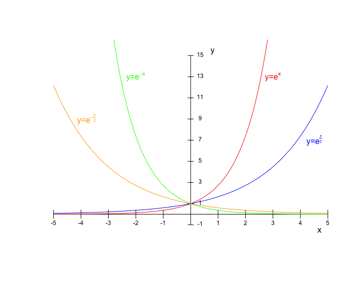
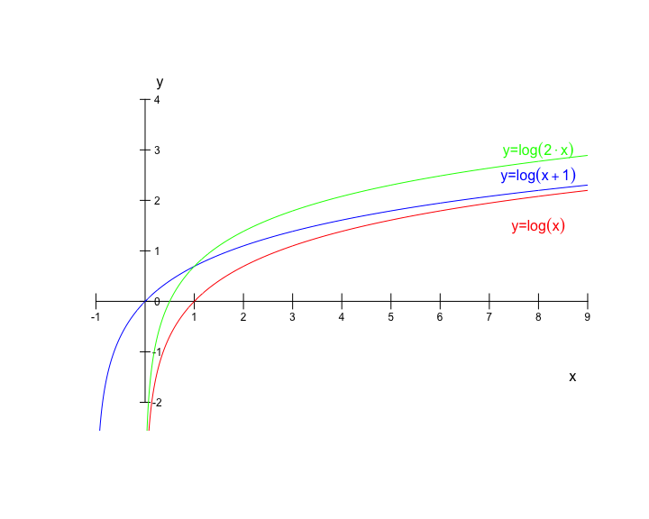
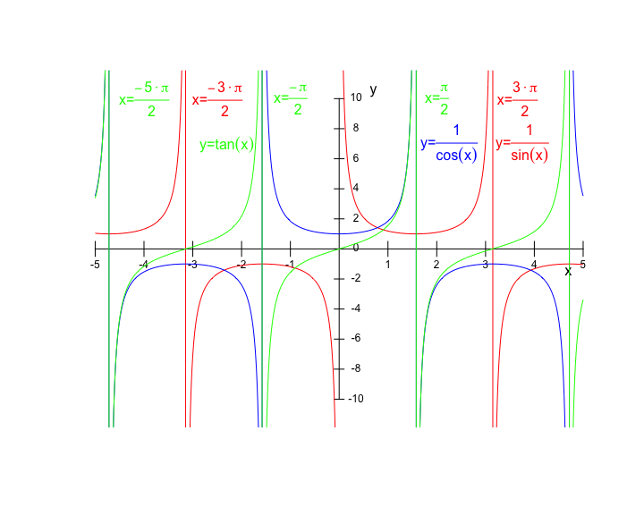
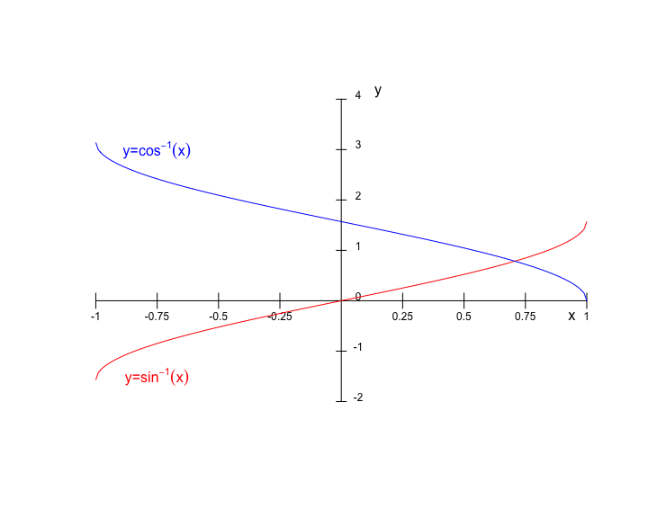

## Funciones reales de variable real

Una función real de variable real $f:A \subset \mathbb{R} \rightarrow \mathbb{R}$ es una regla que asigna a cada elemento de un primer conjunto $A$, un único elemento de un segundo conjunto $\mathbb{R}$. Las funciones son relaciones entre los elementos de dos conjuntos.

Se llama **dominio** de la función $f$ al conjunto de valores para los cuales la misma está definida

$$Dom\ f = A = \{x\in \mathbb R| \exists! y \in \mathbb R: f(x)=y\}$$
El conjunto de todos los resultados posibles de una función dada se denomina **rango**, **imagen** o **codominio** de esa función. 

$$Im\ f = \{y\in \mathbb R| \exists x \in \mathbb R: f(x)=y\}$$

## Funciones polinómicas

## Funciones potenciales

## Funciones exponenciales

## Funciones logarítmicas

## Funciones trigonométricas

## Funciones trigonométricas

## Funciones trigonométricas

## Funciones trigonométricas

