## Máquinas binarias

Los ordenadores actuales son máquinas binarias, en el sentido que pueden almacenar y tratar información gracias a que pueden distinguir dos estados, que usualmente representamos como 0 y 1: los llamados **bits**, de *binary digit*, dígito binario. 

Por lo tanto, para representar los números, no queda más remedio que emplear un número finito -y fijo- de bits para cada uno, es decir, la variedad de números que pueden almacenar y manejar es ciertamente muy limitada. 

Dicho de otra forma, sólo se puede representar un subconjunto reducido de números racionales, ya que los irracionales tienen todos un número ilimitado de cifras. 

## Máquinas binarias

Siendo así, surgen de forma natural dos preguntas:

1. ¿Cómo se consigue hacer cálculos precisos con estas limitaciones?, y

2. ¿Para qué no hemos molestado en introducir los números reales si, al final, sólo vamos a trabajar con un subconjunto finito de números racionales?

A lo largo del curso iremos viendo respuestas a estas cuestiones pero, de entrada, es conveniente tener en cuenta que el cálculo, en buena parte, puede ser visto como el álgebra de las aproximaciones. No comparamos igualdades como -grosso modo- se hace en álgebra, sino que comparamos aproximaciones: cuantas cifras decimales exactas necesito en los argumentos para tener en la respuesta las cifras decimales exactas requeridas por la naturaleza del problema, sea éste enviar un cohete a la Luna, construir un puente, o determinar la velocidad de un objeto en movimiento.

## Máquinas binarias

De hecho, veremos que los conceptos clave del cálculo están basados en desigualdades y en aproximaciones y son precisamente estas técnicas de aproximación del cálculo infinitesimal, las que nos permiten conseguir resultados más que satisfactorios en multitud de problemas de muy diversa índole.

Pero para ello necesitamos saber, por ejemplo, que la raíz cuadrada de $2$ es un número real y, por lo tanto, susceptible de ser aproximado, tanto como queramos o, si usamos ordenadores, tanto como nos deje la precisión en la representación de los números -el **epsilon**- de la máquina con la que vamos a realizar los cálculos.

Veamos pues cómo se representan los números en un ordenador y en que consiste este **epsilon** de un ordenador.

## Números naturales en un ordenador.

Nuestro sistema de numeración és un sistema posicional en base 10, lo que quiere decir que, por ejemplo,
$$
6528 = 6 \cdot 10^3+5 \cdot 10^2 + 2 \cdot 10  + 8 
$$
El valor de cada cifra es el suyo intrínseco y, también, el del lugar que ocupa en el número.

En general, para cada base $b\geq 2$ hay un sistema posicional de base $b$ y cada sistema posicional requiere de $b$ símbolos que actuan como dígitos en la representación de números en ese sistema.

A nuestros efectos, dado que los ordenadores son máquinas binarias, nos interesa el sistema de base $2$, que sólo requiere de dos símbolos, $0$ y $1$, para la representación de números en ese sistema.

## Números naturales: sistema binario

Todo número natural se puede representar en un sistema posicional. Recíprocamente, cualquier secuencia bien formada de dígitos en una base $b$, se corresponde con un número natural.

Así pues, la representación decimal del número que tiene por representación binaria $10111_{(2}$ es:
$$
10111_{(2}=2^4+2^2+2+1= 16+4+2+1=23_{(10}
$$
Además, dada la representación decimal de un número, la versión binaria de este número resulta de la concatenación de los sucesivos restos de la división del número por $2$, de tal manera que el primer resto es la cifra de las unidades -la que está más a la derecha- y así sucesivamente hasta obtener un cociente igual a $0$

## Números naturales: sistema binario

**Ejemplos**

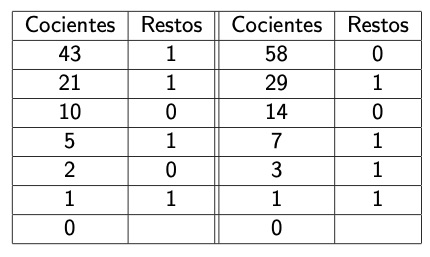

Por lo tanto:
$$
43_{(10} = 101011_{(2}  \quad \text{ y } \quad 58_{(10} = 111010_{(2}
$$

## Números naturales: sistema binario

Python, así como otros lenguajes de programación, ofrece multitud de rutinas para la conversión de número decimal a su equivalente en binario, la que sigue es una de la más sencillas:

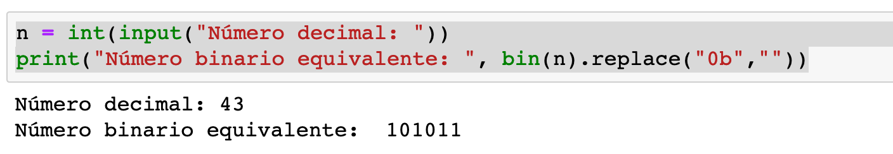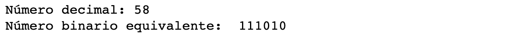

## Números naturales: sistema binario

El número  fijo de bits dedicados a representar los números en un ordenador marca el tamaño del mayor número representable, así por ejemplo, con $8$ bits, el mayor número natural representable es $2^8-1 = 255 = 11111111_{(2}$, dado que $2^8=256 = 100000000_{(2}$ requiere $9$ bits.

En general, con $d$ bits, el mayor número natural que se puede representar es $2^d -1$, así por ejemplo, con $12$ bits el mayor número natural representable es $2^{12}-1=4095$

## Números enteros en un ordenador

Cuando se trata de representar números enteros, que pueden ser negativos o positivos, se reserva un bit -el de más a la izquierda- para indicar el signo: $1$ si el número es negativo o $0$ si es positivo. 

**Ejemplos**

En un sistema con $8$ bits, el mayor número entero representable es $2^7-1=127$, en tanto que el menor es $-127$ y su codificación binaria seria:
$$
2^7-1 = 127= 01111111 \quad \text{ y } \quad -(2^7-1) = 11111111
$$
respectivamente.

## Números enteros en un ordenador

Dado que $10000000$ representaria el número $-0$, se acostumbra a considerarlo como $-128$, de forma que se aumenta en $1$ el rango de números representables y se evita tener dos codificaciones para el $0$. 

En definitiva, reservando un bit para el signo, el rango de la representación de enteros con $d$ bits va desde $-2^{d-1}$ hasta $2^{d-1}-1$, es decir, si $d=12$, entonces el rango va desde $-2^{11}= -2048$  hasta $2^{11}-1 =2047$

Con todo, esta no es la codificación más conveniente para las necesidades de cálculo del ordenador y, por ello, se recurre a dos modificaciones de esta representación: el complemento a $2$ o la representación sesgada, siendo esta última la más usada.

## Complemento a $2$

La representación de complemento a $2$, consiste en representar los números negativos mediante su complemento a $2^{d-1}$, si estamos usando $d$ bits. Esta conversión se realiza cambiando los bits, $0$ a $1$ y $1$ a $0$ y sumando $1$ al número resultante. Es decir,  si $p < 0$ entonces el número codificado es $2^{d-1} -p$, con el bit de más a la izquierda igual a $1$.

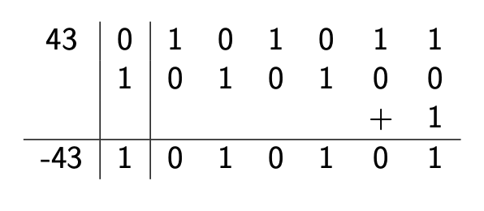

## Complemento a $2$

Una de las ventajas de esta técnica es que convierte las restas en sumas: para efectuar una resta es suficiente convertir el sustraendo con su signo, por su representación de complemento a $2$. Ejemplo:

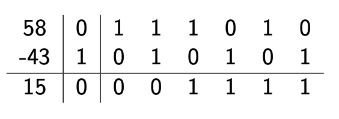

## Complemento a $2$

Ejemplo:

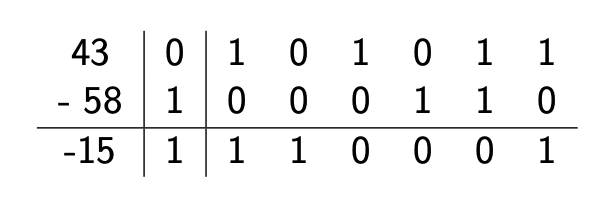

$$
110001-1= 110000 \quad \text{ y } \quad 001111_{(2} =15
$$

## Representación sesgada de números enteros

La representación sesgada consiste, en el caso de $d$ bits, en sumar $2^{d-1}$ a cada número. Con esto se consigue que el primer bit de todos los números negativos sea $0$, en tanto que el de los positivos es $1$, de tal manera que no es necesario reservar un bit para el signo.

Así, cuando $d=8$,  el rango va de $0$ a $2^8-1=255$ y cuando $d=12$, el rango va desde $0$ hasta $2^{12}-1=4095$.

Este es el método que se usa para los exponentes en la representación de coma flotante, que es la que se usa para los números reales. 

## Números racionales en base $2$

 También es posible representar en base $2$ cualquier número racional. Es suficiente tener en cuenta que el valor de las cifras a la derecha de la coma es el suyo intrínseco más el del lugar que ocupan, lo que se indica por potencias negativas de 10:
 $$
 0.4195 = 4 \cdot 10^{-1}+1\cdot 10^{-2}+9 \cdot 10^{-3}+ 5 \cdot 10^{-4}
 $$
 Análogamente:
 $$
 0.1101_{(2} = 2^{-1}+2^{-2}+2^{-4} = \dfrac{1}{2}+\dfrac{1}{4}+\dfrac{1}{16}= 0.8125_{(10}
 $$

## Números racionales en base $2$

Para convertir un número decimal a base $2$, la parte entera se convierte como ya hemos visto. Para la parte decimal, hay que descartar la parte entera, multiplicar por 2, quedarse con la parte entera, que será la cifra siguiente, descartar del número la parte entera y repetir el proceso, hasta obtener una parte decimal nula o llegar al número de cifras deseado:

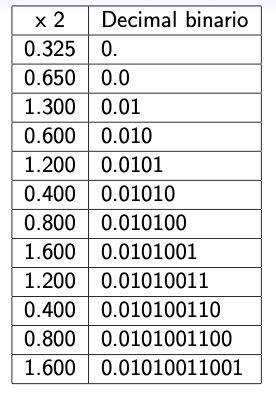

## Números racionales en base $2$

Este código de Python permite obtener la representación binaria de un número fraccionario entre $0$ y $1$:

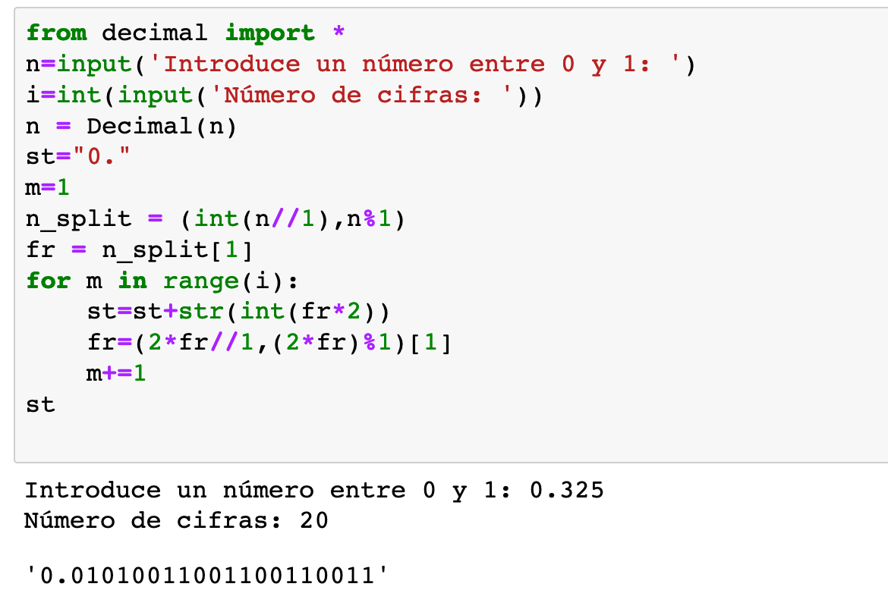

## Números racionales en base $2$

Conviene observar que, en el ejemplo anterior, la representación binaria resultante es un número periódico, ya que a partir de $0.600$ se iran repitiendo los números que salen. Esto indica que el proceso de conversión a binario puede ser aproximado y, por consiguiente, apareceran errores de truncamiento: 

Por una parte hemos calculado que $0.325_{(10} = 0.010\overline{1001}_{(2}$, en tanto que

$$
0.0101001_{(2} = 2^{-7}+2^{-4}+2^{-2}=0.3203125_{(10},
$$
y que

$$
0.01010011001_{(2} = 2^{-11}+2^{-8}+2^{-7}+2^{-4}+2^{-2} = 0.32470703125_{(10}.
$$

## Números racionales en base $2$

Si la representación es exacta, entonces el proceso se interrumpe cuando la parte decimal es igual a 0:

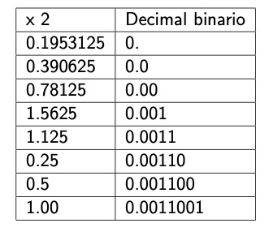

## Números racionales en base $2$

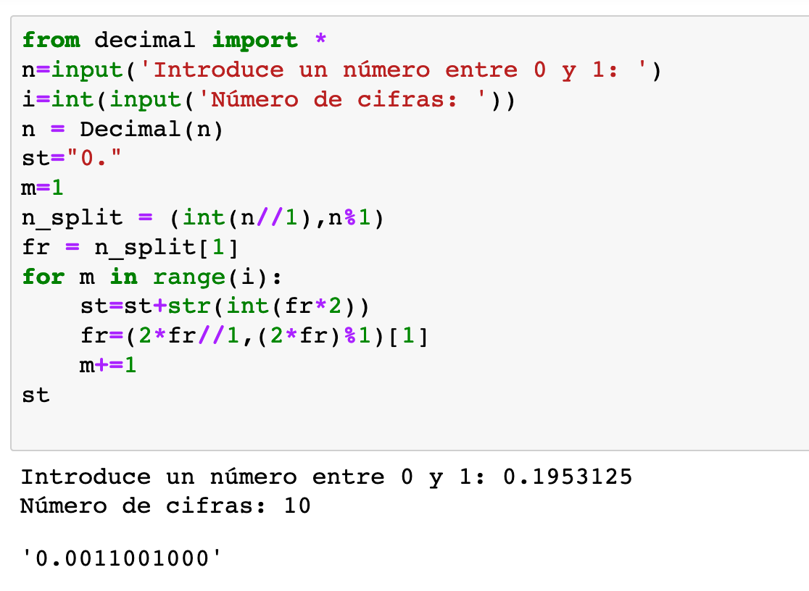

## Números reales en un ordenador: coma flotante

Para representar números racionales en un ordenador se usa la notación de coma flotante:
$$
q= m \times 10^E \quad \text {o, en binario, } \quad q_{(2} = m_{(2} \times 2^{E_{(2}}
$$
$m$: mantisa o significando y $E$: exponente.

Ejemplos:

$72.9100243= 0.729100243 \times 10^2 =.729100243E2$

$987654321= 0.987654321 \times 10^9 = .987654321E9$

$11.01100011= 0.1101100011 \times 2^{10} = 0.1101100011E10$

$0.00111000101= 0.111000101 \times 2^{-1011} = 0.111000101E-1011$

## Números reales en un ordenador: coma flotante

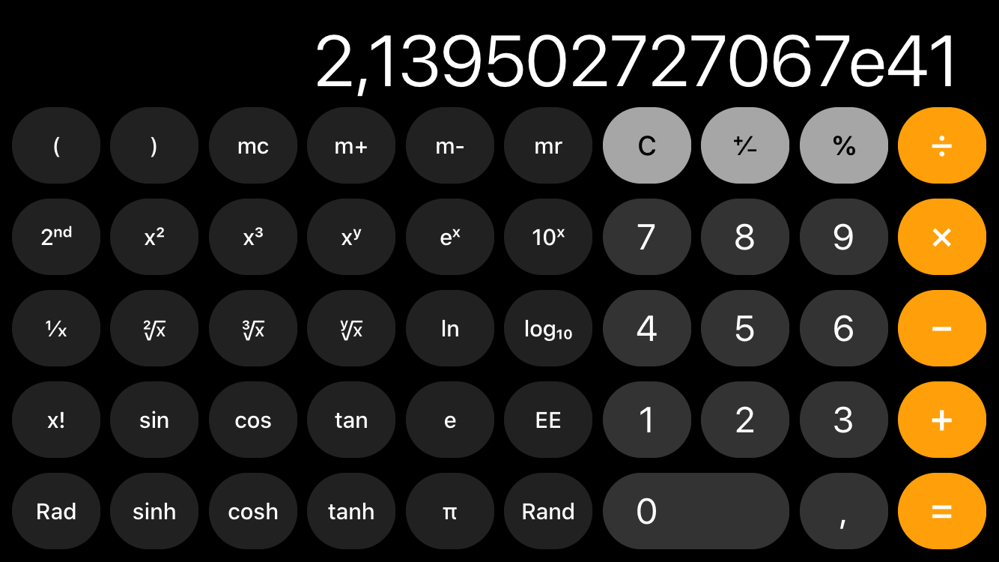

## Números reales en un ordenador: coma flotante

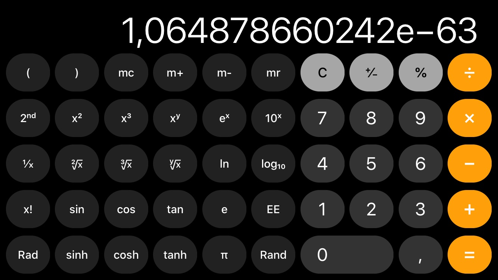

## Números reales en un ordenador: coma flotante

La IEEE estableció, en 1985, una norma para estandarizar la representación de números racionales. Es la norma IEEE-754 y tiene, como principales características:

a) Tanto el exponente como la mantisa se almacenan en binario.

a) El bit de más a la izquierda -llamado bit más significativo- se reserva para el signo del número, $0$ para los positivos y $1$ para los negativos.

b) Exponente: entero sesgado: $E+2^{ne-1}$, siendo $ne$ el número de bits reservados para el exponente y que van a continuación del bit de signo.

c) Los bits restantes, $nm$, se dedican a la mantisa con el bit más significativo igual a $1$, que no se almacena. 

## Números reales en un ordenador: coma flotante

Dado que aumentar el exponente una unidad equivale a desplazar la coma un lugar hacia la izquierda y que disminuyendo una unidad el exponente equivale a correr la coma un lugar hacia la derecha, siempre podremos conseguir que el bit más significativo de la mantisa sea igual a $1$.

De acuerdo con la norma IEEE-754 los dos estándares más usados son el de precisión simple, que usa $32$ bits, $8$ para el exponente y $23$ para la mantisa, que en realidad, son $24$, puesto que no se almacena el bit más significativo que es siempre igual a $1$. El otro, es la precisión doble usa $64$ bits: $11$ para el exponente y $52$ para la mantisa, que en realidad, son $53$.

## Números reales en un ordenador: coma flotante

Distribución de los bits en precisión simple:

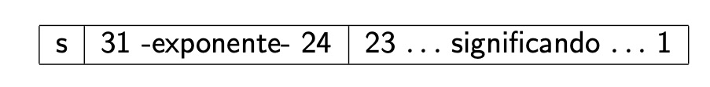

Distribución de los bits en precisión doble:
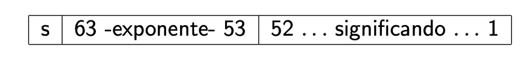

https://www.h-schmidt.net/FloatConverter/IEEE754.html

## Representación de números reales

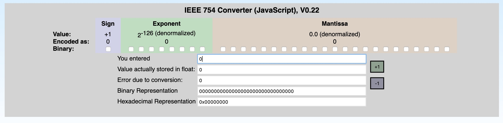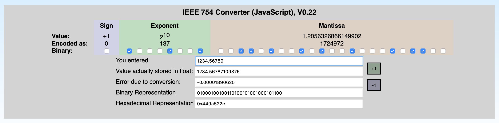

## Representación de números reales

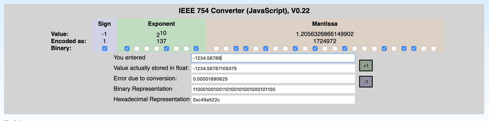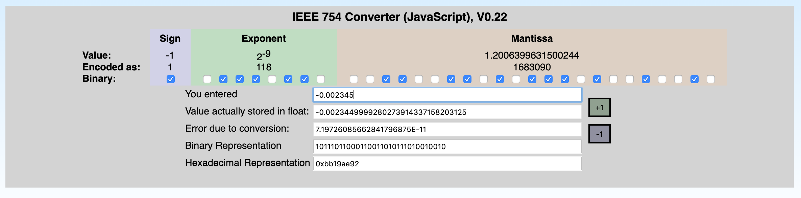

## Representación de números reales

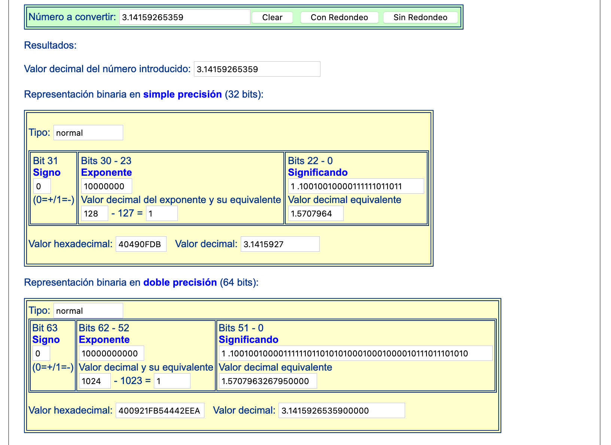

https://www.zator.com/Cpp/E2_2_4a1.htm

## Representación de números reales

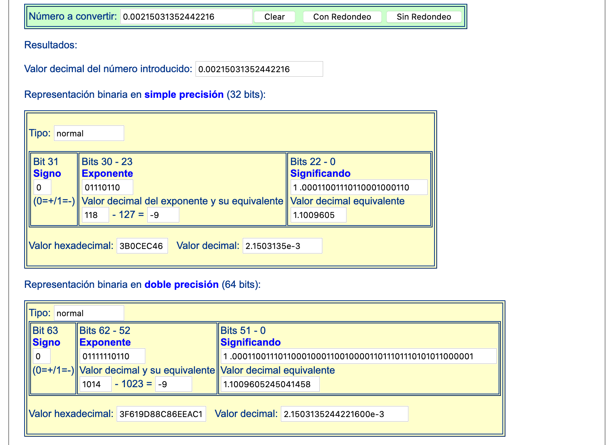

##  *Epsilon* de una máquina

**Errores de redondeo**

Como hemos visto, la representación de números fraccionarios en binario, frecuentemente será aproximada, debido -esencialmente- a las limitaciones en el número de cifras que se pueden usar, por lo tanto si $fl(x)$ es la representación en coma flotante de un número $x$, no siempre será $x= fl(x)$, la diferencia $|x-fl(x)|$ es el *error de redondeo* de la representación flotante de $x$.

##  *Epsilon* de una máquina

**Errores de redondeo**

Cuanto mayor sea el número mayor puede ser este error, aunque tal vez sea menos significativo. Así, por ejemplo, hemos visto que cuando $x=1234.56789$, teniamos que
$$
|x-fl(x)|= 0.00001890625,
$$
en tanto que para $x=-0.002345$,
$$
|x-fl(x)|= 7.19726085662841796875E-11,
$$ 
y aunque el error es mucho menor en este caso, resulta que en el primero $x$ y $fl(x)$ coinciden hasta la cuarta cifra decimal, en tanto que en el segundo la coincidencia llega hasta la quinta cifra decimal y, por lo tanto, el error parece que es más relevante en este último que en el anterior.

##  *Epsilon* de una máquina

Por esta razón, se considera que una medida más ajustada del error viene dada por el **error relativo**:
$$
\dfrac{|x-fl(x)|}{|x|}
$$
En el primer ejemplo anterior es:
$$
\dfrac{0.00001890625}{1234.56789}=1.531406263935797E-08,
$$
en tanto que, para el segundo es:
$$
\dfrac{7.19726085662841796875E-11}{0.002345} = 3.0691943951507115E-08.
$$

##  *Epsilon* de una máquina

Observad que són del mismo orden $E-08$, con la mantisa del segundo aproximadamente el doble que la del primero, lo cual explica que en el primer caso la precisión sea hasta la cuarta cifra decimal, en tanto que para el segundo, con un error de redondeo mucho menor, la precisión sólo llegue hasta la quinta cifra decimal

##  *Epsilon* de una máquina

 ***Epsilon* de una máquina** es la diferencia entre $1$ y el siguiente número mayor en la representación de coma flotante.

$\epsilon = 2^{-23} \approx 1.19 \times 10^{-7}$, en precisión simple. $7$ decimales.

$\epsilon = 2^{-52} \approx 2.22 \times 10^{-16}$, en precisión doble. $16$ decimales.

Precisión simple: $1+2^{-23}$

Precisión doble: $1 + 2^{-52}$

##  *Epsilon* de una máquina

Para resumir, en precisión simple, aproximadamente todos los números que, teniendo el mismo exponente, coincidan en sus $8$ primeras cifras decimales, tendran la misma representación en coma flotante. Por ejemplo
$$
fl(0.12345678956) = 0.12345679104328155517578125 =fl(0.12345678988)
$$

Por su parte, en precisión doble, todos los números que, teniendo el mismo exponente, difieran a partir de la cifra $17$ también tendrán la misma representación en coma flotante.

Como ya he mencionado, pese a esta limitación del conjunto de números que puede manejar un ordenador, se consiguen resultados muy precisos.

