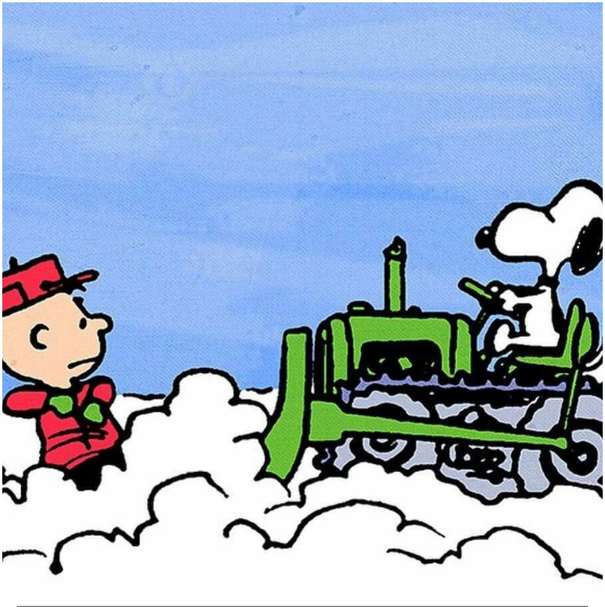

# El problema de la máquina quita nieves.

## El problema de la máquina quitanieves.

Vamos a ver como se resuelve un problema curioso --y famoso-- que muestra la potencia del cálculo para encontrar respuestas, eso sí, con las hipótesis adecuadas, aunque alguna esté de forma implícita. El enunciado es como sigue:

 **Enunciado**

Una mañana empieza a caer de forma intensa y constante una fuerte nevada. Una máquina quitanieves sale a quitar nieve a las 12:00. Avanza dos kilómetros  durante la primera hora y un kilómetro durante la segunda. ¿A qué hora empezó a nevar?

Este problema aparece publicado por primera vez, en un libro --de 1942-- sobre ecuaciones diferenciales. Su autor es R.P. Agnew.

## Formulación matemática.

El enunciado contiene dos hipótesis que serán cruciales para poder resolver este problema: 

1. *La cantidad de nieve que cae por unidad de tiempo es constante*, y
2. *La velocidad de la máquina es inversamente proporcional a la cantidad de nieve caída*, puesto que la máquina recorre menos distancia a medida que va encontrando más nieve.

Obviamente, si queremos usar el cálculo para responder a la pregunta, necesitamos representar los datos mediante funciones, que supondremos -y esta es otra de las hipótesis implícitas- continuas y derivables.

Conviene observar que ninguna de las hipótesis es descabellada, en el sentido que nos dicen que la nieve cae de forma constante y, por supuesto, que la máquina se mueve sin interrupciones considerables.

## Formulación matemática.

Para formular en términos matemáticos el problema, podemos considerar los siguientes elementos:

1. $t$: tiempo -en horas- recorrido por la máquina a partir de las 12:00.
2. $x(t)$: distancia -en kilómetros- recorrida por la máquina.
3. $h(t)$: altura -en centímetros- de la nieve.
4. $b$: tiempo -en horas- que hace que empezó a nevar antes de las 12:00
5. $k_1$: cantidad de nieve -en centímetros- que cae por hora.

El problema quedará resuelto si calculamos el valor de $b$.

## Cantidad de nieve caída.

En primer lugar, la cantidad de nieve por unidad de tiempo que cae es constante, por lo que
$$
h'(t)= k_1
$$

lo que se traduce en 
$$
h(t)=k_1 t+C
$$
Dado que empezó a nevar $b$ horas antes de las 12:00, resultará que $h(-b)=k_1(-b)+C= 0$, es decir que
$$
C=k_1 b \quad \text { y, por lo tanto, } \quad h(t)=k_1(t+b)
$$

## Velocidad de la máquina quitanieves 

La velocidad de la máquina es la derivada de la distancia respecto del tiempo, es decir $x'(t)$. Dado que la velocidad es inversamente proporcional a la cantidad de nieve caída, tendremos que
$$
x'(t)h(t) = k_2
$$

donde $k_2$ es una constante de proporcionalidad. Por lo tanto
$$
x'(t)= \dfrac{k_2}{k_1 (t+b)} = \dfrac{k}{t+b}, \quad \text{ donde } \quad k=\dfrac{k_2}{k_1}
$$
<!-- Es decir, -->
<!-- $$ -->
<!-- x(t)= k \log(t+b) + C_1 -->
<!-- $$ -->

## Distancia recorrida por la máquina (1)

Dado que durante la primera hora ha recorrido $2$ kilómetros, aplicando el teorema fundamental del cálculo y teniendo en cuenta que $x(0)=0$, tendremos que

$$
2= x(1) = \int_0^1 \dfrac{k \text{d} t }{t+b} = \left.k \log(t+b)\right]_0^1 = k \left(\log (1+b)-\log b \right) 
$$
Es decir,
$$
2 = k \log \left( \dfrac{1+b}{b} \right)
$$

## Distancia recorrida por la máquina (2)

Análogamente, la distancia recorrida durante la segunda hora es
$$
1= x(2)-x(1) = \int_1^2 \dfrac{k \text{d} t}{t+b} = \left.k \log(t+b)\right]_1^2 = k \log \left(\dfrac{2+b}{1+b} \right)
$$
En definitiva, multiplicando por $2$, y teniendo en cuenta que $p \log a = \log a^p$, tenemos que 
$$
2 = k \log \left(\dfrac{2+b}{1+b} \right)^2
$$

## Distancia recorrida por la máquina (3)

Combinando las dos igualdades obtenidas, llegamos a
$$
k \log \left(\dfrac{1+b}{b} \right)=2= k \log \left(\dfrac{2+b}{1+b} \right)^2
$$
Dado que la función $\log$ es inyectiva, tendremos que
$$
\dfrac{1+b}{b} =  \left(\dfrac{2+b}{1+b} \right)^2
$$
Por lo tanto,
$$
(1+b)^3 = b(2+b)^2  \quad \text{ o, lo que es equivalente, } \quad b^2+b-1=0
$$

## Hora de inicio de la nevada

Es decir, 
$$
b= \dfrac{-1 \pm \sqrt{1+4}}{2}
$$
de las dos soluciones, una positiva y la otra negativa, debemos descartar la segunda, puesto que no tiene sentido, dado que $b$ es el tiempo que hace que empezó a nevar antes de las 12:00, por lo que
$$
b = \dfrac{-1 + \sqrt{5}}{2} \approx 0.618 
$$
En definitiva, como  $0.618$ horas son  $60 \cdot 0.618  \approx 37$ minutos, empezó a nevar alrededor de las **11:23 horas**.
