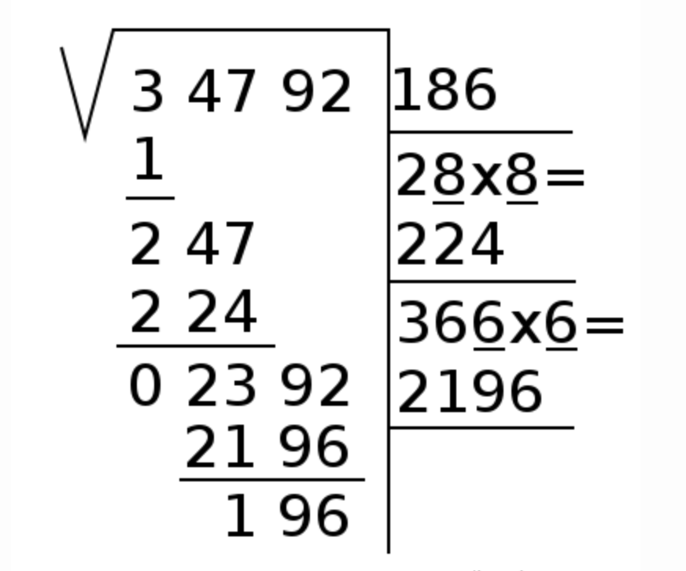
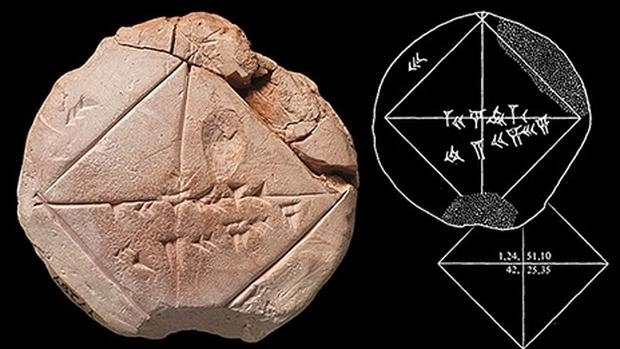
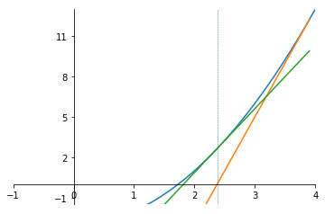
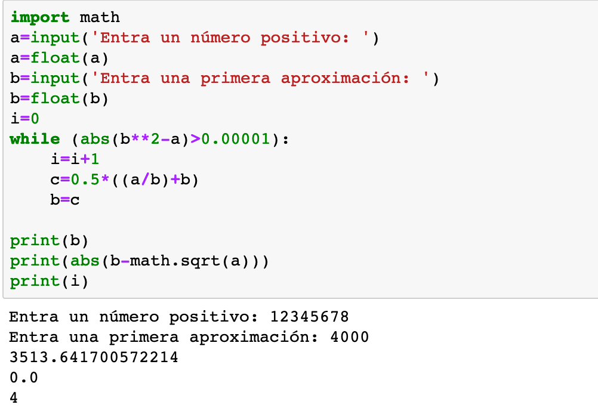
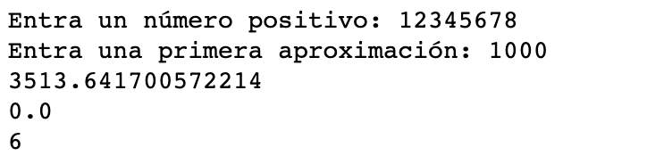
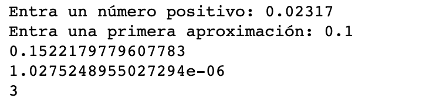
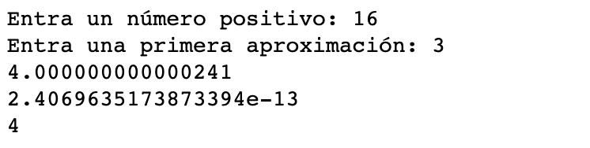
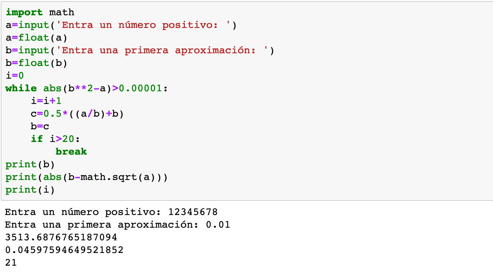
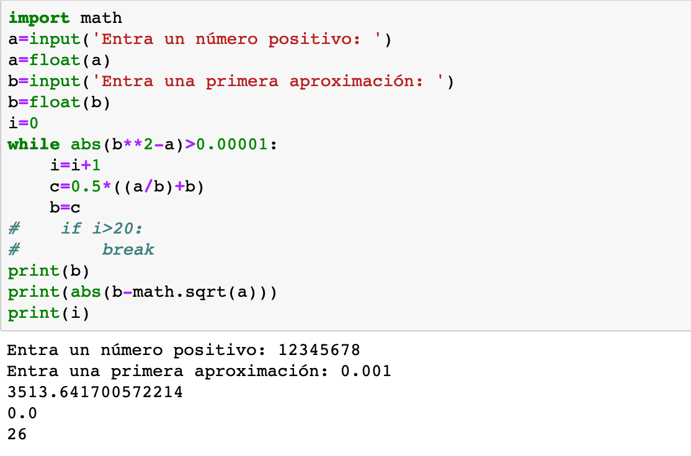
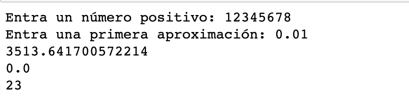

## El teorema de ¿Pitágoras?

Dicho de una forma rápida y sencilla: el teorema de Pitágoras no es de Pitágoras, puesto que hay evidencias que unos mil años antes de Pitágoras, tanto los matemáticos de Mesopotamia como los matemáticos chinos -regla de Gougu- ya conocían la relación entre los catetos y la hipotenusa de un triángulo rectángulo.

No sólo conocían esta relación, sino que, además, la utilizaban con objetivos prácticos, como medir alturas de puntos inacesibles. También es conocido que los agrimensores egipcios utilizaban la terna pitagórica $3$,$4$, $5$, para marcar ángulos rectos. Lo hacían con una cuerda con $12$ nudos igualmente espaciados, ponían tres de un lado, cuatro del otro y cerraban con los cinco restantes. Dado que $3^2+4^2=5^2$, sabían que el ángulo entre los tres y los cuatro nudos era un ángulo recto.

## El teorema de Pitágoras

Las aplicaciones prácticas del teorema dicho de Pitágoras requerían el cálculo de raices cuadradas de números. ¿Cómo las hacian? Los matemáticos chinos desarrollaron el método de la cajita, por llamarle de alguna forma, y es el que se enseñaba en las escuelas de todo el mundo, por lo menos, hasta finales del siglo XX. Tiene este aspecto:

## Raices cuadradas

Sin embargo, los matemáticos mesopotámicos desarrollaron un método muy diferente y muy eficaz, de los que hoy llamaríamos iterativos. Curiosamente, una de las virtudes de este método mesopotámico, frente al de los chinos, ha cobrado vigencia con la aparición de las máquinas de cálculo, adaptadas como estan a la repetición de grupos de operaciones.

## El algoritmo mesopotámico

La idea básica del algoritmo usado por por los mesopotámicos es muy simple:

Si $x= \sqrt{a}$, es decir, si $x^2=a$, entonces $x$ y $\dfrac{a}{x}$ tienen que ser iguales. 

Por lo tanto, dado un número $x_0 >0$, descartando la coincidencia feliz que sea $x_0 = \dfrac{a}{x_0}$, sólo quedan dos posibilidades:

## El algoritmo mesopotámico

2. $x_0 < \dfrac{a}{x_0}$, entonces la media aritmética de estos dos valores es una mejor aproximación a $\sqrt{a}$, puesto que 
$$
x_0 < \dfrac{1}{2}\left(x_0 + \dfrac{a}{x_0}\right) < \dfrac{a}{x_0}.
$$
3. Análogamente, si $x_0 > \dfrac{a}{x_0}$, la media aritmética de estos dos valores es una mejor aproximación a $\sqrt{a}$ puesto que 
$$
\dfrac{a}{x_0} < \dfrac{1}{2}\left(x_0 + \dfrac{a}{x_0}\right) < x_0.
$$

## El algoritmo mesopotámico

Se trata, pues, de reiterar este proceso para ir aproximándose a la raíz cuadrada pedida. 

En definitiva, la raíz cuadrada se obtiene al calcular los primeros términos de la sucesión recurrente definida a partir de un valor inicial $x_0 >0$, y que tiene por término general:
$$
x_{n+1} =\dfrac{1}{2}\left(x_n + \dfrac{a}{x_n}\right)
$$
que, como hemos visto al tratar las sucesiones recurrentes, es convergente y, además
$$
\lim x_n = \sqrt{a}
$$

## El algoritmo mesopotámico: Ejemplo

Vamos a calcular, mediante este algoritmo la raíz cuadrada de $234195$. En primer lugar podeis comprobar com python o con una calculadora que 
$$
\sqrt{234195}= 483.93697936818177.
$$

Ahora usamos el algoritmo. En primer lugar, vemos que la raíz cuadrada pedida está entre $400$ y $500$, puesto que 

$$
400^2= 160000 < 234195 <250000 =500^2,
$$
por lo que $480$, por ejemplo, puede ser una buena opción para el valor inicial $x_0$. 

## El algoritmo mesopotámico: Ejemplo

Con este valor para $x_0$, tenemos que 
$$
x_1 = \dfrac{1}{2}\left(480 + \dfrac{234195}{480}\right) = 483.953125.
$$

Vemos que sólo tenemos una cifra decimal exacta de la raíz, así que reiteramos el proceso para obtener $x_2 =  483.93697963750685$, con lo que ya tenemos seis cifras decimales exactas.

Reiteramos nuevamente el proceso y obtenemos $x_3= 483.9369793681818$, es decir ya tenemos $12$ cifras decimales exactas, con las que ya nos damos por satisfechos, y todo ello con sólo tres iteraciones.

Naturalmente, no dispondremos del valor de la raíz cuadrada, por lo que, para detener el algoritmo, iremos comprobando la diferencia entre dos iteraciones consecutivas.

## Interpretación gráfica

## El algoritmo mesopotámico

Se trata de una sucesión que converge muy rápidamente, por lo que con unos pocos términos se consigue la raíz cuadrada con una precisión más que aceptable. 

Eso si, siempre que empezemos con un $x_0$ razonable, es decir, próximo al valor de la raíz cuadrada pedida, lo que se puede conseguir por una estimación simple.

A continuación os presento un programa en Python que implementa este algoritmo, en el que los datos de entrada son el número del cual queremos calcular la raíz cuadrada y el valor de la primera aproximación $x_0$.

## El algoritmo mesopotámico

## El algoritmo mesopotámico

## El algoritmo mesopotámico

## El algoritmo mesopotámico

## Newton-Raphson

La historia del algoritmo mesopotámico para extraer raices cuadradas llega hasta finales del siglo XVII, cuando, de forma independiente, Isaac Newton y Joseph Raphson describen un método numérico para calcular raices de funciones derivables, el método conocido precisamente con el nombre de sus descubridores: Newton-Raphson, que tiene como uno de sus casos particulares el método de los mesopotámicos. Este método, el de Newton-Raphson, está explicado en la Lectura 106.

<!-- Por el camino los matemáticos chinos ya habían desarrollado -posiblemente unos mil años antes de nuestra era- el método de la cajita, que es el que se ha venido enseñando en las escuelas de todo el mundo hasta finales del siglo XX. -->

Por cierto, podemos seguir atribuyendo a Pitágoras el teorema, puesto que, aparentemente, fue el primero en dar una demostración del mismo.
