# Curso de cálculo

## ¿Qué vamos a aprender?

* Conocer y **manejar** el conjunto de los **números reales** $\mathbb{R}$.

## La recta real

```
## 
## Listening on http://127.0.0.1:6546
```

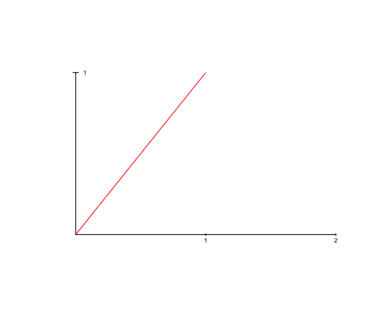<!-- -->


## La recta real
\vspace{-2cm}


## La recta real
\vspace{-2cm}
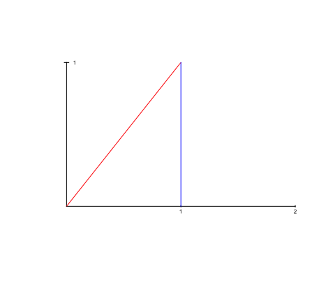

## La recta real
\vspace{-2cm}
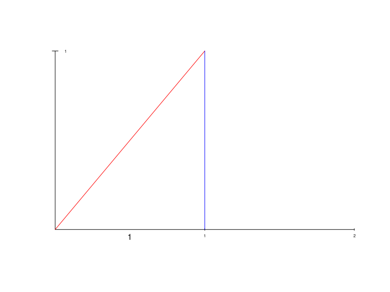


## La recta real
\vspace{-2cm}
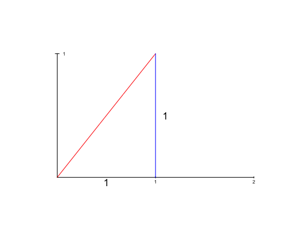

## La recta real
\vspace{-2cm}
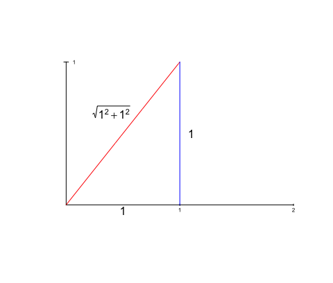

## La recta real
\vspace{-2cm}
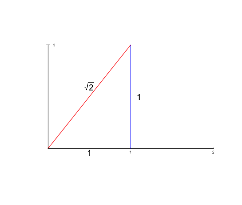


## La recta real
\vspace{-2cm}
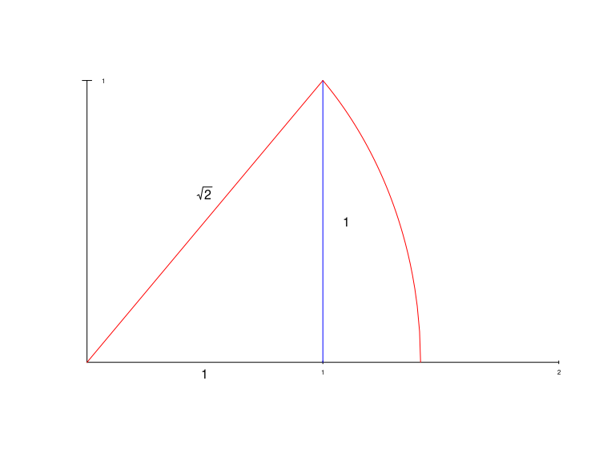

## La recta real
\vspace{-2cm}
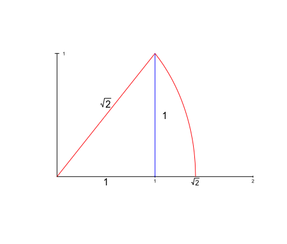

## ¿Qué vamos a aprender?

* Trabajar con funciones **reales** de variable **real**:
$$
f: D\subseteq \mathbb{R}\longrightarrow\mathbb{R},
$$
donde $D$ es el llamado **dominio** de la función.


## Conceptos que aprenderemos: continuidad

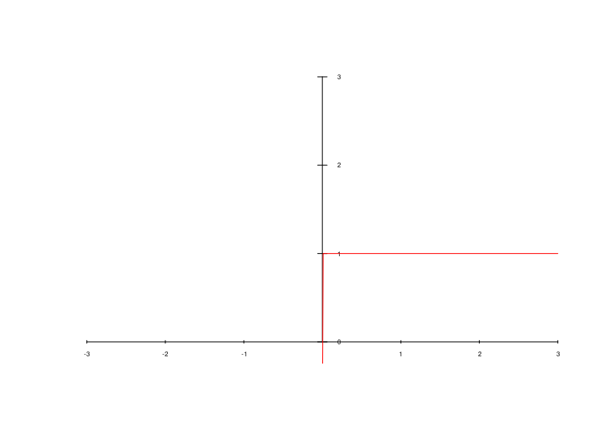

## Conceptos que aprenderemos: continuidad

```
## 
## Listening on http://127.0.0.1:5054
```

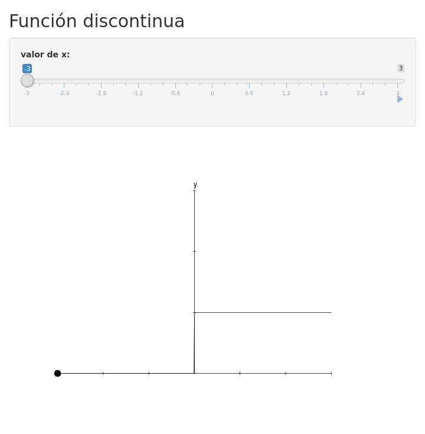<!-- -->


## Conceptos que aprenderemos: derivabilidad
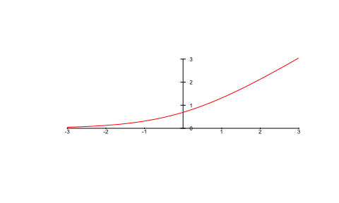

## Conceptos que aprenderemos: derivabilidad

```
## 
## Listening on http://127.0.0.1:5603
```

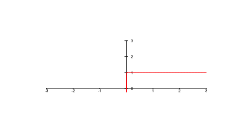<!-- -->


## Conceptos que aprenderemos: integral o área


## Conceptos que aprenderemos: integral o área

```
## 
## Listening on http://127.0.0.1:3388
```

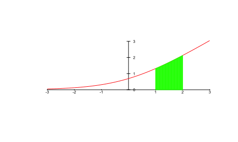<!-- -->


## Conceptos que aprenderemos: integral o área

```
## 
## Listening on http://127.0.0.1:5270
```

<!-- -->

## Conceptos que aprenderemos: longitud de una curva

```
## 
## Listening on http://127.0.0.1:5603
```

<!-- -->

## Ejemplos de funciones reales de variable real

* Función logística: $f(x)=\frac{1}{1+\mathrm{e}^{-x}}$:
\vspace*{-3cm}


## Función logística
Usada en:

* Redes neuronales,
* Matemáticas en biología,
* Química,
* Demografía,
* Economía,
* Psicología,
* Estadística,
* etc.

## Funciones de activación en redes neuronales
En el ámbito de las redes neuronales, las **funciones de activación** o **rectificador** se definen como:

* $f(x)=\max\{0,x\}$, donde $x>0$ es la entrada de la neurona. Se usa como alternativa a la función logística:
\vspace{-2cm}
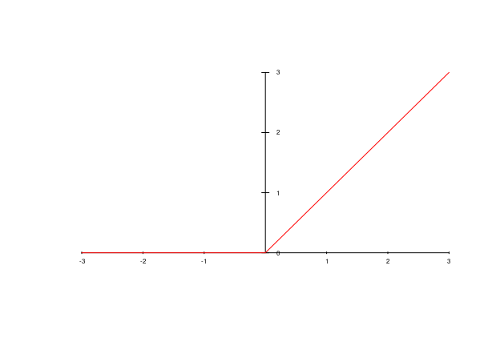

## Aproximación suave
Una aproximación suave de la función anterior es la función **softplus**: $f(x)=\log(1+\mathrm{e}^x)$:
\vspace{-2cm}


## 

<div class="box">
**Esperemos que disfrutéis del curso**
</div>


