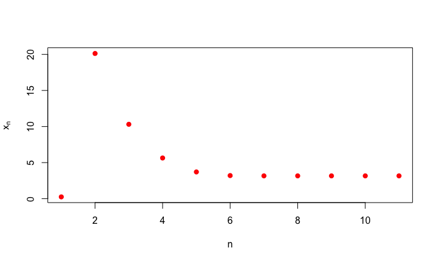

<script src="https://kit.fontawesome.com/a0edb659c7.js" crossorigin="anonymous"></script>

```{r setup, include=FALSE}
knitr::opts_chunk$set(echo = TRUE)

 reticulate::use_python("/opt/anaconda3/bin/python")
```

# Sucesiones

## Introducción

Como hemos visto, el conjunto de los números reales incluye todos los números racionales, es decir, todos los números que tengan un número finito de cifras en su desarrollo decimal. De hecho, también incluye algunos con un número infinito de cifras decimales como seria el caso de los decimales periódicos.

<div class="center">
Ejemplo de decimal periódico: [](https://www.wolframalpha.com/input/?i=6%2F7+with+48+decimals)
</div>

Por consiguiente, los números reales que no son racionales, es decir los números **irracionales** tienen una cantidad infinita de cifras en su desarrollo decimal, tal seria el caso de, por ejemplo, $\sqrt{2}$, $\pi$ o $e$.  

<div class="center">
Ejemplos de números irracionales: [](https://www.wolframalpha.com/input/?i=%E2%88%9A2+with+48+decimals)[](https://www.wolframalpha.com/input/?i=%CF%80+with+48+decimals)
</div>


## Introducción

Siendo así, ¿cómo podemos utilizar estos números con infinitas cifras decimales? La respuesta viene de la mano del concepto de **sucesión** y de **límite**. 

Cómo hemos demostrado, dado un número irracional y una precisión, siempre es posible determinar un racional que diste del irracional dado menos que dicha precisión, es decir, si $r \in \mathbb{R} \setminus \mathbb{Q}$, para todo $\epsilon >0$, existe $q \in \mathbb{Q}$ tal que $|r-q|< \epsilon$  Es lo que hacemos cuando tomamos $\pi$ como $3.14$ o $3.1415$, $\ldots$

En lo que sigue, veremos cómo podemos tratar con los números irracionales a partir de sus aproximaciones racionales.

## Ejemplos

<div class="example">

**Ejemplo 1.** Consideremos las sucesivas aproximaciones decimales de $\sqrt{2}$,

$$
1,1.4,1.41,1.414,1.4142,1.41421,\ldots
$$ 
Cada uno de estas aproximaciones mejora la anterior, puesto que cada una difiere de $\sqrt{2}$ en menos de $10^{-n}$, donde $n$ indica el número de cifras decimales de la aproximación racional. Obsérvese tambien que una vez alcanzada una determinada precisión, los términos siguientes mejoran dicha precisión.

En general, dado un $\epsilon$, es decir, una precisión, podemos asegurar que, a partir de un término dado que diste menos que esa precisión de la raíz cuadrada de 2, los subsiguientes términos distan de $\sqrt{2}$ menos que esa precisión. .

</div>

## Ejemplos

<div class="example">
Para generar los 15 primeros términos de la sucesión anterior en `python` haríamos lo siguiente:

```python
import math
def trun_n_d(n,d):
    s=repr(n).split('.')
    if (len(s)==1):
        return int(s[0])
    return float(s[0]+'.'+s[1][:d])
x=math.sqrt(2)
n=15
for i in range(1,n):
   print "%.15f" % (trun_n_d(x,i))
```

</div>

## Ejemplos

<div class="example">

```
## 1.400000000000000
## 1.410000000000000
## 1.414000000000000
## 1.414200000000000
## 1.414210000000000
## 1.414213000000000
## 1.414213500000000
## 1.414213560000000
## 1.414213562000000
## 1.414213562300000
## 1.414213562370000
## 1.414213562373000
## 1.414213562373000
## 1.414213562373090
```

</div>


## Ejemplos 

<div class="example">

**Ejemplo 2.** 

Análogamente, las sucesivas aproximaciones decimales del número $\pi$:
$$
3,3.1,3.14,3.141,3.1415,3.14159, \ldots
$$
aproximan el número $\pi$


</div>

## Ejemplos 

<div class="example">

**Ejemplo 2.** 

Análogamente, las sucesivas aproximaciones decimales del número $\pi$:
$$
3,3.1,3.14,3.141,3.1415,3.14159, \ldots
$$
aproximan el número $\pi$

De hecho, podemos calcular los 15 primeros términos de la sucesión anterior en `python` con este código:

```python
x=math.pi
n=15
for i in range(1,n):
   print "%.15f" % (trun_n_d(x,i))
```
</div>

## Ejemplos 

<div class="example">

```
## 3.100000000000000
## 3.140000000000000
## 3.141000000000000
## 3.141500000000000
## 3.141590000000000
## 3.141592000000000
## 3.141592600000000
## 3.141592650000000
## 3.141592653000000
## 3.141592653500000
## 3.141592653580000
## 3.141592653589000
## 3.141592653589700
## 3.141592653589790
```

</div>


</div>

## Sucesiones

<l class="definition"> **Definición: Sucesión**</l>

Una **sucesión** $\{a_n \}_{n \in \mathbb{N}}$ de números reales es un conjunto de números reales ordenado según un subíndice que recorre los números naturales. Dicho de una manera más formal, una sucesión de números reales es la imagen de una aplicación del conjunto $\mathbb{N}$ en los reales $\mathbb{R}$.


<div class="example">

**Ejemplos**

**Ejemplo 1. ** Dado un número real $r$, la sucesión constante $a_n = r$, para todo $n \in \mathbb{N}$ es un ejemplo de sucesión. Obsérvese que una sucesión tiene siempre infinitos términos, aunque puedan estar todos o algunos repetidos.

**Ejemplo 2.** La sucesión de término general $a_n = \dfrac{1}{n}$:
$$
1,\dfrac{1}{2},\dfrac{1}{3},\dfrac{1}{4}, \ldots ,\dfrac{1}{n}, \ldots
$$


## Ejemplos de sucesiones

<div class="example">

**Ejemplos**

**Ejemplo 3.** Un ejemplo interesante de sucesión lo constituye la de término general $a_n = 10^{-n}$, és decir la sucesión
$$
0.1,0.01,0.001,0.0001,0.00001, \ldots
$$

**Ejemplo 4.** La sucesión de aproximaciones decimales del número $\pi$: 

 $$
 a_1=3.1\quad a_2=3.14 \quad a_3=3.141 \quad a_4 = 3.1415 \quad a_4 =3.14159 \quad \ldots
 $$

**Ejemplo 5.** Las sucesivas aproximaciones decimales del número $\sqrt{2}$:

$$
a_1=1.4 \quad a_2=1.41 \quad a_3=1.414 \quad a_4=1.4142 \quad a_5=1.41421 \quad \ldots
$$


**Ejemplo 6.** En general, todo número  $\alpha \in \mathbb{R}$, admite un desarrollo decimal en la forma
$$
\alpha= \alpha_0 + \alpha_1 10^{-1}+ \alpha_2 10^{-2}+ \ldots + \alpha_k 10^{-k}+ \ldots 
$$
donde $a_0 \in \mathbb{Z}$ y cada $a_i \in \{0,1,2,\ldots, 9 \}$, de forma que determina una sucesión de término general 
$$
a_n = \alpha_0 + \alpha_1 10^{-1}+ \alpha_2 10^{-2}+ \ldots + \alpha_n 10^{-n} = \alpha_0.\alpha_1\alpha_2\alpha_3\ldots\alpha_n
$$
Obsérvese que para cada $n \in \mathbb{N}$ se tiene que $\alpha-a_n = \alpha_{n+1}10^{-(n+1)}+ \ldots < 10^{-n}$.


</div>

## Ejemplos de sucesiones

<div class="example">

**Ejemplos**

**Ejemplo 7.** La sucesión de **Fibonacci** és una sucesión *recurrente* definida a partir de dos números $x_1$ y $x_2$, de la forma

$$
x_n=x_{n-1} +x_{n-2}
$$
De tal manera que si $x_1 = x_2=1$, sus términos son:
$$
1,1,2,3,5,8,13,21,34, \ldots 
$$
**Ejemplo 8.** La sucesión, también recurrente, $x_1=c>0$, $x_{n+1}=\dfrac{1}{2} \left(x_n + \dfrac{a}{x_n}\right)$, donde $a$ es un nombre real positivo.

</div>

## Ejemplos de sucesiones

<div class="example"> **Ejemplo**
La expresión explícita de la sucesión anterior puede verse en el enlace siguiente de `Wolfram Alpha`
<l class="center">
[](https://www.wolframalpha.com/input/?i=x%281%29%3Dc+and+x%28n%2B1%29%3D%281%2F2%29*%28x%28n%29%2Ba%2Fx%28n%29%29%2C)
</l>

<div class="center">
Para $c=\frac{1}{4}$ y $a=10$, el gráfico de la sucesión definida anteriormente es el siguiente: 

</div>

</div>

## Subsucesión de una dada

<l class="definition"> **Definición: Subsucesión de una dada** </l>

Sean $\{a_n\}$ una sucesión y $n_1 <n_2< \ldots <n_k < \ldots$ una colección -infinita- de números naturales, entonces la sucesión $\{a_{n_k}\}$ recibe el nombre de **subsucesión** de la sucesión dada.


Dicho de otra forma, una subsucesión de una dada está formada eliminando términos de la sucesión, respetando el orden en el cual estan dados. Obsérvese que una subsucesión es siempre una sucesión.

<div class="example"> **Ejemplos**

a) La sucesión $\{\frac{1}{n^2}\}_{n \in \mathbb{N}}$ es una subsucesión de $\{\frac{1}{n}\}_{n \in \mathbb{N}}$
b) La sucesión $\{n+5\}$ lo es de la sucesión $\{n\}_{n \in \mathbb{N}}$.
c) La sucesión $\{\frac{1}{2},1,\frac{1}{4},\frac{1}{3}, \ldots ,\frac{1}{n+1},\frac{1}{n}, \ldots \}$, no es una subsucesión de la sucesión $\{\frac{1}{n}\}_{n \in \mathbb{N}}$. (¿Por qué?).
d) Tampoco lo es $\{1,2,3, \ldots, 234501\}$ respecto de la sucesión  $\{n\}_{n \in \mathbb{N}}$.  (¿Por qué?).


#  Límite de una sucesión

## Introducción

Hemos visto que dado un número irracional, siempre podemos encontrar un racional tan cerca como se quiera, es decir que fijada una precisión con la que se necesite representar el irracional, es posible determinar un racional que lo represente con dicha precisión, es decir, si $r$ es el irracional, $q$ el racional y $\epsilon$ la precisión, entonces $|r-q| < \epsilon$. Por otra parte, una precisión menor, es decir para un $\epsilon$ más grande, incluye todos los racionales de precisión mayor, es decirlos que corresponden a un $\epsilon$ menor.

Esta es la idea queda formalizada con la noción de límite, que exponemos a continuación.

## Límite de una sucesión


<l class="definition">**Definición: Límite de una sucesión**</l>

 
Dada una sucesión $\{a_n\}_{n \in \mathbb{N}}$ de números reales, el número real $a$ és el **límite de la sucesión** dada si para cada $\epsilon > 0$ existe un lugar $n_0$, a partir del cual todos los términos de la sucesión distan de $a$ menos que $\epsilon$, es decir, si para todo $n \geq n_0$ es $|a_n -a|< \epsilon$

Escribiremos 

$$
\lim_{n \rightarrow \infty} a_{n} = a \quad \text{ o }  \quad a_n \rightarrow a
$$

Dicho de otra forma, $\lim_{n \rightarrow \infty} a_{n} = a$, si para cada $\epsilon >0$, existe un término de la sucesión $a_{n_0}$ tal que, a partir de él, todos los términos de la sucesión estan en el intervalo $(a-\epsilon, a+\epsilon)$.

## Ejemplos

<div class="example">

**Ejemplo 1.** La propiedad arquimediana implica que $\displaystyle{\lim_{n \rightarrow \infty}\dfrac{1}{n} = 0}$,

puesto que para cada $\epsilon >0$, existe un número natural $n_0$ tal que $0<\dfrac{1}{n_0}< \epsilon$, por lo tanto, dado que para todo $n \geq n_0$, es $\dfrac{1}{n} \leq \dfrac{1}{n_0} < \epsilon$, que es lo que había que demostrar.

Así, si $\epsilon = 10^{-5}$, entonces $n_0 = \dfrac{1}{10^{-5}}+1= 10^5 +1$ y, si $n>n_0$, entonces $\dfrac{1}{n} < 10^{-5}$.

**Ejemplo 2.** $\displaystyle{\lim_{n \rightarrow \infty}\dfrac{n+1}{n} }= 1$

Efectivamente, dado que $n+1 > n$, $\displaystyle{\left| \dfrac{n+1}{n} -1 \right|} = \dfrac{n+1}{n} -1 = \dfrac{1}{n}$.

Ahora, como sabemos que dado un $\epsilon > 0$  existe $n_0 \in \mathbb{N}$ tal que $\dfrac{1}{n} < \epsilon$ para todo $n\geq n_0$, obtenemos el resultado pedido.


## Observaciones

<l class="observ"> **Observaciones**</l>

1. De una sucesión con límite diremos que es <l class="important">**convergente**</l>

1. Hay que tener en cuenta que $\epsilon$  determina el lugar a partir del cual los términos de la sucesión satisfacen  $|a_n - a|<\epsilon$.  Un **cambio en  $\epsilon$** sólo cambia el lugar a partir del cual se satisface la desigualdad. Por eso no debe sorprender si alguna vez aparece un  **$\epsilon$  multiplicado o dividido por una constante**. La única restricción es que la expresión resultante en función de  $\epsilon$  pueda hacerse tan pequeña como se desee, es decir que una expresión del tipo $\epsilon +K$  no sirve.

2. La **existencia o no del límite** de una sucesión no depende de los primeros términos de la misma, es decir sólo depende del **comportamiento final** de los términos de la sucesión. Es decir, si se remplaza qualquier número finito de términos de una sucesión, la sucesión resultante seguirá teniendo límite o no, según lo tuviera o no la sucesión original.


## Propiedades de los límites de sucesiones

<l class="prop">**Proposición** </l>

El límite de una sucesión, si existe, és único.

<div class="dem">

**Demostración**

Supongamos que no, que $l_1$ y que $l_2$ son los dos límites de la sucessión $\{a_n\}_{n\in  \mathbb{N}}$. Entonces, dado un $\epsilon >0$ existen $n_1$ y $n_2$ tales que 
$$
|a_n-l_1| <\dfrac{\epsilon}{2}  \quad \text{ y } \quad  |a_n-l_2| <\dfrac{\epsilon}{2}
$$
para todo $n>n_1$, para la primera desigualdad y para todo $n>n_2$, para la segunda.

Ahora $|l_1-l_2| = |l_1-a_n +a_n -l_2| \leq |l_1-a_n| + |a_n -l_2| < \dfrac{\epsilon}{2}+\dfrac{\epsilon}{2} = \epsilon$, siempre que $n>n_0 = \max\{n_1,n_2\}$. Por lo tanto, para todo $\epsilon >0$ es $|l_1-l_2| <\epsilon$ y esto sólo puede ocurrir si $|l_1-l_2| =0$, es decir si $l_1 = l_2$.

## Propiedades de los límites

<l class="prop"> **Proposición** </l>

Una sucesión $\{a_n\}$ es convergente si, y sólo sí, todas sus subsucesiones lo son y tienen el mismo límite.

<div class="dem"> **Demostración**

En primer lugar, si todas las subsucesiones de $\{a_n\}$ son convergentes, entonces, dado que ella misma es una subsucesión ($n_1 =1$; $n_2=2$; $\ldots$), deberá ser convergente.

Recíprocamente, si $\{a_{n_k}\}$ es una subsucesión de $\{a_n\}$ y esta es convergente, entonces si $a = \lim a_n$, para cada $\epsilon > 0$ existe $n_0$ tal que para todo $n>n_0$ es $|a_n-a|<\epsilon$. Sea ahora $n_{n_{k_0}}$ el menor de los $n_k$ mayor que $n_0$, entonces para todo $n_k > n_{n_{k_0}} \geq n_0$, será $|a_{n_k}-a|<\epsilon$, es decir, que la subsucesión es convergente y tiene el mismo límite que la sucesión.
</div>

## Propiedades de los límites

<div class="example"> **Ejemplos**

1. Dado que $\{ \frac{1}{n+5}\}$ es una subsucesión de $\{\frac{1}{n}\}$, será $\lim  \frac{1}{n+5} =0= \lim \frac{1}{n}$
2. La sucesión $\{1,-1,1,-1, \ldots\}=\{(-1)^n\}$, no es convergente, puesto que las subsucesiones $\{1,1,1, \ldots \}$ y $\{-1,-1,-1, \ldots \}$ tienen límites diferentes, $1$ y $-1$, respectivamente.
</div>

## Propiedades de los límites

<l class="prop"> **Corolario del Teorema de Bolzano-Weierstrass.**

Toda sucesión de rango infinito y acotada tiene una subsucesión convergente.

<div class="dem">

Por ser la sucesión $\{a_n\}$ de rango infinito y acotada, tiene un punto de acumulación, sea $L$ éste. Veamos que existe una subsucesión de la dada que tiene límite $L$.

Ahora, para cada $\epsilon >0$ existe $k_0 \in \mathbb{N}$ tal que $\dfrac{1}{k} < \epsilon$, para todo $k \geq k_0$ 

Para cada $k \geq k_0$ en el entorno $V^*_{\frac{1}{k}}(L)$ hay infinitos puntos de la sucesión, por ser $\dfrac{1}{k}>0$. Sea $n_k$ el primero de los índices de estos infinitos elementos, diferente de los que ya hemos escogido, lo cual es factible, dado que en cada entorno hay infinitos términos de la sucesión. Es $|L-a_{n_k}| <\dfrac{1}{k} <\epsilon$ para todo $k \geq k_0$. De esta forma tenemos una subsucesión $\{a_{n_k}\}$ de la dada tal que para todo $\epsilon>0$ es  
$$
|L-a_{n_k}| <\epsilon
$$
lo que significa que $\lim a_{n_k} = L$, que es lo que queríamos demostrar.


## Propiedades de los límites

<l class="prop">**Proposición** </l>

Toda sucesión convergente esta acotada. Es decir, si existe el $\lim_{n \rightarrow \infty} a_n$, entonces existen $n_ 0 \in \mathbb{N}$ y $K \in \mathbb{R}$, $K>0$, tal que $|a_n |<K$ para todo $n>n_0$.

<div class="dem">

**Demostración.**

Sea $a=\lim_{n \rightarrow \infty}a_n$. Dado que $\epsilon = 1>0$,  existe $n_0$ tal que para todo $n \geq n_0$ es $|a_n -a|<1$. Ahora $|a_n| -|a| <|a_n - a|<1$, es decir, $|a_n| < |a|+1$, para todo $n\geq n_0$.
Sea $K= \max \{|a_1|, |a_2|, \ldots |a_{n_0-1}|, 1+|a| \}$. 

Con esta elección de $K$, está claro que $|a_n| < K$ para todo $n \in \mathbb{N}$.

</div>

Si representamos los números reales mediante límites de sucesiones, para que esta representación sea útil, también debería servir para representar las operaciones entre ellas. De esto se ocupa la proposición siguiente.


## Operaciones entre sucesiones

Dadas dos sucesiones $\{a_n\}_{n\in \mathbb{N}}$ y $\{b_n\}_{n \in \mathbb{N}}$, se definen la sucesión suma y producto de la forma:

  1) $\{a_n \}_{n \in \mathbb{N}} + \{b_n \}_{n \in \mathbb{N}} = \{a_n+b_n\}_{n \in \mathbb{N}}$
  
  2) $\{a_n \}_{n \in \mathbb{N}} \cdot \{b_n \}_{n \in \mathbb{N}} = \{a_n \cdot b_n\}_{n \in \mathbb{N}}$

  3) Si $a_n \neq 0$ para todo $n \in \mathbb{N}$, entonces $\dfrac{1}{\{a_n\}_{n \in \mathbb{N}}} = \displaystyle{ \left\{\dfrac{1}{a_n}\right\}}_{n \in \mathbb{N}}$

En realidad, para poder definir la inversa de una sucesión, no es necesario que todos los términos sean diferentes de $0$, es suficiente que sean diferentes de $0$ todos los términos a partir de uno dado.

## Límites y operaciones

<l class="prop">**Proposición**</l>

Si $a_n \rightarrow a$ y $b_n \rightarrow b$, entonces

  a) $a_n+b_n \rightarrow a+b$.
  b) $a_nb_n \rightarrow ab$.
  c) Si $a \neq  0$, entonces $\dfrac{b_n}{a_n} \rightarrow \dfrac{b}{a}$.
  d) Si $a_n \leq b_n$, entonces $a \leq b$.


## Límites y operaciones

Para demostrar la proposición anterior, será útil el lema siguiente:

<l class="prop"> **Lema**

Si $\lim a_n =0$ y $b_n$ está acotada, entonces $\lim a_nb_n =0$.

<div class="dem"> **Demostración**

Por ser $b_n$ acotada, existe $K>0$ y $n_1$ tal que, para todo $n>n_1$ es $|b_n|<K$.

Por ser $\lim a_n =0$, para todo $\epsilon >0$ existe $n_2$ tal que para todo $n>n_2$ es $|a_n|<\dfrac{\epsilon}{K}$.

Sea $n_0 = \max\{n_1, n_2\}$, tendremos que, para todo $n > n_0$ es
$$
|a_nb_n|=|a_n||b_n| < \dfrac{\epsilon}{K} K = \epsilon
$$
por lo tanto, $\lim a_nb_n =0$

</div>

## Límites y operaciones

<div class="dem">

**Demostración**

P1. $\lim (a_n +b_n) = \lim a_n + \lim b_n$. 
  
  Dado un $\epsilon >0$, existen $n_1,n_2 \in \mathbb{N}$, tales que $|a_n -a|< \dfrac{\epsilon}{2}$ si $n>n_1$ y $|b_n -b|< \dfrac{\epsilon}{2}$ si $n>n_2$. Entonces, si $n \geq \max\{n_1,n_2\}$, tendremos que: 
  
$$
|(a_n + b_n) - (a+b)| = |(a_n -a)+(b_n-b)| \leq |a_n -a|+|b_n - b| < \dfrac{\epsilon}{2}+ \dfrac{\epsilon}{2} = \epsilon 
$$

P2. $\lim (a_n b_n) = \lim a_n \lim b_n$.
  
  En primer lugar, si uno de los dos límites es $0$ entonces el producto también tiene límite $0$, puesto que, por ser las dos sucesiones convergentes, estan acotadas, y de acuerdo con el lema el producto tendrá límite $0$.
  
Supongamos, pues que los dos límites son diferentes de $0$
  
</div>

## Límites y operaciones

<div class="dem">

**Demostración**

P2. (continuación) Por ser $\{a_n \}_{n \in \mathbb{N}}$ convergente, está acotada, es decir, existen $K>0$ i $n_1 \in \mathbb{N}$ tal que $|a_n| < K$, para todo $n>n_1$.

* Sea $M= \max\{|a|, K \}$.
* Por ser $\lim a_n = a$ convergente y  $\lim b_n =b\neq 0$, existe $n_2  \in \mathbb{N}$ tal que $|a_n-a|< \dfrac{\epsilon}{2|b|}$ para todo $n>n_2$.
* Por ser $\lim b_n =b\neq 0$, existe $n_3 \in \mathbb{N}$ tal que $|b_n-b|< \dfrac{\epsilon}{2K}$ para todo $n>n_3$.

Ahora, si $n \geq \max \{n_1,n_2,n_3\}$, será 

$$
|a_nb_n -ab| = |a_nb_n +a_nb -a_nb-ab| =|a_n(b_n-b) + b(a_n-a)|
$$
$$
\leq |a_n||b_n-b| + |b||a_n-a| \leq K\dfrac{\epsilon}{2K} + |b|\dfrac{\epsilon}{2|b|} = \epsilon
$$
que es lo que se quería demostrar.

</div>


## Límites y operaciones

<div class="dem">

**Demostración**
  
  P3.  Veamos, en primer lugar, que si $\lim {a_n} =a \neq 0$, entonces $\dfrac{1}{a_n}$ está acotada, en particular, existe $n_1 \in \mathbb{N}$ tal que para todo $n >n_1$,  $\dfrac{1}{|a_n|} < \dfrac{2}{|a|}$: Dado que $\epsilon=\dfrac{|a|}{2} >0$, existe $n_1 \in \mathbb{N}$ tal que para todo $n >n_1$, es $|a|-|a_n| \leq |a-a_n| < \dfrac{|a|}{2}$, de donde $-|a_n| < -|a|+ \dfrac{|a|}{2} = -  \dfrac{|a|}{2}$, es decir que $|a_n|> \dfrac{|a|}{2}$, para todo $n > n_1$. Por lo tanto es $\dfrac{1}{|a_n|}< \dfrac{2}{|a|}$, para todo $n >n_1$. 
  
Ahora
$$
\displaystyle{\dfrac{1}{a}-\dfrac{1}{a_n}} = \displaystyle{\dfrac{a_n -a}{aa_n}}= \dfrac{1}{aa_n}(a_n -a)
$$
Tenemos, pues, el producto de una sucesión acotada por una que tiene límite $0$, puesto que $\lim(a_n-a)=0$ y, por lo tanto, $\lim \left(\dfrac{1}{a_n} - \dfrac{1}{a}\right)=0$, en definitiva: $\lim \dfrac{1}{a_n} = \dfrac{1}{a}$

Finalmente $\lim \dfrac{b_n}{a_n} =\lim( b_n) \left( \dfrac{1}{a_n}\right) = \lim b_n \lim \dfrac{1}{a_n}= \dfrac{b}{a}$
</div>

## Límites y operaciones

<div class="dem">

  P4. En primer lugar, veamos que si $\lim_{n \rightarrow \infty} a_n =a$ y $a_n \geq 0$ para todo $n \in \mathbb{N}$, entonces $a \geq 0$. Supongamos que no, que $a<0$, entonces $\epsilon = -a > 0$, entonces, existe $n_0 \in \mathbb{N}$ tal que $|a_n-a|< \epsilon = -a$ para todo $n \geq n_0$, entonces tendríamos que $a<a_n-a<-a$, lo que signicaría que $a_n < 0$, lo cual contradice la hipótesis, por lo tanto debe ser $a \geq 0$.

Ahora, si $a_n \leq b_n$, entonces $b_n - a_n \geq 0$ y, por lo tanto $b-a = \lim (b_n - a_n) = \lim b_n - \lim a_n \geq 0$, y por lo tanto $a = \lim a_n \leq \lim b_n =b$.


</div>

## Límites y operaciones

<l class="prop">**Proposición**</l>

Si $\{a_n\}_{n\in \mathbb{N}}$ es una sucesión de términos positivos tal que $\lim a_n =a$, con $a>0$, entonces la sucesión $\{\log(a_n)\}_{n\in \mathbb{N}}$ es convergente y su límite es $\log a$.

<div class="dem">**Demostración**

Dado que $a_n \rightarrow a$, resulta que $\lim \dfrac{a}{a_n} =1$, por consiguiente, como para cada $\epsilon >0$ es $e^{\epsilon} >1$, resulta que, por ser $e^{\epsilon}-1>0$, existe $n_1$ tal que para todo $n>n_1$ es $\dfrac{a}{a_n}-1 < e^{\epsilon} - 1$, es decir que $\dfrac{a}{a_n} < e^{\epsilon}$. Por otra parte, al ser $e^{-\epsilon} <1$ y, por lo tanto $1-e^{-\epsilon}>0$  existirá un $n_2$, tal que para todo $n \geq n_2$ es $1-\dfrac{a}{a_n} < 1- e^{-\epsilon}$ es decir $-\dfrac{a}{a_n} < - e^{-\epsilon}$. Si ahora consideramos $n_0=\max\{n_1,n_2\}$, tenemos que para todo $n>n_0$ es
$$
e^{-\epsilon} < \dfrac{a}{a_n} < e^{\epsilon}
$$
Ahora sólo basta tomar logaritmos en estas desigualdades para obtener
$$
-\epsilon < \log a - \log a_n < \epsilon
$$
</div>


## Límites y operaciones

<l class="prop">**Proposición**</l>

Si $\{a_n\}_{n \in \mathbb{N}}$ es una sucesión de términos positivos tal que $\lim a_n =a$, con $a>0$, y si $\{b_n\}_{n\in \mathbb{N}}$ es tal que $\lim b_n =b$ entonces, la sucesión $\{a_n ^{b_n}\}_{n\in \mathbb{N}}$ es convergente y su límite es $a^b$.

<div class="dem">**Demostración**

Consideremos la sucesión $\left\{\log \left(a_n ^{b_n} \right)\right\}_{n \in \mathbb{N}}$, tenemos que 
$$
\log \left( a_n ^{b_n} \right) = b_n \log a_n
$$
ahora, tenemos que  $\lim (b_n \log a_n) = b \log a$. Por lo tanto, aplicando la proposición anterior, tendremos
que
$$
\lim \left(a_n ^{b_n} \right) = (\lim a_n)^{\lim b_n}= a^b 
$$

</div>

## Límites infinitos. Sucesiones divergentes.

<l class="definition"> **Definición: Sucesiones divergentes** </l>

Sea $\{a_n\}_{n \in \mathbb{N}}$ una sucesión

a) Si para todo $K>0$ existe un $n_0 \in \mathbb{N}$ tal que para todo $n \geq n_0$ es $a_n >K$, se dice que el límite de la sucesión $a_n$ es $+\infty$, $\lim a_n = + \infty$.

b) Si para todo $K > 0$ existe $n_0 \in \mathbb{N}$ tal que para todo  $n \geq n_0$ es $a_n <-K$, se dice que el límite de la sucesión $a_n$ es $-\infty$, $\lim a_n = - \infty$.

c) Si para todo $K>0$ existe un $n_0 \in \mathbb{N}$ tal que para todo $n \geq n_0$ es $|a_n| >K$, se dice que el límite de la sucesión $a_n$ es $\infty$, $\lim a_n = \infty$.

En cualquiera de los casos anteriores, se dice que la sucesión $\{a_n\}_{n \in \mathbb{N}}$ es **divergente**.

## Sucesiones divergentes: ejemplos.

<div class="example"> **Ejemplos**

1) La sucesión $a_n=n$, es una sucesión divergente, puesto que los números naturales no están acotados en $\mathbb{R}$ y, por lo tanto $\lim n = +\infty$.

2) La sucesión de término general $a_n = \dfrac{5-n^2}{n}$, también es una sucesión divergente, puesto que 
$$
\lim \left(\dfrac{5-n^2}{n} \right) =\lim \left(\dfrac{5}{n} - \dfrac{n^2}{n} \right)= \lim \dfrac{5}{n}-\lim n = 0 -\infty = -\infty
$$
3) La sucesión $\{(-1)^n\}_{n \in \mathbb{N}}$ no es ni convergente, ni divergente, puesto que a partir de cualquier lugar de la sucesión siempre encontraremos términos que valen $1$ y otros que valen $-1$


## Sucesiones de Cauchy

Parece razonable pensar que si los términos de una sucesión convergente $\{a_n\}$ se *acercan* al límite $a$ de la sucesión, entonces, necesariamente deben acercarse entre ellos, es decir que si $\lim a_n =a$, entonces para todo $\epsilon >0$, existe un lugar $n_0 \in \mathbb{N}$ tal que para todo $m,n \geq n_0$ es $|a_n-a_m|< \epsilon$. 

Recíprocamente, si los terminos de la sucesión se aproximan entre ellos  entonces la sucesión debe ser convergente. Veremos que en $\mathbb{R}$ es así y que esta es una característica intrínseca del conjunto de números reales, es decir, existen sucesiones en $\mathbb{Q}$ tales que los términos se acercan entre ellos y, sin embargo, la sucesión no tiene límite, basta, por ejemplo pensar en las aproximaciones decimales de $\sqrt{2}$: son todos números racionales, se acercan entre ellos y, no obstante no tiene límite en $\mathbb{Q}$, puesto que ese límite, $\sqrt{2}$, no es un número racional.


## Sucesiones de Cauchy

<l class="definition"> **Definición: Sucesión de Cauchy** </l>

Una sucesión de números reales $\{a_n\}$, es de **Cauchy** si para cada $\epsilon >0$ existe un $n_0 \in \mathbb{N}$ tal que para todo $m,n \geq n_0$ es $|a_n - a_m| < \epsilon$

<l class="prop"> **Proposición** </l>

Una sucesión $\{a_n\}_{n \in \mathbb{N}}$ convergente es de Cauchy.

<div class="dem"> **Demostración**

Por ser $a_n$ convergente y de límite $a$, para cada $\epsilon > 0$ existe un $n_0 \in \mathbb{N}$ tal que para todo $n \geq n_0$ es $|a_n - a| < \dfrac{\epsilon}{2}$

Ahora, si $n,m \geq n_0$, tendremos
$$
|a_n-a_m| = |a_n - a+a-a_m| \leq |a_n-a|+|a-a_m| < \dfrac{\epsilon}{2} + \dfrac{\epsilon}{2} = \epsilon
$$
</div>

## Sucesiones de Cauchy

La demostración del recíproco, que una sucesión de Cauchy en $\mathbb{R}$ es convergente, requiere del teorema de Bolzano-Weierstrass, el cual, a su vez, depende del axioma del supremo. Previamente demostraremos que una sucesión de Cauchy está acotada.

<l class="prop"> **Proposición** </l>

Sea $\{a_n \}_{n \in \mathbb{N}}$ una sucesión de Cauchy, entonces existe $K>0$  tal que $|a_n| \leq K$, para todo $n$.

## Sucesiones de Cauchy 

<div class="dem"> **Demostración**

Por ser $\{a_n \}$ de Cauchy y $\epsilon=1>0$, existe un $n_0 \in \mathbb{N}$, tal que $|a_n - a_m| <1$. Sea ahora 
$$
K= \max \{|a_1|,|a_2|,\ldots, |a_{n_0}|+1\}
$$
Está claro que si $n <n_0$, entonces $|a_n| \leq K$. Si $n \geq n_0$, entonces
$$
|a_n| = |a_n - a_{n_0} +a_{n_0}|\leq |a_n - a_{n_0}|+|a_{n_0}|<1+|a_{n_0}|
$$
por lo tanto, en cualquier caso, es $|a_n| \leq K$, para todo $n \in \mathbb{N}$.
</div>

## Sucesiones de Cauchy

<l class="prop"> **Proposición** </l>

En $\mathbb{R}$ toda sucesión de Cauchy tiene límite.

<div class="dem"> **Demostración**

Sea $\{a_n\}_{n \in \mathbb{N}} \subset \mathbb{R}$ una sucesión de Cauchy, veremos que tiene límite. Si la sucesión tiene rango finito, es decir que sólo tiene un número finito de términos diferentes, entonces, a partir de un cierto término, debe ser constante, ya que, de otra forma, los términos no se podrían aproximar más que la menor de las diferencias en valor absoluto entre ellos. Por lo tanto, es convergente.

Supongamos ahora que el rango de $\{a_n\}$ es infinito, por ser de Cauchy, está acotada. 

Por el teorema de Bolzano-Weierstrass, tiene un punto de acumulación, $a$. Veremos que $a= \lim_{n\rightarrow \infty}a_n$.

Por ser $a$ un punto de acumulación, dado un $\epsilon >0$ existen infinitos términos, $a_k$, tales que $|a_k -a| < \dfrac{\epsilon}{2}$. Conviene observar que, esto, por si mismo, no es suficiente para asegurar que $a_n \rightarrow a$, puesto que la desigualdad no tiene porque cumplirse para todos los $a_k$ a partir de un lugar.

## Sucesiones de Cauchy

<div class="dem"> **Demostración**

Para obviar esta dificultad, consideremos $n_1 = \min \{k \in \mathbb{N}: |a_k -a| < \dfrac{\epsilon}{2} \}$. Nuevamente, por ser $a_n$ de Cauchy, existe $n_2$ tal que para todo $m,n\geq n_2$, es $|a_n-a_m|< \dfrac{\epsilon}{2}$. 

Ahora, si $n_0 = \max\{n_1,n_2\}$, existe un $k \geq n_0$ tal que $|a_k -a| < \dfrac{\epsilon}{2}$. Consideremos ahora un $n\geq n_0$, tendremos que 
$$
|a_n -a| = |a_n -a_k +a_k -a| \leq |a_n -a_k|+|a_k -a|<\dfrac{\epsilon}{2}+\dfrac{\epsilon}{2} = \epsilon
$$
Es decir, para todo $\epsilon >0$ existe un $n_0 \in \mathbb{N}$ tal que para todo  $n \geq n_0$ es $|a_n-a| <\epsilon$, en definitiva, $\lim_{n \rightarrow \infty} a_n = a$

# Cálculo de límites

## Cálculo de límites

Veremos en este apartado algunas estrategias para calcular limites de sucesiones reales, la mayoría, orientadas a resolver algunas de las indeterminaciones que involucran límites infinitos y que hemos explicitado al extender la recta real.

<l class="prop"> Límite del cociente de dos polinomios. Indeterminación del tipo $\dfrac{\infty}{\infty}$: </l>
$$
\lim \dfrac{P(n)}{Q(n)}=\lim \dfrac{a_hn^h+a_{h-1}n^{h-1}+ \ldots + a_1n+a_0}{b_kn^k+b_{k-1}n^{k-1}+ \ldots +b_1n+b_0}
$$


## Cálculo de límites

Se trata de una indeterminación del tipo $\dfrac{\infty}{\infty}$. Se puede resolver dividiendo todos los terminos por la potencia mayor de $n$, para obtener

$$
\lim \dfrac{P(n)}{Q(n)} =
\begin{cases}
\mbox{  } 0, & \mbox{ si } h<k; \\
\dfrac{a_h}{b_k}, & \mbox { si } h=k; \\
+\infty, &\mbox{ si } h>k \mbox { y }  \dfrac{a_h}{b_k} >0;\\
-\infty,& \mbox{ si } h>k \mbox { y }  \dfrac{a_h}{b_k} <0.
\end{cases}
$$


## Cálculo de límites

<div class="example"> **Ejemplos** 

1. $\lim \dfrac{3n^4-4n^3-5}{2n^5+5n^3-2n} = 0$
2. $\lim \dfrac{2n^3+4n+1}{3n^3+2n^2}= \dfrac{2}{3}$
3. $\lim \dfrac{3n^5+4n^4+2n}{7n^4+2n^3+n^2+5n}= \infty$
4. $\lim \dfrac{\sqrt{3n^2-1}-\sqrt{n}}{n+1}= \sqrt{3}$

</div>

## Cálculo de límites

<div class="example"> 
Los límites anteriores se resolverían en `python` de la forma siguiente:

```{python}
from sympy import *
from sympy.abc import n
limit_seq((3*n**4-4*n**3-5) / (2*n**5+5*n**3-2*n),n)
limit_seq((2*n**3+4*n+1) / (3*n**3+2*n**2),n)
```

</div>


## Cálculo de límites

<div class="example"> 

```{python}
limit_seq((3*n**5+4*n**4+2*n) / (7*n**4+2*n**3+n**2+5*n),n)
limit_seq(((3.*n**2.-1.)**0.5-n**0.5)/(n+1.),n)
```
</div>


## Cálculo de límites

<div class="example"> 
Los límites anteriores en `Wolfram Alpha` se pueden ver en los enlaces siguientes:

* $\lim \dfrac{3n^4-4n^3-5}{2n^5+5n^3-2n} = 0$: [](https://www.wolframalpha.com/input/?i=Limit+of+%283+n%5E4-4+n%5E3-5%29%2F%282+n%5E5%2B5+n%5E3-2+n%29%2C+when+n+tends+to+infinity)

* $\lim \dfrac{2n^3+4n+1}{3n^3+2n^2}= \dfrac{2}{3}$: [](https://www.wolframalpha.com/input/?i=Limit+of+%282+n%5E3%2B+4n+%2B1%29%2F%283+n%5E3%2B2+n%5E2%29%2C+when+n+tends+to+infinity)

* $\lim \dfrac{3n^5+4n^4+2n}{7n^4+2n^3+n^2+5n}= \infty$: [](https://www.wolframalpha.com/input/?i=Limit+of+%283n%5E5%2B4+n%5E4%2B+2n%29%2F%287+n%5E4%2B2n%5E3%2Bn%5E2%2B5n%29%2C+when+n+tends+to+infinity)

* $\lim \dfrac{\sqrt{3n^2-1}-\sqrt{n}}{n+1}= \sqrt{3}$: [](https://www.wolframalpha.com/input/?i=Limit+of+%28Sqrt%5B3+n%5E2-1%5D-Sqrt%5Bn%5D%29%2F%28n%2B1%29%2C+when+n+tends+to+infinity)
</div>

## Cálculo de límites

<l class="prop"> Indeterminaciones del tipo $\infty -\infty$

En estos casos es conveniente multiplicar y dividir por el conjugado de la expresión dada.

<div class="example"> **Ejemplo**

 $\lim (\sqrt{n^2-n+4}-\sqrt{n^2+2})$

$= \lim \dfrac{(\sqrt{n^2-n+4}-\sqrt{n^2+2})(\sqrt{n^2-n+4}+\sqrt{n^2+2})}{\sqrt{n^2-n+4}+\sqrt{n^2+2}}$

$= \lim \dfrac{n^2-n+4-n^2-2}{\sqrt{n^2-n+4}+\sqrt{n^2+2}} = \lim \dfrac{-n+2}{\sqrt{n^2-n+4}+\sqrt{n^2+2}} = -\dfrac{1}{2}$

</div>

## Cálculo de límites

<div class="example"> 
El límite anterior se resolvería en `python` de la forma siguiente:

```{python}
limit_seq(((n**2-n+4)**(0.5))-((n**2+2)**(0.5)),n)
```

y el límite resuelto en `Wolfram Alpha` se puede ver en el enlace siguiente: [](https://www.wolframalpha.com/input/?i=Limit+of+Sqrt%5Bn%5E2-n%2B4%5D-Sqrt%5Bn%5E2%2B2%5D+when+n+tends+to+infinity)

</div>


## Sucesiones monótonas

Una clase importante de sucesiones son las llamadas **monótonas**:

<l class="definition"> **Definición: Sucesiones monótonas** </l> 

1. Una sucesión de números reales $\{a_n\}_{n \in \mathbb{N}}$ és **creciente** si existe un $n_0 \in \mathbb{N}$ tal que para todo $n \geq n_0$ es $a_n \leq a_{n+1}$.

2. Una sucesión és **decreciente** si $a_n \geq a_{n+1}$, para todo $n \geq n_0$.
2. Una sucesión **monótona** es una sucesión que es creciente o decreciente.
3. Una sucesión és **estrictamente creciente** si $a_n < a_{n+1}$, para todo $n \geq n_0$.
4. Una sucesión es **estrictamente decreciente** si $a_n > a_{n+1}$, para todo $n \geq n_0$.


## Convergencia de las sucesiones monótonas

<l class="prop"> **Proposición**

a) Una sucesión monótona creciente acotada superiormente es convergente.
b) Una sucesión monótona decreciente acotada inferiormente es convergente.

<div class="dem"> **Demostración**

Por ser $\{a_n\}_{n \in \mathbb{N}}$ acotada tiene supremo, sea $a= \sup \{a_n: n\in \mathbb{N} \}$. Veamos que $a= \lim _{n \rightarrow \infty} a_n$.

Sea ahora $\epsilon >0$, $a - \epsilon$ no es cota superior, por lo que existe algún $n_0$ tal que $a - \epsilon < a_{n_0}$, dado que la sucesión és monótona creciente será $a-\epsilon <a_{n_0}\leq a_n$, para todo $n \geq n_0$. En definitiva es $a-a_n<\epsilon$, es decir 

$$
0 \leq |a-a_n| < \epsilon
$$
para todo $n \geq n_{0}$, es decir

$$
\lim _{n \rightarrow \infty} a_n = a
$$

Consideraciones similares sirven para el caso de sucesiones decrecientes.
</div>

## Ejemplos: **El número $e$**

Vamos a demostrar que la sucesión de término general
$$
a_n = \left( 1 + \dfrac{1}{n}\right)^n
$$
es monótona creciente y está acotada.

## Ejemplos: **El número $e$**

En primer lugar, veamos que es creciente. Por el teorema del binomio tenemos que
$$
a_n = \left( 1 + \dfrac{1}{n}\right)^n =1+ \dfrac{n}{1}\dfrac{1}{n}+\dfrac{n(n-1)}{2!}\dfrac{1}{n^2}+ \dfrac{n(n-1)(n-2)}{3!}\dfrac{1}{n^3}
$$
$$
+ \cdots+ \dfrac{n(n-1) \cdots 2 \cdot 1}{n!}\dfrac{1}{n^n}
$$

## Ejemplos: **El número $e$**

Si ahora dividimos por las respectivas potencias de los términos de los numeradores, obtenemos:

$$
a_n= 1+1+\dfrac{1}{2!}\left( 1 -\dfrac{1}{n}\right)+\dfrac{1}{3!}\left( 1 - \dfrac{1}{n}\right)\left( 1 - \dfrac{2}{n}\right)
$$

$$
+ \cdots + \dfrac{1}{n!}\left(1 -\dfrac{1}{n}\right)\left(1-\dfrac{2}{n}\right) \cdots \left( 1 - \dfrac{n-1}{n}\right)
$$

## Ejemplos: **El número $e$**
Análogamente, tenemos que 
$$
a_{n+1}= 1+1+\dfrac{1}{2!}\left( 1 -\dfrac{1}{n+1}\right)+\dfrac{1}{3!}\left( 1 - \dfrac{1}{n+1}\right)\left( 1 - \dfrac{2}{n+1}\right)
$$
$$
+ \cdots + \dfrac{1}{n!}\left(1 -\dfrac{1}{n+1}\right)\left(1-\dfrac{2}{n+1}\right) \cdots \left( 1 - \dfrac{n-1}{n+1}\right)
$$
$$
 + \dfrac{1}{(n+1)!}\left(1 -\dfrac{1}{n+1}\right)\left(1-\dfrac{2}{n+1}\right) \cdots \left( 1 - \dfrac{n}{n+1}\right)
$$

## Ejemplos: **El número $e$**

Si ahora comparamos término a término $a_n$ y $a_{n+1}$ veremos que en el segundo aparece un término positivo más y que cada uno de los restantes son menores o iguales en $a_n$ que los de $a_{n+1}$. Por lo tanto la sucesión es creciente:
$$
a_1 \leq a_2 \leq \ldots \leq a_{n-1} \leq a_n \leq \ldots
$$
Veamos ahora que la sucesión $\{a_n\}_{n \in \mathbb{N}}$ está acotada.

## Ejemplos: **El número $e$**


Por una parte, tenemos que para $k = 1, 2 ,\ldots n$, es $(1-\frac{k}{n} )<1$. Por la otra, se puede demostrar por inducción que $2^{k-1} \leq k!$, por lo tanto es $\frac{1}{k!} \leq \frac{1}{2^{k-1}}$. En definitiva, para $n >1$, se verifica que
$$
2 <a_n <1+1+ \dfrac{1}{2}+\dfrac{1}{2^2}+ \cdots +\dfrac{1}{2^{n-1}}
$$

## Ejemplos: **El número $e$**

Por otra parte,
$$  
\dfrac{1}{2}+\dfrac{1}{2^2}+ \cdots +\dfrac{1}{2^{n-1}} = 1 - \dfrac{1}{2^{n-1}} <1
$$
 puesto que se trata de la suma de los $n$ primeros términos de una progresión geométrica de razón $\frac{1}{2}$. Veremos la demostraqción de esta fórmula en el tema de series.
 
 
## Ejemplos: **El número $e$**

 En definitiva el límite de la sucesión 
 $$
 a_n = \left( 1 + \dfrac{1}{n}\right)^n
 $$
 existe y
 $$
 2 < \lim \left( 1 + \dfrac{1}{n}\right)^n <3
 $$
puesto que todos los términos, a  partir del primero, son mayores que $2$ y menores que $3$. Este límite es lo que conocemos como el número $e$
$$
 \lim \left( 1 + \dfrac{1}{n}\right)^n = e
$$


## Otros límites relacionados con el número $e$

<l class="prop">**Proposición** </l>

Sea $a_n$ una sucesión tal que $a_n \rightarrow \infty$. Entonces 
$$
\lim \left( 1 + \dfrac{1}{a_n}\right)^{a_n} = e
$$

## Otros límites relacionados con el número $e$

<div class="dem">**Demostración**

Recordemos, en primer lugar, que dado un número real $\beta$, el mayor entero  que es menor que $\beta$ se llama *parte entera* de $\beta$ y se denota por $\lfloor \beta \rfloor$.

Consideremos, en primer lugar que $a_n \rightarrow +\infty$. Sea $\beta_n = \lfloor a_n \rfloor$, dado que $\beta_n \leq a_n \leq \beta_n +1$, tendremos que 
$$
1 + \dfrac{1}{\beta_n +1} \leq 1+ \dfrac{1}{a_n} \leq 1+ \dfrac{1}{\beta_n}
$$
y, por lo tanto,
$$
\left(1 + \dfrac{1}{\beta_n +1} \right)^{\beta_n} \leq \left(1 + \dfrac{1}{\beta_n +1} \right)^{a_n} \leq \left( 1+ \dfrac{1}{a_n}\right)^{a_n} \leq \left( 1+ \dfrac{1}{a_n}\right)^{\beta_n +1} \leq \left( 1+ \dfrac{1}{\beta_n} \right)^{\beta_n +1}
$$
</div>

## Otros límites relacionados con el número $e$

<div class="dem"> **Demostración** (Continuación)

Ahora, dado que cada $\beta_n$ es un número natural y que 
$$ 
\left(1 + \dfrac{1}{\beta_n +1} \right)^{\beta_n} =\dfrac{\left(1 + \dfrac{1}{\beta_n +1} \right)^{\beta_n +1}}{1 + \dfrac{1}{\beta_n +1} } \quad \text{ y } \left( 1+ \dfrac{1}{\beta_n} \right)^{\beta_n +1} = \left( 1+ \dfrac{1}{\beta_n} \right)^{\beta_n}\left( 1+ \dfrac{1}{\beta_n} \right)
$$
resulta que las dos sucesiones son subsucesiones de la sucesión $\left( 1+ \dfrac{1}{n} \right)^{n}$ dividida y multiplicada, respectivamente, por sucesiones que tiene límite $1$ y, por lo tanto, las dos tienen el mismo límite: $e$.

En definitiva:
$$
\lim \left( 1 + \dfrac{1}{a_n}\right)^{a_n} = e
$$
 Consideraciones análogas, sirven para el caso que  $a_n \rightarrow -\infty$
</div>   


## Otros límites relacionados con el número $e$ 

<l class="prop"> **Proposición** </l>

Sean $x_n$ una sucesión tal que $x_n \rightarrow x$ y $a_n$ tal que $a_n \rightarrow \infty$. Entonces
$$
\lim \left( 1 + \dfrac{x_n}{a_n}\right)^{a_n} = e^x
$$
<div class="dem"> **Demostración**

Sea $b_n = \dfrac{a_n}{x_n}$. Como $b_n \rightarrow \infty$, con esta notación tendremos que
$$
\lim \left( 1 + \dfrac{x_n}{a_n}\right)^{a_n} = \left( \lim \left( 1 + \dfrac{1}{b_n}\right)^{b_n} \right)^{x_n} = e^{\lim x_n} = e^x
$$
</div>

## Otros límites relacionados con el número $e$ 

<l class="prop"> **Proposición** </l>

Sean $a_n$ y $b_n$ tales que $a_n \rightarrow 1$ y $b_n \rightarrow \infty$. Entonces
$$
\lim a_n ^{b_n} = e^{\lim (b_n(a_n-1))}
$$
<div class="dem"> **Demostración**

Dado que $a_n \rightarrow 1$, podemos poner $a_n = 1+ \delta_n$, con $\delta_n \rightarrow 0$. Ahora, si $x_n=\delta_n b_n = (a_n-1)b_n$, tendremos que
$$
\lim a_n ^{b_n} =  \lim (1+\delta_n)^{b_n} = \lim \left(1 +\dfrac{x_n}{b_n} \right)^{b_n} = e^{\lim x_n } = e^{\lim (b_n(a_n-1))}
$$


</div>

## Indeterminaciones del tipo $1^{\infty}$

Para este tipo de indeterminaciones sirven cualquiera de los dos resultados anteriores:

<div class="example"> **Ejemplo **

Calcular el $\lim_{n \rightarrow \infty} \left( \dfrac{n+2}{n-3} \right) ^{\dfrac{2n-1}{5}}$

Se trata de una indeterminación del tipo $1^\infty$, puesto que si $a_n = \dfrac{n+2}{n-3}$ y $b_n= \dfrac{2n-1}{5}$, entonce $\lim a_n=1$ y $\lim b_n = \infty$, por lo tanto, podemos aplicar el resultado anterior, es decir calculamos el 
$$
\lim b_n(a_n-1)=\lim \dfrac{2n-1}{5}\cdot \left(\dfrac{n+2}{n-3} -1 \right) = \lim \dfrac{(2n-1)(n+2-n+3)}{5(n-3)}=2
$$
y, por lo tanto

$$
\lim_{n \rightarrow \infty} \left( \dfrac{n+2}{n-3} \right) ^{\dfrac{2n-1}{5}} = e^2
$$
</div>


## Sucesiones definidas en forma recurrente (1)

El cálculo de límites de sucesiones definidas en forma recurrente es otra de las aplicaciones interesantes de la convergencia monótona de sucesiones.

En primer lugar, entendemos por sucesión definida en forma recurrente una sucesión en la que su término general está definido sólo a partir de los anteriores. Algunos ejemplos serian los siguientes: 

Sean $a$ y $a_1$  dos números reales positivos. A partir de ellos definimos la sucesión:
$$
a_{n+1} = \dfrac{1}{2}\left( a_n + \dfrac{a}{a_n}\right)
$$

Veremos que esta sucesión es monótona decreciente y que está acotada inferiormente.

## Sucesiones definidas en forma recurrente (2)

Veamos, en primer lugar que está acotada inferiormente. De acuerdo con la igualdad que define la sucesión, $a_n$ y $a_{n+1}$ satisfacen la ecuación de segundo grado
$$
a_n^2-2a_{n+1}a_n +a = 0
$$
De esta ecuación sabemos que tiene, por lo menos una solución real, por lo que su discriminante deberá ser positivo, es decir
$$
4a_{n+1}^2 -4a \geq 0
$$
es decir, $a_{n+1}^2 \geq a$, para todo $n \in \mathbb{N}$. En definitiva, $\sqrt{a}$ es una cota inferior para esta sucesión.


## Sucesiones definidas en forma recurrente (3)

Veamos ahora que la sucesión es decreciente:
$$
a_n - a_{n+1} =a_n - \dfrac{1}{2} \left(a_n + \dfrac{a}{a_n}\right) = \dfrac{1}{2} \left( \dfrac{a_n^2 -a}{a_n}\right) \geq 0
$$
puesto que, como hemos visto, $a_n \geq a$, para todo $n>2$. Por lo tanto, la sucesión $\{a_n \}_{n \in \mathbb{N}}$ es convergente, por ser decreciente y acotada inferiormente.


## Sucesiones definidas en forma recurrente (4)

Finalmente, usando las propiedades de los límites de sucesiones con respecto de las operaciones aritméticas, tenemos que

$$
L= \lim_{n \rightarrow \infty} {a_{n+1}} = \lim_{n \rightarrow \infty} \dfrac{1}{2} \left(a_n + \dfrac{a}{a_n}\right)
$$

$$
= \dfrac{1}{2} \left(\lim_{n \rightarrow \infty} a_n + \dfrac{a}{\lim_n a_n}\right) = \dfrac{1}{2}\left( L +\dfrac{a}{L}\right) = \dfrac{L^2+a}{2L}
$$


es decir, $2 L^2 = L^2 +a$ y, por lo tanto, $L=\sqrt{a}$, dado que todos los términos de la sucesión son positivos.

Los babilonios usaban esta sucesión para calcular raíces cuadradas, cerca de 2000 años antes de nuestra era.

## Sucesiones definidas en forma recurrente (5)

<div class="example"> **Ejemplo** 

Sea $a \geq1$, definimos la sucesión $\{a_n \}$ de la forma $a_1= \sqrt{a}$, $a_n = \sqrt{a+a_{n-1}}$. Calcula $\lim_{n \rightarrow \infty} a_n$.

La sucesión es creciente, puesto que $a_1 = \sqrt{a} < \sqrt{a+\sqrt{a}} =a_2$ y, si $a_{n-1} < a_{n}$, entonces, $a + a_{n-1} = a_n^2 < a_{n+1}^2 = a + a_{n}$, es decir $a_n <a_{n+1}$.

Además, la sucesión está acotada por $a+1$, puesto que es  $a_n^2 =a + a_{n-1}$, es decir $a_n = \dfrac{a}{a_n} + \dfrac{a_{n-1}}{a_n} < a+1$, dado que la sucesión es creciente y, por lo tanto, $\dfrac{a_{n-1}}{a_n} <1$ y también $a_n > a_1 \geq 1$.

Es decir, se trata de una sucesión monótona creciente y, por lo tanto, tiene límite, sea $l= \lim_{n \rightarrow \infty} a_n$. Aplicando la definición de la recurrencia y las propiedades aritméticas del límite, tendremos que
$\lim a_n^2 =  a+ \lim a_{n-1}$, és decir $l^2 =a +l$ y por lo tanto $l$ es una de las soluciones de esta ecuación de segundo grado, como una de ellas, $\dfrac{1-\sqrt{1+4a}}{2}$, es negativa y todos los términos de la sucesión son positivos, el límite buscado será la otra solución, es decir

$$
l=\dfrac{1+\sqrt{1+4a}}{2}
$$

</div>


## Sucesiones recurrentes (6)

<div class="example"> **Ejemplo**

Calcular, si existe, el  $\lim_{n \rightarrow \infty} a_n$, donde $a_n$ es la sucesión definida por $a_1=2$, $a_{n+1} = \frac{1}{3-a_n}$.

La sucesión es decreciente, puesto que $2=a_1 \geq a_2= 1$ y, si $a_{n-1} \geq a_n$, entonces es $3-a_{n-1} \leq 3-a_n$, y por lo tanto $a_n = \frac{1}{3-a_{n-1}} \geq \frac{1}{3-a_n}= a_{n+1}$ y, en consecuencia, por el Principio de Inducción, es $a_n \geq a_{n+1}$, para todo $n \in \mathbb{N}$. 

Todos los términos de la sucesión son positivos, ya que es decreciente y el primero es $2$, por lo tanto está acotada inferiormente, lo que significa que tiene límite, sea este $l$. Aplicando la propiedades aritméticas de los límites tenemos que $\lim a_n = \frac{1}{3-\lim a_{n-1}}$, es decir $l =\dfrac{1}{3-l}$, por lo que 
$$
\lim a_n = \dfrac{3-\sqrt{5}}{2}
$$

dado que la otra solución de la ecuación de segundo grado resultante es mayor que todos los términos de la sucesión, y esta es decreciente.
</div>


## Sucesiones recurrentes (7)

<div class="example"> 
Acabamos de ver que si $a_1=2$, $a_{n+1} = \frac{1}{3-a_n}$, entonces $\lim a_n = \frac{3-\sqrt{5}}{2}$. El gràfico siguiente muestra los $25$ primeros términos de esta sucesión y lo rápida que es la convergencia.
<div class="center">
```{python, echo = FALSE}
from sympy import *

import math
import matplotlib.pyplot as plt

l=((3.-math.sqrt(5.))/2.)

a=[2]+list(range(1, 26))

#an=2
for k in range(25):
  a[k+1]=1/(3.-a[k])
  #print(a[k])

#print(l)
fig = plt.figure()
ax = plt.axes()
ax.plot(range(26), a)
```
</div>
</div>

## Sucesiones recurrentes (8)

```{python, echo = TRUE, eval = FALSE }

import math
import matplotlib.pyplot as plt

l=((3.-math.sqrt(5.))/2.)

a=[2]+list(range(1, 26))

#an=2
for k in range(25):
  a[k+1]=1/(3.-a[k])
  # print(a[k])

#print(l)
fig = plt.figure()
ax = plt.axes()
ax.plot(range(26), a)
```

## Criterio del sandwich


Si $\lim a_n =L=\lim b_n$ y $\{c_n\}_{n \in \mathbb{N}}$ es tal que $a_n \leq c_n \leq b_n$, entonces la sucesión $c_n$ es convergente y $\lim c_n = L$.


<div class="dem"> **Demostración**

Por hipótesis, para cada $\epsilon >0$, existen $n_1$ i $n_2$ tales que $|a_n-L|< \epsilon$, para todo $n \geq n_1$ y $|b_n-L|< \epsilon$  , para todo $n \geq n_2$.

Ahora, dado que que $a_n \leq c_n \leq b_n$, tendremos que

$$
-\epsilon < a_n -L \leq c_n -L \leq b_n -L < \epsilon
$$

para todo $n \geq n_0= \max\{n_1,n_2\}$. Por lo tanto tenemos que, para todo $n \geq n_0$ es $|c_n -L| < \epsilon$, es decir

$$
\lim_{n \rightarrow \infty} c_n =L
$$

</div>

## Ejemplo de aplicación del criterio del sandwich

<div class="example"> **Ejemplo** 

Calcular el límite de la sucesión de término general $a_n = \dfrac{\sin n}{n}$.

Dado que $-1 \leq \sin x \leq 1$, para todo $x \in \mathbb{R}$, tenemos que
$$
-\dfrac{1}{n} \leq  \dfrac{\sin n}{n} \leq \dfrac{1}{n}
$$
resulta que
$$
\lim_{n \rightarrow \infty} \dfrac{\sin n}{n} =0
$$
\div

## Ejemplo 2 de aplicación del criterio del sandwich.
<div class="example"> **Ejemplo**

Calcular el límite: ${\displaystyle \lim_{n \rightarrow \infty} \sum_{k=1}^n \dfrac{1}{ \sqrt {n^2+k}} = \lim_{n \rightarrow \infty} \left(\dfrac{1}{\sqrt{n^2+1}}+ \dfrac{1}{\sqrt{n^2+2}}+ \cdots+\dfrac{1}{\sqrt{n^2+n}}\right)}$

Aplicamos el criterio del sandwich. Puesto que, para todo $k \in \{1,2, \ldots, n\}$, tenemos
$$
\dfrac{1}{\sqrt{n^2+n}} \leq \dfrac{1}{\sqrt{n^2+k}} \leq \dfrac{1}{\sqrt{n^2+1}}
$$
por consiguiente:
$$
\dfrac{n}{\sqrt{n^2+n}} \leq \sum_{k=1}^n \dfrac{1}{\sqrt{n^2+k}} \leq \dfrac{n}{\sqrt{n^2+1}}
$$

</div>

## Ejemplo 2 de aplicación del criterio del sandwich.

<div class="example"> **Ejemplo**

Ahora, es fácil comprobar que ${\displaystyle \lim_{n \rightarrow \infty} \dfrac{n}{\sqrt{n^2+n}} =1= \lim_{n \rightarrow \infty} \dfrac{n}{\sqrt{n^2+1}}}$.

Por lo tanto
$$
\lim_{n \rightarrow \infty} \sum_{k=1}^n \dfrac{1}{\sqrt{n^2+k}} =1
$$


El cálculo del límite anterior puede verse en el enlace siguiente de `Wolfram Alpha`
<l class="center">
[](https://www.wolframalpha.com/input/?i=Limit%5BSum%5B1%2FSqrt%5Bn%5E2%2Bk%5D%2C%7Bk%2C1%2Cn%7D%5D%2Cn-%3EInfinity%5D)
</l>
</div>

## El criterio de Stolz

<l class="prop">**Proposición. (Criterio de Stolz)**</l>

Sea $\{a_n\}_{n \in \mathbb{N}}$ una sucesión de números reales y sea $\{b_n\}_{n \in \mathbb{N}}$ una sucesión estrictamente creciente y no acotada (es decir que $\lim b_n = \infty$), tales que  
$$
\lim \dfrac{a_{n+1} -a_n}{b_{n+1}-b_n} = l
$$
Entonces existe el $\lim\dfrac{a_n}{b_n}$ y es igual a $l$.

## El criterio de Stolz (Demostración)

<div class="box">
<div class="important">
<i class="fa fa-dizzy"> Contenido muy técnico. </i>
</div>
</div>

<div class="dem">**Demostración**

Dado un $\epsilon >0$ existe un $N(\epsilon)$ tal que para todo $n>N(\epsilon)$ es
$$
l-\epsilon < \dfrac{a_{n+1} - a_n}{b_{n+1}-b_n} <l+\epsilon
$$
es decir, como $b_n$ es creciente, 

$$
(l-\epsilon)(b_{n+1}-b_n) < a_{n+1} - a_n <(l+\epsilon)(b_{n+1}-b_n)
$$

Sea ahora $k>N(\epsilon)$, 
$$
(l-\epsilon) \sum_{n=N(\epsilon)}^k (b_{n+1}-b_n) < \sum_{n=N(\epsilon)}^k (a_{n+1} - a_n) <(l+\epsilon)\sum_{n=N(\epsilon)}^k (b_{n+1}-b_n)
$$

se trata de sumas telescópicas, por lo que se reduciran a 

$$
(l-\epsilon)(b_{k+1}-b_{N(\epsilon)}) < a_{k+1} - a_{N(\epsilon)} <(l+\epsilon)(b_{k+1}-b_{N(\epsilon)})
$$
</div>


## Criterio de Stolz. (Demostración)

<div class="box">
<div class="important">
<i class="fa fa-dizzy"> Contenido muy técnico. </i>
</div>
</div>

<div class="dem">

Dividimos ahora por $b_{k+1}>0$, y obtenemos

$$
(l-\epsilon) \left(1-\dfrac{b_{N(\epsilon)}}{b_{k+1}}\right) < \dfrac{a_{k+1}}{b_{k+1}} - \dfrac{a_{N(\epsilon)}}{b_{k+1}} <(l+\epsilon) \left(1- \dfrac{b_{N(\epsilon)}}{b_{k+1}}\right)
$$

Ahora, dado que $b_{k+1} \rightarrow \infty$, resulta que 
$\lim \dfrac{b_{N(\epsilon)}}{b_{k+1}} = 0 = \lim \dfrac{a_{N(\epsilon)}}{b_{k+1}}$ y, por lo tanto,  existe un $K$ tal que, para todo $k \geq K$, es
$$
l-\epsilon < \dfrac{a_{k+1}}{b_{k+1}} <l+\epsilon
$$

es decir, que 

$$
\lim \dfrac{a_k}{b_k} = l
$$


</div>

## Criterio de Stolz: Ejemplo 1

<div class="example"> **Ejemplo** 

Calcular el límite 
$$
\lim \dfrac{1^2+2^2+ \cdots + n^2}{n^3}
$$


En primer lugar, $n^3$ es una sucesión creciente y no está acotada, por lo tanto se puede aplicar el criterio de Stolz:
$$
\lim \dfrac{1^2+ \cdots + n^2}{n^3} = \lim \dfrac{1^2+ \cdots + n^2+(n+1)^2 - (1^2+ \cdots + n^2)}{(n+1)^3-n^3} 
$$
$$
= \lim \dfrac{(n+1)^2}{(n^3+3n^2+3n+1)-n^3} = \lim \dfrac{n^2+2n+1}{3n^2+3n+1}=\dfrac{1}{3}
$$
</div>

## Criterio de Stolz: Ejemplo 2

<div class="example"> **Ejemplo** 

**Calcular el límite de la sucesión de término general  $\dfrac{1}{\sqrt{n}}\left( \dfrac{1}{\sqrt{1}}+ \dfrac{1}{\sqrt{2}}+ \cdots+ \dfrac{1}{\sqrt{n}} \right)$ **

Mediante el criterio de Stolz, con $a_n= \left( \dfrac{1}{\sqrt{1}}+ \dfrac{1}{\sqrt{2}}+ \cdots+ \dfrac{1}{\sqrt{n}} \right)$ y $b_n= \sqrt{n}$ tenemos
$$
\lim_{n \rightarrow \infty} \dfrac{a_n - a_{n-1}}{b_n - b_{n-1}} = \lim_{n \rightarrow \infty} \dfrac{\dfrac{1}{\sqrt{n}}}{\sqrt{n}-\sqrt{n-1}}=\lim_{n \rightarrow \infty} \dfrac{\sqrt{n}+\sqrt{n-1}}{\sqrt{n}(n-(n-1))}=\lim_{n \rightarrow \infty} \dfrac{\sqrt{n}+\sqrt{n-1}}{\sqrt{n}} = 2
$$

</div>

## Criterio de Stolz: Ejemplo 3

<div class="example"> **Sabiendo que $\lim_{n \rightarrow \infty} x_n = x$. Calcula**
$$
\lim_{n \rightarrow \infty} \dfrac{x_1+2x_2+\cdots+nx_n}{n^2} \quad \text{ y } \lim_{n \rightarrow \infty} \dfrac{\dfrac{x_1}{1}+\dfrac{x_2}{2}+\cdots+\dfrac{x_n}{n}}{\log n}
$$
Aplicando el criterio de Stolz, obtenemos, en el primer caso:
$$
\lim_{n \rightarrow \infty} \dfrac{x_1+2x_2+\cdots+nx_n}{n^2}= \lim_{n \rightarrow \infty} \dfrac{nx_n}{n^2-(n-1)^2}= \lim_{n \rightarrow \infty} x_n \cdot \lim_{n \rightarrow \infty}\dfrac{n}{2n-1} = \dfrac{x}{2}
$$

En segundo lugar,
$$
\lim_{n \rightarrow \infty} \dfrac{\dfrac{x_1}{1}+\dfrac{x_2}{2}+\cdots+\dfrac{x_n}{n}}{\log n} = \lim_{n \rightarrow \infty} \dfrac{\dfrac{x_n}{n}}{\log(n) - \log(n-1)} = \lim_{n \rightarrow \infty} \dfrac{x_n}{\log\left(\dfrac{n}{n-1}\right)^n} = \lim_{n \rightarrow \infty} x_n = x
$$
Ya que $\lim_{n \rightarrow \infty} \log\left(\dfrac{n}{n-1}\right)^n = \log e =1$.

</div>

## Criterio de Stolz: Ejemplo 4

<div class="example"> 
**Calcular el $\lim_{n \rightarrow \infty} \sqrt[n]{n+2}$**

En primer lugar, tenemos que $\sqrt[n]{n+2} = (n+2)^{\frac{1}{n}}$, dado que las dos sucesiones son de términos positivos, podemos tomar logaritmos, $\log(n+2)^{\frac{1}{n}} = \dfrac{1}{n} \log(n+2)$ con lo cual reducimos el cálculo del limite propuesto al de $\lim \dfrac{\log(n+2)}{n}$, se trata de una indeterminación del tipo $\dfrac{\infty}{\infty}$. 

Al ser $n$ creciente y no acotada, podemos aplicar el criterio de Stolz, para obtener
$$
\lim \dfrac{\log(n+2)}{n} = \lim \dfrac{\log(n+2)- \log(n+1)}{n-(n-1)}= \lim \log \dfrac{n+2}{n+1} =0
$$
Por lo que 
$$
\lim_{n \rightarrow \infty} \sqrt[n]{n+2}= e^0=1
$$
El cálculo del límite anterior puede verse en el enlace siguiente de `Wolfram Alpha`
<l class="center">
[](https://www.wolframalpha.com/input/?i=Limit%28n%2B2%29%5E%281%2Fn%29%2Cn-%3EInfinity%5D)
</l>
</div>
</div>


## Aplicaciones del criterio de Stolz

<l class="prop"> **Proposición: Criterio de la media aritmética**  </l>

Si $\lim_{n \rightarrow \infty}a_n =a$, entonces
$$
\lim_{n \rightarrow \infty} \dfrac{a_1 +a_2 + \ldots + a_n}{n} = a
$$
<div class="dem"> **Demostración**

Puesto que $\{a_n -a\} \rightarrow 0$ y $\{n\}$ es creciente y no está acotada, podemos aplicar el criterio de Stolz
$$
\lim_{n \rightarrow \infty} \dfrac{a_1 +a_2 + \ldots + a_n}{n} = \lim_{n \rightarrow \infty} \dfrac{(a_1+ \ldots + a_{n-2}+a_n)-(a_1+ \ldots +a_{n-1})}{n-(n-1)}= \lim \dfrac{a_n}{1} =a
$$
</div>

## Criterio de media aritmética: Ejemplos 

<div class="example"> **Ejemplo 1**

Calcula el límite:
$$
\lim_{n \rightarrow \infty} \dfrac{1+\dfrac{1}{2}+\dfrac{1}{3}+ \cdots +\dfrac{1}{n}}{n} = \lim_{n \rightarrow \infty} \dfrac{\displaystyle\sum_{k=1}^n\dfrac{1}{k}}{n}
$$

La sucesión dada es la sucesión de medias aritméticas de la sucesión $a_n = \left\{\dfrac{1}{n}\right\}_{n \in \mathbb{N}}$, por lo tanto, el límite pedido será igual al de la sucesión $a_n$, es decir
$$
\lim_{n \rightarrow \infty} \dfrac{1+\dfrac{1}{2}+\dfrac{1}{3}+ \cdots +\dfrac{1}{n}}{n} = \lim_{n \rightarrow \infty} \dfrac{1}{n} =0
$$


</div>

## Criterio de media aritmética: Ejemplos 

<div class="example"> **Ejemplo 2**

Calcula el límite:
$$
\lim_{n \rightarrow \infty} \dfrac{\log (n!)}{n}
$$

Dado que $\log (n!) = \log (1\cdot 2\cdot 3\cdots n)= \log (1)+ \log (2) + \log(3) + \cdots \log(n)$, la sucesión dada es la sucesión de medias aritméticas de $a_n = \log (n)$, por lo tanto, el límite pedido es
$$
\lim_{n \rightarrow \infty} \dfrac{\log (n!)}{n} =  \lim_{n \rightarrow \infty} \log (n) = + \infty
$$
El cálculo del límite anterior puede verse en el enlace siguiente de `Wolfram Alpha`
<l class="center">
[](https://www.wolframalpha.com/input/?i=Limit%5BLog%5Bn%21%5D%2Fn%2Cn-%3EInfinity%5D)
</l>


</div>

## Criterio de media aritmética: Ejemplos

<div class="example"> **Ejemplo 3**

Calcula el límite:
$$
\lim_{n \rightarrow \infty} \left(\dfrac{2}{n}+\dfrac{3}{2n}+ \cdots \dfrac{n+1}{n^2} \right) = \lim \sum_{k=2}^{n+1} \dfrac{k}{(k-1)n}
$$

Es suficiente observar que $\dfrac{2}{n}+\dfrac{3}{2n}+ \cdots \dfrac{n+1}{n^2}= \dfrac{1}{n}\left(\dfrac{2}{1}+\dfrac{3}{2}+ \cdots +\dfrac{n+1}{n}\right)$, es decir que se trata de la sucesión de medias aritméticas de la sucesión de término general $a_n = \dfrac{n+1}{n}$, por lo tanto 
$$
\lim_{n \rightarrow \infty} \left(\dfrac{2}{n}+\dfrac{3}{2n}+ \cdots \dfrac{n+1}{n^2} \right) = \lim \sum_{k=2}^{n+1} \dfrac{k}{(k-1)n} = \lim_{n \rightarrow \infty} \dfrac{n+1}{n} = 1.
$$
El cálculo del límite anterior puede verse en el enlace siguiente de `Wolfram Alpha`
<l class="center">
[](https://www.wolframalpha.com/input/?i=Limit%5BSum%5Bk%2F%28%28k-1%29+n%29%2C%7Bk%2C2%2Cn%2B1%7D%5D%2Cn-%3EInfinity%5D)
</l>

</div>


## Aplicaciones del criterio de Stolz

<l class="prop"> **Proposición: Criterio de la media geométrica**  </l>

Si $a_n >0$ y $\lim_{n \rightarrow \infty} a_n =a$, entonces 
$$
\lim_{n \rightarrow \infty} \sqrt[n]{a_1 a_2 \cdots a_n} = a
$$
<div class="dem"> **Demostración** 

Dado que la sucesión $a_n$ es de términos positivos, podemos tomar logaritmos y aplicar el criterio de la media aritmética:
$$
\log \lim_{n \rightarrow \infty} \sqrt[n]{a_1 a_2 \cdots a_n} = \lim \dfrac{\log a_1 + \log a_2 + \cdots + \log a_n}{n} = \log a
$$
Por lo tanto, es $\lim_{n \rightarrow \infty} \sqrt[n]{a_1 a_2 \cdots a_n} = a$.
</div>

## Criterio de la media geométrica: Ejemplos

<div class="example"> **Ejemplo 1**

Calcula el límite:
$$
\lim_{n \rightarrow \infty} \sqrt[n]{\dfrac{3}{2} \cdot \dfrac{6}{8} \cdots \dfrac{n^2+2}{2n^2}}
$$
La sucesión dada es la sucesión de medias geométricas de la sucesión $a_n = \dfrac{n^2+2}{2n^2}$, por lo tanto el límite pedido es
$$
\lim_{n \rightarrow \infty} \sqrt[n]{\dfrac{3}{2} \cdot \dfrac{6}{8} \cdots \dfrac{n^2+2}{2n^2}} = \lim_{n \rightarrow \infty} \dfrac{n^2+2}{2n^2} = \dfrac{1}{2}
$$
El cálculo del límite anterior puede verse en el enlace siguiente de `Wolfram Alpha`
<l class="center">
[](https://www.wolframalpha.com/input/?i=Limit%5B%28Product%5B%28i%5E2%2B2%29%2F%282+i%5E2%29%2C%7Bi%2C1%2Cn%7D%5D%29%5E%281%2Fn%29%2Cn-%3EInfinity%5D)
</l>

</div>


## Criterio de la media geométrica: Ejemplos

<div class="example"> **Ejemplo 2**

Calcula el límite:

$$
\lim_{n \rightarrow \infty} \sqrt[n]{\dfrac{(3+1)(3+2) \cdots (3+n)}{n!}}
$$

La sucesión dada es la sucesión de media geométricas de la sucesión de término general $a_n = \dfrac{3+n}{n}$, por consiguiente, el límite pedido es

$$
\lim_{n \rightarrow \infty} \sqrt[n]{\dfrac{(3+1)(3+2) \cdots (3+n)}{n!}} = \lim_{n \rightarrow \infty} \dfrac{n+3}{n} = 1
$$

El cálculo del límite anterior puede verse en el enlace siguiente de `Wolfram Alpha`
<l class="center">
[](https://www.wolframalpha.com/input/?i=Limit%5B%28Product%5B%28i%2B3%29%2C%7Bi%2C1%2Cn%7D%5D%2Fn%21%29%5E%281%2Fn%29%2Cn-%3EInfinity%5D)
</l>

</div>

## Aplicaciones del criterio de Stolz

<l class="prop"> **Proposición: Criterio del cociente-raiz**  </l>

Si $a_n >0$, para todo $n$,  y $\lim_{n \rightarrow \infty} \dfrac{a_{n}}{a_{n-1}} =a$, entonces 

$$
\lim_{n \rightarrow \infty} \sqrt[n]{a_n} = a
$$

<div class="dem"> **Demostración**

Dado que $a_n>0$ para todo $n$, podemos tomar logaritmos y aplicar el criterio de Stolz

$$
\log \lim_{n \rightarrow \infty} \sqrt[n]{a_n} = \lim \dfrac{\log a_n}{n}= \lim \dfrac{\log a_{n} - \log a_{n-1}}{n-(n-1)}= \lim \log \left(\dfrac{a_{n}}{a_{n-1}} \right)= \log a
$$

Por lo tanto, $\lim_{n \rightarrow \infty} \sqrt[n]{a_n} = a$ 

</div>


## Ejemplos

<div class="example"> **Ejemplo**

**Calcular el $\lim \sqrt[n]{a^n+b^n}$, con $a>b>0$**

Apliquemos el criterio del cociente-raíz a la sucesión $\{a^n+b^n\}$ y dividimos numerador y denominador por $a^{n}$:

$$
\lim \sqrt[n]{a^n+b^n}=\lim_{n \rightarrow \infty} \dfrac{a^{n+1}+b^{n+1}}{a^n+b^n}= \lim_{n \rightarrow \infty} \dfrac{a+\left(\dfrac{b}{a} \right)^n b}{1+\left(\dfrac{b}{a} \right)^n} = a
$$

Puesto que $\lim_{n \rightarrow \infty} \left(\dfrac{b}{a} \right)^n =0$, al ser $a >b$.

El cálculo del límite anterior para $a=2$ y $b=5$ puede verse en el enlace siguiente de `Wolfram Alpha`
<l class="center">
[](https://www.wolframalpha.com/input/?i=Limit%5B%282%5En%2B5%5En%29%5E%281%2Fn%29%2Cn-%3EInfinity%5D)
</l>
</div>

## Ejemplos

<div class="example"> **Ejemplo**

**Calcular el $\lim \dfrac{\sqrt[n]{n!}}{n}$.**

Apliquemos el criterio del cociente raiz a la sucesión $a_n=\left\{ \dfrac{n!}{n^n}\right\}$, 

$$
\lim \dfrac{\sqrt[n]{n!}}{n}=\lim \dfrac{a_{n+1}}{a_n} = \lim \dfrac{(n+1)! \cdot n^n}{(n+1)^{n+1} \cdot n!} = \lim  \left(\dfrac{n}{n+1}\right)^n = \dfrac{1}{e}
$$

El cálculo del límite anterior puede verse en el enlace siguiente de `Wolfram Alpha`
<l class="center">
[](https://www.wolframalpha.com/input/?i=Limit%5B%28n%21%29%5E%281%2Fn%29%2Fn%2Cn-%3EInfinity%5D)
</l>

</div>


