

# Introducción

## Funciones reales de variable real

Supondremos que son conocidos el concepto de **función**, en tanto que una **aplicación** entre conjuntos de números. En particular, nos concentraremos en **funciones reales de variable real**, es decir en funciones $f:A \subset \mathbb{R} \rightarrow \mathbb{R}$.

Tambien suponemos conocidos los conceptos de **rango** y **dominio** de una función, así como los términos **variable independiente** y **dependiente**. 

Aunque seran tratadas con detalle más adelante, es conveniente tener presentes las principales características de funciones elementales como las polinómicas $f(x)= P_n(x) = a_nx^n+a_{n-1}x^{n-1}+ \cdots + a_1x+a_0$, la exponencial $f(x)=e^x$ y las trigonométricas $f(x)=\sin(x)$, $f(x)=\cos(x)$, $f(x) =\tan(x)$, entre otras. 

## Funciones reales de variable real

Uno de los principales objetivos del cálculo es el estudio las funciones. De hecho, como ya se ha mencionado, el **cálculo diferencial** trata del estudio de la **medida del cambio**, precisamente a través de relaciones que vienen expresadas como funciones, principalmente como **funciones reales de variable real**.

La primera cuestión que se aborda tiene que ver con los **números reales**, en particular cómo **evaluar las funciones reales de variable real** cuando la **variable independiente** es un número **irracional**. Nuevamente el concepto de **límite** viene a ayudar en la solución de esta cuestión.

## Límite de una función en un punto

<l class="definition"> **Definición. Límite de una función en un punto.** </l>

Sea $f:A \subset \mathbb{R}$ una función definida sobre el conjunto $A \subset \mathbb{R}$ y sea $c$ un punto de acumulación de $A$. $L \in \mathbb{R}$ es el **límite de $f(x)$ cuando $x$ tiende a $c$** si para toda sucesión $\{x_n\}_{n \in \mathbb{N}}$ de puntos de $A$ tal que $\displaystyle{\lim_{n \rightarrow \infty}x_n = c}$ es $\displaystyle{\lim_{n \rightarrow \infty}f(x_n)=L}$.

Escribiremos, $\displaystyle{\lim_{x \rightarrow c}f(x)=L}$, para indicar el límite de $f(x)$ cuando $x$ tiende a $c$. 

##  Límite de una función en un punto
<l class="observ"> **Observaciones.** </l>

**1.** Igual que hemos hecho con las sucesiones y los números irracionales, con esta definción convertimos el problema de evaluar una función en un punto irracional en el de calcular el límite de una sucesión. 

**2.** El hecho requerir que $c$ sea un punto de acumulación de $A$, nos garantiza que existan sucesiones $\{x_n\}$ de puntos de $A$ tales que $\displaystyle{\lim_{n\rightarrow \infty} x_n = c}$ y, por lo tanto, la definición tiene sentido.

**3.** Si $c$ es un punto **aislado** de $A$, es decir si hay un entorno de $c$ en el cual no hay puntos de $A$ diferentes de $c$, entonces no tiene sentido hablar del límite de $f$ en ese punto.

## Límite de una función en un punto: Ejemplos.

 **Ejemplos**

**Ejemplo 1.** Sea $f: \mathbb{R}\rightarrow \mathbb{R}$ definida por $f(x)=x$ y sea $c \in \mathbb{R}$, entonces
$$
\lim_{x \rightarrow c} x = c,
$$
puesto que para cualquier sucesión $x_n  \rightarrow c$ es obvio que $f(x_n) = x_n \rightarrow c$.

**Ejemplo 2.** Análogamente si ahora es $f(x) = \dfrac{1}{x}$ y $c \neq 0$, entonces 

$$
\lim_{x \rightarrow c} \dfrac{1}{x} = \dfrac{1}{c},
$$
puesto que si $x_n \rightarrow c$, entonces $\dfrac{1}{x_n} \rightarrow \dfrac{1}{c}.$

## Límite de una función en un punto: Ejemplos

 **Ejemplos**

**Ejemplo 3.** Si $f(x) = P_n(x) = a_n x^n + a_{n-1}x^{n-1}+ \cdots + a_1 x + a_0$, entonces para todo $c \in \mathbb{R}$ es
$$
\lim_{x \rightarrow c}P_n(x) = P_n(c) = a_n c^n + a_{n-1}c^{n-1}+ \cdots + a_1 c + a_0,
$$
como se deduce fácilmente de las propiedades aritméticas de los límites de sucesiones.

**Ejemplo 4.** Igualmente, si $P_n(x)$ y $Q_m(x)$ són polinomios tales que $Q_m(c) \ne 0$, entonces 
$$
\lim_{x \rightarrow c} \dfrac{P_n(x)}{Q_m(x)} = \dfrac{P_n(c)}{Q_m(c)}.
$$
**Ejemplo 5.** Si $f(x) = e^x$, entonces $\displaystyle{\lim_{x \rightarrow c} e^x = e^{c}}$ puesto que, como hemos demostrado, si $x_n \rightarrow c$, entonces $e^{x_n} \rightarrow e^{c}$.

## Límite de una función en un punto: Ejemplos

 **Ejemplos**

**Ejemplo 6.** Más interesante es el caso $\displaystyle{\lim_{x \rightarrow 1} \dfrac{x^5-2x^3+1}{x-1}}$, puesto que, en principio, para $x=1$ la función no está definida al anularse el denominador, es decir que el dominio de la función es $\mathbb{R}\setminus\{1\}$ y, por lo tanto, $1$ es un punto de acumulación del dominio.

Ahora bien, dado que el numerador también se anula en este punto, podemos simplificar la fracción por $x-1$, con lo que nos queda que $\dfrac{x^5-2x^3+1}{x-1} = x^4+x^3-x^2-x$, y por lo tanto, 
$$\lim _{x \rightarrow 1} \dfrac{x^5-2x^3+1}{x-1} = \lim _{x \rightarrow 1} (x^4+x^3-x^2-x-1 )= -1.
$$

Este resultado se puede comprobar con `Wolfram Alpha` en este enlace: 

## Caracterización del límite: propiedad $\epsilon-\delta$.

<l class="prop"> **Proposición** </l>

Sea $f:A \subset \mathbb{R} \rightarrow \mathbb{R}$ una función definida sobre el conjunto $A \subset \mathbb{R}$ y sea $c$ un punto de acumulación de $A$. entonces son equivalentes las tres afirmaciones siguientes:

  a) $\displaystyle{\lim_{x \rightarrow c}f(x)=L}$
  
  b) Para todo $\epsilon >0$ existe un $\delta >0$ tal que siempre que $0<|x-c|< \delta$, entonces es $|f(x)-L|<\epsilon$. (**Propiedad $\epsilon-\delta$**).

  c) Para todo entorno abierto de $L$, $V_{\epsilon}(L)$, existe un entorno abierto de $c$, $V_{\delta} (c)$ tal que para todo $x \in V^*_{\delta} (c)$ es $f(x) \in V_{\epsilon}(L)$, donde $V^*_{\delta}= V_{\delta} \setminus \{c\}$, es decir el entorno reducido de $c$ y radio $\delta$

## Caracterización del límite: propiedad $\epsilon-\delta$

 **Demostración**

 Veamos en primer lugar que 2) $\implies$ 1). Sea $x_n$ una sucesión de puntos distintos de $c$, tal que $x_n \rightarrow c$.

Supongamos que para todo $\epsilon >0$ existe $\delta >0$ tal que si $|x - c|< \delta$, entonces $|f(x)-L|<\epsilon$. 

Dado que $\delta >0$, existe $n_0$ tal que para todo $n > n_0$ es $|x_n - c|<\delta$, por lo tanto será $|f(x_n) - L| < \epsilon$, para todo $n > n_0$, por lo que, efectivamente, $f(x_n) \rightarrow L$.

## Las dos definiciones son equivalentes

 **Demostración. (Continuación)**

Demostramos la otra implicación por contraposición, es decir usando la equivalencia $2 \implies 1 \equiv \lnot 1 \implies \lnot 2$. 

Suponemos, pues que se verifica la propiedad $\epsilon-\delta$, es decir que hay un $\epsilon > 0$ tal que para todo $\delta >0$ existe $x_{\delta}$ tal que $|x_{\delta} - c|<\delta$ y $|f(x_{\delta}) - L| \geq \epsilon$. 

Se trata de ver que hay una sucesión, $\{x_n\}$ que tiene límite  $c$ y que $f(x_n) \not\rightarrow_{x \rightarrow c} L$. 

Consideremos ahora la sucesión de números positivos $\delta_n = \frac{1}{n}$, y los correspondientes $x_n$ tales que $|x_n-c|< \frac{1}{n}$, es $|f(x_n) -L | \geq \epsilon$, es decir $f(x_n) \not\rightarrow L$, en tanto que $x_n \rightarrow c$, que es lo que se quería demostrar.

Finalmente, en lo que se refiere al tercer apartado, es suficiente tener en cuenta que que $|x-c| < \delta$ si, y sólo si,  $x \in V_{\delta}(c)$.

## Ejemplo de la propiedad $\epsilon-\delta$

 **Ejemplo**

Si $f(x)=\dfrac{1}{x}$, dado un punto $c>0$, tenemos para $x>0$, 
$$
\left|\dfrac{1}{x} -\dfrac{1}{c}\right|= \left|\dfrac{1}{cx}(c-x)\right| = \dfrac{1}{cx}|c-x|
$$
Ahora, si $x$ es tal que $|x-c| <\dfrac{1}{2}c$, de tal manera que $\dfrac{c}{2}<x<\dfrac{3c}{2}$, por lo que $0 < \dfrac{1}{cx} <  \dfrac{2}{c^2} \quad \text{ para } |x-c|< \dfrac{1}{2}c$.
Por lo tanto, para estos valores de $x$ tenemos que
$$
\left|\dfrac{1}{x} -\dfrac{1}{c}\right| \leq \dfrac{2}{c^2} |x-c|.
$$

Ahora, dado un $\epsilon >0$ bastará tomar $\delta = \min \left\{\dfrac{1}{2}c, \dfrac{1}{2}c^2 \epsilon \right\}$ para tener asegurado que si $|x -c|<\delta$, entonces $\left|\dfrac{1}{x} -\dfrac{1}{c}\right| < \epsilon$.

##  Ejemplo de la propiedad $\epsilon-\delta$

 **Ejemplo**

Veamos que $\displaystyle{\lim_{x \rightarrow 2} \dfrac{x^3-4}{x^2+1}= \dfrac{4}{5}}$
$$
\left|\dfrac{x^3-4}{x^2+1} -  \dfrac{4}{5}\right|= \left|\dfrac{5x^3-20-4x^2-4}{5(x^2+1)}\right| = \dfrac{|5x^2+6x+12|}{5(x^2+1)}|x-2|
$$
Ahora, si $|x-2|<1$, o equivalentemente, si $0<x<3$, tendremos que $\dfrac{|5x^2+6x+12|}{5(x^2+1)} \leq \dfrac{15}{2}$, puesto que el numerador es menor o igual que $15$ y el numerador mayor o igual que $2$. 

Si para un $\epsilon >0$ tomamos $\delta = \min \left\{1, \dfrac{2}{15} \epsilon \right\}$, tendremos que si $|x-2| < \delta$, entonces 
$$
\left|\dfrac{x^3-4}{x^2+1} -  \dfrac{4}{5}\right| < \epsilon
$$
que era lo que queríamos demostrar. Este resultado se puede comprobar con `Wolfram Alpha` en este enlace: 

## Sobre la propiedad $\epsilon-\delta$

<l class="observ"> **Observaciones** </l>

**1.** La propiedad $\epsilon -\delta$, significa que dada una precisión cualquiera, $\epsilon$, para el resultado, $L$, podemos determinar la precisión, $\delta$, con la que hay que tomar la aproximación, $x$ de $c$, para tener asegurada la precisión requerida para $L$.

**2.** Los ejemplos anteriores muestran que $\delta$ puede depender de $\epsilon$ y del punto $c$, por lo que sería más apropiado escribir $\delta(\epsilon,c)$, lo que no se acostumbra a hacer para evitar complicar la notación en exceso, lo cual no es óbice para olvidar esta dependencia.

**3.** Los ejemplos anteriores también pueden producir la impresión, equivocada, que es más conveniente usar la primera definición de límite que la propiedad $\epsilon-\delta$, pero veremos que, en ocasiones, resulta más conveniente esta última que la primera.

## La propiedad $\epsilon-\delta$

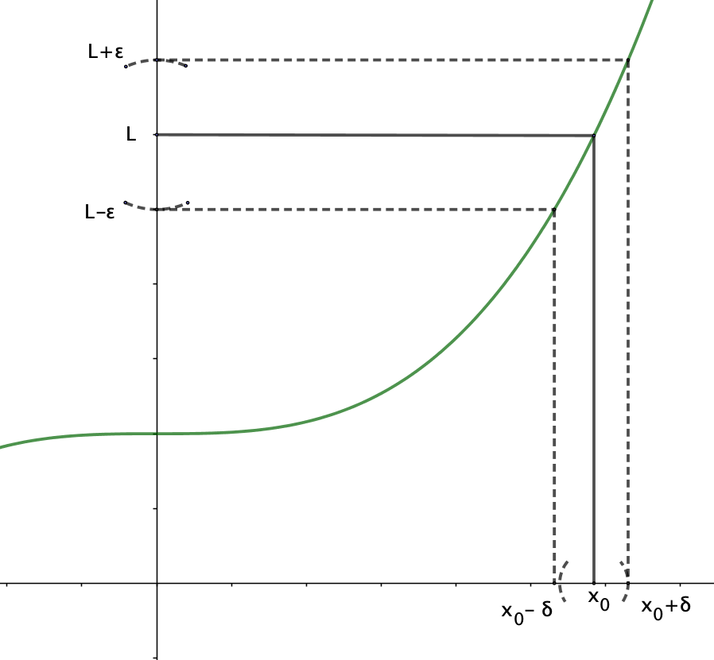

## Propiedades del límite de una función

<l class="definition"> **Definición** </l>

Sea $f:A \subset \mathbb{R} \rightarrow \mathbb{R}$ y $c$ un punto de acumulación de $A$. $f$ **está acotada en un entorno de $c$**, $V_{\delta}(c)$, si existe una constante $M \in \mathbb{R}$ tal que $|f(x)| \leq M$ para todo $x \in A \cap V_{\delta}(c)$.

<l class="prop"> **Proposición**

Sea $f:A \subset \mathbb{R} \rightarrow \mathbb{R}$ y $c$ un punto de acumulación de $A$. Si $\lim _{x \rightarrow c} f(x) =L$, entonces $f$ está acotada en un entorno de $c$.

 **Demostración**

Dado $\epsilon=1>0$, existe $\delta$ tal que $|f(x)|-|L| \leq |f(x)-L|<1$, para todo $x \in A \cap V_{\delta}(c)$. Por consiguiente si $M= |L|+1$, es $|f(x)| < |L|+1 = M$.

## Propiedades del límite de una función

<l class="definition"> **Definición** </l>

Sean $f,g:A \subset \mathbb{R} \rightarrow \mathbb{R}$ dos funciones reales de variable real. Entonces

1) $f+g: A \subset \mathbb{R} \rightarrow \mathbb{R}$ es la función definida por $(f+g)(x) = f(x)+g(x)$

2)  $f \cdot g: A \subset \mathbb{R} \rightarrow \mathbb{R}$ es la función definida por $(f\cdot g)(x) = f(x) \cdot g(x)$

3) Si $g(x)\neq 0$ en un $A$, entonces $\dfrac{1}{g}:A \subset \mathbb{R} \rightarrow \mathbb{R}$ es la función definida por $\dfrac{1}{g}(x)= \dfrac{1}{g(x)}$

4) Si $\lambda \in \mathbb{R}$, entonces $\lambda \cdot f: A \subset \mathbb{R} \rightarrow \mathbb{R}$ es la función definida por $(\lambda \cdot f)(x)= \lambda \cdot f(x)$.

## Propiedades del límite de una función

<l class="prop"> **Proposición** </l>

Sean $f,g:A \subset \mathbb{R} \rightarrow \mathbb{R}$ dos funciones reales de variable real y $c$ un punto de acumulación de $A$, tales que $\displaystyle{\lim_{x \rightarrow c} f(x) = L_1}$ y $\displaystyle{\lim_{x \rightarrow c} g(x)= L_2}$. Entonces

P1. $\displaystyle{\lim_{x \rightarrow c}(f+g)(x) = L_1+L_2}$.

P2. $\displaystyle{\lim_{x \rightarrow c}(f \cdot g)(x) = L_1 \cdot L_2}$.

P3. $\displaystyle{\lim_{x \rightarrow c} (\lambda \cdot f)(x) = \lambda \cdot L_1}$.

P4. Si $L_2 \neq 0$, entonces $\displaystyle{\lim_{x \rightarrow c} \dfrac{f(x)}{g(x)} = \dfrac{L_1}{L_2}}$.

## Propiedades del límite de una función

 **Demostración**

P1, P2 y P3 son una consecuencia inmediata de la definción de límite de una función. En el caso de P1, por ejemplo, tenemos que si $x_n \rightarrow c$ entonces $f(x_n) \rightarrow L_1$ y $g(x_n) \rightarrow L_2$, por lo tanto, 

$$
\lim_{x \rightarrow c}(f+g)(x)= \lim_{n  \rightarrow \infty} (f+g)(x_n)= \lim_{n  \rightarrow \infty} \left( f(x_n)+g(x_n) \right)
$$

$$=  \lim_{n  \rightarrow \infty} f(x_n) + \lim_{n  \rightarrow \infty} g(x_n) = L_1+L_2 = \lim_{x \rightarrow c} f(x) + \lim_{x \rightarrow c} g(x) 
$$

Por lo que se refiere a P4, tenemos que si $L_2 \neq 0$, entonces hemos demostrado, en el tema de límite de sucesiones, que para toda sucesión $x_n$ de puntos de $A$ tal que $g(x_n) \rightarrow L_2$, existe $n_0$ tal $g(x_n) \neq 0$ para todo $n \geq n_0$ y, además, $\lim_{n \rightarrow \infty}\dfrac{1}{g(x_n)} = \dfrac{1}{L_2}$ y, por lo tanto,
$$
\lim_{x \rightarrow c} \dfrac{f(x)}{g(x)} = \dfrac{L_1}{L_2}.
$$

## Propiedades del límite de una función

<l class="prop"> **Proposición** </l>

Si para todo $x \in A$ es $a \leq f(x) \leq b$, entonces $\displaystyle{a \leq \lim_{x \rightarrow c} f(x) \leq b}$

<l class="prop"> **Proposición** </l>

Sean $f,g,h :A\subset \mathbb{R} \rightarrow \mathbb{R}$, tales que $h(x) \leq f(x) \leq g(x)$, para todo $x \in A$, y

que $\displaystyle{\lim_{x \rightarrow c} g(x) =  \lim_{x \rightarrow c} h(x) = L}$, entonces  
$$
\lim_{x \rightarrow c} f(x) = L.
$$

 **Ejercicio**

Las demostraciones de estas dos proposiciones son del todo análogas a las correspondientes en el caso de límites de sucesiones y se dejan como ejercicio.

## Propiedades del límite de una función

<l class="prop"> **Proposición** </l>

Sean $f:A \subset \mathbb{R} \rightarrow \mathbb{R}$ y $c$ un punto de acumulación de $A$. Si $\lim _{x \rightarrow c} f(x) = L>0$, entonces existe $\delta > 0$ tal que $f(x)>0$ para todo $x \in V^*_{\delta}(c) \cap A$.

Análogamente, si $\lim _{x \rightarrow c} f(x) = L <0$, entonces existe $\delta > 0$ tal que $f(x)<0$ para todo $x \in V^*_{\delta}(c) \cap A$.

 **Demostración**

Supongamos, en primer lugar que $L>0$. Sea $\epsilon = \dfrac{L}{2} > 0$, entonces, por ser $L= \lim _{x \rightarrow c} f(x)$, existe $\delta >0$ tal que $|f(x)-L|<\dfrac{L}{2}= \epsilon$, por lo tanto, tenemos que $-\dfrac{L}{2} < f(x) - L < \dfrac{L}{2}$ y por lo tanto, es $0 <\dfrac{L}{2} < f(x)$. 

La demostración para el caso $L<0$ es completamente similar y se deja como ejercicio.

## Límites laterales

La función $f:\mathbb{R} \setminus \{0\} \rightarrow \mathbb{R}$, $f(x) = \dfrac{x}{|x|}$, no està definida en el punto ${0}$, de hecho, se trata de la función
$$ 
f(x) =
\begin{cases}
\;\;   1, & \mbox { si } x>0 \\
-1, & \mbox { si } x<0
\end{cases}
$$
conocida como la función *signo* de $x$, que se acostumbra a indicar por $\text{sgn}(x)$

$0$ es un punto de acumulación del dominio de $f$, pero no existe el $\displaystyle{\lim_{x \rightarrow 0} \text{sgn}(x)}$

## Límites laterales

No existe el $\displaystyle{\lim_{x \rightarrow 0}\text{sgn}(x)}$. 

En efecto, consideremos la sucesión de término general $x_n = \dfrac{(-1)^n}{n}$, entonces es $\text{sgn}(x_{2k})= 1$ en tanto que $\text{sgn}(x_{2k+1})=-1$, para todo $k \in \mathbb{N}$, es decir que la sucesión de término general $\text{sgn}(x_n)$ tiene dos subsucesiones con límite diferente y, por lo tanto, $\text{sgn}(x_n)$ no tiene límite. 

En definitiva no existe el $\displaystyle{\lim_{x \rightarrow 0}\text{sgn}(x)}$.

## Límites laterales: gráfica de la función $\text{sgn}(x)$

  

## Límites laterales

<l class="definition"> **Definición de límite lateral** </l>

1) Sea $f: A \subset \mathbb{R} \rightarrow \mathbb{R}$ una función real de variable real y sea $c$ un punto de acumulación de $A$. $L \in \mathbb{R}$ es el **límite lateral por la derecha** de $f$ en $c$, si para toda sucesión $x_n$ tal que $x_n \rightarrow c$ con $x_n \geq c$, es $f(x_n)\rightarrow L$. Escribiremos 
$$
L = \lim_{x \rightarrow c^+}f(x).
$$

2) Análogamente, $L \in \mathbb{R}$ es el **límite lateral por la izquierda** de $f$ en $c$, si para toda sucesión $x_n$ tal que $x_n \rightarrow c$ con $x_n \leq c$, es $f(x_n)\rightarrow L$. Escribiremos 
$$
L = \lim_{x \rightarrow c^-}f(x).
$$

## Límites laterales 

 **Ejemplos**

1) En el caso de la función *signo*, $\text{sgn}(x) = \dfrac{x}{|x|}$, hemos visto que  $\lim_{x \rightarrow 0^+}\text{sgn}(x) = 1$ y  $\lim_{x \rightarrow 0^-} \text{sgn}(x) = -1$.

2) Sea $g:\mathbb{R} \rightarrow \mathbb{R}$, la función definida por
$$
g(x)=
\begin{cases}
x+1, & \mbox{ si } x \leq 0, \\
x^2, & \mbox{ si } x > 0.
\end{cases}
$$
Entonces $\lim_{x \rightarrow 0^-} g(x) = 1$ y $\lim_{x \rightarrow 0^+} g(x) = 0$.

3) Sea $h:\mathbb{R} \rightarrow \mathbb{R}$, la función definida por
$$
h(x)=
\begin{cases}
x+1, & \mbox{ si } x \leq 0, \\
x^2+1, & \mbox{ si } x > 0. 
\end{cases}
$$
Entonces $\lim_{x \rightarrow 0^+} h(x) = 1$ y $\lim_{x \rightarrow 0^-} h(x) = 1$ y, como veremos a continuación, existe el $\lim_{x \rightarrow 0} h(x)$ y es igual a $1$.

## Gráfica de la función g 

  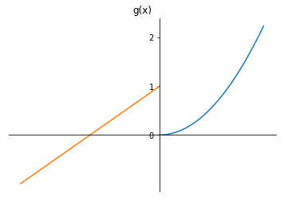

## Gráfica de la función h 

  

## Límites laterales

 **Ejercicios**

En lo que sigue,  $f: A \subset \mathbb{R} \rightarrow \mathbb{R}$ es una función real de variable real y $c$ es un punto de acumulación de $A$.

1. Demuestra que $L = \lim_{x \rightarrow c^+}f(x)$ si, y sólo si, para todo $\epsilon >0$, existe $\delta >0$ tal que, siempre que $0<x-c<\delta$, entonces es $|f(x)-L| < \epsilon$. 

2. Demuestra que   $L = \lim_{x \rightarrow c^-}f(x)$ si, y sólo si, para todo $\epsilon >0$, existe $\delta >0$ tal que, siempre que $0<c-x<\delta$, entonces es $|f(x)-L| < \epsilon$.

3. Demuestra que  $L = \lim_{x \rightarrow c^+}f(x)$ si, y sólo si, para todo $\epsilon >0$, existe $\delta >0$ tal que si $x \in V^*_{\delta} (c) \cap (c, +\infty)$, entonces $f(x) \in V_{\epsilon}(L)$

4. Demuestra que  $L = \lim_{x \rightarrow c^-}f(x)$ si, y sólo si, para todo $\epsilon >0$, existe $\delta >0$ tal que si $x \in V^*_{\delta} (c) \cap (-\infty, c)$, entonces $f(x) \in V_{\epsilon}(L)$.

## Límites laterales

<l class="prop"> **Proposición** </l>

Sea $f: A \subset \mathbb{R} \rightarrow \mathbb{R}$ y sea $c$ un punto de acumulación de $A$. Entonces existe el $\displaystyle{\lim_{x \rightarrow c}f(x)}$ si, y sólo si, los dos límites laterales $\displaystyle{\lim_{x \rightarrow c^+}f(x)}$ y $\displaystyle{\lim_{x \rightarrow c^-}f(x)}$
existen y son iguales.

## Límites laterales

 **Demostración**

Si $\lim_{x \rightarrow c}f(x) = L$, entonces para toda sucesión $x_n$ tal que $x_n \rightarrow c$ es $f(x_n) \rightarrow L$. Ahora, si $x_n \rightarrow c$ y $x_n > c$ será igualmente $f(x_n) \rightarrow L$. Análogamente si $x_n <c$.

Supongamos ahora que los dos límites laterales existen y son iguales a $L$. Sea $x_n$ tal que $x_n \rightarrow c$, entonces tres casos són posibles:

1) todos los $x_n$ a partir de un lugar son tales que $x_n \geq c$, 

2) todos los $x_n$ a partir de un lugar son tales que $x_n \leq c$, y 

3) existen infinitos $x_{n_k}$ tales que $x_{n_k} \geq c$ e infinitos $x_{n_j}$ tales que $x_{n_j} \leq c$, claramente $\{x_n\}= \{ x_{n_k}\} \cup \{x_{n_j}\}$.

En todos los casos es $f(x_n) \rightarrow L$, en el primero por ser $\lim_{x \rightarrow c^+}f(x)$ y en el segundo por ser  $\lim_{x \rightarrow c^-}f(x)$. El el tercer caso tendríamos dos subsucesiones $f(x_{n_k})$ y $f(x_{n_j})$ con el mismo límite L y, por lo tanto es $f(x_n) \rightarrow L$, dado que $\{x_n\}= \{ x_{n_k}\} \cup \{x_{n_j}\}$. En definitiva es  $\lim_{x \rightarrow c}f(x) = L$.

## Limites infinitos

<l class="definition"> **Definición** </l>

Sean $f: A \subset \mathbb{R} \rightarrow \mathbb{R}$ y $c$ un punto de acumulación de $A$,

1. Diremos que $\lim_{x \rightarrow c}f(x) = +\infty$, si para cada $K >0$ existe un $\delta > 0$ tal que si $x \in V^*_{\delta}(c)$ entonces es $f(x)>K$.

2. Diremos que $\lim_{x \rightarrow c}f(x) = - \infty$, si para cada $K >0$ existe un $\delta > 0$ tal que si $x \in V^*_{\delta}(c)$ entonces es $f(x)< -K$

 **Ejercicio** 

Las definiciones anteriores también se pueden formular en términos de sucesiones así, por ejemplo, se pide comprobar que la primera definición es equivalente a

$\lim_{x \rightarrow c}f(x) = +\infty$ si, y sólo si, para toda sucesión $x_n$ tal que $x_n \rightarrow c$ es $f(x_n) \rightarrow \infty$. 

## Limites infinitos: Ejemplos.

 **Ejemplo**

$\displaystyle{\lim_{x \rightarrow 0} \dfrac{1}{x^2} = \infty}$, puesto que si $x_n \rightarrow 0$ entonces para todo $K>0$ existe $n_0$ tal que para todo $n > n_0$ es $|x_n| < \dfrac{1}{\sqrt{K}}$ y, por lo tanto $|f(x_n)|=\dfrac{1}{x_n^2}>K$.

 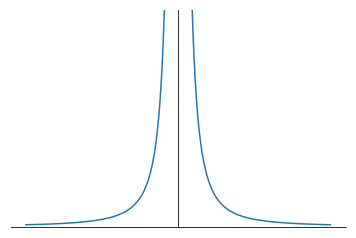

## Límites en el infinito

El ejemplo anterior también sirve para justificar la siguiente definición:

<l class="definition"> **Definición** </l>

Sean $f: \mathbb{R} \rightarrow \mathbb{R}$ y $L \in \mathbb{R}$, $L = \lim_{x \rightarrow \infty}f(x)$ si para toda sucesión $x_n$ tal que $\lim_{n \rightarrow \infty}x_n= +\infty$ entonces $\lim_{n \rightarrow +\infty} f(x_n)= L$.

Análogamente, $L = \lim_{x \rightarrow -\infty}f(x)$ si para toda sucesión $x_n$ tal que $\lim_{n \rightarrow \infty}x_n= -\infty$ entonces $\lim_{n \rightarrow \infty} f(x_n)= L$.

 **Ejercicios**

1) Demuestra que $L = \lim_{x \rightarrow +\infty}f(x)$ si, sólo sí, para todo $\epsilon >0$ existe $K>0$ tal que si $x>K$ entonces $|f(x)-L|<\epsilon$.

2) Demuestra que $L = \lim_{x \rightarrow -\infty}f(x)$ si, sólo sí, para todo $\epsilon >0$ existe $K>0$ tal que si $x<-K$ entonces $|f(x)-L|<\epsilon$.

## Limites en el infinito

 **Ejemplos**

1) $\displaystyle{\lim_{x \rightarrow +\infty} \dfrac{1}{x^2} = 0}$, puesto que dado un $\epsilon >0$ para $K=\dfrac{1}{\sqrt{\epsilon}}$ es $f(x)= \dfrac{1}{x^2} < \epsilon$ siempre que $x >K$.

2) Anàlogamente $\lim_{x \rightarrow -\infty} \dfrac{1}{x^2} = 0$, puesto que dado un $\epsilon >0$ para $K=\dfrac{1}{\sqrt{\epsilon}}$ es $f(x)= \dfrac{1}{x^2} < \epsilon$ siempre que $x <-K$.

3) La función $h(x) = \dfrac{1}{x}$, proporciona un interesante ejemplo de que también tienen sentido los límites laterales para los límites infinitos, puesto que como es fácil comprobar $\lim_{x \rightarrow 0^+} h(x) = +\infty$ en tanto que $\lim_{x \rightarrow 0^-} h(x) = -\infty$. 

4) También es fácil comprobar que $\lim_{x \rightarrow -\infty} \dfrac{1}{x} =0 = \lim_{x \rightarrow +\infty}  \dfrac{1}{x}.$

## Límites en el infinito: Gráfica de la función $\frac{1}{x}$

 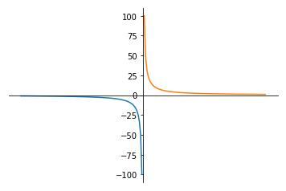

# Cálculo de límites

## Cálculo de límites

Dada la definición de límite de una función en un punto que hemos hecho, vinculada a la de límite de sucesiones, no debería sorprendernos que una buena parte de las técnicas exploradas para el cálculo de límites de sucesiones sean también de aplicación para el cálculo de límite de funciones.

Así, por ejemplo $\lim_{x \rightarrow 0}(1+x)^{\frac{1}{x}} = e$, puesto que, como hemos visto en el tema anterior, dada una sucesión $a_n$ tal que $a_n \rightarrow 0$, es $\lim (1+a_n)^{\frac{1}{a_n}}=e$, como esta igualdad es cierta para cualquier sucesión que tenga límite $0$, es $\lim_{x \rightarrow 0}(1+x)^{\frac{1}{x}} =e$.

Aparecen algunas técnicas nuevas, como las relacionadas con la consideración de límites laterales o la de los infinitésimos equivalentes, y algunas dejan de tener sentido, como por ejemplo, las que involucran el criterio de Stoltz.

## Cálculo de límites

 **Ejemplo 1**

Calcula el $\lim_{x \rightarrow 0}\dfrac{\sqrt{1+2x} - \sqrt{1+3x}}{x+2x^2}$.

En primer lugar, la función està definida para todos los puntos $x \geq -\frac{1}{3}$, menos el punto $x=0$. Por lo tanto $0$ es un punto de acumulación del dominio y tiene sentido considerar el límite de la función en ese punto.

En segundo lugar, se trata de una indeterminación del tipo $\frac{0}{0}$, en estos casos que involucran sumas o diferencias de raíces cuadradas, es conveniente intentar resolver la indeterminación multiplicando y dividiendo por el conjugado:
$$
\lim_{x \rightarrow 0}\dfrac{\sqrt{1+2x} - \sqrt{1+3x}}{x+2x^2} = \lim_{x \rightarrow 0}\dfrac{(\sqrt{1+2x} - \sqrt{1+3x})(\sqrt{1+2x} + \sqrt{1+3x})}{(x+2x^2)(\sqrt{1+2x} + \sqrt{1+3x})}
$$
$$
= \lim_{x \rightarrow 0}\dfrac{1+2x - (1+3x)}{x(1+2x)(\sqrt{1+2x} + \sqrt{1+3x})} = \lim_{x \rightarrow 0}\dfrac{-x}{x(1+2x)(\sqrt{1+2x} + \sqrt{1+3x})}=-\dfrac{1}{2}
$$

Este resultado se puede comprobar con `Wolfram Alpha` en este enlace: 

## Cálculo de límites

La gráfica de la función corrobora el resultado obtenido:

 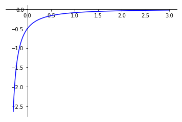

## Cálculo de límites

 **Ejemplo 2**

Demuestra que no existe el $\lim_{x \rightarrow 0}  \cos \dfrac{1}{x}$ y que $\lim_{x \rightarrow 0} x \cos \dfrac{1}{x}=0$

Para ver que no existe el primer límite es suficiente considerar las dos sucesiones $\dfrac{1}{2n\pi}$ y $\dfrac{1}{2n\pi + \frac{\pi}{2}}$, ambas tienden a $0$, sin embargo $\cos (2n \pi) \rightarrow 1$ en tanto que $\cos (2n\pi + \frac{\pi}{2}) \rightarrow 0$.

En el segundo límite, se trata de una función que tiene límite $0$ multiplicada por otra que está acotada, ya que $\left|\cos \dfrac{1}{x}\right| \leq 1$, por lo tanto $\lim_{x \rightarrow 0} x \cos \dfrac{1}{x}=0$

## Cálculo de límites

Gráficas de la funciones $f(x)=\cos \frac{1}{x}$ y $g(x)=x \cos \frac{1}{x}$, respectivamente:

 

 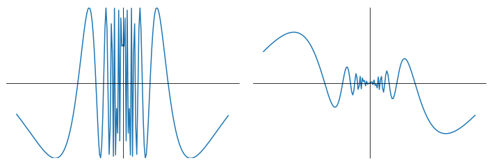
 
 

 

## Cálculo de límites

 **Ejemplo 3**

Calcula el $\lim_{x \rightarrow 1} \dfrac{\sqrt{x} -1}{x-1}$.

Se trata de una indeterminación del tipo $\dfrac{0}{0}$. En este caso el cambio de variable $x = t^2$ puede ser útil, dado que 
$$
\lim_{x \rightarrow 1} \dfrac{\sqrt{x} -1}{x-1} = \lim_{t \rightarrow 1}\dfrac{t-1}{t^2-1}=\lim_{t \rightarrow 1}\dfrac{t-1}{(t-1)(t+1)} =\lim_{t \rightarrow 1}\dfrac{1}{t+1} = \dfrac{1}{2}
$$
Este resultado se puede comprobar con `Wolfram Alpha` en este enlace: 

 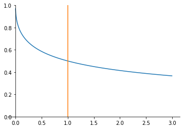

## Cálculo de límites

 **Ejemplo 4**

Calcula el $\lim_{x \rightarrow a} \dfrac{x^2-(a+1)x+a}{x^3-a^3}$

Se trata de una indeterminación del tipo $\dfrac{0}{0}$. Dado que $a$ es una raíz de los dos polinomios, ambos son múltiplos de $x-a$, efectuando la división entera obtenemos que 
$$
x^2-(a+1)x+a = (x-1)(x-a) \quad \text{ y} \quad x^3-a^3= (x^2 +ax+a^2)(x-a).
$$
Por lo tanto 
$$
\lim_{x \rightarrow a} \dfrac{x^2-(a+1)x+a}{x^3-a^3} =\lim_{x \rightarrow a} \dfrac{(x-1)(x-a)}{(x^2 +ax+a^2)(x-a)} = \lim_{x \rightarrow a} \dfrac{x-1}{x^2 +ax+a^2} =\dfrac{a-1}{3a^2}
$$
Este resultado se puede comprobar con `Wolfram Alpha` en este enlace: 

## Cálculo de límites

 **Ejemplo 5**

Calcula $\lim_{x \rightarrow 0}\left(\dfrac{1-x}{1+x}\right)^{\dfrac{1}{x}}$

Se trata de una indeterminación del tipo $1^{\infty}$, con el cambio $x=\dfrac{1}{t}$, tenemos
$$
\lim_{x \rightarrow 0}\left(\dfrac{1-x}{1+x}\right)^{\frac{1}{x}} =\lim_{t \rightarrow \infty}\left(\dfrac{t-1}{t+1} \right)^t= e^{\lim_{t \rightarrow \infty}t \left(\frac{t-1}{t+1}-1\right)} = e^{-2}=\dfrac{1}{e^2}
$$

Este resultado se puede comprobar con `Wolfram Alpha` en este enlace: 

## Cálculo de límites

 **Ejemplo 6**

Calcula el $\displaystyle{\lim_{x \rightarrow 0}\dfrac{1}{x} \log \sqrt{\dfrac{1+x}{1-x}}}$

Se trata de una indeterminación del tipo $\dfrac{0}{0}$. 

Dado que  $\log \sqrt{\dfrac{1+x}{1-x}} = \dfrac{1}{2} (\log (1+x)- \log(1-x))$, tenemos que el límite a calcular es

$$
\lim_{x \rightarrow 0}\dfrac{1}{x} \log \sqrt{\dfrac{1+x}{1-x}} = \dfrac{1}{2} \log \lim_{x \rightarrow 0} \left(\dfrac{1+x}{1-x} \right)^{\dfrac{1}{x}}= \dfrac{1}{2} \log e^2 =1
$$

Este resultado se puede comprobar con `Wolfram Alpha` en este enlace: 

## Infinitésimos

<l class="definition"> **Definición** </l>

Sea $c$ un punto de acumulación del dominio de una función $f: A \subset \mathbb{R} \rightarrow \mathbb{R}$. $f$ es un **infinitésimo** en $c$ si $\lim_{x \rightarrow c}f(x) =0$. Análogamente, diremos que $f$ es un infinitésimo en $\pm \infty$ si  $\lim_{x \rightarrow \pm \infty}f(x)=0$.

 **Ejemplos**

1. $f(x)=x$ en el punto $0$,
2. $g(x)= \sin x$, en $x=0$ y, en general, en todos los puntos de la forma $k\pi$, con $k \in \mathbb{N}$,
3. $h(x) = e^x -1$ en $x=0$,
4. $k(x)= \cos x$ en $x=\dfrac{\pi}{2}$ y, en general en todos los $x=\dfrac{(2k+1)}{2}\pi$, con $k \in \mathbb{N}$,
5. $l(x)= \dfrac{1}{x^2}$ en $x=\pm \infty$,
6. $p(x) = e^{\frac{1}{x}}$ en $x=\pm\infty$

## Infinitésimos equivalentes

<l class="definition"> **Definición** </l>

Sean $f$ y $g$ dos infinitésimos en $c$, entonces $f$ y $g$ son **equivalentes** si 
$$
\lim_{x \rightarrow c} \dfrac{f(x)}{g(x)}=1.
$$

 **Ejemplos**

1. $f(x)= 3x -5x^2$ y $g(x)=3x$ en $x=0$, puesto que el $\lim_{x \rightarrow 0} \frac{3x-5x^2}{3x} =1$.
3. $\log (1+x)$ y $x$ son equivalentes en $x=0$, puesto que $\lim_{x \rightarrow 0} \dfrac{\log(1+x)}{x} = \lim_{x \rightarrow 0} \log(1+x)^\frac{1}{x} = \log \lim_{x \rightarrow 0} (1+x)^\frac{1}{x} = \log e =1$.
2. $h(x)= e^x -1$ y $p(x)=x$, en $x=0$: Con el cambio de variable $e^x-1 =t$, tenemos que cuando $x \rightarrow 0$ es $t \rightarrow 0$ y $x=\log(1+t)$, por lo tanto:
$\lim_{x \rightarrow 0} \dfrac{e^x-1}{x} = \lim_{t \rightarrow 0} \dfrac{t}{\log(1+t)}=1.$

## Infinitésimos equivalentes

<l class="prop"> **Proposición** </l>

Las funciones $\sin x$ y $x$ son infinitésimos equivalentes en $x=0$.

 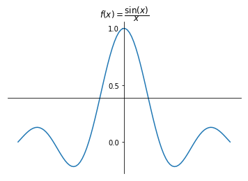

## Cálculo del $\lim_{x \rightarrow 0}\dfrac{\sin x}{x}$

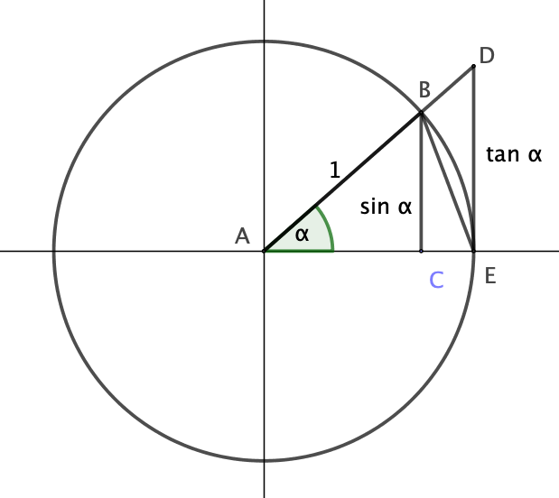

El área del triangulo $ABE$ es $\frac{1}{2} \sin \alpha$

El área del sector circular $ABE$ es $\frac{1}{2} \alpha$

El área del triángulo $ADE$ es $\frac{1}{2} \tan \alpha$

## Cálculo del $\lim_{x \rightarrow 0}\dfrac{\sin x}{x}$

Claramente, la relación entre estas tres áreas es la siguiente
$$
\frac{1}{2} \sin (\alpha) < \frac{1}{2} \alpha < \frac{1}{2} \tan \alpha.
$$
Dividiendo por $\frac{1}{2} \sin \alpha$ y tomando recíprocos, queda
$$
\cos \alpha < \dfrac{\sin \alpha}{\alpha} < 1.
$$
Por lo tanto,
$$
1 = \lim_{x \rightarrow 0^+} \cos x \leq \lim_{x \rightarrow 0^+}\dfrac{\sin x}{x} \leq 1.
$$

## Cálculo del $\lim_{x \rightarrow 0}\dfrac{\sin x}{x}$

Análogamente tenemos
$$
1 = \lim_{x \rightarrow 0^-} \cos x \leq \lim_{x \rightarrow 0^-}\dfrac{\sin x}{x} \leq 1.
$$
En definitiva, como los dos límites laterales existen y son iguales, resulta que
$$
\lim_{x \rightarrow 0}\dfrac{\sin x}{x} =1.
$$
Por lo tanto, $\sin x$ y $x$ son infinitésimos equivalentes en $0$.

## Infinitésimos equivalentes.

<l class="prop"> **Proposición** </l>

$1-\cos x$ y $\dfrac{x^2}{2}$ son infinitésimos equivalentes en $x=0$.

 **Demostración**

Es inmediata a partir de la consideración de la igualdad trigonométrica: 
$$
1-\cos x =\dfrac{\sin^2 x}{1+ \cos x},
$$

que se puede verificar mediante cálculos elementales. Ahora

$$
\lim_{x \rightarrow 0} \dfrac{ 1-\cos x}{\dfrac{x^2}{2}}= \lim_{x \rightarrow 0} \dfrac{\dfrac{\sin^2 x}{1+ \cos x}}{\dfrac{x^2}{2}} = \lim_{x \rightarrow 0}\dfrac{2 \sin^2 x}{x^2(1+\cos x)}= \lim_{x\rightarrow 0} \dfrac{\sin^2 x}{x^2} \lim_{x \rightarrow 0} \dfrac{2}{1+\cos x} =  1.
$$

## Infinitésimos equivalentes.

<l class="prop"> **Proposición** </l>

Sean $f,g,h: A \subset \mathbb{R} \rightarrow \mathbb{R}$ y sea $c$ un punto de acumulación de $a$. Supongamos, además que $f(x)$ y $g(x)$ son infinitésimos equivalentes en $x =c$. Entonces

1. Existe el $\lim_{x \rightarrow c} f(x)h(x) = L$ si, y sólo si, existe el $\lim_{x \rightarrow c} g(x)h(x)=L$. 

2. Existe el $\lim_{x \rightarrow c} \dfrac{f(x)}{h(x)} = L$ si, y sólo si, existe el $\lim_{x \rightarrow c} \dfrac{g(x)}{h(x)}=L$.

 **Importante**

La proposición anterior establece que, en el cálculo de un límite, se puede substituir un infinitésimo por otro equivalente, siempre que el infinitésimo multiplique o divida a la otra función involucrada. No se puede substituir si forma parte de una suma o de una diferencia.

## Infinitésimos equivalentes

 **Demostración**

1. Multiplicando y dividiendo por $g(x)$, tendremos que 
$$
L = \lim_{x \rightarrow c} f(x)\cdot h(x) = \lim_{x \rightarrow c} \dfrac{f(x)}{g(x)}\dfrac{g(x)}{h(x)}= \lim_{x \rightarrow c}\dfrac{f(x)}{g(x)} \lim_{x \rightarrow c} \dfrac{g(x)}{h(x)} = \lim_{x \rightarrow c} \dfrac{g(x)}{h(x)}.
$$

2. La demostración es análoga a la anterior.

 **Ejemplo 1**

Cálculo del límite $\lim_{x \rightarrow 0} \dfrac{\sin 2x}{3x -5x^3}$

Primero, usamos la equivalencia entre $3x -5x^3$ y $3x$ y, acontinuación, la que hay entre $\sin 2x$ y $2x$:
$$
\lim_{x \rightarrow 0} \dfrac{\sin 2x}{3x -5x^3}= \lim_{x \rightarrow 0} \dfrac{\sin 2x}{3x} = \dfrac{2}{3}\lim_{x \rightarrow 0} \dfrac{\sin 2x }{2x}= \dfrac{2}{3}
$$
Este resultado se puede comprobar con `Wolfram Alpha` en este enlace: 

## Infinitésimos equivalentes. Más ejemplos

 **Ejemplo 2**

Calcula el $\displaystyle{\lim_{x \rightarrow 0}\dfrac{\sqrt[3]{x^3+2x^4}}{\log (1+2x)}}$.

Dado que $\log(1+x)$ y $x$ son equivalentes, mediante el cambio de variable $x=2t$, vemos que también lo son $\log(1+2x)$ y $2x$. Por lo tanto,
$$
\lim_{x \rightarrow 0}\dfrac{\sqrt[3]{x^3+2x^4}}{\log (1+2x)} = \lim_{x \rightarrow 0} \dfrac{\sqrt[3]{x^3+2x^4}}{2x}= \dfrac{1}{2}.
$$

Este resultado se puede comprobar con `Wolfram Alpha` en este enlace: 

## Infinitésimos equivalentes. Más ejemplos

 **Ejemplo 3**

Demuestra que $\dfrac{x}{2}$ y $\sqrt{1+x}-1$ son infinitésimos equivalentes en $x=0$.

Debemos demostrar que $\lim_{x \rightarrow 0}\dfrac{\dfrac{x}{2}}{\sqrt{1+x}-1}=1$. Mediante el cambio de variable $1+x =t^2$, tenemos que cuando $x \rightarrow 0$, $t \rightarrow 1$ y, por lo tanto,
$$
\lim_{x \rightarrow 0}\dfrac{\dfrac{x}{2}}{\sqrt{1+x}-1} = \lim_{t \rightarrow 1}\dfrac{t^2 -1}{2(t-1)} = \lim_{t \rightarrow 1} \dfrac{t+1}{2} =1.
$$
Este resultado se puede comprobar con `Wolfram Alpha` en este enlace: 

## Infinitésimos equivalentes. Más ejemplos

 **Ejemplo 4**

Comprueba que $p(x)=(x+1)^n -1$ y $q(x)=nx$ son infinitésimos equivalentes en $x=0$.

Dado que $(x+1)^n = \sum_{j=0}^n \binom{n}{j} x^{n-j}=x^n+\binom{n}{n-1}x^{n-1} +  \cdots + \binom{n}{1}x+1$, 

tendremos que $(x+1)^n -1 = x^n+nx^{n-1} +  \cdots + nx$, y por lo tanto
$$
\lim_{x \rightarrow 0} \dfrac{(x+1)^n -1}{nx} = \lim_{x \rightarrow 0} \dfrac{x^n+nx^{n-1} +  \cdots + nx}{nx}= 1.
$$

Este resultado se puede comprobar con `Wolfram Alpha` en este enlace: 

## Infinitésimos equivalentes. Más ejemplos

 **Ejemplo 5**

Calcula el $\displaystyle{\lim_{x \rightarrow 0} \dfrac{\sqrt[n]{x+1}-1}{x}}$

Si hacemos el cambio de variable $x+1= (t+1)^n$, tendremos que $x=(t+1)^n-1$, por lo que
$$
\lim_{x \rightarrow 0} \dfrac{\sqrt[n]{x+1}-1}{x}= \lim_{t \rightarrow 0} \dfrac{t+1-1}{(t+1)^n-1}= \lim_{t \rightarrow 0}\dfrac{t}{(t+1)^n-1}=\lim_{t \rightarrow 0}\dfrac{t}{nt} = \dfrac{1}{n},
$$
puesto que como acabamos de ver $(t+1)^n-1$ y $nt$ son infinitésimos equivalentes en $t=0$.

Este resultado se puede comprobar con `Wolfram Alpha` en este enlace: 

## Infinitésimos equivalentes. Más ejemplos

 **Ejemplo 6**

Calcula el $\lim_{x \rightarrow 1}\dfrac{\tan(x^2-1)}{x-1}$

En $x = 1$, tanto $\tan(x^2-1)$ como $x-1$ son infinitésimos.

Dado que $\tan (x)$ y $x$ son infinitésimos equivalentes en $0$, resulta que $\tan(x^2-1)$ y $x^2-1$ son equivalentes en $x=1$, por lo tanto
$$
\lim_{x \rightarrow 1}\dfrac{\tan(x^2-1)}{x-1}= \lim_{x \rightarrow 1}\dfrac{x^2-1}{x-1}= \lim_{x \rightarrow 1} (x+1)= 2.
$$

Este resultado se puede comprobar con `Wolfram Alpha` en este enlace: 

## Infinitésimos equivalentes. Más ejemplos

 **Ejemplo 7**

Calcula el $\displaystyle{\lim_{x \rightarrow 0}\dfrac{a^x-1}{x \log a}}$.

Dado que $a^x = e^{x \log a}$, tenemos que
$$
\lim_{x \rightarrow 0}\dfrac{a^x-1}{x \log a} = \lim_{x \rightarrow 0}\dfrac{e^{x \log a}-1}{x \log a} =1.
$$
puesto que $e^x  - 1$ y $x$ són infinitésimos equivalentes en $x=0$.

Este resultado se puede comprobar con `Wolfram Alpha` en este enlace: 

## Comparación infinitésimos

<l class="definition"> **Definición** </l>

Sean $c$ un punto de acumulación de $A$ y sean $f$ y $g$ dos infinitésimos en $c$. 

1. $f$ y $g$ son del mismo orden si $\lim_{x \rightarrow c} \dfrac{f(x)}{g(x)} = k \neq 0$ y $|k| < +\infty$. Se indica por $f(x)=O(g(x))$ cuando $x \rightarrow c$.

2. $f$ es de orden superior a $g$ si $\lim_{x \rightarrow c} \dfrac{f(x)}{g(x)} =  0$, se indica por $f(x)=o(g(x))$, cuando $x \rightarrow c$.

3. $f$ es de orden inferior a $g$ si $g$ es de orden superior a $f$, o equivalentemente, si $\lim_{x \rightarrow c} \dfrac{f(x)}{g(x)} = \infty$.

## Comparación de infinitésimos

 **Ejemplos**

1. Hemos visto que $\lim_{x \rightarrow 0} \dfrac{\sqrt[n]{x+1}-1}{x} = \dfrac{1}{n}$, por lo tanto $\sqrt[n]{x+1}-1$ y $x$ son del mismo orden.

2. $f(x)= \sin^2 x$ es de orden superior a $g(x)= x$ en $x=0$, puesto que 
$$
\lim_{x \rightarrow 0}\dfrac{\sin^2 x}{x}=0.
$$ 

<l class="observ"> **Observaciones** </l>

1. Dos infinitésimos equivalentes son del mismo orden, pero no todos los infinitésimos del mismo orden son equivalentes.

2. Habitualmente se usan como referencia los infinitésimos en $c$, $(x-c)^n$, donde el exponente se usa para indicar el orden del infinitésimo.

# Continuidad

## Introducción

Dada una función $f:A\subset \mathbb{R} \rightarrow \mathbb{R}$, si $x \in A$ es irracional cabe preguntarse cómo podemos evaluar $f(x)$. Dado que podemos aproximar $x$ por racionales tanto como queramos, sería conveniente poder determinar la precisión de esta aproximación una vez que conozcamos la precisión requerida para $f(x)$. 

Las funciones continuas son precisamente las funciones para las que, una vez fijada la precisión requerida a $f(x)$, es posible determinar la precisión de $x$, para tener asegurada la precisión requerida.

En lo que sigue, veremos que esta condición tiene consecuencias muy notables.

## Funciones continuas.

<l class="definition"> **Definición** </l>

Sean $f: A\subset \mathbb{R} \rightarrow \mathbb{R}$ y $x_0 \in A$, **$f$ es continua en $x_0$** si para cada $\epsilon >0$ existe un $\delta >0$ tal que para todo $x \in A$ que verifique que $|x-x_0|<\delta$, entonces $|f(x)-f(x_0)|< \epsilon$.

Diremos que **$f$ es continua en $A$**, si es continua para todo $x \in A$.

Dicho de otra forma, **$f$ es continua en $x_0$** si, una vez fijada la precisión, $\epsilon$, que se requiere para $f(x_0)$, es posible determinar la precisión, $\delta$, que hay que exigir a $x_0$ para tener asegurada la precisión de $f(x_0)$.

La gráfica siguiente ilustra esta definición.

## Funciones continuas

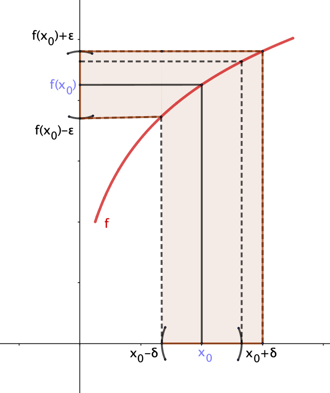

$\epsilon$ es la precisión con la queremos $f(x_0)$ y $\delta$ es la precisón para $x_0$. Es decir, $f(x_0) \in (f(x_0)-\epsilon,f(x_0)+\epsilon)$, siempre que $x_0 \in (x_0 -\delta, x_0 + \delta)$.

## Funciones continuas

<l class="observ"> **Observaciones** </l>

1. Es fàcil comprobar que si $x_0$ es un punto de acumulación de $A$, entonces $f$ es continua en $x_0$ si, y sólo sí, $\displaystyle{\lim _{x \rightarrow x_0}f(x)=f(x_0)}$.

2. Si $x_0$ es un punto aislado de $A$, es decir, que no es de acumulación, entonces, dado que existe un entorno de $x_0$ donde este es el único punto de $A$, para que $f$ sea continua en $x_0$ es suficiente que $f$ esté definida en ese punto.

## Funciones continuas

<l class="important"> **Observación importante** </l>

Pese a que la definición de continuidad sobre un conjunto pueda inducir a pensar lo contrario, el concepto de continuidad es esencialmente **local**: una función es continua en un punto. No hay que olvidar, pues, que aunque la función sea continua sobre un conjunto $A$, la precisión $\delta$ para cada $x_0 \in A$, depende de $\epsilon$ y de $x_0$, por lo que se debería escribir $\delta(\epsilon,x_0)$, aunque no se haga, se debe tener siempre en cuenta esta dependencia. Por otra parte, veremos algunos casos en los que $\delta$ sólo depende de $\epsilon$, es la llamada **continuidad uniforme**. 

## Funciones continuas: Ejemplos.

 **Ejemplos**

**Ejemplo 1**. Una función constante $f(x)=c$ es continua para todo $x \in \mathbb{R}$, dado que si $x_n \rightarrow x_0$, entonces $f(x_n) \rightarrow x_0$, puesto que $f(x_n)=c=f(x_0)$, para todo $n \in \mathbb{N}$.

**Ejemplo 2**. $g(x) = x$ es continua para todo $x_0  \in \mathbb{R}$, puesto que si $x_n \rightarrow x_0$, entonces, obviamente $g(x_n)=x_n \rightarrow x_0=g(x_0)$.

**Ejemplo 3**. $h(x)=x^2$ es continua para todo $x_0 \in \mathbb{R}$, puesto que si $x_n \rightarrow x_0$, entonces $x_n^2 \rightarrow x_0^2=h(x_0)$.

**Ejemplo 4**. La función signo $\text{sgn}(x)$ no es continua en $x_0=0$, puesto que como hemos visto no existe el $\lim_{x \rightarrow x_0} \text{sgn} (x)$, dado que $-1 = \lim_{x \rightarrow x_0^-} \text{sgn}(x) \neq \lim_{x \rightarrow x_0^+} \text{sgn}(x) =1$.

**Ejemplo 5**. La función $\psi :\mathbb{R} \rightarrow \mathbb{R}$ definida por
$$
\psi(x)=
\begin{cases}
1, \text{ si } x \in \mathbb{Q}, \\
0, \text{ si } x \in \mathbb{R} \setminus \mathbb{Q},
\end{cases}
$$
es discontinua en todo punto $x \in \mathbb{R}$, puesto que si $x \in \mathbb{Q}$, existe una sucesión de irracionales $x_n$, tal que $x_n \rightarrow x$ y, por lo tanto $\psi(x_n)= 0$ para todo $n$, es decir que $\psi(x_n) \rightarrow 0 \neq 1=\psi(x)$. Análogamente, si $x \in \mathbb{R}\setminus \mathbb{Q}$, existe una sucesión de racionales tal que $x_n \rightarrow x$ y, por lo tanto $\psi(x_n) \rightarrow 1 \neq 0=\psi(x)$.

## Funciones continuas: Ejemplos.

 **Ejemplos**

**Ejemplo 6**. La función $f(x)=e^x$ es continua para todo $x_0 \in \mathbb{R}$, puesto que, como demostramos en el tema de sucesiones, si $x_n \rightarrow x_0$, entonces $e^{x_n} \rightarrow e^{x_0}$

**Ejemplo 7**. La función $\log: (0,+\infty) \rightarrow \mathbb{R}$, es continua para todo $x_0 \in (0,+\infty)$, puesto que, igual que con la exponencial, en su día demostramos que si $x_n \rightarrow x_0$, con $x_n > 0$, entonces $\log x_n \rightarrow \log x_0$

## La función $\sin x$ es continua.

<l class="prop"> **Proposición** </l>

La función $\sin : \mathbb{R} \rightarrow \mathbb{R}$ es continua para todo $x \in \mathbb{R}$.

 **Demostración**

Hay que ver que, para cada $\epsilon >0$ existe $\delta >0$ tal que si $|x-x_0| < \delta$ entonces $|\sin x - \sin x_0|<\epsilon$, o lo que es lo mismo, dado que en su dominio no hay puntos aislados, que $\lim_{x \rightarrow x_0} \sin x = \sin x_0$.

Teniendo en cuenta la igualdad trigonométrica: $\sin \alpha -\sin \beta = 2 \sin \frac{\alpha - \beta}{2} \cos \frac{\alpha + \beta}{2}$, 
tenemos 
$$
\sin x -\sin x_0 =2 \sin \frac{x-x_0}{2} \cos \frac{x+x_0}{2}.
$$
Dado que que la función $\cos x$ está acotada, tendremos que $\displaystyle{\lim_{x \rightarrow x_0} (\sin x -\sin x_0) }= 0$, es decir, que
$$
\lim_{x \rightarrow x_0} \sin x = \sin x_0.
$$

## Funciones continuas

<l class="observ"> **Observaciones** </l>

1. Puede ocurrir que una función $f : A \subset \mathbb{R} \rightarrow \mathbb{R}$ no esté definida en un punto de acumulación $c$ de $A$ y, sin embargo exista el $\lim_{x \rightarrow c} f(x) = L$, entonces la función $F :A \cup \{c\} \rightarrow \mathbb{R}$ definida por
$$
F(x)=
\begin{cases}
L, \quad  \text{ si } x=c, \\
f(x), \text{ si } x \in A,
\end{cases}
$$
es una función continua en $A \cup \{c\}$.

2. Caso que no exista el  $\lim_{x \rightarrow c} f(x)$, entonces no es posible extender $f$ a una función continua en $A \cup \{c\}$, puesto que sea cual sea el valor, $L$ que asignemos a la extensión $F$ en $c$, dicha función no podría ser continua, puesto que si fuera continua tendríamos que $\lim_{x \rightarrow c} f(x)=L$, y hemos supuesto dicho límite no existía.

## Funciones continuas

 **Ejemplos**

1. La función $f(x)= \frac{\sin x}{x}$, no está definida en $x=0$, sin embargo, dado que existe $\lim_{x \rightarrow 0} \frac{\sin x}{x} =1$, se puede extender dicha función a una función continua definida en $x=0$, asignando en ese punto el valor del límite, es decir 
$$
f(0) =1 = \lim_{x \rightarrow 0} \frac{\sin x}{x}.
$$

2. Por el contrario, no es posible extender la función $h(x)= \text{sgn}(x)$ para que sea continua en $x=0$, puesto que, como como hemos visto, no existe el $\lim_{x \rightarrow 0} \text{sgn} (x)$.

3. Dado que el $\lim_{x \rightarrow 0} x \cos \frac{1}{x} = 0$, entonces la función $\varphi :\mathbb{R} \rightarrow \mathbb{R}$, definida por
$$
\varphi (x) =
\begin{cases}
0, \qquad \,  \text{ si } x=0, \\
x \cos \frac{1}{x}, \text{ si } x \neq 0,
\end{cases}
$$
es una función continua para todo $x \in \mathbb{R}$.

## Discontinuidades: Tipos.

Las consideraciones anteriores, juntamente con la coincidencia o no de los limites laterales en un punto, lleva a la siguiente clasificación de las dicontinuidades

1. *Evitable:* $f$ no está definida en $x_0$, pero existe el $\lim_{x \rightarrow x_0}f(x)$.

2. *De primera especie (o de salto):* $\lim_{x \rightarrow x_0^-}f(x) \neq \lim_{x \rightarrow x_0^+}f(x)$.

3. *De segunda especie:* No existe alguno o ninguno de los límites laterales.

<l class="observ"> **Observación** </l>

Las discontinuidades de salto, como la de la función sgn$(x)$ en el punto $0$, ayudan a entender el nombre **continua** para las funciones que lo son: su gráfica no presenta saltos de ningún tipo, es decir -y valga la redundancia- la gráfica de una función continua es continua.

## Combinaciones de funciones continuas

Recordemos la definición siguiente:

<l class="definition"> **Definición** </l>

Sean $f,g: A \subset \mathbb{R} \rightarrow \mathbb{R}$ dos funciones reales de variable real. Entonces

1. $f+g$ es la función de $A$ en $\mathbb{R}$ definida por $(f+g)(x)=f(x)+g(x)$.
2. $f \cdot g$ es la función de $A$ en $\mathbb{R}$ definida por $(f \cdot g)(x)=f(x) \cdot g(x)$.
3. Si $\lambda \in \mathbb{R}$, $\lambda \cdot f$ es la función de $A$ en $\mathbb{R}$ definida por $( \lambda \cdot f)(x) =\lambda \cdot f(x)$.
4. Si $g(x) \neq 0$, $\dfrac{f}{g}$ es la función de $A$ en $\mathbb{R}$ definida por $\dfrac{f}{g}(x)= \dfrac{f(x)}{g(x)}$.

## Combinaciones de funciones continuas

<l class="prop"> **Proposición** </l>

Sean $f,g : A \subset \mathbb{R} \rightarrow \mathbb{R}$  tales que $f$ y $g$ són continuas en en $x_0 \in A$. Entonces

1. $f+g$ es continua en $x_0$.
2. $f \cdot g$ es continua en $x_0$.
3. Si $\lambda \in \mathbb{R}$, $\lambda f$ es continua en $x_0$.
4. Si $g(x) \neq 0$ para todo $x \in A$, entonces $\dfrac{f}{g}$ es continua en $x_0$.

## Combinaciones de funciones continuas

 **Demostración**

Si $x_0$ es un punto aislado, el resultado es inmediato. 

Supongamos pues que $x_0$ es un punto de acumulación de $A$, sea $x_n$ una sucesión de puntos de $A$ tal que $x_n \rightarrow x_0$, entonces, dado que $f$ y $g$ son continuas en $x_0$, tendremos que $f(x_n) \rightarrow f(x_0)$ y $g(x_n) \rightarrow g(x_0)$, por lo tanto 
$$
(f+g)(x_n) = f(x_n)+g(x_n) \rightarrow f(x_0)+g(x_0) = (f+g)(x_0).
$$

Consideraciones análogas sirven para demostrar las otras combinaciones descritas en el enunciado.

## Combinaciones de funciones continuas

<l class="prop"> **Proposición** </l>

Sean $f,g : A \subset \mathbb{R} \rightarrow \mathbb{R}$  tales que $f$ y $g$ **són continuas en en $A$**. Entonces

1. $f+g$ es continua en $A$.
2. $f \cdot g$ es continua en $A$.
3. Si $\lambda \in \mathbb{R}$, $\lambda f$ es continua en $A$.
4. Si $g(x) \neq 0$ para todo $x \in A$, entonces $\dfrac{f}{g}$ es continua en $A$.

 **Demostración**

Inmediata a partir de la definición de continuidad en un conjunto y de la proposición anterior.

 
## Composición de funciones

<l class="definition"> **Definición** </l>

Sean $f: A \subset \mathbb{R} \rightarrow \mathbb{R}$ y $g: B \subset \mathbb{R} \rightarrow \mathbb{R}$ tales que $f(A) \subset B$. La **función compuesta de $f$ y $g$**, $g \circ f$, es la función $g \circ f : A \rightarrow \mathbb{R}$ definida por
$$
(g \circ f) (x)= g(f(x)).
$$

<l class="observ"> **Observación** </l>

Por $f(A)$ se entiende el conjunto de los elementos de $\mathbb{R}$ tales que son imagen por $f$ de algún elemento de $A$, es decir
$$
f(A) =\{y \in \mathbb{R}: y=f(x)\text{ para algún } x \in A \}.
$$

## Composición de funciones

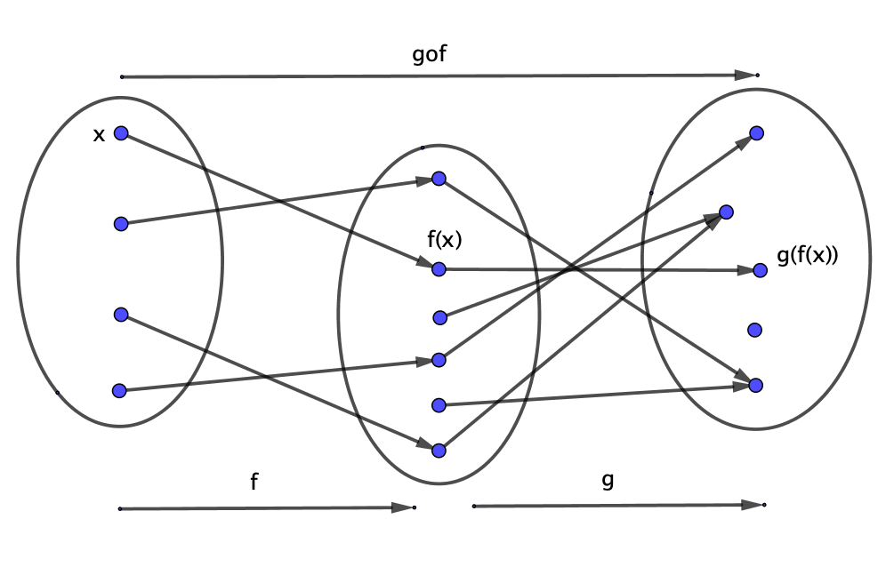

## Composició de funciones: Ejemplos.

 **Ejemplos**

1. $h(x) = \sin \left(\dfrac{\pi}{2}-x \right)$ es la composición de las funciones $g(x)=\sin x$ y $f(x) =\dfrac{\pi}{2}-x$: $h(x) = (g \circ f)(x)$. Se debe tener en cuenta que la composición de funciones **no** es conmutativa, en  este caso 
$$
(f \circ g)(x) = \dfrac{\pi}{2}  - \sin x \neq \sin \left(\dfrac{\pi}{2}-x \right) = (g \circ f)(x).
$$

2. $h(x)= |x|$ es la composición de las funciones $r(x) = \sqrt{x}$ y $s(x)= x^2$: $h(x) = |x| = \sqrt{x^2}=r(s(x))$. Nuevamente $|x| = (r \circ s)(x) \neq (s \circ r) = (\sqrt{x})^2= x$, ya que la igualdad sólo sería vàlida para los $x >0$.

3. $h(x)=\log(x+1)$ es la composición de las funciones $f(x)= x+1$ y $g(x) = \log(x)$.

## Composición de funciones continuas

<l class="prop"> **Proposición** </l>

Sean $f: A \subset \mathbb{R} \rightarrow \mathbb{R}$ y $g : B \subset \mathbb{R} \rightarrow \mathbb{R}$, tales que $f(A) \subset B$. Si $f$ es continua en $x_0$ y $g$ es continua en $f(x_0)$, entonces $g \circ f$ es continua en $x_0$.

 **Demostración**

Para simplificar la notación, pongamos que $y_0=f(x_0)$ y que $V_{\epsilon}(y)$ es el entorno centrado en $y$ y de radio $\epsilon$.

Sea $\epsilon >0$, dado que $g$ es continua en $y_0$, existe un $\gamma >0$ tal que si $y \in V_{\gamma} (y_0) \cap B$, entonces $g(y) \in V_{\epsilon}(g(y_0))$.

Dado que $f$ es continua en $x_0$, $f(A) \subset B$ y que $\gamma >0$, existe un $\delta >0$ tal que si $x \in V_{\delta}(x_0) \cap A$, entonces $y=f(x) \in V_{\gamma}(f(x_0))$.

En definitiva, para cada $\epsilon >0$ hemos podido determinar un $\delta >0$ tal que si $x \in V_{\delta}(x_0) \cap A$, entonces $g(f(x)) \in V_{\epsilon} (g(f(x_0)))$, es decir que $g \circ f$ es continua en $x_0$.

## Composición de funciones continuas

 **Ejemplos**

1. La función $\cos : \mathbb{R} \rightarrow \mathbb{R}$ es continua para todo $x \in \mathbb{R}$. En efecto: si $g(x) = \sin(x)$ y $f(x) = \dfrac{\pi}{2} -x$, entonces, tanto $f$ como $g$ son continuas para todo $x \in \mathbb{R}$, por lo tanto
$$
\cos (x) = \sin \left(\dfrac{\pi}{2} - x \right) = g(f(x)).
$$
es una función continua para todo $x \in \mathbb{R}$ por ser la composición de dos funciones continuas.

2. Si $f(x)$ es una función continua en $x_0$, entonces $|f(x)|$ también es continua en $x_0$, puesto que $h(x)=|x|$ es una función continua para todo $x \in \mathbb{R}$, dado que $|x|=\sqrt{x^2}$ y tanto $r(x) = \sqrt{x}$, como $s(x)=x^2$ son funciones continuas, la primera para todo $x \geq 0$ y la segunda para todo $x$. Entonces 
$$
|f(x)|= r(s(f(x))),
$$
es decir seria la composición de tres funciones continuas.

2. Si $f(x)$ es una función continua en $x_0$, entonces $e^{f(x)}$ es también continua en $x_0$, puesto que se trata de la composición de dos funciones continuas, $f$, y la exponencial, $e^x$. Lo mismo pasa con $\log f(x)$, si $f$ es una función positiva.

## Composición de funciones continuas

<l class="prop"> **Proposición** </l>

Sean $f: A \subset \mathbb{R} \rightarrow \mathbb{R}$ y $g : B \subset \mathbb{R} \rightarrow \mathbb{R}$, tales que $f(A) \subset B$. Si $f$ es continua en $A$ y $g$ es continua en $B$, entonces $g \circ f$ es continua en $A$.

 **Demostración**

Inmediata a partir de la definición de continuidad en un conjunto y de la proposición anterior.

# Funciones continuas en intervalos

## Introducción

Al considerar funciones continuas sobre intervalos aparece, con todo su esplendor, la potencia y la magia de la propiedad de continuidad. Veremos que el hecho que la gráfica de la función entre los extremos del intervalo no se interrumpa -es decir, que sea continua- se convierte en un potente instrumento para la localización de raíces de una ecuación, polinómica o no.

También se demuestra que si el intervalo es cerrado, entonces la función está acotada y, el que posiblemente sea el resultado más importante, es que en este caso, las funciones continuas son **uniformemente continuas**, es decir que el $\delta$ de la propiedad $\epsilon -\delta$, que depende de $\epsilon$ y del punto, pasa a depender sólo de $\epsilon$, un hecho que tiene importantes consecuencias, como se verá posteriormente.

## Teorema de la conservación del signo

<l class="prop"> **Proposición: Teorema de la conservación del signo** </l>

Sea $f:[a,b] \rightarrow \mathbb{R}$ continua y sea $c \in (a,b)$ tal que $f(c) >0$. Entonces existe un $\delta >0$ tal que $f(x) >0$ para todo $x \in (c-\delta, c+\delta)$. Análogamente, si $f(c) <0$, entonces existe un $\delta >0$ tal que $f(x) <0$ para todo $x \in (c-\delta, c+\delta)$.

<l class="prop"> **Corolario** </l>

Sea $f:[a,b] \rightarrow \mathbb{R}$ continua y sea $c \in (a,b)$ tal que en todo entorno de $c$ hay puntos en los que $f$ es positiva y puntos en los que $f$ es negativa, entonces $f(c) =0$ .

## Teorema de la conservación del signo: Demostración.

 **Demostración**

Supongamos en primer lugar que $f(c)>0$, sea $\epsilon = \dfrac{f(c)}{2} >0$. Por ser $f$ continua en $c$, existe $\delta >0$ tal que si $x \in (c-\delta,c+\delta)$, entonces $f(x) \in (f(c)-\epsilon,f(c)+\epsilon) = \left(\dfrac{f(c)}{2},\dfrac{3f(c)}{2}\right)$, por lo tanto si $x  \in (c-\delta,c+\delta)$, es $f(x) > \dfrac{f(c)}{2} >0$.

 **Ejercicio**

Demuestra el teorema anterior en el caso que $f(c) <0$.

## Teorema de Bolzano

<l class="prop"> **Proposición: Teorema de Bolzano** </l>

Sea $f:[a,b] \rightarrow \mathbb{R}$ continua tal que $f(a)\cdot f(b) < 0$, entonces existe $c \in (a,b)$ tal que $f(c)=0$.

La condición $f(a)\cdot f(b) < 0$ es una forma sencilla para expresar que $f(a)$ y $f(b)$ son de signo diferente como se ilustra en el gráfico siguiente:

## Teorema de Bolzano: Demostración

 **Demostración**

Supongamos que $f(a)<0$ y que $f(b)>0$, el conjunto $S=\{x \in [a,b]: f(x) <0\}$ está acotado superiormente, por ejemplo, por $b$. Sea $c= \sup S$, veamos que $f(c)=0$.

Supongamos en primer lugar que $f(c) <0$, por ser $f$ continua y por el teorema de la conservación del signo, existirá un $\delta >0$ tal que para todo $x \in (c-\delta, c+\delta)$ es $f(x) <0$, es decir, existirían elementos $x>c$ tales que $f(x)<0$, lo que contradice que $c$ sea el mayor para los que $f$ toma valores negativos, por lo tanto no puede ser que $f(c)<0$.

Supongamos, pues que $f(c)>0$, razonamientos análogos a los anteriores no llevarían a ver que es incompatible esta condición con el hecho que $c$ sea el supremo de $S$.

En consecuencia, $f(c)=0$, que es lo que queríamos demostrar.

 **Ejercicio**

Demuestra el teorema de Bolzano en el caso que sea $f(a) >0$ y $f(b)<0$.

## Teorema de los valores intermedios

<l class="prop"> **Proposición: Teorema de los valores intermedios**

Sea $f:[a,b] \rightarrow \mathbb{R}$ continua y sean $x_1,x_2 \in [a,b]$ tales que $x_1 < x_2$ y $f(x_1)\neq f(x_2)$, entonces $f$ toma todos los valores comprendidos entre $f(x_1)$ y $f(x_2)$.

 **Demostración**.

En primer lugar  hay que tener en cuenta que  $x_1 < x_2$ no significa que $f(x_1)<f(x_2)$. 

Supongamos, pues, que $f(x_1) < f(x_2)$, sea $d \in (f(x_1), f(x_2))$, entonces $h(x)= f(x)-d$ es una función continua sobre el intervalo $[x_1,x_2]$ tal que $h(x_1)=f(x_1) -d <0$ y $h(x_2)= f(x_2) -d >0$, por el teorema de Bolzano, existe $c \in (x_1,x_2)$ tal que $h(c)=0=f(c)-d$, es decir que $f(c)=d$.

 **Ejercicio**

Demuestra la proposición para el caso $x_1 < x_2$ y $f(x_1) > f(x_2)$.

## Funciones acotadas

<l class="definition"> **Definición** </l>

Sea $f:A \subset \mathbb{R} \rightarrow \mathbb{R}$:

1. $f$ está acotada superiormente si existe $K \in \mathbb{R}$ tal que $f(x) < K$, para todo $x \in A$.

2. $f$ está acotada inferiormente si existe $K \in \mathbb{R}$ tal que $f(x) > K$, para todo $x \in A$.

3.  $f$ está acotada si lo está inferiormente y superiormente, es decir si existe $K \in \mathbb{R}$ tal que $|f(x)|<K$, para todo $x \in A$.

## Funciones acotadas: Ejemplos

 **Ejemplos**

1. Las funciones $\sin$ y $\cos$ estan acotadas en $\mathbb{R}$, puesto que $|\sin(x)| \leq 1$ y $|\cos(x)| \leq 1$ para todo $x \in \mathbb{R}$.

2. La función $f(x)= \dfrac{1}{x^2}$ está acotada inferiormente en $\mathbb{R}$ por $0$, pero no lo está superiormente.

3. La función $g(x)= 2-x^2$ está acotada superiormente en $\mathbb{R}$ por $2$, pero no lo está inferiormente.

4. La función $h(x)= \dfrac{1}{x}$ no està acotada inferiormente ni superiormente en cualquier entorno de $0$.

## Teorema de Weierstrass

<l class="prop"> **Proposición: Teorema de Weierstrass.** </l>

Sea $f:[a,b] \rightarrow \mathbb{R}$ continua, entonces $f$ está acotada.

 **Demostración**

Por reducción al absurdo. Supongamos que $f$ no está acotada en $[a,b]$, entonces existe $x_1 \in I_1= [a,b]$ tal que $f(x_1) >1$. Sea $c =\dfrac{a+b}{2}$, entonces $f$ no está acotada en $[a,c]$ o en $[c,b]$, sea $I_2 =[a_2,b_2]$ dicho intervalo. Entonces $f$ no está cotada en $I_2$, por lo tanto, existe $x_2 \in I_2$ tal que $f(x_2) > 2$. Reiterando este proceso, construiremos una sucesión $I_n$ de intervalos anidados, $I_{n-1} \supset I_n$, tal que $b_n - a_n = \dfrac{b_{n-1 }-a_{n-1}}{2}$, por lo que $\lim_{n \rightarrow \infty}(b_n - a_n)=0$ y, además $x_n \in I_n$.

Por el principio de los intervalos anidados, existe $c$ tal que $\lim_{n \rightarrow \infty} a_n = c = \lim_{n \rightarrow \infty} b_n$. Dado que $a_n \leq x_n \leq b_n$, tendremos que $\lim_{n \rightarrow \infty} x_n = c$ como, por otra parte $f(x_n) > n$, resulta que $f(x_n)  \rightarrow \infty$, lo que contradice que $f$ sea continua, puesto que debería ser $f(x_n) \rightarrow f(c)$.

## Teorema del extremo

<l class="prop"> **Proposición. Teorema del extremo** </l>

Sea $f:[a,b] \rightarrow \mathbb{R}$ continua, entonces existen $x_1$ y $x_2$ tales que $f(x_1) = \inf_{[a,b]}f$ y que $f(x_2) = \sup_{[a,b]}f$.

 **Demostración**

Dado que $f$ es continua en $[a,b]$, $f$ está acotada, por lo tanto existen $M= \sup_{[a,b]}f$ y $m= \inf_{[a,b]}f$. Veamos que existen $x_1$ y $x_2$ tales que $m=f(x_1)$ y $M=f(x_2)$. Supongamos, en primer lugar que no existe $x$ tal que $f(x) = M$, entonces la función $h(x)=\dfrac{1}{f(x)-M}$ es continua y por lo tanto, debería estar acotada en $[a,b]$.
Veamos que no es así: sea $K>0$, por ser $M= \sup_{[a,b]}f$, existe $x \in [a,b]$ tal que $f(x) \in \left(M-\dfrac{1}{K},M+\dfrac{1}{K}\right)$, puesto que, de no ser así $M-\dfrac{1}{K}$ seria una cota superior para $f$ en $[a,b]$, por lo tanto, dado que $|h(x)| = \dfrac{1}{|f(x)-M|} > K$, es decir $h(x)$ no está acotada, lo cual contradice que sea continua en $[a,b]$. Así pues, existe $x_2$ tal que $f(x_2)=M= \sup_{[a,b]} f$. 

Razonamientos análogos permiten demostrar que existe $x_1 \in [a,b]$ tal que $f(x_1)=m= \inf_{[a,b]}f$.

## Teorema del extremo

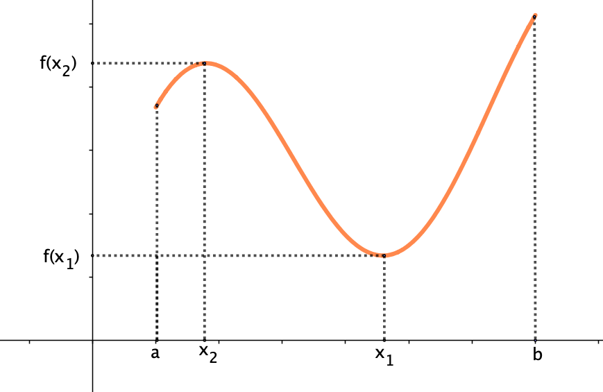

## Corolario del teorema del extremo

<l class="prop"> **Proposición. Corolario del teorema del extremo.** </l>

La imagen de un intervalo cerrado por una función continua es un intervalo cerrado.

 **Demostración**

Sea $f: [a,b] \rightarrow \mathbb{R}$, el teorema del extremo asegura que existen $x_1, x_2 \in [a,b]$ tales que $f(x_1)= m=\inf{[a,b]}$ y $f(x_2)= M=\sup{[a,b]}$, por lo tanto $f([a,b]) \subset [m,M]$. Sea ahora $y \in [m,M]$, por el teorema de los valores intermedios, existe $x \in [a,b]$ tal que $y=f(x)$, por lo que $[m,M] \subset f([a,b])$. Por consiguiente es $f([a,b]) = [m,M]$.

## Funciones monótonas

<l class="definition"> **Definición** </l>

Sea $f: A \subset \mathbb{R} \rightarrow \mathbb{R}$ una función y sea $B \subset A$.

1. $f$ es **creciente** en $B$ si, para todo par $x,y \in B$  tales que si $x <y$, entonces  $f(x) \leq f(y)$. Si esta última desigualdad es estricta, es decir $f(x) <f(y)$, entonces $f$ es **estrictamente creciente**.

2. $f$ es **decreciente** en $B$ si, para todo par $x,y \in B$ tales que $x < y$, entonces $f(x) \geq f(y)$. Si $f(x) > f(y)$, entonces $f$ es **estrictamente decreciente** en $B$.

3. $f$ es **monótona** en $B$, si es creciente o decreciente en $B$. **Estrictamente monónotona** seria, por consiguiente una función estrictamente creciente o estrictamente decreciente.

## Funciones monótonas.

 **Ejemplos** 

La función representada en esta gráfica, es estrictamente creciente en los intervalos $[a,x_2)$ y $[x_1,b)$ y es estrictamente decreciente en el intervalo $(x_2,x_1)$.

 

## Funciones monótonas.

 **Ejemplos** 

La función $f(x)= \dfrac{1}{x}$ es estrictamente decreciente en todo su dominio, es  decir en $\mathbb{R} \setminus \{0\}$.

 

 

## Funciones monótonas.

 **Ejemplos** 

La función $f(x)= \dfrac{1}{x^2}$ es estrictamente creciente en $(-\infty,0)$ y estrictamente decreciente en $(0,+\infty)$.

 

## Funciones monótonas.

 **Ejemplos** 

Un ejemplo de función creciente, pero no estrictamente creciente:
$$
g(x)= \begin{cases}
x+1,& \text{ si } x \in [-2,0], \\
1, & \text{ si } x \in [0,1], \\
x^2, & \text{ si } x \in [1,2]. 
\end{cases}
$$

 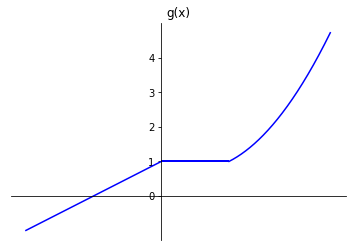

## Funciones monótonas

<l class="prop"> **Proposición** </l>

$f: A \subset \mathbb{R} \rightarrow \mathbb{R}$ una función monótona en $A$. Entonces $f$ no puede tener ninguna discontinuïdad de segunda especie.

 **Demostración**

En esencia, lo que nos asegura el enunciado es que existen los límites laterales de $f$ en todo punto de acumulación de $A$. Supongamos que $f$ es creciente y sea $c$ uno de estos puntos de acumulación, veamos que existe el $\lim_{x \rightarrow c^-} f(x)$. Para ello consideremos el conjunto $D=\{f(x): x<c, \, x \in A \}$. Dado que $f$ es creciente, $D$ está acotado superiormente por $f(c)$, por lo tanto existe el supremo de $D$, sea $s= \sup D$, dado un $\epsilon >0$, existe $x_0 < c$ tal que $s-\epsilon < f(x_0) <s$, puesto que, de no ser así, el supremo sería $s-\epsilon$ y no $s$. 
Sea $\delta = c-x_0 >0$, para todo $x  \in A$ tal que $x_0 <x < c$ es $|c-x| < \delta$ y $|s -f(x)| < \epsilon$, puesto que $f(x_0) < f(x)$ por ser $f$ creciente, Por lo tanto, queda demostrado que $\lim_{x \rightarrow c^-} f(x) = s$.

Consideraciones análogas permiten demostrar que existe $\lim_{x \rightarrow c^+}f(x)$. 

 **Ejercicio**

Demuestra la proposición anterior para $f$ decreciente. 

## Funciones inversas

Recordemos que una **aplicación biyectiva** o **correspondencia uno a uno** es una aplicación que es, a la vez, inyectiva y exhaustiva.

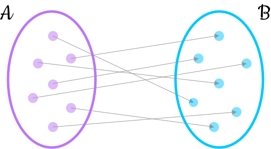

Una propiedad importante de esta aplicaciones biyectivas es que se puede invertir el sentido de las flechas y el resultado continua siendo una aplicación biyectiva. 

## Funciones inversas

<l class="prop"> **Proposición** </l>

Sea $f: A \rightarrow B$ una aplicación biyectiva. Entonces la aplicación $f^{-1}: B \rightarrow A$, definida por $f^{-1}(y)= x$ si $f(x)=y$ es una aplicación biyectiva.

 **Ejercicio**

Demuestra esta proposición. 

Está claro que $f$ y $f^{-1}$ son tales que $(f \circ f^{-1})(x) = x = (f^{-1}\circ f)(x)$

En el caso de funciones, es decir, aplicaciones entre conjuntos de números, la aplicación inversa recibe el nombre de función inversa.

## Funciones inversas

 **Ejemplos**

1. La inversa en $[0,+\infty)$ de la función $f(x)= x^2$ es $f^{-1}(x)= \sqrt{x}$, en general la de $g(x)= x^n$ es $g^{-1}(x)=\sqrt[n]{x}$.

2. La inversa de la función $\sin: \left[-\dfrac{\pi}{2},\dfrac{\pi}{2} \right] \rightarrow [-1,1]$ es $\arcsin:  [-1,1] \rightarrow \left[-\dfrac{\pi}{2},\dfrac{\pi}{2} \right]$.

3. La inversa de la función $g(x) = \dfrac{1}{x}$ en $\mathbb{R} \setminus \{0\}$ es ella misma. 

4. La inversa de la funcion $h(x) =\dfrac{1}{x^2}$ en $(0,+\infty)$ es $h^{-1}(x) = \dfrac{1}{\sqrt{x}}$.  

5. La inversa de $t(x)=a + (b-a)x$ en $[0,1]$ es $t^{-1}(x)= \dfrac{x-a}{b-a}$ en $[a,b]$. Este ejemplo muestra que siempre existe una aplicación biyectiva entre dos intervalos cerrados cualesquiera de $\mathbb{R}$.

## Funciones inversas

Las gràficas de una función, $f$, y la de su inversa, $f^{-1}$ són simétricas respecto de la recta $y=x$:

 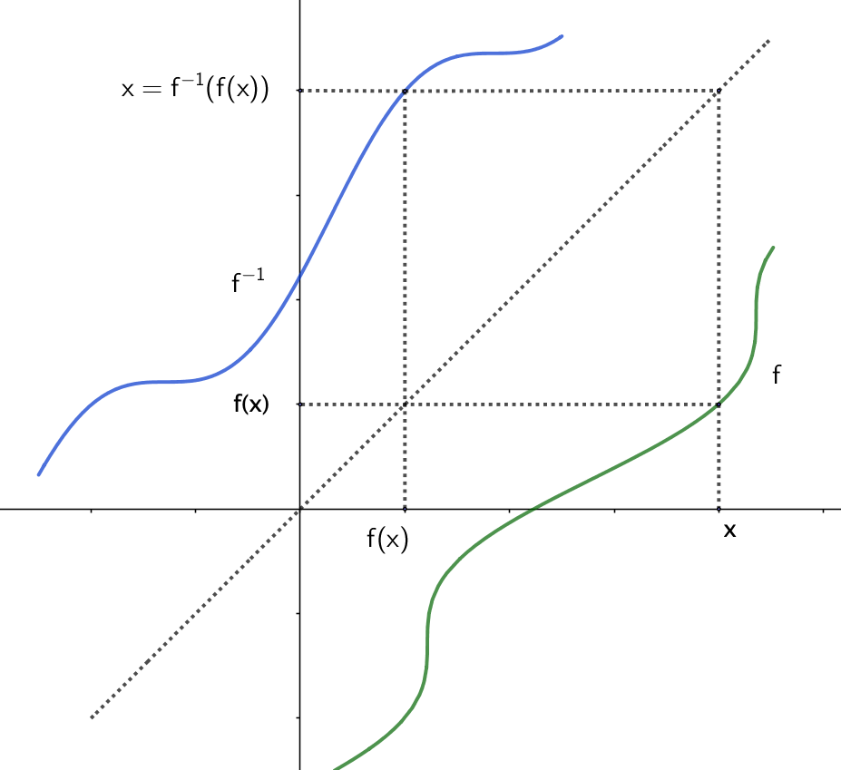

## Funciones monótonas e inversas

<l class="prop"> **Proposición**

Sea $f: [a,b] \rightarrow \mathbb{R}$ una función continua y estrictamente creciente. Entonces 

1. Existe la función inversa $f^{-1} : [f(a),f(b)] \rightarrow [a,b]$.
2. $f^{-1}$ es continua y estrictamente creciente.

 **Demostración**

Vamos a demostrar que existe $f^{-1}$, es decir que $f$ es una biyección entre $[a,b]$ y $[f(a),f(b)]$. El teorema de los valores intermedios nos asegura que $f$ es exhaustiva, puesto que dado un $y \in [f(a),f(b)]$, existe un $x \in [a,b]$, tal que $f(x)=y$, o lo que es lo mismo tal que $f^{-1}(y)=x$, por lo tanto, todos los elementos de $[f(a),f(b)]$ son imagen de alguno de $[a,b]$, por lo tanto $f$ es exhaustiva.
$f$ es, además inyectiva por ser estrictamente creciente, puesto que si $x_1 \neq x_2$, entonces o es $x_1 < x_2$ o es $x_1 > x_2$, en el primer caso seria $f(x_1) <f(x_2)$ y, en el segundo, $f(x_1) > f(x_2)$ y, por lo tanto, en cualquier caso $f(x_1) \neq f(x_2)$. Al ser $f$ exhaustiva y inyectiva, es biyectiva y, por lo tanto $f^{-1}$ es una función. 

## Funciones monótonas e inversas

<i class="fa fa-dizzy"> Contenido muy técnico. </i>

 **Demostración**

$f^{-1}$ es estrictamente creciente, puesto que si $y_1 < y_2$ entonces, si $f^{-1}(y_1) > f^{-1}(y_2)$, tendríamos, por ser $f$ estrictamente creciente y $f(f^{-1}(y))=y$, que $y_1=f(f^{-1}(y_1)) > f(f^{-1}(y_2))=y_2$, y si fuera $f^{-1}(y_1) = f^{-1}(y_2)$, sería $y_1=f(f^{-1}(y_1)) = f(f^{-1}(y_2))=y_2$, como las dos opciones son absurdas, resulta que ha de ser $f^{-1}(y_1) < f^{-1}(y_2)$.

Falta ver que $f^{-1}$ es continua: Con este fin, sean $y_0 \in (f(a),f(b))$, $c=f^{-1}(y_0)$ y $\epsilon >0$. Sea ahora $\delta = \min \{f(c+\epsilon) - y_0, y_0 - f(c-\epsilon)\}$.

Si $y$ es tal que $|y-y_0|< \delta$, entonces, dado que $f(c-\epsilon) <y < f(c+ \epsilon)$, tendremos que $f^{-1}(f(c-\epsilon)) < f^{-1}(y) < f^{-1}(f(c+ \epsilon))$, por lo que
$c-\epsilon < f^{-1}(y) < c+ \epsilon$, es decir que $|f^{-1}(y)-c| < \epsilon$ o sea que
$|f^{-1}(y)-f^{-1}(y_0)| < \epsilon$. 

En los extremos del intervalo $f(a)$ y $f(b)$, es suficiente considerar $\delta = |f(a+\epsilon) -f(a)|$ en el primer caso y $\delta = |f(b-\epsilon) -f(b)|$.

## Funciones monótonas e inversas

<l class="prop"> **Proposición**

Sea $f: [a,b] \subset \mathbb{R} \rightarrow \mathbb{R}$ una función continua y estrictamente decreciente. Entonces 

1. Existe la función inversa $f^{-1} : [f(b),f(a)] \rightarrow [a,b]$.
2. $f^{-1}$ es continua y estrictamente decreciente.

 **Ejercicio**

La demostración es completamente análoga a la anterior y se deja como ejercicio.

## Funciones monótonas e inversas

 **Ejemplos de aplicación**

1. Dado que la función $f(x)=x^2$ es estrictamente creciente y continua en $[0,+\infty]$, su función inversa $f^{-1}(x)= \sqrt{x}$ también es estrictamente creciente y continua sobre la imagen por $f$ de $[0,+\infty]$, que es el mismo conjunto.

2. Dado que la función $\sin(x)$ es estrictamente creciente y continua en el intervalo $\left[-\dfrac{\pi}{2},\dfrac{\pi}{2} \right]$, su función inversa $\arcsin(x)$ es estrictamente creciente y continua en el intervalo $[-1,1]$.

3. Dado que la función $\cos(x)$ es estrictamente decreciente y continua en el intervalo $[0,\pi]$, su función inversa $\arccos(x)$ es estrictamente decreciente y continua en el intervalo $[-1,1]$.

 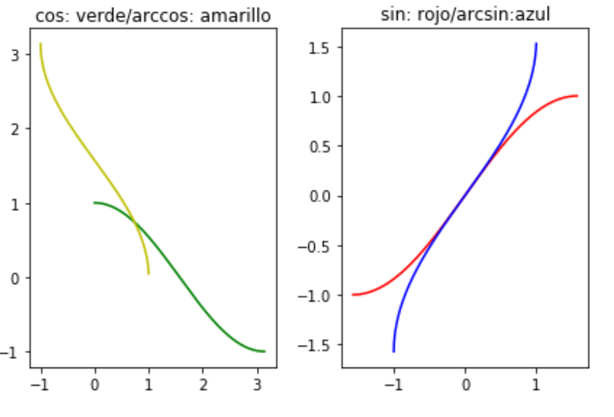

# Continuidad uniforme

## Introducción

A pesar de las múltiples e interesantes propiedades que tienen la funciones continuas en un punto, en determinadas situaciones, el hecho que el $\delta$ dependa de $\epsilon$ y del punto se convierte en una limitación importante. Así, por ejemplo, la convergencia de determinadas series de funciones está vinculada a que $\delta$ sea el mismo para todos los $x$, una vez fijado el $\epsilon$.

En este apartado se estudia un tipo de continuidad en la que $\delta$ sólo depende de $\epsilon$, es la llamada **continuidad uniforme**.

## Continuidad uniforme

<l class="definition"> **Definición** </l>

Sea $f: A \subset \mathbb{R} \rightarrow \mathbb{R}$, $f$ es **uniformemente continua** en $A$ si para todo $\epsilon > 0$ existe $\delta >0$ tal que si $x,y \in A$ son tales $|x-y| < \delta$, entonces $|f(x) -f(y)| < \epsilon$.

 **Observación importante**

La **continuidad uniforme** es una propiedad de conjunto: una función puede ser uniformemente continua en un conjunto, pero no tiene sentido decir que una función es uniformemente continua en un punto. Con todo, para evitar confusiones, se acostumbra a denotar esta última por **continuidad puntual** para distinguirla de la **uniforme**.

## Continuidad uniforme

 **Ejemplo de función uniformemente continua**

La funció $g(x)=\sqrt{x}$ es uniformemente continua en $(0,+\infty)$. Puesto que si $x,y \in (0,+\infty)$, con $x <y$, multiplicando y dividiendo por el conjugado de $\sqrt{y} - \sqrt{x}$ tendremos que:
$$
\sqrt{y} - \sqrt{x} \leq \dfrac{y-x}{\sqrt{y} + \sqrt{x}} \leq \dfrac{y-x}{\sqrt{y-x}}= \sqrt{y-x}
$$
por lo tanto, dado que cuando $x=y$ la desigualdad sigue siendo cierta y que podemos cambiar el papel de $x$ e $y$, resulta que, dado un $\epsilon > 0$, tomado $\delta = \epsilon^2$, tendremos que siempre que $|y-x|<\delta$, será 
$$
\sqrt{y} - \sqrt{x} \leq \sqrt{|y-x|} < \epsilon.
$$

Más adelante veremos más ejemplos de funciones continuas.

## Continuidad uniforme

Sea $f:A\subset \mathbb{R} \rightarrow \mathbb{R}$. $f$ es uniformemente continua en $A$ si, y sólo si, para todo par de sucesiones $x_n$ y $y_n$ de puntos de $A$ tales que $\lim_{n \rightarrow \infty} (x_n - y_n) =0$ es $\lim_{n \rightarrow \infty}(f(x_n)- f(y_n)) =0$.

 **Demostración**

Supongamos que $f$ es uniformemente continua, dado $\epsilon >0$ existe $\delta >0$ tal que para todo $x,y \in A$ tales que $|x-y| < \delta$, entonces $|f(x)-f(y)|< \epsilon$. Dado que $\delta >0$, existe $n_0 \in \mathbb{N}$ tal que para todo $n > n_0$ es $|x_n - y_n| < \delta$ y, por lo tanto es $|f(x_n) - f(y_n)| < \epsilon$, es decir que  $\lim_{n \rightarrow \infty}(f(x_n)- f(y_n)) =0$.

Para el recíproco, supongamos que $f$ no es uniformemente continua, veremos que existe un par de sucesiones $x_n$ y $y_n$ tales que $\lim (x_n-y_n) =0$, en tanto que $\lim (f(x_n) -f(y_n)) \neq 0$.
Ahora bien, por no ser $f$ uniformemente continua, existe un $\epsilon >0$ tal que para todo $\delta >0$ existe un par $x_{\delta}$, y $y_{\delta}$ tal que $|x_{\delta} - y_{\delta}| < \delta$ y $|f(x_{\delta})-f(y_{\delta})|  \geq \epsilon$. Por lo tanto es suficiente considerar $\delta_n = \dfrac{1}{n}$ y los correspondientes $x_n = x_{\delta_n}$ y $y_n=y_{\delta_n}$ para tener las dos sucesiones que satisfacen que $(x_n - y_n) \rightarrow 0$ en tanto que $|f(x_n)-f(y_n)| \geq \epsilon$.

## Continuidad uniforme

<l class="prop"> **Corolario** </l>

Sea $f:A\subset \mathbb{R} \rightarrow \mathbb{R}$. Si $f$ **no** es uniformemente continua en $A$ entonces existen $\epsilon > 0$ y dos sucesiones $x_n$ y $y_n$ de puntos de $A$ tales que $\lim_{n \rightarrow \infty} (x_n - y_n) =0$ y $|f(x_n) - f(y_n)| \geq \epsilon$.

 **Demostración**

Si $f$ no es uniformente continua, entonces existe $\epsilon >0$ tal que para todo $\delta >0$ existen $x_{\delta}$ y $y_{\delta}$ tales que $|x_{\delta} - y_{\delta}|  < \delta$ y $|f(x_{\delta}) - f(y_{\delta})| > \epsilon$.

Dado este $\epsilon$, consideremos la sucesión de números positivos $\dfrac{1}{n}>0$. Para cada uno de estos números existen, pues, $x_n$ y $y_n$ tales que $|x_n - y_n| <\dfrac{1}{n}$ y $|f(x_n) - f(y_n)| \geq \epsilon$. Por lo tanto $x_n$ y $y_n$ satisfacen las condiciones del enunciado.

## Continuidad uniforme

 **Ejemplo de función no uniformemente continua**

La función $f(x)=\dfrac{1}{x}$ no es uniformemente continua en $(0,+\infty)$. 

En efecto: las sucesiones $x_n = \dfrac{1}{n}$ y $y_n = \dfrac{1}{n+1}$ son tales que $|x_n -y_n|= \dfrac{1}{n(n+1)}$, es decir que $\lim_{n \rightarrow \infty}(x_n - y_n) = 0$ en tanto que que
$|f(x_n)-f(y_n)| = |n -(n+1)| = 1$.

## Continuidad uniforme

<l class="prop"> **Proposición** </l>

Sean $f: A \subset \mathbb{R} \rightarrow \mathbb{R}$ y  $g: B \subset \mathbb{R} \rightarrow \mathbb{R}$ tales que $f(A) \subset B$. Entonces si $f$ y $g$ son uniformemente continuas, también lo es la función compuesta $g \circ f$.

 **Demostración**

La demostración es inmediata  a partir de la observación anterior: Sean $x_n$ y $y_n$ dos sucesiones tales que $\lim_{n \rightarrow \infty} (x_n - y_n) =0$. Por ser $f$ uniformente continua, tendremos que $\lim_{n \rightarrow \infty}(f(x_n)- f(y_n)) =0$. Por ser $g$ uniformemente continua, tendremos que $\lim_{n \rightarrow \infty}(g(f(x_n))- g(f(y_n))) =0$, por lo tanto $g \circ f$ es uniformemente continua.

## Continuidad uniforme: La propiedad de Lipschitz

Un ejemplo de condición que implica la continuidad uniforme sobre un conjunto -pero no al revés- és la llamada propiedad de **Lipschitz**:

<l class="definition"> **Definición** </l>

Sea $f:A \subset \mathbb{R} \rightarrow \mathbb{R}$, $f$ cumple **la propiedad de Lipschitz** si existe $M>0$ tal que para todo $x,y \in A$ es 
$$
|f(x)-f(y)|\leq M|x-y|.
$$
A una función que cumpla esta propiedad, se le acostumbra a llamar **función lipschitziana**.

## Continuidad uniforme: La propiedad de Lipschitz

<l class="observ"> **Observación** </l>

Si una función $f$ verifica la propiedad de Lipschitz entonces el conjunto
$$
{\cal{M}}=\left\{\dfrac{f(y)-f(x)}{y-x}: x,y \in A, \quad x \neq y \right\}
$$
es no vacío y está acotado superiormente, por lo que existe $M_0 = \sup \cal{M}$. $M_0$ recibe el nombre de **constante de Lipschitz** para $f$.

## Continuidad uniforme: La propiedad de Lipschitz

<l class="prop"> **Proposición** </l>

Sea $f:A \subset \mathbb{R} \rightarrow \mathbb{R}$ una función lipschitziana en $A$, entonces $f$ es uniformemente continua en $A$.

 **Demostración**

Si $M >0$ es tal que $|f(x)-f(y)|\leq M|x-y|$, para todo $x,y \in A$, para cada $\epsilon >0$, sea $\delta < \dfrac{\epsilon}{M}$, entonces, siempre $|x-y| < \delta = \dfrac{\epsilon}{M}$, tendremos que
$$
|f(x)-f(y)|\leq M|x-y| < M \dfrac{\epsilon}{M}= \epsilon,
$$
es decir, $f$ es uniformemente continua en $A$.

## Continuidad uniforme: La propiedad de Lipschitz

 **Ejemplo**

La función $g(x)= \sqrt{x}$ es uniformemente continua en $(0,+\infty)$, pero no es lipschitziana.

Hemos demostrado anteriormente que $g$ era uniformemente continua en $(0,+\infty)$, veamos que no verifica la propiedad de Lipschitz. Para ello veremos que
$$
\lim_{x \rightarrow y}\dfrac{\sqrt{y}-\sqrt{x}}{y-x} = \dfrac{1}{2\sqrt{y}}.
$$
Por lo que el cociente $\dfrac{\sqrt{y}-\sqrt{x}}{y-x}$ no está acotado en $(0,+\infty)$ y hemos visto que este cociente estaba acotado para las funciones lipschitzianas.

Para calcular el límite, basta considerar los cambios $\sqrt{y} = u$ y $\sqrt{x}=v$, con lo que tendremos
$$
\lim_{x \rightarrow y}\dfrac{\sqrt{y}-\sqrt{x}}{y-x} = \lim_{v \rightarrow u}\dfrac{u-v}{u^2-v^2}=\lim_{v \rightarrow u} \dfrac{1}{u+v}= \lim_{v \rightarrow u} \dfrac{1}{2u}= \dfrac{1}{2\sqrt{y}}.
$$

## Continuidad uniforme

<l class="prop"> **Proposición. Teorema de Heine-Cantor** </l>

Toda función continua sobre un intervalo cerrado es uniformemente continua.

 **Demostración**

Supongamos que $f$ no es uniformemente continua en $[a,b]$. De acuerdo con el corolario anterior, existen un $\epsilon >0$ y dos sucesiones $x_n$ y $y_n$ de puntos de $[a,b]$ tales que $\lim_{n \rightarrow \infty}(x_n-y_n)=0$ y $|f(x_n)-f(y_n)| > \epsilon$. 

Dado que, tanto $x_n$, como $y_n$ estan acotadas por estar contenidas en $[a,b]$, de acuerdo con el teorema de Bolzano-Weierstrass, cada una de ellas tiene una subsucesión convergente. Sean estas $x_{n _k}$ y $y_{n_k}$, sea $l = \lim x_{n _k}$, tenemos que $|y_{n_k} -l|\leq |y_{n_k} - x_{n _k}| + |x_{n _k}-l|$ y, por lo tanto, dado que $\lim (x_n -y_n) =0$, tendremos que $\lim y_{n_k} =l$. Por consiguiente, tanto $f(x_{n_k}) \rightarrow f(l)$, como $f(y_{n_k}) \rightarrow f(l)$,es decir que $\lim (f(x_{n_k}) - f(y_{n_k})) = 0$ lo cual es absurdo, puesto que $|f(x_n)-f(y_n)| > \epsilon$ para todo $n$. 

Queda así demostrado que si $f$ es continua sobre un intervalo cerrado, entonces $f$ es uniformemente continua.

## Continuidad uniforme: funciones escalonadas.

Una consecuencia notable del resultado anterior es que, dada una función continua sobre un intervalo cerrado, podemos aproximar esta función  por una función constante a trozos.

<l class="definition"> **Definición** </l>

**Una partición** de un intervalo $[a,b] \subset \mathbb{R}$ és una colección de subintervalos disjuntos,$[a,x_1]$,$(x_i,x_{i+1}]$, con $i \in \{1, \ldots, n-1\}$ y $a <x_1< \ldots < x_n=b$, tales que 
$$
[a,x_1] \cup (x_1,x_2]  \ldots \cup (x_i,x_{i+1}] \cup \dots \cup (x_{n-1}, x_n] = [a,b]
$$
Representaremos la partición por el conjunto de extremos de los subintervalos que la definen: $\{a,x_1, \ldots,x_{n-1},b\}$

## Continuidad uniforme: funciones escalonadas.

<l class="definition"> **Definición** </l>

Dada una partición $\{a,x_1, \ldots,x_{n-1},b\}$ de un intervalo $[a,b]$, $S:[a,b] \rightarrow \mathbb{R}$ es **una función escalonada** sobre $[a,b]$ si $S$ es constante sobre cada uno de los subintervalos de la partición.

 **Ejemplo de función escalonada**

La función $S: [-3,5] \rightarrow \mathbb{R}$ definida por
$$
S(x) =
\begin{cases}
-2, & \text{ si } x \in [-3,-1],\\
1, & \text{ si } x \in (-1,1], \\
-1, &\text{ si } x \in (1,3],\\
2, &\text{ si } x \in (3,4], \\
4, &\text{ si } x \in (4,5],
\end{cases}
$$

## Ejemplo de función escalonada

 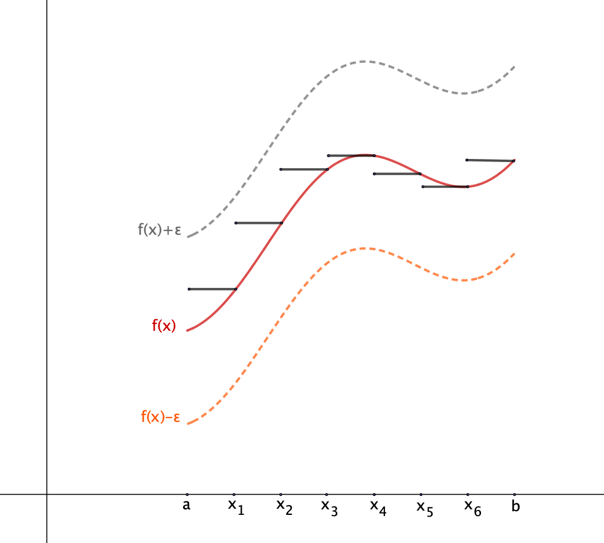

## Continuidad uniforme: funciones escalonadas.

<l class="prop"> **Proposición** </l>

Sea $f:[a,b] \rightarrow \mathbb{R}$ una función continua. Entonces, para cada $\epsilon > 0$ existen una partición $\{a,x_1, \ldots,x_{n-1},b\}$ del intervalo $[a,b]$, con todos los subintervalos de igual longitud, y una función escalonada $S_{\epsilon}: [a,b] \rightarrow \mathbb{R}$ tales que, para todo $x \in \mathbb{R}$, es
$$
|f(x)-S_{\epsilon}(x)| < \epsilon.
$$

## Continuidad uniforme: funciones escalonadas.

 **Demostración**

Por ser $f$ continua sobre un intervalo cerrado, es uniformemente continua, por lo tanto dado un $\epsilon>0$, existe un $\delta >0$, tal que si $|x-y|< \delta$, entonces $|f(x)-f(y)|< \epsilon$. La propiedad arquimediana nos asegura que existe $n \in \mathbb{N}$ tal que $h=\dfrac{b-a}{n} < \delta$. Consideremos pues la partición de $[a,b]$ dada por los puntos.
$$
a; x_1=a+h; x_2=a+2h; \ldots x_k=a+kh; \ldots x_{n-1}=a+(n-1)h; b,
$$
Consideremos los intervalos $I_1=[a,x_1]=[a,a+h]$ y $I_k=(x_{k-1},x_k]=(a+(k-1)h,a+kh]$, para $k \in \{2,\ldots, n\}$.
Sea ahora la función escalonada definida por
$$
S_{\epsilon} (x) = f(a+kh)=f(x_k) \text{ si } x \in I_k,
$$
para $k \in \{1, \ldots n \}$.

$S_{\epsilon}$ es la función escalonada buscada, puesto que dado $x \in [a,b]$ existe un $k$ tal que $x \in I_k$, por lo tanto
$$
|f(x)-S_{\epsilon}(x)| = |f(x)-f(x_k)| < \epsilon,
$$
puesto que $|x-x_k| < \delta$, dado que $x \in I_k$.

## Continuidad uniforme: funciones lineales a trozos.

<l class="definition"> **Definición** </l>

**Función lineal** entre dos intervalos, $f:[a,b] \rightarrow [c,d]$, es la función que tiene por gráfica el segmento que une los puntos $(a,c)$ y $(b,d)$, es decir la función definida por
$$
f(x) = \dfrac{d-c}{b-a}(x-a)+c.
$$

Está claro que una función lineal entre dos intervalos es siempre continua.

## Continuidad uniforme: funciones lineales a trozos.

<l class="definition"> **Definición** </l>

Una función entre dos intervalos $f:[a,b] \rightarrow [c,d]$ es **lineal a trozos** si existe una partición del intervalo $I_k$, $k=1, \ldots ,n$, tal que $f$ restringida a cada $I_k$ es una función lineal sobre dicho intervalo. 

Una función lineal a trozos es siempre continua.

## Ejemplo de función lineal a trozos

 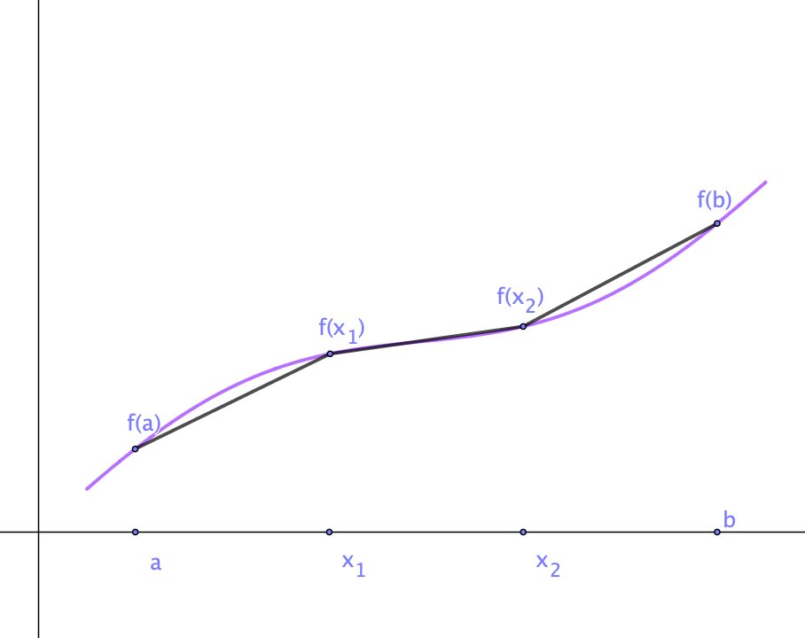

## Continuidad uniforme: funciones lineales a trozos.

<l class="prop"> **Proposición** </l>

Sea $f: [a,b] \rightarrow \mathbb{R}$ una función continua. Entonces, para cada $\epsilon >0$ existe una función lineal a trozos $g_{\epsilon}: [a,b] \rightarrow \mathbb{R}$ tal que, para todo $x \in [a,b]$ es 
$$
|f(x)-g_{\epsilon}(x)|<\epsilon.
$$

## Funciones lineales a trozos.

 **Demostración**

Por ser $f$ continua sobre $[a,b]$, es uniformemente continua. Por lo tanto, dado un $\epsilon > 0$, existe un $\delta >0$ tal que si $|x-y| < \delta$, entonces $|f(x)-f(y)|<\dfrac{\epsilon}{2}$. Sea $n \in \mathbb{N}$ tal que $h = \dfrac{b-a}{n} < \delta$ y sean $I_k$ los subintervalos de la partición de $[a,b]$ determinada por los puntos 
$$
x_0=a,x_1=a+h, \ldots x_k=a+kh, \ldots x_{n-1}=a+(m-1)h,x_n=b,
$$
Entonces la función lineal, $g_{\epsilon}$ a trozos que une los puntos 
$$
(x_{k-1}, f(x_{k-1})) \text{ y } (x_k, f(x_k)),
$$
es la función buscada. 

## Funciones lineales a trozos.

 **Demostración**

En efecto,
$$
g_{\epsilon}(x)=\dfrac{f(x_k) - f(x_{k-1})}{x_k - x_{k-1}} (x -x_{k-1})+f(x_{k-1}).
$$

Por lo tanto
$$
|g_{\epsilon}(x)-f(x_{k-1})| \leq \left|\dfrac{x -x_{k-1}}{x_k - x_{k-1}}\right| |f(x_k) - f(x_{k-1})|\leq \dfrac{\epsilon}{2},
$$

ya que $\left|\dfrac{x -x_{k-1}}{x_k - x_{k-1}} \right| \leq 1$ y $|x_k - x_{k-1}| < \delta$,

En definitiva, 
$$
|g_{\epsilon}(x)-f(x)| \leq |g_{\epsilon}(x)-f(x_{k-1})| + |f(x_{k-1})-f(x_k)|< \dfrac{\epsilon}{2}+\dfrac{\epsilon}{2}=\epsilon.
$$

